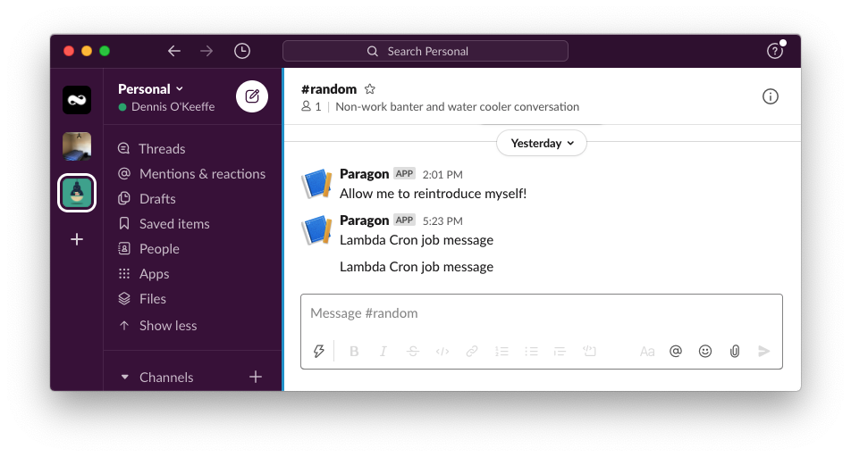

In this particular tutorial, I am sharing how I used the AWS SDK to send a basic Slack message using a cron job.

This is a simple proof-of-concept that I am planning to take further by swapping out the "send Slack message" with a number of other future project plans I have for do x.

In order to follow along, you'll should have the following:

1. Some familiarity with AWS + an account with your [configuration setup](https://docs.aws.amazon.com/sdk-for-java/v1/developer-guide/setup-credentials.html)
2. A [Slack webhook](https://api.slack.com/messaging/webhooks) to use
3. Basic familiarity with [npm](https://www.npmjs.com/)

<Ad />

## Setting up the infra dependencies

In a new file, we need to setup the npm package:

```s
# initialise with base settings
npm init -y
npm i @aws-cdk/aws-events @aws-cdk/aws-events-targets @aws-cdk/aws-lambda @aws-cdk/aws-s3-assets @aws-cdk/core dotenv
npm i --save-dev typescript @types/node @types/dotenv
```

These dependencies are all essentially used for the CloudFormation file synthesis, with the addition of `dotenv` so that we can add in any secrets we want locally and not store it on git.

<Ad />

## Gitignore file

Create a `.gitignore` file and add the following:

```s
cdk.out/
node_modules/
.env
```

This will keep out the pesky secrets we don't want stored in Git.

<Ad />

## Setting up TypeScript

You can initialise with your preferred settings, however this is a pretty handy one you can add after creating a `tsconfig.json` file:

```json
{
  "compilerOptions": {
    "target": "ES2018",
    "module": "commonjs",
    "lib": ["es2016", "es2017.object", "es2017.string"],
    "strict": true,
    "noImplicitAny": true,
    "strictNullChecks": true,
    "noImplicitThis": true,
    "alwaysStrict": true,
    "noUnusedLocals": true,
    "noUnusedParameters": true,
    "noImplicitReturns": true,
    "noFallthroughCasesInSwitch": false,
    "inlineSourceMap": true,
    "inlineSources": true,
    "experimentalDecorators": true,
    "strictPropertyInitialization": false
  }
}
```

<Ad />

## Setting up the infrastructure code

Create a simple `index.ts` file and add the following code:

```ts
import events = require("@aws-cdk/aws-events")
import targets = require("@aws-cdk/aws-events-targets")
import lambda = require("@aws-cdk/aws-lambda")
import cdk = require("@aws-cdk/core")
import assets = require("@aws-cdk/aws-s3-assets")
import path = require("path")

require("dotenv").config()

export class LambdaCronStack extends cdk.Stack {
  constructor(app: cdk.App, id: string) {
    super(app, id)

    // The following JavaScript example defines an directory
    // asset which is archived as a .zip file and uploaded to
    // S3 during deployment.
    // See https://docs.aws.amazon.com/cdk/api/latest/docs/aws-s3-assets-readme.html
    // @ts-ignore - this expects Construct not cdk.Construct :thinking:
    const myLambdaAsset = new assets.Asset(this, "LambdaCronJobExampleZip", {
      path: path.join(__dirname, "lambda"),
    })

    const lambdaFn = new lambda.Function(this, "LambdaCronJobExample", {
      code: lambda.Code.fromBucket(
        myLambdaAsset.bucket,
        myLambdaAsset.s3ObjectKey
      ),
      timeout: cdk.Duration.seconds(300),
      runtime: lambda.Runtime.NODEJS_12_X,
      environment: {
        SLACK_CHANNEL: process.env.SLACK_CHANNEL as string,
      },
      handler: "slack-message.handler",
    })

    // Run every day, every minute (UTC time)
    // See https://docs.aws.amazon.com/lambda/latest/dg/tutorial-scheduled-events-schedule-expressions.html
    const rule = new events.Rule(this, "Rule", {
      schedule: events.Schedule.expression("cron(0/1 * * * ? *)"),
    })

    rule.addTarget(new targets.LambdaFunction(lambdaFn))
  }
}

const app = new cdk.App()
new LambdaCronStack(app, "LambdaCronExample")
app.synth()
```

So how does it work? We are simply importing all the required CDK packages to create a lambda function which occurs within the `constructor` for the `LambdaCronStack` class.

The main lambda function code comes from here:

```ts
const lambdaFn = new lambda.Function(this, "LambdaCronJobExample", {
  code: lambda.Code.fromBucket(myLambdaAsset.bucket, myLambdaAsset.s3ObjectKey),
  timeout: cdk.Duration.seconds(300),
  runtime: lambda.Runtime.NODEJS_12_X,
  environment: {
    SLACK_CHANNEL: process.env.SLACK_CHANNEL as string,
  },
  handler: "slack-message.handler",
})
```

In the second argument, the `code` property takes a few options, but here we are using `fromBucket`. This allows us to bundle the dependencies that we need from NPM packages.

The lambda code itself is added from this code snippet:

```ts
// The following JavaScript example defines an directory
// asset which is archived as a .zip file and uploaded to
// S3 during deployment.
// See https://docs.aws.amazon.com/cdk/api/latest/docs/aws-s3-assets-readme.html
// @ts-ignore - this expects Construct not cdk.Construct :thinking:
const myLambdaAsset = new assets.Asset(this, "LambdaCronJobExampleZip", {
  path: path.join(__dirname, "lambda"),
})
```

We are telling the CDK here to bundle the `lambda` folder in the root of our project and store it in a bucket as an asset. We will create this folder in the next section.

To set up the cron job, we have the following code:

```ts
// Run every day, every minute (UTC time)
// See https://docs.aws.amazon.com/lambda/latest/dg/tutorial-scheduled-events-schedule-expressions.html
const rule = new events.Rule(this, "Rule", {
  schedule: events.Schedule.expression("cron(0/1 * * * ? *)"),
})

rule.addTarget(new targets.LambdaFunction(lambdaFn))
```

This basically just says to invoke the lambda function every minute. See the [AWS docs](https://docs.aws.amazon.com/lambda/latest/dg/tutorial-scheduled-events-schedule-expressions.html) for more info.

The last bit of importance here is to note that we are adding an environment variable `SLACK_CHANNEL` that is being loading from the `.env` file through `require("dotenv").config()` at the beginning of the file.

The `SLACK_CHANNEL` env var we are using here is simply just a URL for a Slack webhook to send into our file. You can find out how to create that on the [Slack API documentation](https://api.slack.com/messaging/webhooks).

Create the `.env` file and add that webhook:

```s
# replace the value with that of your webhook
SLACK_CHANNEL=https://hooks.slack.com/services/whatever/your/webhook/url/is
```

<Ad />

## Creating the Lambda function

Create a new `lambda` folder to use. Then, change into that folder an initialise a new `npm` project and add `axios`.

We will use [axios](https://github.com/axios/axios) to send the request to the Slack webhook. This is mainly to demonstration for how to bundle an npm package for Lambda with the CDK.

```bash
cd lambda
npm init -y
npm i axios
```

Create a new file `slack-message.js` here where we will write the function. You can name the file whatever you want, but it needs to match the `handler: "slack-message.handler"` property we wrote in the CDK configuration.

```bash
touch slack-message.js
```

Add the following code to that `slack-message.js` file:

```js
const axios = require("axios")

/**
 * Send a basic text message into Slack.
 *
 * @param {*} message
 * @param {*} [channel=process.env.SLACK_CHANNEL]
 * @returns
 */
function sendText(message, channel = process.env.SLACK_CHANNEL) {
  return new Promise((resolve, reject) => {
    const data = {
      text: message,
    }
    postToChannel(data, channel)
      .then(res => resolve(res))
      .catch(err => reject(err))
  })
}

/**
 * Post the Slack data to a channel.
 *
 * @param {Object} data
 * @param {String} [channel=process.env.SLACK_CHANNEL]
 * @returns
 */
async function postToChannel(data, channel = process.env.SLACK_CHANNEL) {
  return await axios
    .post(channel, data, {
      headers: {
        "Content-Type": "application/json",
      },
    })
    .then(res => res.data)
    .catch(err => err)
}

exports.handler = async function(_, context) {
  await sendText("Lambda Cron job message")
}
```

In the above, I basically have two helper functions for Slack `sendText` and `postToChannel` which creates a basic text message in the appropriate format for Slack from the [API documentation](https://api.slack.com/messaging/webhooks) and uses `axios` to make that request for us.

The `exports.handler` is our function that we want Lambda to invoke when it has been called. Here, we will simply call `sendText("Lambda Cron job message")` to send out message into Slack!

The name of the export also aligns to the `handler: "slack-message.handler"` property in our CDK setup (it basically goes `file.exportedFunctionWeWantToInvoke`).

<Ad />

## Running the CDK

We are now ready to run the CDK!

```s
npm install -g aws-cdk # if you have not already installed aws-cdk globally
npm install
npm run build # convert the infra TS file
```

Once the above is done, we can synthesize, deploy or destory using the `cdk` command.

You can run `cdk help` for more information, but basically what we will want to do is run the following:

```s
cdk synth # synthesise the file
cdk deploy
```

You may also be required to run `cdk bootstrap` if it mentions it.

If successful, we will now have our lambda function deployed to AWS! Check Slack within the next minute or so to confirm things are working as expected.



Congratulations! You can now run `cdk destroy` to teardown the AWS resources (unless you are so inclined to receiving that message every minute on Slack and enjoying the bill).

This can be reapplied for you to do whatever Cron jobs you would like! Life is fantastic. Happy coding!

See the completed project on [GitHub](https://github.com/okeeffed/lambda-cron-cdk-example).

<Ad />

## Resources and Further Reading

A list of further reading or resources referenced throughout the post.

1. [How Zalando use lambda cron in Java](https://github.com/aws-samples/aws-cdk-examples/tree/master/typescript/lambda-cron)
2. [AWS CDK GitHub example for lambda-cron](https://github.com/aws-samples/aws-cdk-examples/tree/master/typescript/lambda-cron)
3. [AWS Lambda Reference](https://docs.aws.amazon.com/cdk/api/latest/docs/aws-lambda-readme.html)
4. [Cron examples in AWS](https://docs.aws.amazon.com/lambda/latest/dg/services-cloudwatchevents-expressions.html)
5. [Creating a serverless app with the AWS CDK](https://docs.aws.amazon.com/cdk/latest/guide/serverless_example.html)
6. [Warning for CDK env var parsing](https://github.com/aws/aws-cdk/issues/3918)
7. [Synthesizing and destroying resources](https://docs.aws.amazon.com/cdk/latest/guide/hello_world.html)
8. [AWS CDK Credential Provider](https://binx.io/blog/2020/01/30/building-an-aws-cdk-credential-provider/)
9. [NPM website](https://www.npmjs.com/)
10. [Setup AWS Credentials](https://docs.aws.amazon.com/sdk-for-java/v1/developer-guide/setup-credentials.html)
11. [Slack Webhook Documentation](https://api.slack.com/messaging/webhooks)
12. [Project repo for okeeffed/lambda-cron-cdk-example](https://github.com/okeeffed/lambda-cron-cdk-example)

_Image credit: [Caspar Camille Rubin](https://unsplash.com/@casparrubin)_
