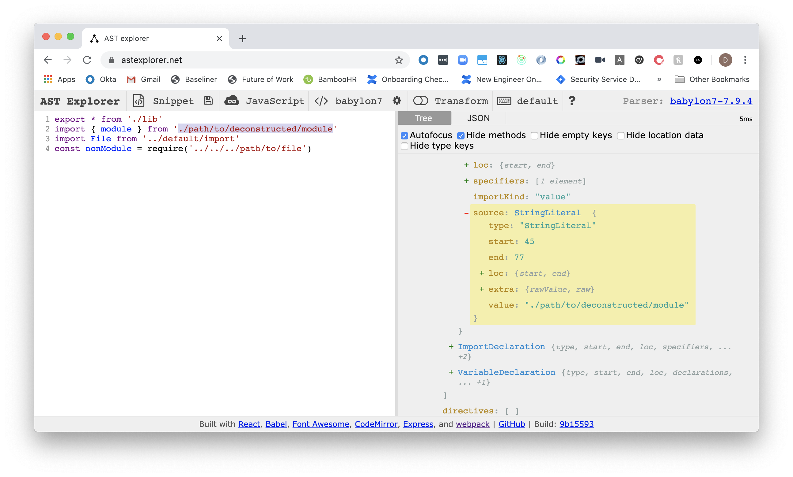
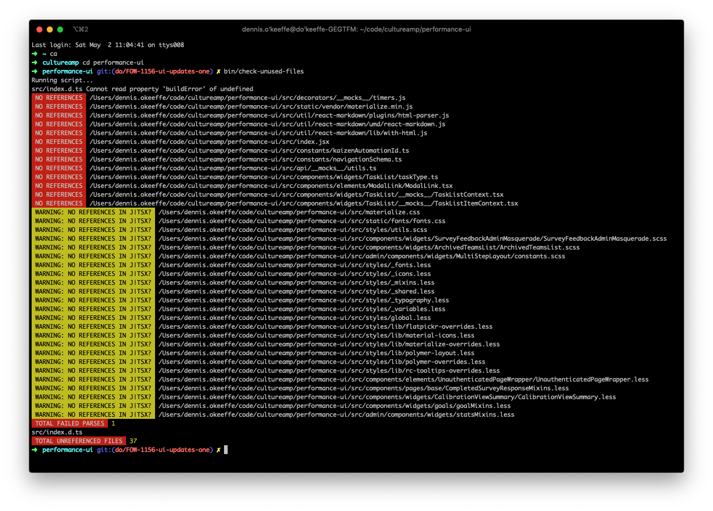

This post is a recount on a script I wrote to remove twenty thousand lines of unused code in the Performance codebase at Culture Amp.

It assumes that you have some understanding on Abstract Syntax Trees (AST) prior.


## Understanding the targets

Whenever I am doing any form of AST manipulation/work, I always head to the [AST Explorer](https://astexplorer.net) first to add some code and play around.

For those who have not yet used it, it is an incredible tool to see different AST parsers and how they syntax translates to the tree.

What I needed to identify through the codebase was whether the JS file had been imported anywhere or used with any of the following syntax:

```javascript
import example from "../path/to/file"
export * from "../path/to/file"
const example = require("../path/to/file")
```

So posting a few of these iterations, I was able to determine how the Babel parser interprets the syntax to help me with the script.




## Using the Babel parser

In order to use the Babel parser, you need to install both the `@babel/parser` and `@babel/traverse` package. The later is used to interpret the parsed code and enable you to use the visitor pattern on particular nodes.

```javascript
const babelParser = require("@babel/parser")
const babelTraverse = require("@babel/traverse").default

/**
 * Check AST tree for any (j|tsx?) files and set a file
 * references for any import, require or dynamic import files.
 */
const parseFileASTTree = file =>
  babelTraverse(
    babelParser.parse(fs.readFileSync(file, "utf-8"), babelParserOptions,
    visitorPatternHandler
  )
```

The `babelParserOptions` is an object with options related to your configuration, while the `visitorPatternHandler` here is an object with Node types as the object keys, and a handler function as the values.

The `file` is the passed in path to the file that I am using Nodejs' `fs` module to simply read.

Once filled out, this came to look like the follow for me:

```javascript
/**
 * Check AST tree for any (j|tsx?) files and set a file
 * references for any import, require or dynamic import files.
 */
const parseFileASTTree = file =>
  babelTraverse(
    babelParser.parse(fs.readFileSync(file, "utf-8"), {
      sourceType: "module",
      plugins: [
        "optionalChaining",
        "classProperties",
        "decorators-legacy",
        "exportDefaultFrom",
        "doExpressions",
        "numericSeparator",
        "dynamicImport",
        "jsx",
        "typescript",
      ],
    }),
    {
      // Used for all ES6 import statements
      ImportDeclaration: path => {
        setFileRef(file, path.node.source.value)
      },
      // For require('') statements
      Identifier: path => {
        if (
          path.node.name === "require" &&
          path.parent.type === "CallExpression"
        ) {
          setFileRef(file, path.parent.arguments[0].value)
        }
      },
      // Use for dynamic imports like routes.jsx
      CallExpression: path => {
        if (path.node.callee.type === "Import") {
          setFileRef(file, path.node.arguments[0].value)
        }
      },
      // Use for export barrells
      ExportAllDeclaration: path => {
        setFileRef(file, path.node.source.value)
      },
      ExportNamedDeclaration: path => {
        // ensure there is a path export
        if (path.node.source) {
          setFileRef(file, path.node.source.value)
        }
      },
    }
  )
```


## Keeping score of unused files

What I also needed to figure out what how to keep track of what files have/haven't been used in some way. This part wasn't so bad - I essentially have an object keep track of the files used and the count of times they had been used.

The idea would be to grab these files, then based on particular logic used, I would iterate through the list and take some form of action.

If it was a JS or TS file, I would run that file through the parser and record what files had been required and used by it.

```javascript
/**
 * Filter only references to (t|jsx?) or (less|scss) files for now.
 * Opt to use our relative paths.
 */
const setFileRef = (file, pathway) => {
  // remove unexpected extension imports
  if (/\.(svg|png|jpg|d\.ts)/.test(pathway)) {
    return
  }

  // replace relative imports with full path
  let module = pathway
  if (/\.\//g.test(pathway) || /\.\.\//g.test(pathway)) {
    module = path.resolve(file, "..", pathway)
  }

  // initialise or increase reference count for file
  if (allImportFileReferences.hasOwnProperty(module)) {
    allImportFileReferences[module] = allImportFileReferences[module] + 1
  } else {
    allImportFileReferences[module] = 1
  }
}
```


## Putting it all together

In the script, there was a `main` method used to fetch files that matched a certain file type that I would use throughout.

```javascript
/**
 * Return paths to all (j|tsx?) files.
 */
const getAllSrcJSAndTSFiles = () =>
  Promise.all([
    recursive("src", ["!*.js"]),
    recursive("src", ["!*.jsx"]),
    recursive("src", ["!*.ts"]),
    recursive("src", ["!*.tsx"]),
    recursive("src", ["!*.css"]),
    recursive("src", ["!*.scss"]),
    recursive("src", ["!*.less"]),
  ])

/**
 * Where Node CLI runs from.
 */
const main = async () => {
  try {
    console.log("Running script...")
    // fetch all js, jsx, ts, tsx, css, scss and less file paths
    const promiseMap = await getAllSrcJSAndTSFiles()
    // flatten the promise arrays returns from separate
    // glob fetches.
    const srcFiles = promiseMap.flatMap(d => d)

    // Iterate through all files and attempt
    // to parse the imports and require
    // statements used to build object map.
    for (const file of srcFiles) {
      if (/(s?css|less)/.test(file)) {
        continue
      }

      try {
        parseFileASTTree(file)
      } catch (err) {
        console.error(file, err.message)
        errFiles.push(file)
      }
    }

    // Optional: Write all the reference counts to
    // a JSON file.
    writeAllImportReferencesJsonFile(allImportFileReferences)

    // Iterate through all src files again, this time checking
    // if that file is actually used in another file.
    for (const file of srcFiles) {
      const pathToFile = path.resolve(".", file)
      // remove .css, .scss and .less from module import path
      let pathToFileWithoutExt = /(s?css|less)/.test(file)
        ? pathToFile
        : pathToFile.replace(/\.[^/.]+$/, "")

      // Handle edge cases where file imported is also a reference to an index
      // file in a folder.
      if (isReferenceToIndexFile(pathToFileWithoutExt)) {
        pathToFileWithoutExt = handleImportsFromIndexFiles(pathToFileWithoutExt)
      }

      // If file is not used, log to console
      // and push to an array of all unreferenced
      // files.
      if (
        isNotUsedInMainApplication(
          pathToFile,
          pathToFileWithoutExt,
          allImportFileReferences
        )
      ) {
        logFileWithNoReferences(pathToFile)
        unreferencedFiles.push(pathToFile)
      }
    }

    // Finally, log any files that failed
    // to parse and the total count of unused
    // files.
    logErrorFiles(errFiles)
    logTotalFilesWithNoReferences(unreferencedFiles)
  } catch (err) {
    console.error(err)
    process.exit(1)
  }
}

main()
```

Finally, I would have helper functions to log out important information, with `logFileWithNoReferences` logging out any files that ultimately did not have any references.


## Running the script

While there are some elements that have been simplified for this example, the working case gave the following output:



The image above is a shortened version of the output **after** the removal of the 20k lines of code as an example. The original script logged out many, many more files.

> It was decided during earlier conversations that I would manually check the files in this particular runthrough the make sure things were okay. However, there were no issues found and a full QA test sweep came up with 0 issues. Any following changes would probably be safe to run without manually writing the files out.

Success! The PR with the changes was up, and we felt much lighter after the merge.


## Improvements

The script itself wanted to check if the file was used at all. In some cases, a file would be used but only one time. This could be fixed by setting a specific delta to help you identify if a file was important from a test file or not.

The other improvement is simply to automate the removal process instead of just logging. This is just a matter of adding in extra lines to have the `fs` module remove those files for you.


## Resources and Further Reading

1. [AST Explorer](https://astexplorer.net/)
2. [What is an AST?](https://en.wikipedia.org/wiki/Abstract_syntax_tree)
