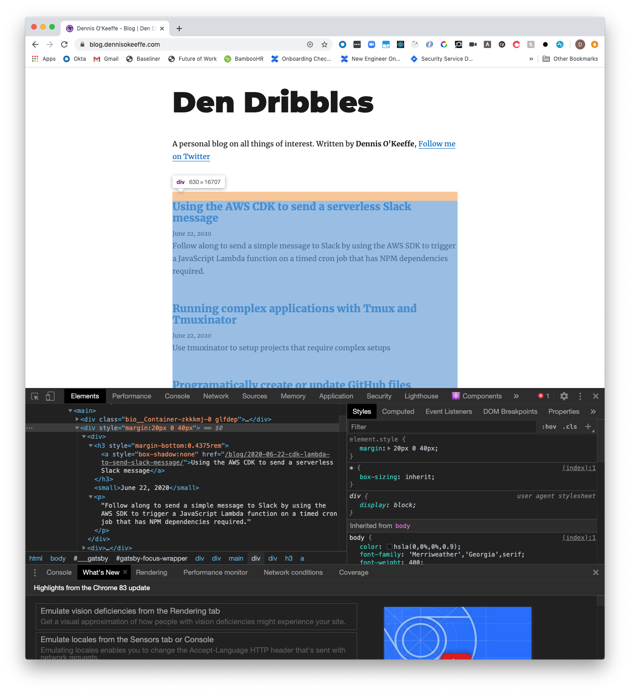
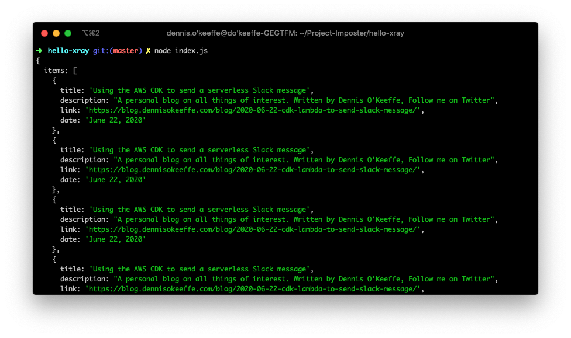

In this short post, we're going to scrape the website that this blog is hosted on to get all the links and posts back using Nodejs and [Xray](https://github.com/matthewmueller/x-ray).


## Setup

We are going to keep things super minimal and bare. We just want a proof of concept on how to scrape the data from the rendered website HTML.

```bash
mkdir hello-xray
cd hello-xray
yarn init -y
yarn add x-ray
touch index.js
```


## Scraping the website

Going to the [blog](https://blog.dennisokeeffe.com) and inspecting with the Developer Tools, we can see that there isn't many classes to go with, but we can use the selectors to decide how we are going to get the information back.



Create a new file `index.js` and add the following:

```javascript
const Xray = require("x-ray")

function getPosts(url = "https://blog.dennisokeeffe.com/") {
  const x = Xray()
  return new Promise((resolve, reject) => {
    x(`${url}`, "main:last-child", {
      items: x("div", [
        {
          title: "h3 > a",
          description: "p",
          link: "h3 > a@href",
          date: "small",
        },
      ]),
    })((err, data) => {
      if (err) {
        reject(err)
      }

      resolve(data)
    })
  })
}

const main = async () => {
  const posts = await getPosts()
  console.log(posts)
}

main()
```

In the above script, we are simply running a main function that calls `getPosts` and waits for the Promise to resolve before logging out the results.

The important part of the code comes from within the `getPosts` function:

```javascript
x(`${url}`, "main:last-child", {
  items: x("div", [
    {
      title: "h3 > a",
      description: "p",
      link: "h3 > a@href",
      date: "small",
    },
  ]),
})((err, data) => {
  if (err) {
    reject(err)
  }

  resolve(data)
})
```

The `x` function is calling the blog URL, the looking for the last child of the `main` DOM element you can see in the HTML DOM from the image shared above.

We are telling Xray to return an array of `items`, and within that, we want to add all the elements that fit the object we pass. In our case, I am using standard selectors to grab the title, description and date, but am using the extra `@href` helper with the `link` to fetch the URL to the blog post!

That's it! Let's run the scraper now using `node index.js`.



Perfect! Now you can take these same shorts tips and apply to anything you need to scrape down the track. Looking for alternatives or to use automation? You should also checkout Puppeteer or Playwright (added to resource links).


## Resources and Further Reading

1. [GitHub - Xray](https://github.com/matthewmueller/x-ray)
2. [GitHub - Puppeteer](https://github.com/puppeteer/puppeteer)
3. [GitHub - Playwright](https://github.com/microsoft/playwright)
4. [Completed project](https://github.com/okeeffed/hello-xray)
