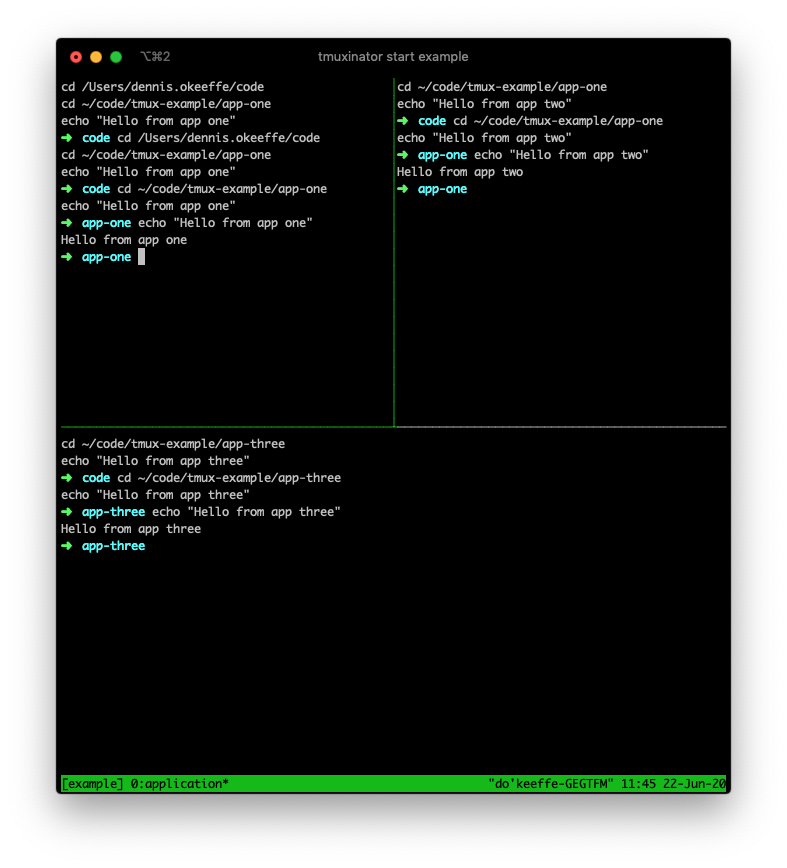
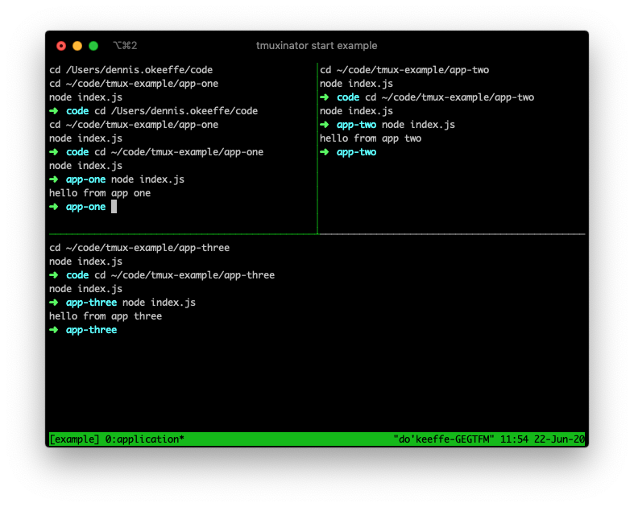

This post will show you how to setup Tmuxinator help you run complex local setups. We will run a contrived example first, because running something basic with some Nodejs scripts.


## Getting started

We need to install bot [Tmux](https://github.com/tmux/tmux) and [Tmuxinator](https://github.com/tmuxinator/tmuxinator) for this setup. I will use Brew, but if you require an alternative, check the documentation.

```bash
brew install tmux
brew install tmuxinator
```

Now that these are install


## Example setup

Within your `~/.tmuxinator` folder, add a new file `example.yml` and add the following:

```yaml
name: example
root: ~/code # can be a path to whatever root you want

windows:
  - application:
      layout: tiled
      panes:
        - app-one:
            - cd ~/code/tmux-example/app-one
            - echo "Hello from app one"
        - app-two:
            - cd ~/code/tmux-example/app-two
            - echo "Hello from app two"
        - app-three:
            - cd ~/code/tmux-example/app-three
            - echo "Hello from app three"
```

In the above, we are declaring the **name** that we can reference and start with Tmuxinator.

Within the **windows**, we are declaring a project named **application**, setting the layout to be **tiled** and finally adding an arbitrary number of panes that we want to show up and run some basic echoes.

Once we have this file saved, we can use `tmuxinator start example` to get our Tmux application running.



We can run `tmux kill-session -t example` to now end the session from a terminal pane.

> As for navigation, the default for Tmux is to use `Ctrl + b`, then the action button. For example, to change between panes, you can use `Ctrl + b, arrow-key`. A list of handy tips can be found [here](https://tmuxcheatsheet.com/).


## Making a slightly-less contrived example

As you may be able to tell from the above example, each pane has a set of commands we can set into the YAML array that will be executed in order. This means that we could use these two run basic Node applications.

Let's do the same echoes from three separate Node apps.

In `~/code/tmux-example`, let's create these files.

```bash
cd ~/code/tmux-example
echo "console.log('hello from app one')" > ./app-one/index.js
echo "console.log('hello from app two')" > ./app-two/index.js
echo "console.log('hello from app three')" > ./app-three/index.js
```

We can now update out Tmuxinator config to run these apps:

```yaml
name: example
root: ~/code # can be a path to whatever root you want

windows:
  - application:
      layout: tiled
      panes:
        - app-one:
            - cd ~/code/tmux-example/app-one
            - node index.js
        - app-two:
            - cd ~/code/tmux-example/app-two
            - node index.js
        - app-three:
            - cd ~/code/tmux-example/app-three
            - node index.js
```

If we run `tmuxinator start example` again, we can see that we successfully manage to get the three different Nodejs scripts to run from different panes.



This stands in place as a simple example, but you could start to see how this can be used when dealing with multiple microservices or require resources to be run during local development.


## Conclusion

This has been a very basic example, but it can be extended as much as you would like.

If you are looking for alternatives to help with local development, I also recommend to check out tools such as Foreman or Kubernetes. Each come with their own tradeoffs and use cases, but I will leave it to you to decide the right tool for the job.


## Resources and Further Reading

1. [Getting started with Tmux](https://linuxize.com/post/getting-started-with-tmux/)
2. [GitHub - Tmuxinator](https://github.com/tmuxinator/tmuxinator)
3. [GitHub - Tmux](https://github.com/tmux/tmux)
4. [GitHub - Node Foreman alternative](https://github.com/strongloop/node-foreman)
5. [Tmux - Cheatsheet](https://tmuxcheatsheet.com/)
