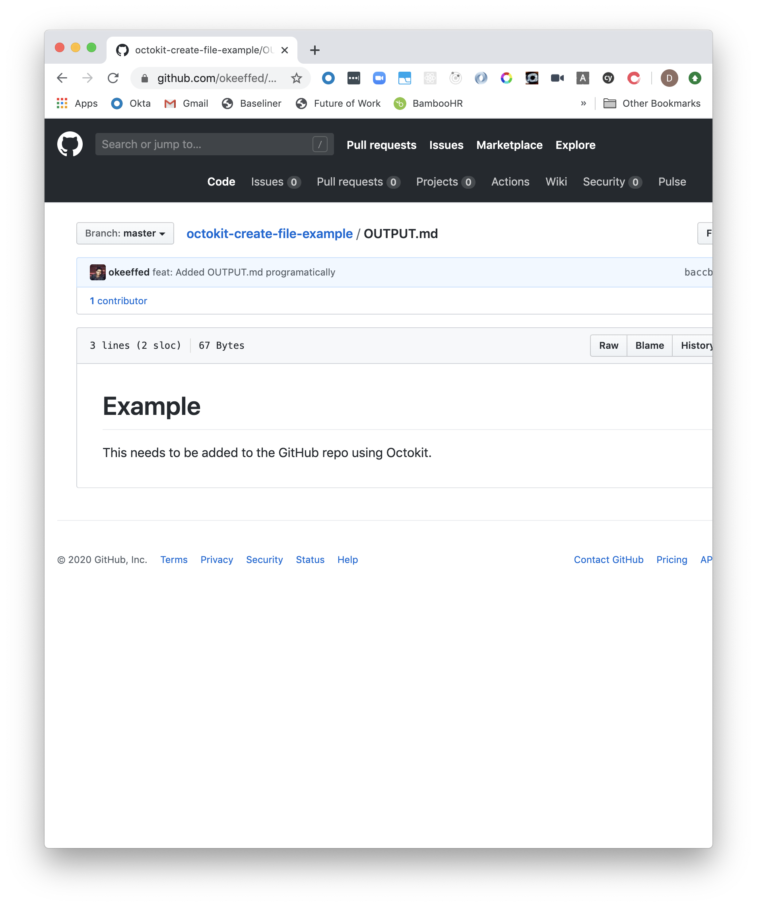
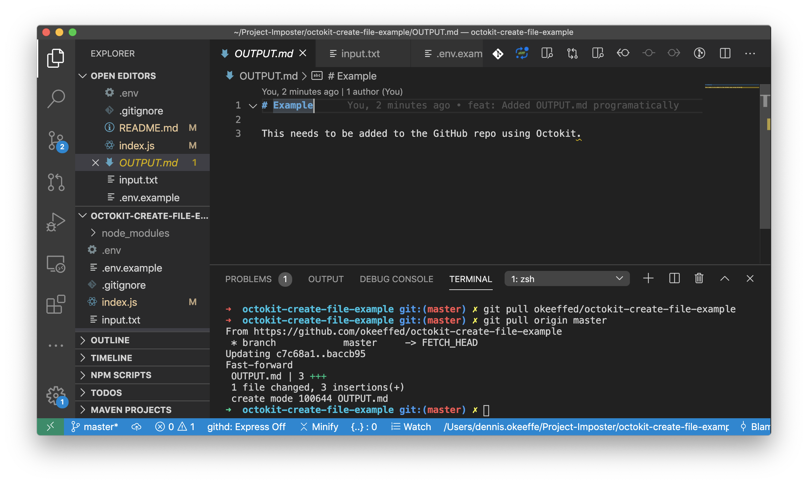

This is a short example to create a new `OUTPUT.md` file in a GitHub repo programatically using [Octokit](https://github.com/octokit/rest.js/).

We are going to use Node's `fs` module to read in a `input.txt` file and use that to write the contents to the repository.


## Setup

We will run a simple setup for this application.

```shell
mkdir octokit-create-file-example
cd octokit-create-file-example
yarn init -y
yarn add @octokit/rest dotenv js-base64
touch index.js input.txt .env .gitignore
```

We are using `dotenv` to set our access token variable and `js-base64` to encode our file contents that we read in from `input.txt`.


## Git Ignored files

Set your `.gitignore` to the following:

```s
node_modules/
.env
```

This will ensure your Personal GitHub Access token won't be accidentally sent up into your repo.


## Adding the GitHub Access Token

You'll need to ensure that you have create a [Personal Access Token](https://help.github.com/en/github/authenticating-to-github/creating-a-personal-access-token-for-the-command-line) to follow along.

Once you have that, add it to your `.env` file:

```s
GITHUB_ACCESS_TOKEN=<access-token-goes-here>
```


## Creating input.txt

Add the following to the `input.txt` file. We will read this in with the Node script.

```markdown
# Example

This needs to be added to the GitHub repo using Octokit.
```


## The Node Script

Add the following to the `index.js` file.

```javascript
const { Octokit } = require("@octokit/rest")
const { Base64 } = require("js-base64")
const fs = require("fs")

require("dotenv").config()

const octokit = new Octokit({
  auth: process.env.GITHUB_ACCESS_TOKEN,
})

const main = async () => {
  try {
    const content = fs.readFileSync("./input.txt", "utf-8")
    const contentEncoded = Base64.encode(content)

    const { data } = await octokit.repos.createOrUpdateFileContents({
      // replace the owner and email with your own details
      owner: "your-github-account",
      repo: "octokit-create-file-example",
      path: "OUTPUT.md",
      message: "feat: Added OUTPUT.md programatically",
      content: contentEncoded,
      committer: {
        name: `Octokit Bot`,
        email: "your-email",
      },
      author: {
        name: "Octokit Bot",
        email: "your-email",
      },
    })

    console.log(data)
  } catch (err) {
    console.error(err)
  }
}

main()
```

We are using Node's `fs` module to first read in the `input.txt` file contents.

Secondly, we encode those contents to base64 using the `js-base64` package we installed.

Finally, we then use Octokit's `createOrUpdateFileContents` function to create the file with that encoded content. You can read more about the required options on the [documentation](https://octokit.github.io/rest.js/v18#repos-create-or-update-file-contents).


## Running the code

First, we need to push up what we have to the remote repo.

```shell
git init
git add --all
git ci -m "feat: Initialise repo setup"
git push
```

> Note: If you haven't already, create the repo on GitHub and add it to the project to push to remote.

If you check the remote repo, it will not have the `OUTPUT.md` file (naturally).

We can now run `node index.js` locally to test our script!

Once you have a successful response, you can refresh your repo to ensure to confirm that `OUTPUT.md` is now there. Hooray!



We can now pull the repo using `git pull` to get the latest file into our local.



Now you can go forth and set things up to programmatically update your repositories!


## Resources and Further Reading

1. [Octokit - GitHub](https://github.com/octokit/rest.js/)
2. [Octokit documentation](https://octokit.github.io/rest.js/)
3. [Octokit docuemntation - createOrUpdateFileContents](https://octokit.github.io/rest.js/v18#repos-create-or-update-file-contents)
4. [Creating a Personal Access Token](https://help.github.com/en/github/authenticating-to-github/creating-a-personal-access-token-for-the-command-line)
5. [Completed GitHub project](https://github.com/okeeffed/octokit-create-file-example)
