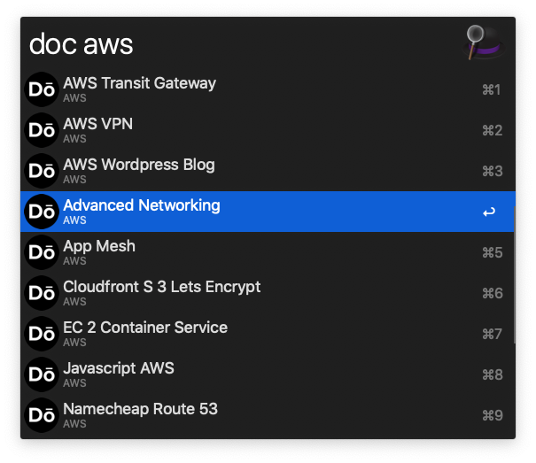
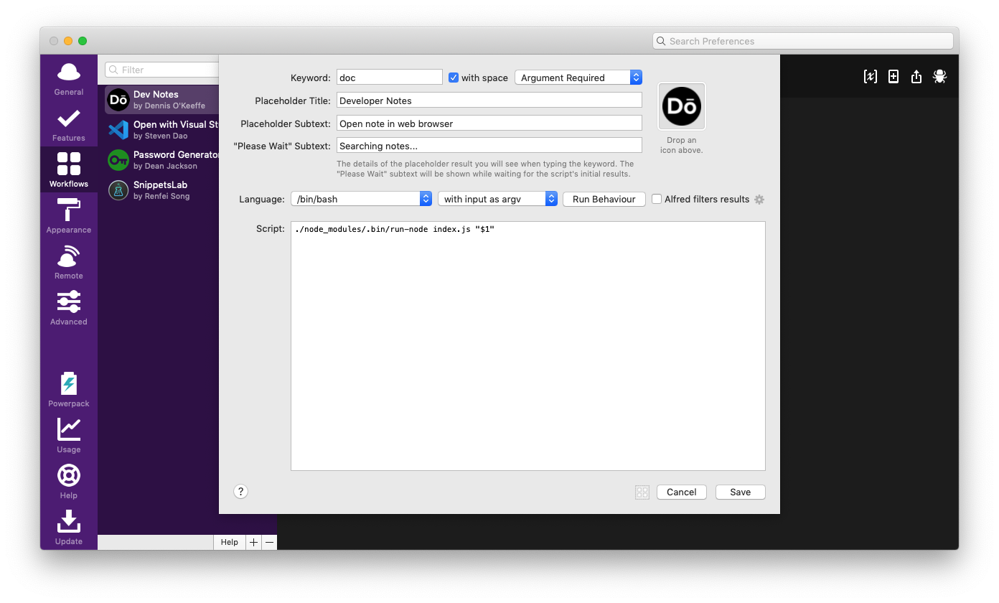
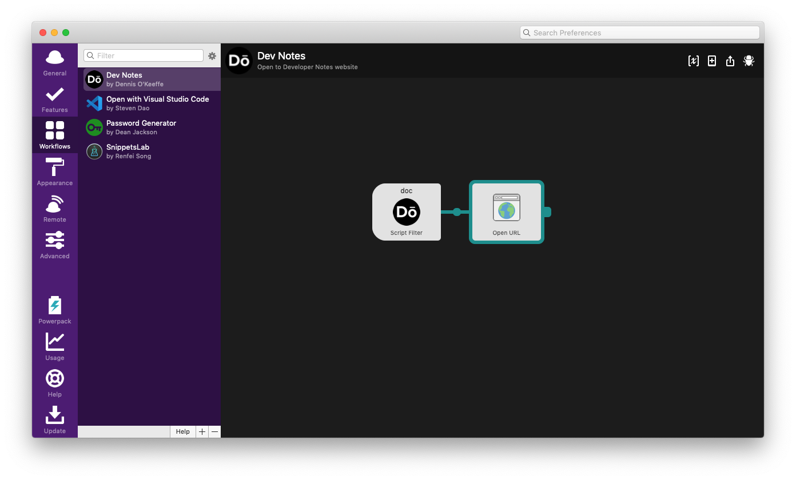
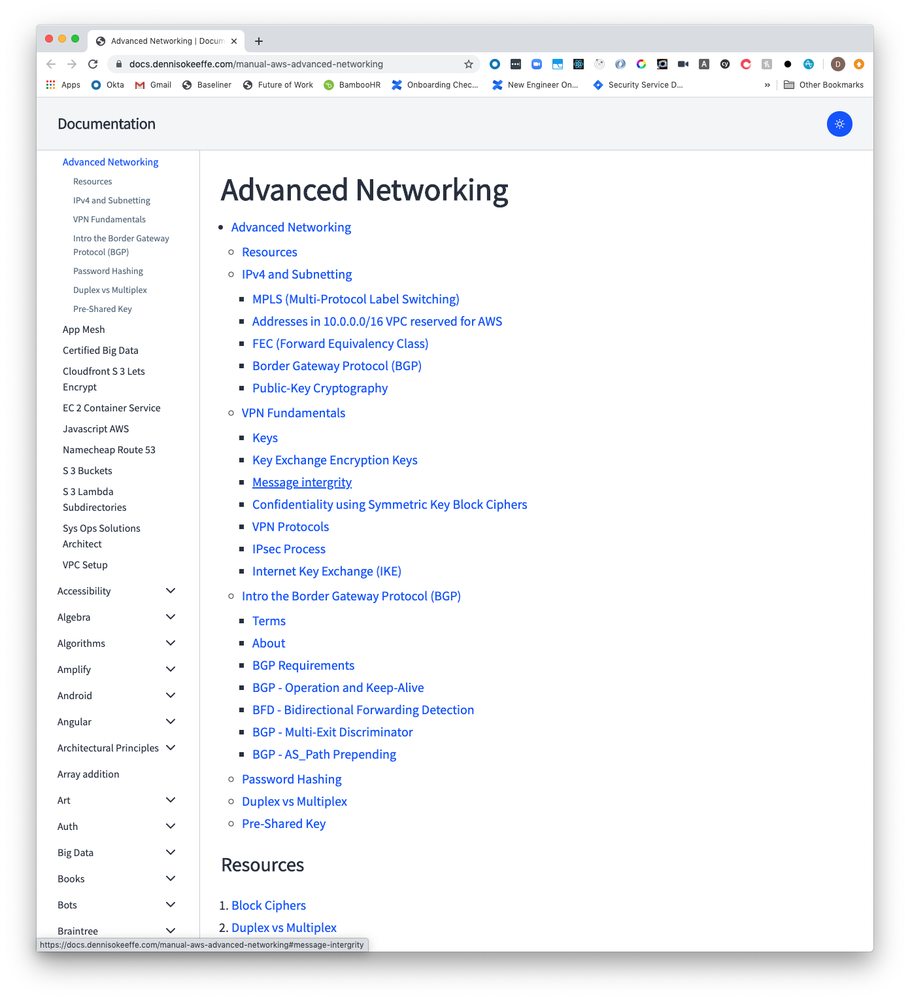

In this post, I will run through a short project I made using [alfy](https://github.com/sindresorhus/alfy) to get an Alfred Workflow up to quickly open notes I have on my [open-source note-taking website](https://docs.dennisokeeffe.com).



<Ad />

## Setting up

If you follow the usage instructions on the [alfy GitHub page](https://github.com/sindresorhus/alfy#usage), step 4 "Go to your new workflow directory" will you get you to the correct place that your code needs to be added in the Alfred workflow.

Getting there is half the battle already done.

This is how my config looks like:



Once there, run the following in a terminal to get things up and going:

```shell
yarn init -y
yarn add alfy
touch index.js
```

As for the Alfred code itself, it was super straight forward:

```javascript
const alfy = require("alfy")
const json = require("./data.json")

;(async () => {
  const items = alfy.inputMatches(json, "search").map(element => ({
    title: element.title,
    subtitle: element.subtitle,
    arg: element.arg,
  }))

  alfy.output(items)
})()
```

That is literally it for the magic that happens with Alfred, but what is the `json` I am importing?

I decided to have a script that generates the latest doc set during my Git pre-push hook from the developer notes repo.

<Ad />

## Generating the docset list

As mentioned above, I have a helper script that will generate the `data.json` file above.

That file looks like so:

```javascript
#!/usr/bin/env node

/**
 * Dynamically generates a script you can `source ./bin/docs-autocompletions`
 * to gen local options for installation.
 */

const fs = require("fs")
const startCase = require("lodash.startcase")
const kebabCase = require("lodash.kebabcase")

const BASE_URL = "https://docs.dennisokeeffe.com/manual"

// Redacting the directory infor for where it is kept
const parentDir = "/path/to/developer-notes"
const getDirectories = source =>
  fs
    .readdirSync(source, { withFileTypes: true })
    .filter(dirent => dirent.isDirectory())
    .map(dirent => dirent.name)

const getFiles = source =>
  fs
    .readdirSync(source, { withFileTypes: true })
    .filter(dirent => dirent.isFile())
    .map(dirent => dirent.name)

const main = () => {
  const directories = getDirectories(`${parentDir}/manual`)
  const json = []

  for (const directory of directories) {
    getFiles(`${parentDir}/manual/${directory}`)
      .map(file => file.replace(".md", ""))
      .map(file =>
        json.push({
          title: startCase(file),
          subtitle: startCase(directory),
          arg: `${BASE_URL}-${kebabCase(directory).toLowerCase()}-${kebabCase(
            file
          ).toLowerCase()}`,
          search: `${startCase(directory)} ${startCase(file)}`,
        })
      )
  }

  fs.writeFileSync(
    "/path/to/alfy/code/data.json",
    JSON.stringify(json),
    "utf-8"
  )

  console.log(
    "[Success]: Autocompletions written to bin/lift-autocomplete.sh for project"
  )
}

main()
```

The above code is not doing anything magical. It follows this process:

1. Get the directory where all the docs are stored on my local [developer notes repo](https://github.com/okeeffed/developer-notes).
2. Iterate through the subdirectories, get the files and map through to make string changes that will end up matching the JSON structure that Alfy requires for the `alfy.inputMatches` function in my Alfred Workflow script.
3. Write all that information to the `data.json` file in the Workflow directory.

> I have omitted the paths on my local for both the developer notes directory + the Alfred workflow directory.

That's it! Everytime I make a change in the developer notes, a pre-push Git hook will generate the latest `data.json` file and place it where it needs to go. Easy peasy!

<Ad />

## Opening the URL

This last part is nice and straight forward - you just need to take the selected input from Alfred and pass it to "Open URL"!



Now I can peruse my notes locally from wherever I want!

<Ad />

## In use

Searching through Alfred looks like so...


...and selecting the document will open up my browser at the page.



<Ad />

## Resources and Further Reading

1. [GitHub - Alfy](https://github.com/sindresorhus/alfy)
2. [GitHub - Personal developer notes](https://github.com/okeeffed/developer-notes)
