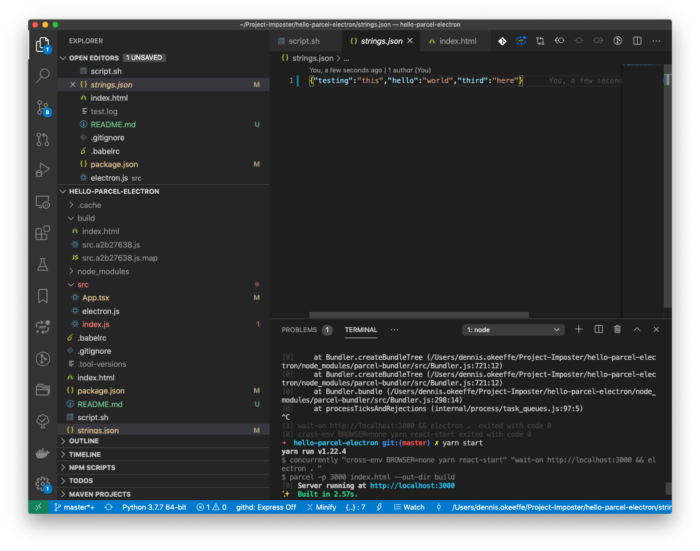

This is a short on how to get up and running with Electron using Parcel and then choosing and updating a JSON file using Electron's dialog API.

<Ad />

## Initialing the project

As for setting up the project.

```sh
mkdir hello-parcel-electron
cd hello-parcel-electron
yarn init -y
yarn add react react-dom electron-is-dev
yarn add -D concurrently cross-env electron electron-builder parcel-bundler wait-on typescript
# Babel
yarn add -D babel-core babel-plugin-transform-object-rest-spread babel-plugin-transform-react-jsx babel-preset-env babel-preset-react
# Adding required files
mkdir src
touch src/index.js src/App.js electron.js tsconfig.json index.html
```

<Ad />

## Creating the entry point

Add the following to `index.html` file in root dir:

```html
<!DOCTYPE html>
<html lang="en">
  <head>
    <meta charset="UTF-8" />
    <meta name="viewport" content="width=device-width, initial-scale=1.0" />
    <meta http-equiv="X-UA-Compatible" content="ie=edge" />
    <title>Electron React Parcel</title>
    <link
      rel="shortcut icon"
      href="./src/assets/logo.ico"
      type="image/x-icon"
    />
  </head>
  <body>
    <div id="root"></div>
    <script src="./src/index.js"></script>
  </body>
</html>
```

This file will be used by Parcel as the entrypoint. Next, add this to `src/index.js`:

```javascript
// index.js
import React from "react"
import ReactDOM from "react-dom"
import App from "./App"

ReactDOM.render(<App />, document.getElementById("root"))
```

And for `src/App.js`:

```javascript
// App.js
import React from "react"

class App = () => (<div>Hello, World!</div>)

export default App
```

This is just a basic React app setup.

<Ad />

## Setup up Babel

In the root `.babelrc` file, add the following:

```javascript
{
  "presets": ["env", "react"],
  "plugins": ["transform-object-rest-spread", "transform-react-jsx"]
}
```

<Ad />

## Adding Scripts and Homepage

Next, we need to update our **scripts** and **homepage** in `package.json`. I've left in some extra tidbits from my current configuration, so feel free to add. The **build** key is used by Electron when creating a build.

```json
{
  "homepage": "./",
  "main": "src/electron.js",
  "scripts": {
    "react-start": "parcel -p 3000 index.html --out-dir build",
    "react-build": "parcel build index.html --out-dir build --public-url ./",
    "start": "concurrently \"cross-env BROWSER=none yarn react-start\" \"wait-on http://localhost:3000 && electron . \"",
    "electron-build": "electron-builder -mwl",
    "build": "yarn clean-build && yarn react-build && yarn electron-build"
  },
  "build": {
    "appId": "com.dennisokeeffe",
    "files": ["src/electron.js", "src/assets/*", "build/**/*"],
    "mac": {
      "target": "dmg",
      "icon": "src/assets/logo.png"
    },
    "win": {
      "target": "nsis",
      "icon": "src/assets/logo.png"
    },
    "linux": {
      "target": "deb",
      "icon": "src/assets/logo.png",
      "category": "Development"
    }
  }
}
```

<Ad />

## TypeScript config

To get TypeScript going, Add this to `tsconfig.json` in the root:

```json
// tsconfig.json
{
  "compilerOptions": {
    "jsx": "react"
  }
}
```

<Ad />

## Setting up the Electron file

Add `electron.js` in `src` directory:

```javascript
const electron = require("electron")
const app = electron.app

const BrowserWindow = electron.BrowserWindow

const path = require("path")
const isDev = require("electron-is-dev")

let mainWindow

function createWindow() {
  mainWindow = new BrowserWindow({
    width: 900,
    height: 680,
  })

  mainWindow.loadURL(
    isDev
      ? "http://localhost:3000"
      : `file://${path.join(__dirname, "../build/index.html")}`
  )
  mainWindow.on("closed", () => (mainWindow = null))
}

app.on("ready", createWindow)

app.on("window-all-closed", () => {
  if (process.platform !== "darwin") {
    app.quit()
  }
})

app.on("activate", () => {
  if (mainWindow === null) {
    createWindow()
  }
})
```

This file is used by Electron as an entrypoint to understand the config. Note that here we are telling it to use `localhost:3000` in dev mode.

We are now ready to start! Tun `yarn start` and to build we run `yarn build` and if successful, you should see the following:


<Ad />

## Updating to use Electron's dialog API

Let's update `src/App.tsx` with the following:

```typescript
import React, { useState } from "react"
const fs = window.require("fs")
const electron = window.require("electron")
const { remote } = electron

const App = () => {
  const [filePath, setFilePath] = useState<string>()
  const [fileJson, setFileJson] = useState<Record<string, any>>()
  const [saved, setSaved] = useState<boolean>(false)

  /**
   * Look for any files called strings.json and grab the
   * file path, read the data, update the data and set it
   * to the `fileJson` variable.
   *
   */
  const handleFileSelect = async () => {
    const res = await remote.dialog.showOpenDialog({
      properties: ["openFile"],
      filters: [{ name: "i18n file", extensions: ["strings.json"] }],
    })

    const [jsonPath] = res.filePaths
    if (jsonPath) {
      const data = JSON.parse(fs.readFileSync(jsonPath, "utf-8"))
      setFilePath(jsonPath)
      data.third = "here"

      setFileJson(data)
    }
  }

  /**
   * Write the file back and set the saved flag.
   *
   */
  const handleSaveFile = () => {
    if (filePath) {
      fs.writeFileSync(filePath, JSON.stringify(fileJson), "utf-8")
      setSaved(true)
    }
  }

  return (
    <div>
      {saved && <p>File saved!</p>}
      <p>Open + save file</p>
      <div>
        <button onClick={handleFileSelect}>Open file</button>
        <button onClick={handleSaveFile}>Save file</button>
      </div>
      <p>{JSON.stringify(fileJson)}</p>
    </div>
  )
}
export default App
```

If we go through this, we are requiring the `fs` module to use for writing files locally, the `remote` module to access the `dialog` API and then we are adding some button handlers to select a file and save a file.

For `handleFileSelect` I am using some of the filters from the API to force myself to only be able to select files named `strings.json`.

Let's create a `strings.json` file in the root directory and add the following:

```json
{ "testing": "this", "hello": "world" }
```

We are going to read this file and add something new!

In our `handleFileSelect` closure, we are checking for a `jsonPath` result to the selection, and if it exists, we are simply reading it, parsing the JSON and adding a new property.

The `handleSaveFile` simply overrides the currently file selected, which we are storing as state `filePath` during the file selection.

<Ad />

## Running the App

Now, the Electron App should look like the following:


If we select `Open file`, we see the following dialog box:


Given the restrictions we set, opening `strings.json` is the only workable option.

If we select it, you can see we have some text to show the JSON with some manipulation to add the `third` key. Currently, this hasn't been saved to disk. If we now select `Save file`, we will get a confirmation of the file being saved, and checking back to our IDE can confirm that the file indeed has been saved to disk.




Hooray! This has been a short introduction into getting things going, but the world is your oyster from here. This code is readily reuseable for you to quickly put together Electron + React + TypeScript apps for your own needs.

<Ad />

## Resources and Further Reading

1. [Medium - Production Ready Electron App Using React and Parcel](https://medium.com/@yogeshkumarr/production-ready-electron-app-using-react-and-parcel-web-bundler-74dcda63f148)
2. [Parcel TypeScript](https://parceljs.org/typeScript.html)
3. [Electron - Dialog API](https://www.electronjs.org/docs/api/dialog)
