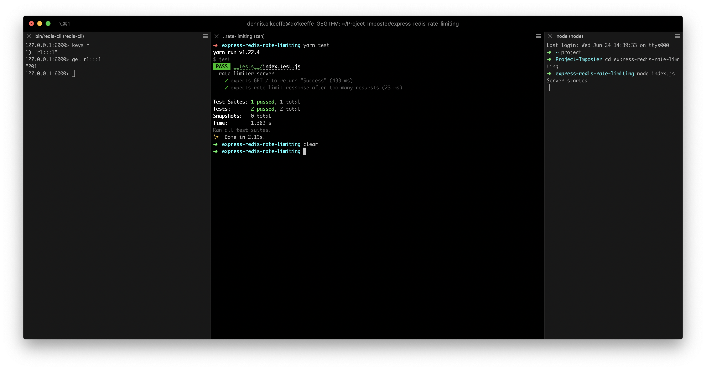
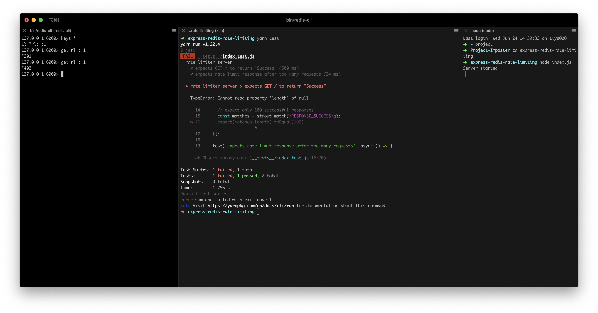

In this tutorial, we are going to use the power of Docker to fire up a Redis instance that can keep track of rate limiting in a simple ExpressJS app to give you all the lowdown on how to set this up yourself locally.

Docker and Redis must be installed for this tutorial, however prior knowledge on Docker and Redis are not required (nor ExpressJS really - we can get this done!). The usual Nodejs suspects are also expected.

If you haven't installed, you can follow instructions on how to do so on the [Docker website](https://docs.docker.com/get-started/) the [Redis quickstart](https://redis.io/topics/quickstart).

Not enough time/care? See a [completed project here](https://github.com/okeeffed/express-redis-rate-limiting).


## Setting up Docker

Let's get this out of the way first! We want to pull down the Redis image and start it with port forwarding.

```s
docker pull redis
docker run --name redis-test -p 6000:6379 -d redis
docker ps
```

Here, we are pulling the image, starting it with the name "redis-test" and forwarding the default Redis port 6379 to 6000. We are doing this to prevent a clash with another Redis instance that may be running.

Running `docker ps` should show something similar to the following:

```s
CONTAINER ID        IMAGE               COMMAND                  CREATED             STATUS              PORTS                    NAMES
00fcae665347        redis               "docker-entrypoint.s…"   3 seconds ago       Up 2 seconds        0.0.0.0:6000->6379/tcp   redis-test
```

Happy days! Let's move forward.


## Setting up the project

Let's create our project folder, install all the packages and get to work.

```s
mkdir express-redis-rate-limiting
cd express-redis-rate-limiting
yarn init -y
yarn add express express-rate-limit rate-limit-redis redis
yarn add --dev execa jest
```

The package `express-rate-limit` is how we will implment the rate limiting, while `rate-limit-redis` and `redis` will allow us to extent the rate limiting capabilities to be used on Redis and not stored in memory. More on that later.

We are installing developer dependencies `execa` and `jest` for testing purposes. We will use them as a helper of sorts to check the rate limiting from the CLI.


## Setting up the Express Server

Add this to a `index.js` file at the root of the project:

```javascript
const express = require("express")
const app = express()
const port = 8080

app.get("/", (_, res) => res.send("RESPONSE_SUCCESS"))

app.listen(port, () => console.log("Server started"))
```

This is a super basic Express app that only has a GET request at route `/`.

From the terminal, run `node index.js` and you should see `server started`.

From another terminal, run `curl localhost:8000` and you should see our `RESPONSE_SUCCESS` command. Perfect!


## Adding in the test to help us out

Before we go into the rate limiting, we're going to set up a test to help us make a ton of requests easily.

First, in `package.json`, make sure your "scripts" property looks like so:

```json
"scripts": {
    "start": "node index.js",
    "test": "jest"
}
```

> Before we used `node index.js` to start the server, but from now on we can also use `yarn start` thanks to the scripts folder.

Next, create file `__tests__/index.test.js` and add the following:

```javascript
const execa = require("execa")

describe("rate limiter server", () => {
  // note: this will only succeed once in the 15min window designated
  test('expects GET / to return "RESPONSE_SUCCESS" the maximum number of times (100)', async () => {
    const { stdout } = await execa("ab", [
      "-n",
      "200",
      "-v",
      "3",
      "http://localhost:8080/",
    ])

    // expect only 100 successful responses
    const matches = stdout.match(/RESPONSE_SUCCESS/g)
    expect(matches.length).toEqual(100)
  })

  test("expects rate limit response after too many requests", async () => {
    const { stdout } = await execa("ab", [
      "-n",
      "1",
      "-v",
      "3",
      "http://localhost:8080/",
    ])

    expect(
      /Too many requests, please try again later./g.test(stdout)
    ).toBeTruthy()
  })
})
```

So what is going here? The "test" descriptions should hopefully tell you exactly what we want to happen:

1. Expects GET / to return "RESPONSE_SUCCESS" the maximum number of times (100).
2. Expects rate limit response after too many requests.

As for `execa`, what is it doing here? Execa basically just takes an initial terminal command and an array of any extra "words" we want to pass (for a lack of a better term), so really what we are running in that first test is `ab -n 200 -v 3 http://localhost:8080/`. So what is `ab`?

Running `man ab`, we can see the manual tells us that `ab` is a "Apache HTTP server benchmarking tool".

Looking through the manual, we see the flag `-n` is the number of requests to perform for the benchmarking session and `-v` is the verbosity level where "3" and above prints response codes, warnings and info. Ipso facto, that command is making a request to `http://localhost:8080/` 200 times and with extra information. Neato!

Execa returns what is logged to `stdout`, so the following is checking how many times in the output we match `RESPONSE_SUCCESS`:

```javascript
const matches = stdout.match(/RESPONSE_SUCCESS/g)
expect(matches.length).toEqual(100)
```

We are going to use this to ensure we only allow 100 max successful responses during the rate limiting period.


## Running the test for the first time

Run `yarn test` to get Jest up and going. You should see "2 failed" - uh oh. What is happening here?

```s
$ jest
 FAIL  __tests__/index.test.js
  rate limiter server
    ✕ expects GET / to return "Success" (133 ms)
    ✕ expects rate limit response after too many requests (18 ms)

  ● rate limiter server › expects GET / to return "Success"

    expect(received).toEqual(expected) // deep equality

    Expected: 100
    Received: 200

      14 |     // expect only 100 successful responses
      15 |     const matches = stdout.match(/RESPONSE_SUCCESS/g);
    > 16 |     expect(matches.length).toEqual(100);
         |                            ^
      17 |   });
      18 |
      19 |   test('expects rate limit response after too many requests', async () => {

      at Object.<anonymous> (__tests__/index.test.js:16:28)

  ● rate limiter server › expects rate limit response after too many requests

    expect(received).toBeTruthy()

    Received: false

      28 |     expect(
      29 |       /Too many requests, please try again later./g.test(stdout),
    > 30 |     ).toBeTruthy();
         |       ^
      31 |   });
      32 | });
      33 |

      at Object.<anonymous> (__tests__/index.test.js:30:7)

Test Suites: 1 failed, 1 total
Tests:       2 failed, 2 total
Snapshots:   0 total
Time:        1.366 s
Ran all test suites.
error Command failed with exit code 1.
```

For the first test, we expected on 100 cases of `RESPONSE_SUCCESS` to show up, not 200. As for the second, we expected a message to come back about there being too many requests after we hit the limit.

Q: Why did this happen?
A: Because we have not added rate limiting


## Adding in InMemory rate limiting

Head back to `index.js` and update it to be the following:

```javascript
const express = require("express")
const rateLimit = require("express-rate-limit")
const app = express()
const port = 8080

const limiter = rateLimit({
  windowMs: 15 * 60 * 1000, // 15 minutes - only used for MemoryStore, ignored with RedisStore
  max: 100, // limit each IP to 100 requests per windowMs
})

// use limiter in the middleware
app.use(limiter)

app.get("/", (_, res) => res.send("RESPONSE_SUCCESS"))

app.listen(port, () => console.log("Server started"))
```

Here we are adding in the `express-rate-limit` library. There is more information about the defaults on [GitHub](https://github.com/nfriedly/express-rate-limit), but for now we are basically saying that "in a 15 minute period, only allow the IP to have a max of 100 requests".

Re-run the server using `yarn start` and run the tests again with `yarn test`.

```s
$ jest
 PASS  __tests__/index.test.js
  rate limiter server
    ✓ expects GET / to return "RESPONSE_SUCCESS" the maximum number of times (100) (188 ms)
    ✓ expects rate limit response after too many requests (18 ms)

Test Suites: 1 passed, 1 total
Tests:       2 passed, 2 total
Snapshots:   0 total
Time:        5.254 s
Ran all test suites.
✨  Done in 9.21s.
```

Success! Hooray!

But what happens if we run it again? One test fails. Why? Because we are already at the rate limit, so we do not expect to see 100 successful requests! I did say this test was just a helper didn't I?

> By default, the expiry time for the limit is one minute, so if you wait a minute and try again, things will work.

Let's try something out here.

```s
yarn start # In terminal one
yarn test # In terminal two - comes with a success
# restart the server again (within the 1 minute expiry) on terminal one
yarn start # In terminal one
yarn test # In terminal two
```

Hang on, now we get success two times? What happen to the rate limiting from our 200 requests?

Without supplying a store for the Express rate limiter, we are using in-memory store. This means anytime the server shuts down, we lose track of the IPs! Even worse, if we have a setup with multiple servers, a rate limit on one server doesn't necessarily mean it is limited on the others!


## Redis to the Rescue

Update `index.js` one last time to have the following:

```javascript
const express = require("express")
const rateLimit = require("express-rate-limit")
const RedisStore = require("rate-limit-redis")
const app = express()
const port = 8080

const limiter = rateLimit({
  store: new RedisStore({
    expiry: 60 * 15, // 15 minute expiring (in seconds)
    client: require("redis").createClient({
      // Exposing Docker port on 6000
      port: 6000,
    }),
  }),
  windowMs: 15 * 60 * 1000, // 15 minutes - only used for MemoryStore, ignored with RedisStore
  max: 100, // limit each IP to 100 requests per windowMs
})

// use limiter in the middleware
app.use(limiter)

app.get("/", (_, res) => res.send("RESPONSE_SUCCESS"))

app.listen(port, () => console.log("Server started"))
```

With the new `store` configuration added the the rate limiter, we are setting a `RedisStore` that sets a expiry time of 15 minutes and we are connecting to port 6000.

> Don't forget, we already did the hard work with Redis and it is running in our Docker container. We are forwarding the Redis port in this container to be exposed to localhost port 6000.

Re-run the server and run the test again. You should see the same old success for both tests that we've seen before. However, this time we have Redis running... so we can do some cool things here.

In another terminal, run `redis-cli -p 6000`. This tells the Redis CLI to connect to a Redis database on port 6000.

Once into the Redis CLI, you can run the following commands:

```s
keys * # show all keys
# 1) "rl:::1" <- should be shown
get rl:::1
# "201"
```

So this is cool... we now have a key that stores a value for the rate limit, and we have the current value at 201!



> Why 201? In our tests, the first test calls the endpoint 200 times, while the second test calls it once.

If we stop and restart the server, the run `yarn test` again, we will see that we get the failure on the first test again as it isn't had 100 successful responses. The second test passes, though, so we must be getting rate limited!

In the Redis CLI, run `get rl:::1` again and you will see "402" as the amount of requests that has been attempted by this IP in the time limit! Sweet victory!



In the wild, this now means that Express instances that connect the same Redis database can now keep in sync with what to rate limit!

> Note: I said the "same" database here, as we are not going into Redis replicas here. That's a tale for another time friends.


## Conclusion

I am going to end it there, but we have had some great success.

Do not forget to teardown your instances afterwards (looking at your Docker):

```s
docker stop redis-test
docker rm redis-test
```

Go forth and rate limit those pesky IPs from your sweet, sweet dog appreciation websites you build on the weekends, pals.

> It is also probably worth reiterating with the tests that they were more of a visual helper - you don't really want a flaky test for the rate limiting that fails intermittent as soon as you are rate limiting and don't get the 100 successful requests. There are solutions for that (changing limit time based on environment etc) but I will leave that one.


## Resources and Further Reading

1. [Completed project](https://github.com/okeeffed/express-redis-rate-limiting)
2. [Docker - Getting Started](https://docs.docker.com/get-started/)
3. [Redis Quickstart](https://redis.io/topics/quickstart)
4. [execa](https://github.com/sindresorhus/execa)
5. [rate-limit-redis](https://github.com/wyattjoh/rate-limit-redis)
6. [express-rate-limit](https://github.com/nfriedly/express-rate-limit)
7. [Redis commands](https://redis.io/commands)
8. [DockerHub - Redis](https://hub.docker.com/_/redis)
9. [Express.js](https://expressjs.com/)

_Image credit: [Markus Spiske](https://unsplash.com/@markusspiske)_