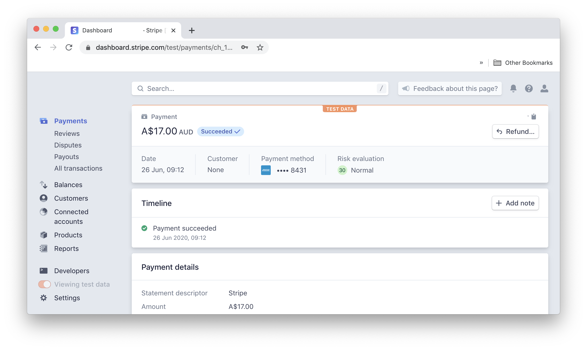

In this short series, we are going to look at how to create a charge to Stripe in a number of their officially supported languages!

In this article, we are going to look at how to do so with C# and Dotnet.

The expectations are that you have both Dotnet installed and have your [Stripe API keys](https://stripe.com/docs/keys) setup and ready to go.

> The following comes in part from my [documentation website](https://docs.dennisokeeffe.com/manual-stripe-dotnet-stripe-configuration).

## Adding the library

Assuming you have Dotnet setup, run the following:

```shell
# install stripe
dotnet add package Stripe.net
# for reading local env file
# NOT REQUIRED unless you want to read from .env
dotnet add package DotNetEnv
# install required code generation code
Microsoft.VisualStudio.Web.CodeGeneration.Design
# global install scaffolding tool
dotnet tool install --global dotnet-aspnet-codegenerator
```

## Adding a Dotenv file

This file will be used to store our credentials to access Stripe.

```shell
touch .env
```

Within the Dotenv file, we need to add your test keys from Stripe's website.

```s
SK_TEST_KEY=<sk_test_key>
PK_TEST_KEY=<pk_test_key>
```

## Updating your settings file

If you are going to use another method to fetch the variables (ie secrets etc), you could add the following to your `appsettings.json` file:

```json
{
  // previous key/values omitted for brevity
  "Stripe": {
    "SecretKey": "SK_TEST_KEY", // this will eval to sk_test_... .env
    "PublishableKey": "PK_TEST_KEY" // this will eval to sk_test_... from .env
  }
}
```

Make sure to check the [docs on passing parameters](https://docs.microsoft.com/en-us/dotnet/csharp/programming-guide/classes-and-structs/passing-parameters) to understand how this works.

## Add Stripe config to Startup.cs

```csharp
using Stripe;
using DotNetEnv;

// ... code omitted for brevity

public Startup(IConfiguration configuration)
{
    Configuration = configuration;
    // load .env file
    DotNetEnv.Env.Load();
    // set config using env var
    StripeConfiguration.ApiKey = System.Environment.GetEnvironmentVariable("SK_TEST_KEY");
}
```

## Create the Model

```cs
// in Models/StripeCharge.cs
namespace ChargeApi.Models
{
    public class StripeCharge
    {
        public long Amount { get; set; }
        public string Currency { get; set; }
        public string Source { get; set; }
        public string ReceiptEmail { get; set; }
    }
}
```

## Create the Controller

```cs
// Controllers/Charge.cs
using System.Collections.Generic;
using Microsoft.AspNetCore.Mvc;
using Stripe;
using ChargeApi.Models;

namespace dotnet_stripe.Controllers
{
    [ApiController]
    [Route("api/charges")]
    public class ChargesController : Controller
    {
        [HttpPost]
        public Stripe.Charge CreateCharge([FromBody] StripeCharge createOptions)
        {
            var options = new ChargeCreateOptions
            {
                Amount = createOptions.Amount,
                Currency = "auread",
                Source = "tok_visa",
                ReceiptEmail = "hello_dotnet@example.com",
            };
            var service = new ChargeService();
            var charge = service.Create(options);
            return charge;
        }
    }
}
```

## Sending the request on HTTPie

Since we are sending back the response from the `Stripe.Charge` object, it will be very verbose and not what you want to do in reality for the API.

In this example using [HTTPie](https://httpie.org/), call `http POST http://localhost:5000/api/charges amount:=1700 receipt_email=hello_dotnet@example.com` and we will get back our charge results sent as JSON. Hooray!

I chose to use HTTPie because I feel it is a fun tool that more should know about! Alternative, you could do the above using `curl` as well (or anything that can make a POST request for a matter of fact).

```s
curl --header "Content-Type: application/json" \
  --request POST \
  --data '{"amount":1700,"receipt_email":"hello_dotnet@example.com"}' \
  http://localhost:5000/api/charges
```

If you now go and check your Stripe dashboard, you will be able to see a charge.



## Resources and Further Ready

1. [Setting up Stripe API for Dotnet](https://codebrains.io/integrate-stripe-api-with-asp-net-core-creating-customers/)
2. [Stripe Dotnet API Docs](https://stripe.com/docs/api?lang=dotnet)
3. [First Dotnet API](https://docs.microsoft.com/en-us/aspnet/core/tutorials/first-web-api?view=aspnetcore-3.1&tabs=visual-studio-mac)
4. [Setting secrets for a Dotnet project](https://docs.microsoft.com/en-us/aspnet/core/security/app-secrets?view=aspnetcore-3.1&tabs=linux)
5. [Interfaces in C#](https://docs.microsoft.com/en-us/dotnet/csharp/language-reference/keywords/interface)
6. [ASP.NET Core API Service with Twilio, Stripe and Stormpath](https://stormpath.com/blog/build-api-service-dotnet-core-twilio-stripe)
7. [Process Payments with Dotnet](https://cmatskas.com/processing-payments-and-being-pci-compliant-with-stripe-js/?utm_content=buffer55d56&utm_medium=social&utm_source=twitter.com&utm_campaign=buffer)
8. [Process Payments with Dotnet Github](https://github.com/cmatskas/StripeSample/tree/master/StripeSample)
9. [Stripe Development Docs](https://stripe.com/docs/development#create-charge)
10. [Toptal ASP.NET WebAPI](https://www.toptal.com/asp-dot-net/asp-net-web-api-tutorial)
11. [Dev.To tutorial](https://dev.to/integerman/creating-a-net-core-api-3n6d)
12. [HTTPie JSON](https://httpie.org/doc#default-behaviour)
