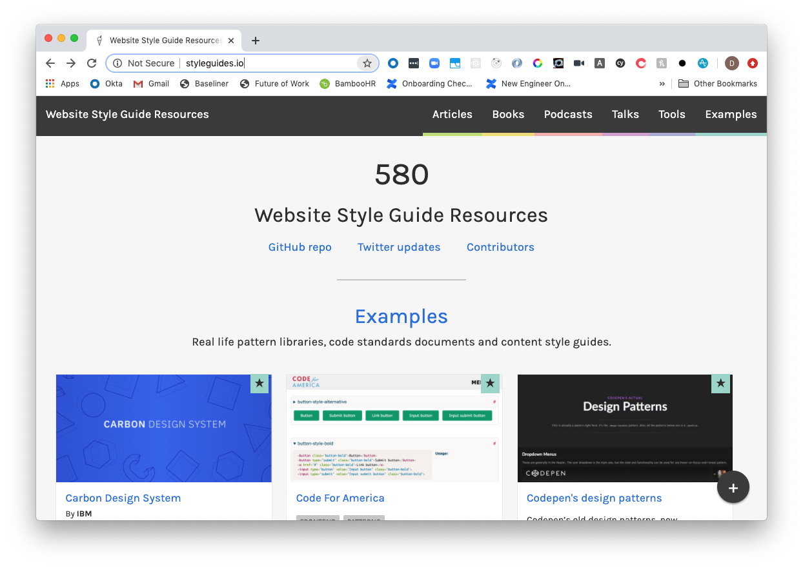
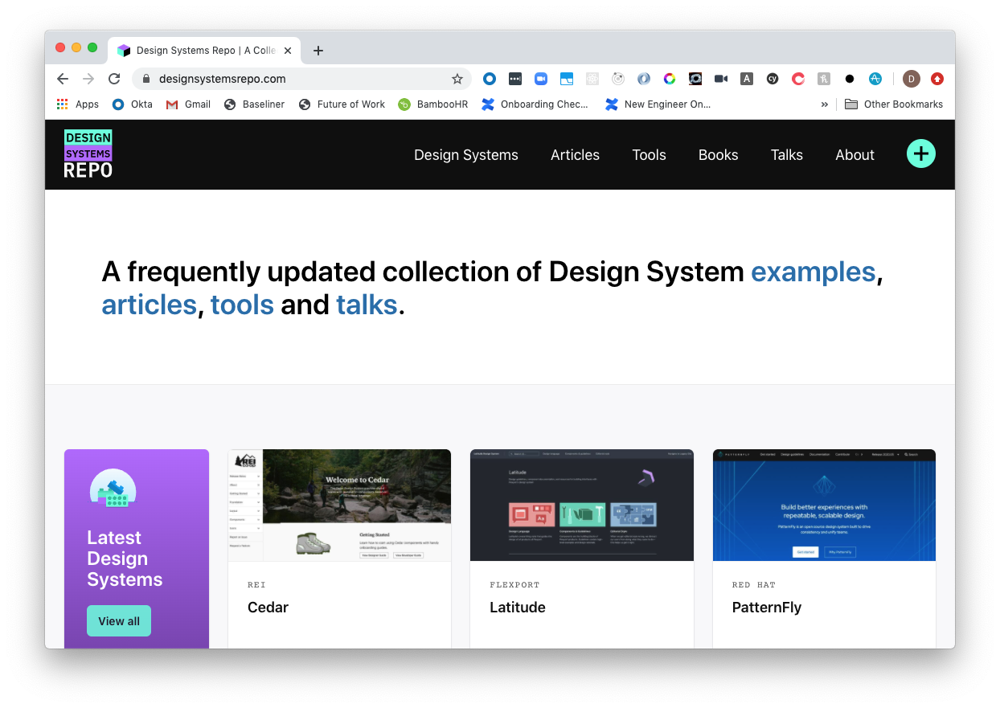
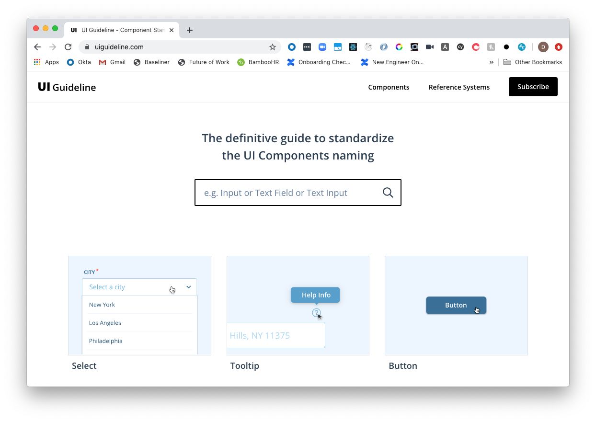
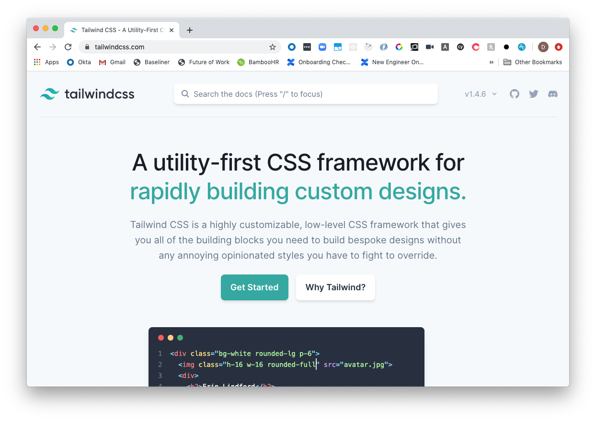
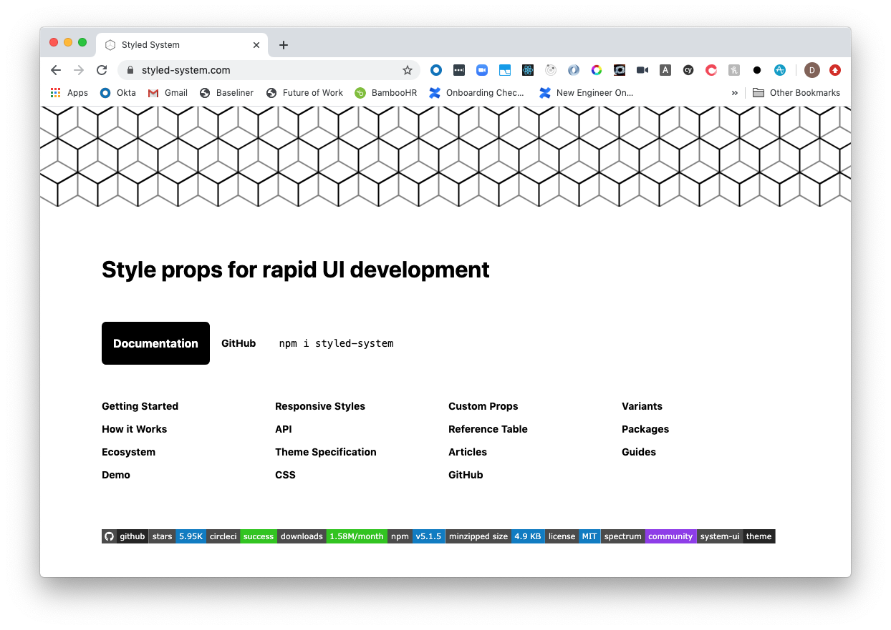
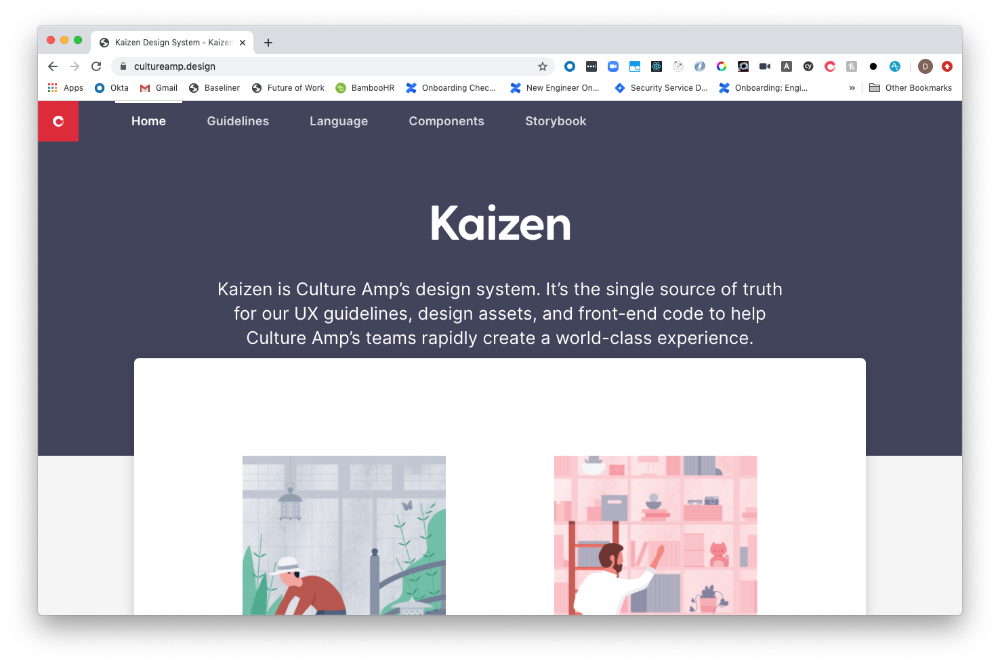

Finding inspiration and ideas for your design system shouldn't be so hard. Here are five resources that set a great foundation and set your design system up for success.

## Style Guides

[Style guides](https://styleguides.io/) is an incredible resource for website style guides, articles, books, talks, tools and podcasts.

It boasts a collection of 230+ examples for design systems and guidelines that can help you make decisions from great branding to strong principles.

With their tag filter, you can also cut through the noise to find systems based on what you want.

Style Guides has been one of my primary resources for finding great guides on accessibility, CSS guides and more. I certainly recommend checking out their old podcasts too for some great wisdom from some of the early pioneers of design systems at scale!

> At the time of writing, the certificate from Style Guides has been expired (uh-oh!), but hopefully they sort out that mishap sometime soon.

## Design Systems Repo

If styleguides.io is the Ying, then [Design Systems Repo](https://designsystemsrepo.com/) compliments it as the Yang. This website focuses primary on design systems and is a great resource for some design system examples you cannot find from the previous example.

This website is a great place to come find some inspiration from other sites and peruse to see what they do/don't include or use.

It also collates some great articles in a no-nonsense UI for you to read up on and learn from other peers in the community!

## UI Guideline

Have you ever struggled to name a component? Want to know what other major companies are using? [UI Guideline](https://uiguideline.com) is for you.

The website lists a standardised set of components and compares systems and how they name these components in the one place.

This has been a debate-ender in places that I have worked and another great resource when planning out your design system.

## Tailwind CSS

Moving into framework territory, [Tailwind CSS](https://tailwindcss.com/) is a fantastic utility CSS framework that you don't have to fight against to override with your own styles.

As opposed to bringing their own components, it works as a foundation for you to build upon.

While I strongly recommend dabbling with Tailwind, their open source code is also a great way to read and be inspired for your own ideas if you do end up working on your own CSS framework.

## Styled System

Moving onto CSS-in-JS, [Styled System](https://styled-system.com/) was a major influence when building my own personal design system for odd jobs.

It has a great outlook on simplicity and uses composition to extend libraries such as [Styled Components](https://styled-components.com/) or [Emotion](https://emotion.sh/docs/introduction).

If you are leaning towards CSS-in-JS for your next project, checkout the source code on [GitHub](https://github.com/styled-system/styled-system) to be inspired for how you can use JavaScript to help template and extend your components.

## Kaizen Design System

Okay, this last one is a shameless plug for the design system I've helped contribute to the most during my time at Culture Amp, but for good reason.

The "guidelines" section and "language" section has been an incredible guide for my day-to-day implementation of the system across the company, and my time liasing with the design system team members has highlighted some of the more interesting pain points of building a design system at scale.

Next time you need some tips for copy writing or appropriate usage of components, check it out!

## Conclusion

These are a few of the primary resources I use when it comes to effective development on the design system and more. The information that can provide can help everything from appropriate naming of your components to inclusive web development.

Hopefully these can now assist you too for the next time you need to contribute to a design system!

> As someone big on inclusive websites, I strongly recommend also checking out some of the bonus resources I have attached before for the Government design systems. They are some of the best when it comes to building accessible websites for everyone.

## Resources and Further Reading

1. [Style Guides](https://styleguides.io/)
2. [Design Systems Repo](https://designsystemsrepo.com/)
3. [UI Guidelines](https://uiguideline.com)
4. [Tailwind CSS](https://tailwindcss.com/)
5. [Styled System](https://styled-system.com/)
6. [Kaizen Design System](https://cultureamp.design/)
7. [Styled Components](https://styled-components.com/)
8. [EmotionJS](https://emotion.sh/docs/introduction)
9. [Styled System](https://styled-system.com/)
10. [Australian Government Design System](https://designsystem.gov.au/)
11. [GOV.UK Design System](https://design-system.service.gov.uk/)
12. [US Gov Design System](https://designsystem.digital.gov/)
