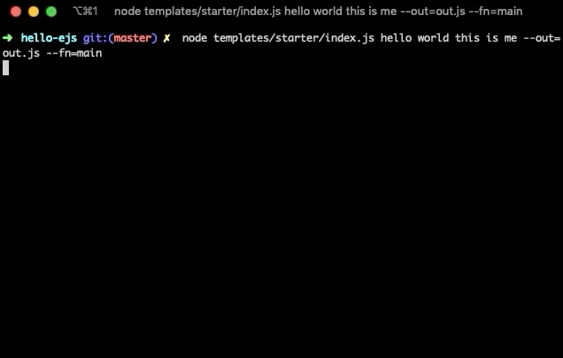

Let's build a small CLI tool today to scaffold some JavaScript files!

We're going to be _super minimal_ today (since I haven't ate dinner yet and still have work to do :crying:) and build out a small "Hello, world!" file using the EJS template engine.

Any concepts you learn today can be applied to scale.

You should have the usual suspects for a NPM/Yarn project and require a [Nodejs version](https://node.green/) that supports ES6 basics like destructing, arrow functions etc (basically any).

<Ad />

## Why templates?

There has been much debate about the usage of templates at the places I have worked.

One benefit is that you can use them to scaffold the basics for you without the need for basically any manual work - think scaffold new components, routes, SCSS files etc.

Some argue that this can be overkill or not flexible enough, however I have found recently in increasinly large codebases that have been around for a few years, templates have been a great "source of truth" for enforcing particular coding patterns in our codebase and a great way for onboarding new developers into these patterns (and avoid them from copying the old!).

<Ad />

## Setting things up

Initialise a new project and add three dependencies that we will use:

```s
# initalise with basic setup
yarn init -y
yarn add ejs fs-extra yargs-parser
```

We are going to use [yargs-parser](https://www.npmjs.com/package/yargs-parser) to parse through our CLI arguments, [fs-extra](https://www.npmjs.com/package/fs-extra) as an extension to Node's internal FS (it comes with some fun extra tidbits that we will use) and we're going to use [ejs](https://www.npmjs.com/package/ejs) to render out our templates!

<Ad />

## Building our first template

Let's make a `templates/starter` folder from the root of our project.

Once created, add a basic `templates/starter/index.js` file with the following:

```javascript
const fs = require("fs-extra")
const ejs = require("ejs")
const argv = require("yargs-parser")(process.argv.slice(2))

const main = () => {
  try {
    console.log(argv)
  } catch (err) {
    console.error(err)
  }
}

main()
```

What we are basically doing is calling the `main` function straight away and logging out `argv`.

`argv` is the result of our helper library Yargs Parser shifting through what we give it at the command line. If we run `node templates/starter/index.js`, we should see the following:

```s
{ _: [] }
```

We get an object with the key `_` and an empty array. What's going on here? Without going to deep into things (see the [docs](https://www.npmjs.com/package/yargs-parser) for a better explanation), anything passed into the command line after the first two arguments ("node" and "templates/starter/index.js") will be stored in the `_` array, and another other flag we pass ie `--flag=3 --test friend` will be put under it's own key-value pair in the object.

Let's quickly test that now with `node templates/starter/index.js hello --flag=3 --test friend`.

```s
{ _: [ 'hello' ], flag: 3, test: 'friend' }
```

Perfect! We see our two flags add as their own key-value pair and anything else passed as an argument is added to the `_` array!

We are going to use this to pass arguments to our simple template renderer.

<Ad />

## Add the ability to read EJS files

Let's add the file `templates/starter/main.ejs` file with the following:

```javascript
const <%= fn %> = () => {
  <% for (const arg of leftovers) { %>
  console.log('<%= arg %>')
  <% } %>
}

<%= fn %>()
```

Whoa, it looks like JS... but what is this funky syntax!?

That, my friends, is the EJS syntax. If we check the [npm README](https://www.npmjs.com/package/ejs), two of the features mentioned above are included:

1. Control flow with `<% %>`
2. Escaped output with `<%= %>`

Basically, we are running JS logic between the first feature we are using with the second feature resulting in our writing something to the template!

If this doesn't make sense just yet, do not fear. We are above to put it to good use.

<Ad />

## Converting the template into something useful

Return to `templates/starter/index.js` now and let's update our script to the following:

```javascript
const fs = require("fs-extra") // note: not being used just yet
const ejs = require("ejs")
const argv = require("yargs-parser")(process.argv.slice(2))
const path = require("path")

const main = () => {
  // 1. Welcome log
  console.log("Generating template...")
  try {
    // 2. Destructure args from argv and set _ array to variable "data"
    const { _: leftovers, out, fn } = argv

    // 3. Add the args we want to use in the .ejs template
    // to an object
    const data = {
      fn,
      leftovers,
    }

    // 4. Create an empty options object to pass to the
    // ejs.renderFile function (we are keeping defaults)
    const options = {}

    // 5. Check that the required flags are in
    if (!out || !fn) {
      console.error("--out and --fn flag required")
      process.exit(1)
    }

    // 6. Set our ejs template file, nominating it to read the
    // sibling "main.ejs" file sibling in the same directory
    const filename = path.join(__dirname, "./main.ejs")

    // 7. Run the renderFile, passing the required args
    // as outlined on the package docs.
    ejs.renderFile(filename, data, options, function(err, str) {
      // str => Rendered HTML string
      if (err) {
        console.error(err)
      }

      console.log(str)
    })
  } catch (err) {
    console.error(err)
  }
}

main()
```

So now what is happening in our file? I've written them in the comments above, however here are them laid out together:

1. Create a welcome log "Generating template..."
2. Destructure args from `argv` and set \_ array to variable "data"
3. Add the args we want to use in the .ejs template to an object
4. Create an empty options object to pass to the ejs.renderFile function (we are keeping defaults)
5. Check that the required flags are in (and exit the program if not)
6. Set our ejs template file, nominating it to read the sibling "main.ejs" file sibling in the same directory
7. Run the renderFile, passing the required args as outlined on the package docs.

As for seven, that argument from the EJS docs looks as follows.

```javascript
ejs.renderFile(filename, data, options, function(err, str) {
  // str => Rendered HTML string
})
```

The arguments are that we want to pass the template filename to render (it will be the file path), the data that we wish to render in that template (for us it will be the `fn` and `leftovers` we wronte in the `main.ejs` file earlier), we are just leaving the options as an empty object and finally we get a callback that gives us an error and string as arguments.

Sweet! Let's try some calls out!

First, let's see what happens when we are missing the `out` or `fn` flag.

```s
nodemon templates/starter/index.js hello world this is me --out=out.js
# Generating template...
# --out and --fn flag required
nodemon templates/starter/index.js hello world this is me --fn=main
# Generating template...
# --out and --fn flag required
```

Peaches, now if we add both flags in?

```s
nodemon templates/starter/index.js hello world this is me --fn=main
```

We get the following logged out

```s
Generating template...
const main = () => {

  console.log('hello')

  console.log('world')

  console.log('this')

  console.log('is')

  console.log('me')

}

main()
```

Whoa! What's the JS? That's the `str` variable being given back in our callback function from `ejs.renderFile`! Super neat. Let's write that to a file!

> Note: The spacing in the JS may look weird. I will address this later, but the solution will not be part of this tiny project.

<Ad />

## Writing the file out

We are going to use our help `fs-extra` module to write this out!

> Note: Using `fs-extra` in the demo is actually a little OP (over-powered). It is a great library to know for sure though, so run with me on this one.

Update `templates/starter/index.js` to look like the following:

```javascript
#!/usr/bin/env node

const fs = require("fs-extra")
const ejs = require("ejs")
const argv = require("yargs-parser")(process.argv.slice(2))
const path = require("path")

const main = () => {
  // 1. Welcome log
  console.log("Generating template...")
  try {
    // 2. Destructure args from argv and set _ array to variable "data"
    const { _: leftovers, out, fn } = argv

    // 3. Add the args we want to use in the .ejs template
    // to an object
    const data = {
      fn,
      leftovers,
    }

    // 4. Create an empty options object to pass to the
    // ejs.renderFile function (we are keeping defaults)
    const options = {}

    // 5. Check that the required flags are in
    if (!out || !fn) {
      console.error("--out and --fn flag required")
      process.exit(1)
    }

    // 6. Set our ejs template file, nominating it to read the
    // sibling "main.ejs" file sibling in the same directory
    const filename = path.join(__dirname, "./main.ejs")

    // 7. Run the renderFile, passing the required args
    // as outlined on the package docs.
    ejs.renderFile(filename, data, options, function(err, str) {
      // str => Rendered HTML string
      if (err) {
        console.error(err)
      }

      // 8. Write file to --out path
      const outputFile = path.join(process.cwd(), out)
      fs.ensureFileSync(outputFile)
      fs.outputFileSync(outputFile, str)
    })
  } catch (err) {
    console.error(err)
  }
}

main()
```

The only change now in the comments is at "Write file to --out path".

In those three lines, we are using path to join the current working directory (cwd) with the argument passed to our `--out` flag.

Afterwards, we are using `ensureFileSync` to ensure the paths to the file exists. We do this since if we passed `--out=path/to/main.js`, we want to make sure the `path` and `to` folder exist, otherwise it will fail. Our `fs-extra` function abstracts that difficulty for us!

Finally, we write that file out.

Run the following one last time:

```s
node templates/starter/index.js hello world this is me --out=out.js --fn=main
```

If you now check the root directory, you will see that `out.js` has been generated! Crazy stuff.

Without even doing anything, let's run `node out.js` and behold the power of the output:

```s
hello
world
this
is
me
```

Woo! We just generated a template that is valid JavaScript!

Checking `out.js`, we see the `str` that we saw before has been written to the file:

```javascript
const main = () => {
  console.log("hello")

  console.log("world")

  console.log("this")

  console.log("is")

  console.log("me")
}

main()
```

Hooray! We are the greatest!

It is important to note that the above has some quirky spacing. This can happen when outputting the templates from EJS, so I always follow up in my own work by using [Prettier.io](https://prettier.io/docs/en/api.html#prettierformatsource--options). I am very, very hungry, so I am not going to add that last tidbit in tonight, but I highly recommend checking it out and trying it for yourself!

While this has been a super, SUPER basic entry into the world of templating, you can run off with this knowledge now and go as crazy as you want! Groovy templateing projects such as [Hygen](https://github.com/jondot/hygen) have used the same methods to a larger extent. Go forth with your witchcrazy and wizardy.

<Ad />

## Resources and Further Reading

1. [Completed project](https://github.com/okeeffed/hello-ejs)
2. [Hygen](https://github.com/jondot/hygen)
3. [Prettier.io](https://prettier.io/docs/en/api.html#prettierformatsource--options)
4. [ejs](https://www.npmjs.com/package/ejs)
5. [yargs-parser](https://www.npmjs.com/package/yargs-parser)
6. [fs-extra](https://www.npmjs.com/package/fs-extra)
7. [node.green - Nodejs support chart](https://node.green/)

_Image credit: [Karsten Würth](https://unsplash.com/@karsten_wuerth)_
