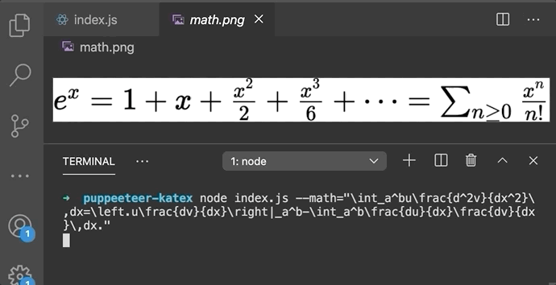
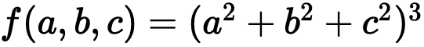
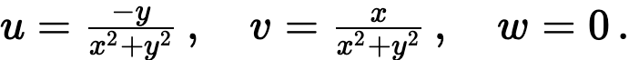
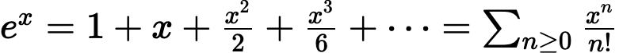
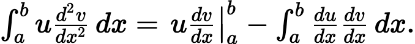

_**If you like this project, be sure to follow me on [GitHub](https://github.com/okeeffed) and [Twitter](https://twitter.com/dennisokeeffe92) for other sweet projects and isolation banter.**_

In tonight's example, we're going to use [Puppeteer](https://github.com/puppeteer/puppeteer) to power a **CLI tool that can take valid LaTex as an argument and output a PNG screenshot of that LaTeX converted to valid math**!



> This particular example will be on mathematics, however the methods that we are going to use to get there can be applicable to any valid HTML that you wish to pass through into the CLI tool. Get creative!

The expectations for today's project is that you have the usual suspects for NodeJS setup.

We are going to install both [Puppeteer](https://github.com/puppeteer/puppeteer) and [Yargs Parser](https://github.com/yargs/yargs-parser). Don't worry if you haven't used them before, prerequisite knowledge is **not required**. However, you may want to check the documentation on each repo for more information or better understanding.

## Initialising the project

Create a new project, jump in to initialise it and install the following:

```s
mkdir puppeteer-katex
cd puppeteer-katex
# begin project with basic settings
yarn init -y
yarn add puppeteer yargs-parser
```

We are using [yargs-parser](https://github.com/yargs/yargs-parser) to convert our CLI arguments into something useful.

[Puppeteer](https://github.com/puppeteer/puppeteer) will be used to run a headless version of Chrome which we can then use to take a screenshot.

## The code in its full glory

As opposed to other tutorials, I am going to share the full code and we can break it down to explain what is happening.

In the root of the project directory, add this to `index.js`:

```javascript
const puppeteer = require("puppeteer")
const argv = require("yargs-parser")(process.argv.slice(2))

if (!argv.math) {
  console.error("Error: --math value required")
  process.exit(1)
}

const html = `<!DOCTYPE html>
<!-- KaTeX requires the use of the HTML5 doctype. Without it, KaTeX may not render properly -->
<html>
  <head>
    <link rel="stylesheet" href="https://cdn.jsdelivr.net/npm/katex@0.11.1/dist/katex.min.css" integrity="sha384-zB1R0rpPzHqg7Kpt0Aljp8JPLqbXI3bhnPWROx27a9N0Ll6ZP/+DiW/UqRcLbRjq" crossorigin="anonymous">

    <!-- The loading of KaTeX is deferred to speed up page rendering -->
    <script src="https://cdn.jsdelivr.net/npm/katex@0.11.1/dist/katex.min.js" integrity="sha384-y23I5Q6l+B6vatafAwxRu/0oK/79VlbSz7Q9aiSZUvyWYIYsd+qj+o24G5ZU2zJz" crossorigin="anonymous"></script>

    <!-- To automatically render math in text elements, include the auto-render extension: -->
    <script src="https://cdn.jsdelivr.net/npm/katex@0.11.1/dist/contrib/auto-render.min.js" integrity="sha384-kWPLUVMOks5AQFrykwIup5lo0m3iMkkHrD0uJ4H5cjeGihAutqP0yW0J6dpFiVkI" crossorigin="anonymous"
        onload="renderMathInElement(document.body);"></script>
    <style>
      .katex { font-size: 48px !important; } 
    </style>
  </head>
  <span id="mykatex" style="display: inline-block;">...</span>
  <script>
    katex.render(String.raw\`${argv.math}\`, mykatex);
  </script>
</html>`

const main = async () => {
  let browser
  try {
    browser = await puppeteer.launch()
    const page = await browser.newPage()
    await page.goto(`data:text/html,${html}`, { waitUntil: "networkidle0" })
    const element = await page.$("#mykatex")
    await element.screenshot({ path: "math.png" })
  } catch (err) {
    console.error(err)
  } finally {
    await browser.close()
  }
}

main()
```

So what's happening here? Let's take it part by part.

## Requiring our npm packages

```javascript
const puppeteer = require("puppeteer")
const argv = require("yargs-parser")(process.argv.slice(2))
```

These two lines are fairly straight forward. The first pulls in our Puppeteer package, while the second does the heavy lifting for parsing the CLI arguments.

The docs for [yargs-parser](https://github.com/yargs/yargs-parser) can share more, however all you need to know is this.

If we run `node index.js`, `argv` will equal the following:

```s
{ _: [] }
```

If we ran `node index.js hello --flag=3 --test friend`, `argv` would equal:

```s
{ _: [ 'hello' ], flag: 3, test: 'friend' }
```

> A few other blog posts I write use Yargs Parser, so I won't go too deep. You can see the original post [here](https://blog.dennisokeeffe.com/blog/yargs-parser/).

## Validating our flags

```javascript
if (!argv.math) {
  console.error("Error: --math value required")
  process.exit(1)
}
```

Here, we are validating that our CLI call has a `--math` flag passed to it.

> Note: We are not validating the math is valid KaTeX itself in tonight's example.

## The HTML string to be used for Puppeteer

```javascript
const html = `<!DOCTYPE html>
<!-- KaTeX requires the use of the HTML5 doctype. Without it, KaTeX may not render properly -->
<html>
  <head>
    <link rel="stylesheet" href="https://cdn.jsdelivr.net/npm/katex@0.11.1/dist/katex.min.css" integrity="sha384-zB1R0rpPzHqg7Kpt0Aljp8JPLqbXI3bhnPWROx27a9N0Ll6ZP/+DiW/UqRcLbRjq" crossorigin="anonymous">

    <!-- The loading of KaTeX is deferred to speed up page rendering -->
    <script src="https://cdn.jsdelivr.net/npm/katex@0.11.1/dist/katex.min.js" integrity="sha384-y23I5Q6l+B6vatafAwxRu/0oK/79VlbSz7Q9aiSZUvyWYIYsd+qj+o24G5ZU2zJz" crossorigin="anonymous"></script>

    <!-- To automatically render math in text elements, include the auto-render extension: -->
    <script src="https://cdn.jsdelivr.net/npm/katex@0.11.1/dist/contrib/auto-render.min.js" integrity="sha384-kWPLUVMOks5AQFrykwIup5lo0m3iMkkHrD0uJ4H5cjeGihAutqP0yW0J6dpFiVkI" crossorigin="anonymous"
        onload="renderMathInElement(document.body);"></script>
    <style>
      .katex { font-size: 48px !important; } 
    </style>
  </head>
  <span id="mykatex" style="display: inline-block;">...</span>
  <script>
    katex.render(String.raw\`${argv.math}\`, mykatex);
  </script>
</html>`
```

This part is us creating a valid HTML file.

What is important to note is that we are using template strings to allows us to use string interpolation for a `argv.math` variable.

This variable will be our `--math` flag value, where we will pass in **valid** LaTeX math equations.

> Note: Reiterating that **we won't be validating the LaTeX** (please don't hate me).

Let's break the HTML down part-by-part.

## Loading KaTeX

```html
<link
  rel="stylesheet"
  href="https://cdn.jsdelivr.net/npm/katex@0.11.1/dist/katex.min.css"
  integrity="sha384-zB1R0rpPzHqg7Kpt0Aljp8JPLqbXI3bhnPWROx27a9N0Ll6ZP/+DiW/UqRcLbRjq"
  crossorigin="anonymous"
/>

<!-- The loading of KaTeX is deferred to speed up page rendering -->
<script
  src="https://cdn.jsdelivr.net/npm/katex@0.11.1/dist/katex.min.js"
  integrity="sha384-y23I5Q6l+B6vatafAwxRu/0oK/79VlbSz7Q9aiSZUvyWYIYsd+qj+o24G5ZU2zJz"
  crossorigin="anonymous"
></script>

<!-- To automatically render math in text elements, include the auto-render extension: -->
<script
  src="https://cdn.jsdelivr.net/npm/katex@0.11.1/dist/contrib/auto-render.min.js"
  integrity="sha384-kWPLUVMOks5AQFrykwIup5lo0m3iMkkHrD0uJ4H5cjeGihAutqP0yW0J6dpFiVkI"
  crossorigin="anonymous"
  onload="renderMathInElement(document.body);"
></script>
```

These scripts basically come straight from the [KaTeX starter template](https://katex.org/docs/browser.html#starter-template).

It is pulling in the required JS and stylesheet links from a CDN that we can have load once we run this JavaScript in Puppeteer. This will save us a bunch of hassle and can be a strategy used for anything else you may want to build in future (ie CDN for D3 etc)!

## Upping the font size

```html
<style>
  .katex {
    font-size: 48px !important;
  }
</style>
```

I've added a styles into the HTML to simply up the font size of our output. Nothing special here!

## The important KaTeX HTML

```html
<span id="mykatex" style="display: inline-block;">...</span>
<script>
  katex.render(String.raw\`${argv.math}\`, mykatex);
</script>
```

This last part of the HTML is where the magic happens. I am simply added a span with the ID `mykatex`.

Then I add some inline styles to that `span` as a helper for our screenshot to ensure all the text is retained within the span.

Finally, I am running a `katex.render` function within `script` tags which I have taken from the [KaTeX API docs](https://katex.org/docs/api.html#in-browser-rendering).

The following is as mentioned earlier (but is the most complex part). As the whole thing is within JS template tags, I can pass an argument of `${argv.math}` inside the `String.raw` template tag. This means that I need to escape the backticks within, so it can look a little funky.

That value `argv.math` will come from our `--math` flag that we will pass from the command line ie `node index.js --math="f(a,b,c) = (a^2+b^2+c^2)^3"`

## Our main function

```javascript
const main = async () => {
  let browser
  try {
    // Launch Puppeteer and setup a new page
    browser = await puppeteer.launch()
    const page = await browser.newPage()

    // Tell Puppeteer to load our HTML variable.
    // Wait until "networkidle0", which from the
    // docs means "consider navigation to be finished
    // when there are no more than 0 network connections
    // for at least 500 ms."
    await page.goto(`data:text/html,${html}`, { waitUntil: "networkidle0" })

    // Wait for the <span id="mykatex" /> element to be visible
    // and assign it to "element".
    const element = await page.$("#mykatex")

    // Create a screenshot and save it locally to "math.png"
    await element.screenshot({ path: "math.png" })
  } catch (err) {
    console.error(err)
  } finally {
    await browser.close()
  }
}

main()
```

Finally, we have a main function. Once called, the following happens in `main`:

1. Launch Puppeteer and setup a new page
2. Tell Puppeteer to load our HTML variable. Wait until "networkidle0", which from the docs means "consider navigation to be finished when there are no more than 0 network connections for at least 500 ms".
3. Wait for the `<span id="mykatex" />` element to be visible and assign it to "element".
4. Create a screenshot and save it locally to "math.png"

Easy right? It all comes together in ~50 lines of JavaScript!

We are keeping them all within a `try-catch-finally` block. For those who have not seen the `finally`, it is a block of code that will always execute in the block. It allows us to close the Puppeteer `browser` everytime, regardless of any errors.

## Running the code

Here is the fun part! Let's run some code.

I've added a few examples of valid LaTeX that we can try out! It doesn't matter if you've never LaTeX before. It can be funky, but I'll provide some to try out!

```s
node index.js
```

When we try running the program without the `--math` flag, we get back `Error: --math value required`. Great!

Let's try an example with a math flag.

```s
node index.js --math="f(a,b,c) = (a^2+b^2+c^2)^3"
```



Eureka!

> "Great success." - Borat.

Let's run a few more examples and see what comes out.

```s
node index.js --math="u=\frac{-y}{x^2+y^2}\,,\quad v=\frac{x}{x^2+y^2}\,,\quad w=0\,."
```



```s
node index.js --math="e^x=1+x+\frac{x^2}{2}+\frac{x^3}{6}+\cdots=\sum_{n\geq0}\frac{x^n}{n!}"
```



```s
node index.js --math="\int_a^bu\frac{d^2v}{dx^2}\,dx=\left.u\frac{dv}{dx}\right|_a^b-\int_a^b\frac{du}{dx}\frac{dv}{dx}\,dx."
```



BAM! We have successfully used Puppeteer to load valid HTML and screenshot some sweet mathematics!

## Conclusion

In today's post, we used Puppeteer and Yargs Parser to build a small CLI tool to screenshot the output of valid LaTeX for us!

This example can be used and applied to anything else you want really. I do it for D3 graphs, generating static maps, generative art... the options are limited only by your creativity!

The final code can be found on my [GitHub](https://github.com/okeeffed/puppeteer-katex)

## Final Code

```javascript
/**
 * Usage from CLI:
 *
 * node index.js --math="f(a,b,c) = (a^2+b^2+c^2)^3"
 * node index.js --math="u=\frac{-y}{x^2+y^2}\,,\quad v=\frac{x}{x^2+y^2}\,,\quad w=0\,."
 * node index.js --math="e^x=1+x+\frac{x^2}{2}+\frac{x^3}{6}+\cdots=\sum_{n\geq0}\frac{x^n}{n!}"
 * node index.js --math="\int_a^bu\frac{d^2v}{dx^2}\,dx=\left.u\frac{dv}{dx}\right|_a^b-\int_a^b\frac{du}{dx}\frac{dv}{dx}\,dx."
 */

const puppeteer = require("puppeteer")
const argv = require("yargs-parser")(process.argv.slice(2))

if (!argv.math) {
  console.error("Error: --math value required")
  process.exit(1)
}

const html = `<!DOCTYPE html>
<!-- KaTeX requires the use of the HTML5 doctype. Without it, KaTeX may not render properly -->
<html>
  <head>
    <link rel="stylesheet" href="https://cdn.jsdelivr.net/npm/katex@0.11.1/dist/katex.min.css" integrity="sha384-zB1R0rpPzHqg7Kpt0Aljp8JPLqbXI3bhnPWROx27a9N0Ll6ZP/+DiW/UqRcLbRjq" crossorigin="anonymous">

    <!-- The loading of KaTeX is deferred to speed up page rendering -->
    <script src="https://cdn.jsdelivr.net/npm/katex@0.11.1/dist/katex.min.js" integrity="sha384-y23I5Q6l+B6vatafAwxRu/0oK/79VlbSz7Q9aiSZUvyWYIYsd+qj+o24G5ZU2zJz" crossorigin="anonymous"></script>

    <!-- To automatically render math in text elements, include the auto-render extension: -->
    <script src="https://cdn.jsdelivr.net/npm/katex@0.11.1/dist/contrib/auto-render.min.js" integrity="sha384-kWPLUVMOks5AQFrykwIup5lo0m3iMkkHrD0uJ4H5cjeGihAutqP0yW0J6dpFiVkI" crossorigin="anonymous"
        onload="renderMathInElement(document.body);"></script>
    <style>
      .katex { font-size: 48px !important; } 
    </style>
  </head>
  <span id="mykatex" style="display: inline-block;">...</span>
  <script>
    katex.render(String.raw\`${argv.math}\`, mykatex);
  </script>
</html>`

const main = async () => {
  let browser
  try {
    // Launch Puppeteer and setup a new page
    browser = await puppeteer.launch()
    const page = await browser.newPage()

    // Tell Puppeteer to load our HTML variable.
    // Wait until "networkidle0", which from the
    // docs means "consider navigation to be finished
    // when there are no more than 0 network connections
    // for at least 500 ms."
    await page.goto(`data:text/html,${html}`, { waitUntil: "networkidle0" })

    // Wait for the <span id="mykatex" /> element to be visible
    // and assign it to "element".
    const element = await page.$("#mykatex")

    // Create a screenshot and save it locally to "math.png"
    await element.screenshot({ path: "math.png" })
  } catch (err) {
    console.error(err)
  } finally {
    await browser.close()
  }
}

main()
```

## Resources and Further Reading

1. [Final project code](https://github.com/okeeffed/puppeteer-katex)
2. [KaTeX from example](https://katex.org/docs/browser.html)
3. [Yargs Parser](https://github.com/yargs/yargs-parser)
4. [Original Yargs Parser blog post](https://blog.dennisokeeffe.com/blog/yargs-parser/)
5. [Puppeteer](https://github.com/puppeteer/puppeteer)
6. [SixthForm - KaTeX examples](http://sixthform.info/katex/guide.html#example)
7. [CSS in HTML tags - w3schools](https://www.w3schools.com/html/html_css.asp)
8. [Puppeteer Docs - page.goto](https://pptr.dev/#?product=Puppeteer&version=v3.0.4&show=api-pagegotourl-options)
