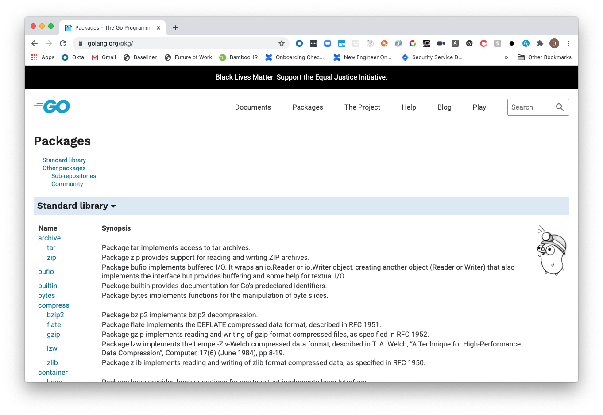
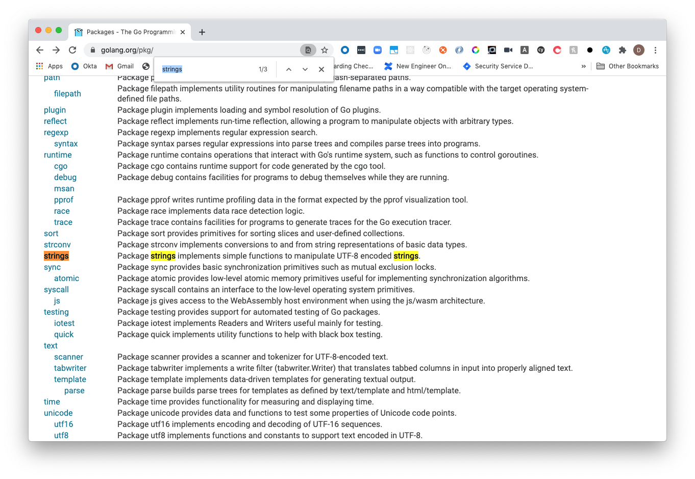
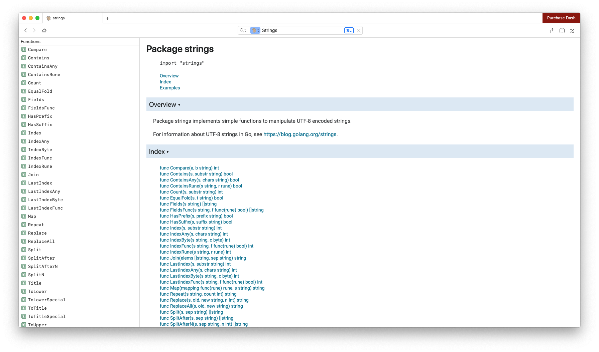
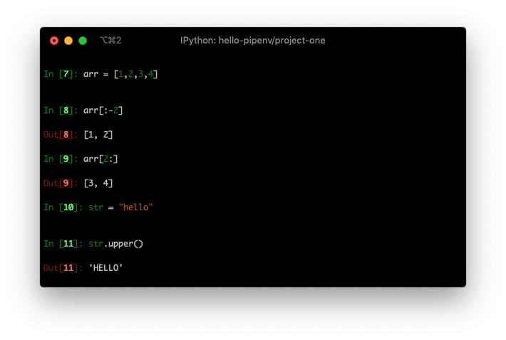
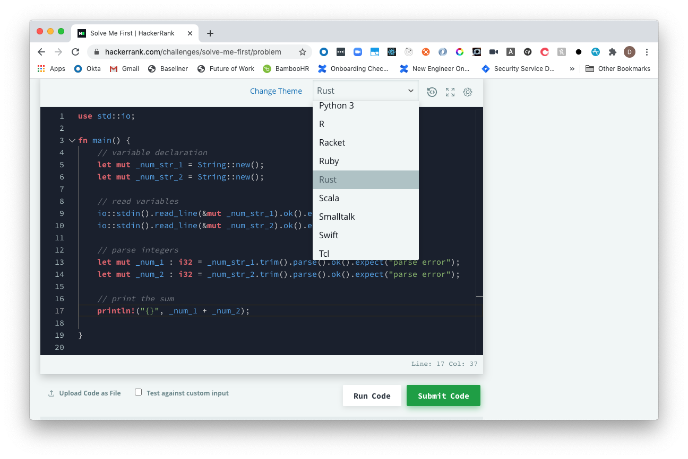
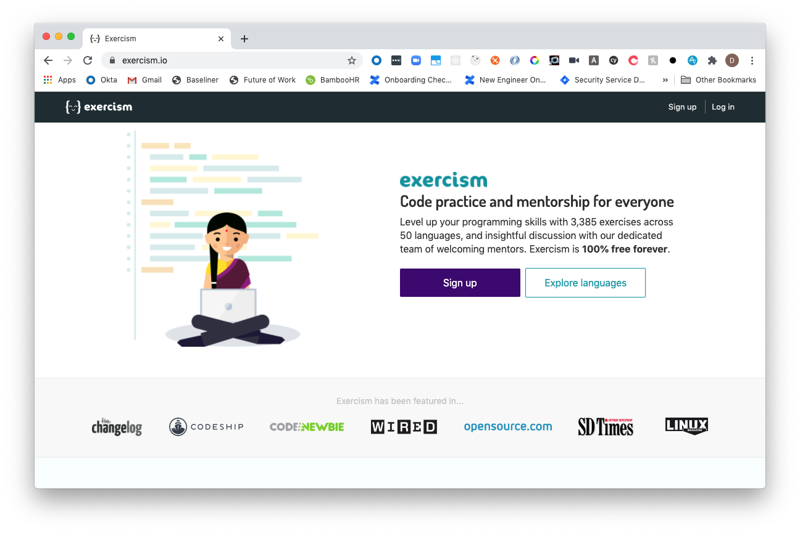
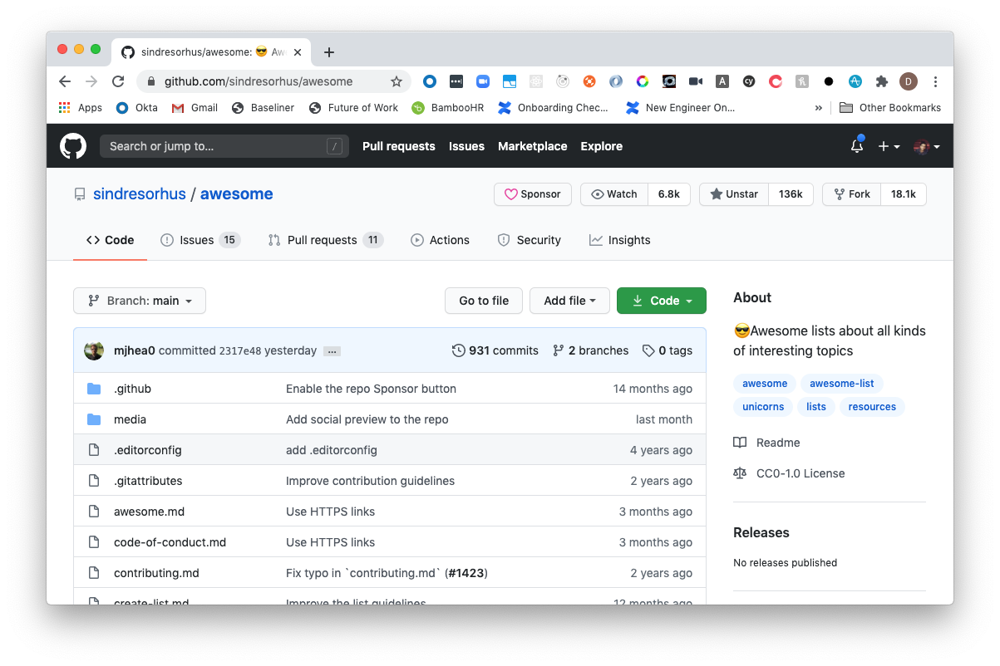
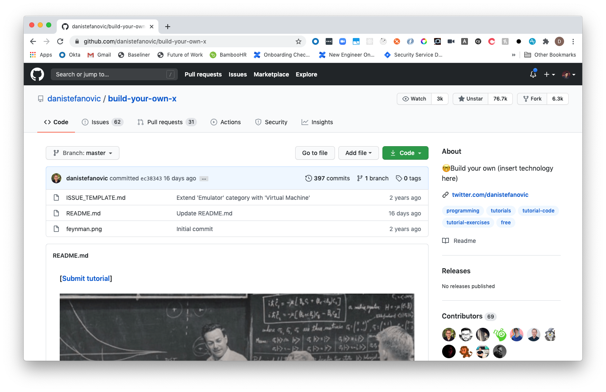

Regardless of tenure, learning a new language is akin to climbing a new mountain. There are new challenges, unfamiliar domains and a whole community out there to discover!

There are many reasons to learning a new language, which include (but are not limited to):

1. You are starting out in programming.
2. You have a personal interest in a new language.
3. Work or study requires you to learn a new language.
4. You wish to build within a new technology that is required or best supported in another language.

In today's post, we're going to go through some of the empirical lessons I have learned from continuously being thrown into the art of language learning.

## What are my credentials for being an expert on this?

I certainly do not consider myself an expert in this domain, nor do I consider myself to be equally strong in all the languages I have shipped to production. I simply just had to learn a myriad of languages for a number of reasons that I feel can be very relatable to others.

My language learning journey so far has looked like so:

1. Starting at University, it was a requirement to learn Java, Python, C, C#, C++, R, Assembly and Haskell at various points (depending on the subject). Each of these weren’t personally by choice, but by requirement.
2. My first job while at university was in iOS development. This initially required learning Objective-C and, at a later date, Swift.
3. My first job outside of university was in web development. At this time, it meant adding in JavaScript and PHP to the list of languages I had to conquer. As this job continued over the years.
4. When starting my current job at Culture Amp, I’ve had to at times write in Ruby, Elixir, Elm, ReasonML and Kotlin. This is also probably a great time to state that none of these are my strong point, but certainly have been a requirement during my short tenure.
5. I took personal interest in learning Golang and Rust because, let’s face it, Rust is super awesome and Golang was approachable and a great alternative for some web server work I was doing in my personal projects.

The above does not include other DSLs or supersets of languages (ie TypeScript) that I’ve had to learn along the way.

To stop anyone from feeling like an imposter, I feel there are some important things to also disclose at this point:

1. I am not some coding wizard. My strength in each language varies greatly. Some are still incredible weak in my opinion, but had a requirement for a particular project or to get something done short-term.
2. I truly believe in the "use it or lose it" reality. I may have spent a significant amount of time in a language like Objective-C early on, but if you asked me to write a "Hello, World!" example for now, the first thing I would do is Google or go back to my notes. Yes, if you’ve learned it before you can pick up quickly again, but memory is fallible and no one is spending every waking hour practicing languages they no longer use — especially when life has so many nicer things to offer.

At first, I started from someone flailing about trying to learn a language. Now I am someone who now follows a very specific pattern to wrapping my head around a language.

Some of these lessons will hopefully go into helping you on your own journey.

## Wholeheartedly Follow the Pareto Principle

This first tip is simply a principle that is at the forefront of my paradigm when taking on a new language. As explained by our best friend [Wikipedia](https://en.wikipedia.org/wiki/Pareto_principle):

> The Pareto principle (also known as the 80/20 rule, the law of the vital few, or the principle of factor sparsity) states that, for many events, roughly 80% of the effects come from 20% of the causes.

When it comes to learning languages, I paraphrase that principle to mean "Getting to 20% mastery of a language will equate to 80% of what you wish to use the language for."

This means that you don’t have to become the be-all-and-end-all of a new language. If you wish to become the next expert on the panel, fantastic. There are some I know who are so good at what they do in their field.

Personally, I like the mantra "Jack of all trades, master of none, oftentimes better than a master of one". You’ll come to find during your coding journey that not every language can do everything.

> There are two languages I genuinely do think can do so much for you, but I’ll get to that at the end.

## Keep first principles at the forefront of your mind

While this post won’t go deep into First Principles, it should be at the forefront of what you use to understand the choices that have gone into a language’s design.

Some of the principles to think about [from my developer notes website](https://docs.dennisokeeffe.com/manual-principles-software-first-principles#coding-first-principles) below include:

1. SOLID - Single Responsibility Principle, Open-Close Principle, Liskov's Substitution Principle, Interface Segregation Principle, Dependency Inversion Principle
2. KISS - Keep It Simple Stupid
3. DRY - Don't Repeat Yourself
4. YAGNI - You Ain't Gonna Need It
5. Composition > Inheritance
6. Separation of Concerns
7. Avoid Premature Optimisation
8. Refactor Refactor Refactor
9. Clean Code > Clever Code
10. Occam's Razor - Does the benefit outweigh the cost?
11. Least Astonishment Principle - Naming should come as no surprise to what it does
12. Law of Demeter - Divide responsibility between classes

While I will not go into them in depth here, it is certainly worthwhile reading into them and also challenging them yourself.

## Become familiar with the languages documentation

> "Give me six hours to chop down a tree and I will spend the first four sharpening the ax."

Abraham Lincoln was quoted for the above, and it is certainly sage advice. Before getting too deep into learning a language, become familiar with the language’s official resources.

<figcaption>Official Go docs</figcaption>

Don’t think too hard about the "four hours of six" from the quote — it’s not about spending hours on the documentation. It’s about learning where to go to find more information on the standard library and methods for things such as manipulating strings and arrays.

<figcaption>Searching Go docs for the strings package</figcaption>

It will come incredibly handy for the next step when you get your feet wet.

If you are a Mac owner, consider investing in [Dash](https://kapeli.com/dash). It is my goto resource, particularly when starting out in a language and has great integrations with some IDEs such as VSCode.

<figcaption>Exploring the Go strings package in Dash</figcaption>

## Learn the baseline and practice, practice, practice

When I refer to "the baseline", I am talking about some of the core ideas that are common to every language:

1. Declaring variables and constants
2. Data Types
3. Functions
4. Comments
5. Control Flow
6. Data structures
7. Common methods and functions for string/array/object manipulation
8. RegExp

The more tenured you get, the more you start to see common patterns and get complacent. This is the last thing that you want. While the `else/if` and variants of a `switch` may be easy to grasp, applying the small variants of the keywords and structures in practice is something entirely different.

I particularly highlight number six to eight. Six and seven are integral to getting up and going at work. You may already understand, but next-to-everything is stored in object/map/array data structures of some kind. Learning how to store these and then apply the language methods to traverse and manipulate these data structures is a huge part of the battle and the previous step of understanding the documentation will help you a lot with this.

As for regular expressions, it can be the most undervalued tool in a programmer’s tool belt. Particular with string identification or replacement. RegExp is an incredible tool (particularly for coding exams) and worthwhile exploring the "how-to RegExp" in your chosen language.

To speed up the learning of the baseline, there are two incredible tools I will go to in order to practice: the language REPL (read-evaluate-print-loop) and online resources for practicing algorithms.

### Use the REPL

<figcaption>Exploring basic types and methods in the iPython REPL</figcaption>

Using a language REPL is a great way to get familiar with data types and simple manipulation. I use it all the time when I need to quickly sense-check my memory of how to do something or evaluate a short example before implementing it into something more complex in my work.

The REPL is your best friend for getting starting quickly with understanding things such as the data types and simple, short methods.

### Use online sources to practice algorithms

As for quickly practicing and using the common methods, data structures and regular expressions that I mention, I’ve personally found the best way to do this is use online learning resources and coding tests.

A number of sites online or problem sets that you can pull locally can help you practice:

1. https://www.hackerrank.com/
2. https://coderbyte.com/
3. https://exercism.io/

I personally use HackerRank as my first goto. Why? While the tests have varying support for the different languages as you go along, I find it to support the most for what I have been working on so far and being able to repeat the same tests in different languages is a great way to understand how to write an implementation of an algorithm in different languages.

<figcaption>Practising Rust on HackerRank</figcaption>

Exercism enables you to download the coding tests to your local machine, which is also amazing. Exercism has test suites that are downloaded as well, so it is a great way to get some exposure to unit testing in your language of choice… which brings me to my next point.

## Learn Testing Early and Often

Being able to write effective tests is a universal skill and something where testing paradigms can be brought across from previous languages you are learned. Once you feel comfortable with some of the language basics, you should take this time early in the journey to unit testing for that language.

It is also a great way to sense check your understanding of what you have learned so far. This is a great time to learn and understand error handling and really check that you understand your data types and there limitations!

For example, if you are writing a simple function that returns a `uint8` in Rust (0-255), write tests for that function to see what happens when you pass the wrong data type or force that function to return a negative number or something above 255. Is that even possible? If not, why not?

What happens when you try doing something similar in a dynamic language like JavaScript, Ruby or Python? Have you managed to catch those edge cases?

Being able to write unit tests also enables you to slow through what you are trying to achieve in what you are writing. It enables you to truly understand the language quirks, and when something fails that you did not expect, you will be glad you took the time to learn the why.

As for the often — once you have understood how to write the unit test, write them as often as possible.

At this stage of the journey, you will actually have conquered such a significant part of the foundation that you will be incredibly surprised by what you can do.

The next step now is such an integral one, but something I also feel is constantly overlooked when it comes to posts such as these.

## Learn how package management works for your language

Bundler, Cargo, Yarn, NPM, Cocoapods, PipEnv, NuGet, Gradle, Hex. What do all of these have in common? They are all tools that are key for installing and managing packages across the different language ecosystems.

If you’ve used even one in your time as a developer, you realise the utmost importance they play in your various projects.

I will keep this section short, but go discover what tools for package management your language has.

The bare minimum is to learn how to install and manage these dependencies, but I would recommend learning how to publish and distribute your own packages while you are here.

I would also highly recommend checking out the resources that lead you to the most popular projects and packages for the language. Thing things like JSON/YML parsing libraries, popular servers, popular utility libraries etc. As a great segway, this brings me to the next point.

## Check out the Awesome GitHub repo for the language

The original [awesome repo](https://github.com/sindresorhus/awesome) is an incredible resource to find related awesome repos for different languages and technologies. The [Programming Languages](https://github.com/sindresorhus/awesome#programming-languages) section is a treasure trove of links to incredibly resources for a language.

<figcaption>The [sindresorhus/awesome](https://github.com/sindresorhus/awesome) GitHub repo</figcaption>

I place this part of the journey here because it this is the time where you can truly appreciate some of the content out there and begin to create your own applications.

These links can include (but are not limited to):

1. Applications
2. Development tools
3. Libraries
4. Blogs
5. Resources
6. Podcasts
7. People to follow

It is a great way to find resources you didn’t know you were looking for, to find projects that you can learn current best practices from and be inspired to start writing your own projects.

Which leads me to the last (and most glorious point):

## Build your own X

It is time to apply everything you have learned so far and start smashing out some projects.

The [build your own x repo](https://github.com/danistefanovic/build-your-own-x) is an absolute gem when it comes to finding ideas and projects to build. I highly recommend checking the repo out just to see what is on offer — it can provide examples on how to build things like your own block chain to your own database.

<figcaption>The [danistefanovic/build-your-own-x](https://github.com/danistefanovic/build-your-own-x) GitHub repo</figcaption>

The examples provided can be language-specific, but it is an incredible resources never-the-less.

Personally, when learning a new language, I generally try to tick off three projects. These three projects are either the core of why I am learning the language or have been the X factor when it came to performance reviews — and they are not crazy complex projects.

### Build a CLI tool

Learning how to pass arguments and flags into a script in your language is highly underrated. The best work I have ever done has come down to writing simple CLI tools to enhance the developer experience in the teams that I have worked on.

CLI tools I have built for projects include things like:

1. Web scraper bots
2. PDF renderers
3. Invoice generators
4. Code generators
5. Interactive news through the CLI
6. Infrastructure stand up/tear downs

Learning how to write a CLI tool truly is a gateway into more complex work.

### Learn how to read/write files

Easily the most underrated skills while I was at university. They legitimately spent less than five minutes on this in my introduction to programming class and had some ridiculous example of writing a simple `.txt` file.

Little did I know that all these years later it would become the source of almost every promotion I have ever gotten. Being able to parse, manipulate and re-write files will open your capabilities to no-code/low-code solutions and just straight-up royalty levels of respect.

### Build a web server

This may be the reason you are learning the language in the first place, but regardless it is a key. Even if you are not building a fully-fledged REST web server, being able to write a simple RPC can empower you to remotely run some many scripts and automate so many things remotely that it isn’t funny.

## Epilogue

The above isn’t the complete list to language mastery — it is simply the pattern that I have followed over the previous years that have come with great success.

There are also other important elements that I didn’t cover: find the best books to read, the best online courses etc.

I find that these are normally things that others already understand or have incorporated as part of their journey. I also find that those books and online courses are best approached once you are at a level that you can critically understand and follow along as they dive deeper into a language and specific frameworks.

## Resources and Further Reading

1. [Awesome - GitHub Repo](https://github.com/sindresorhus/awesome)
2. [Build you own X - GitHub Repo](https://github.com/danistefanovic/build-your-own-x)
3. [Wikipedia](https://en.wikipedia.org/wiki/Pareto_principle)
4. [My developer notes - First Principles](https://docs.dennisokeeffe.com/manual-principles-software-first-principles#coding-first-principles)

_Image credit: [Dlanor S](https://unsplash.com/@dlanor_s)_
