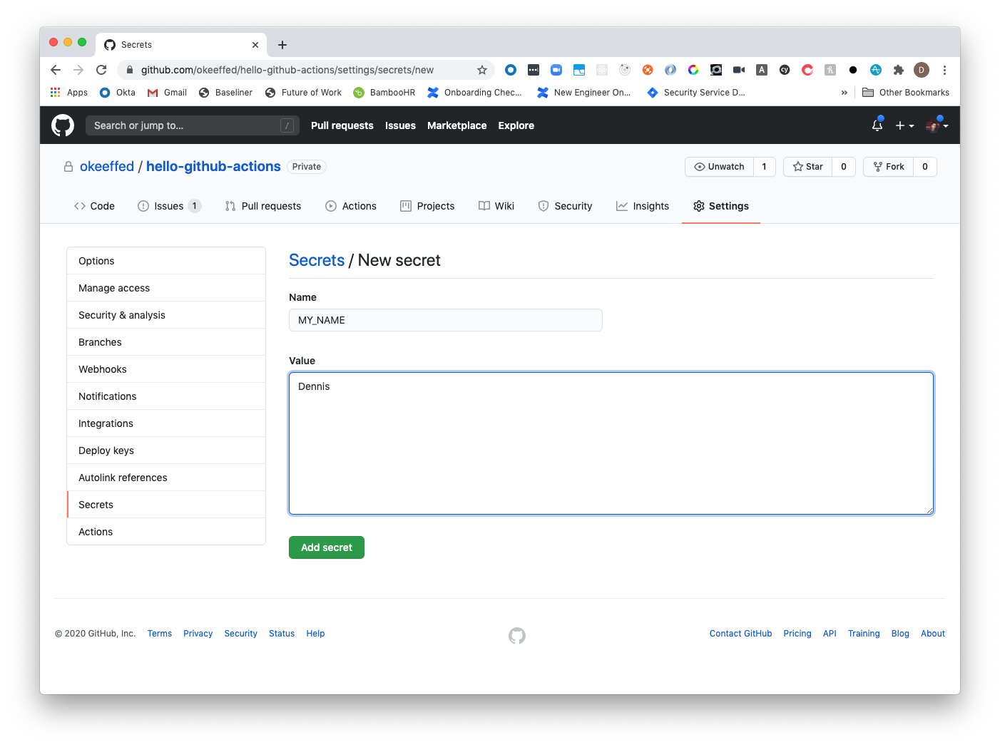
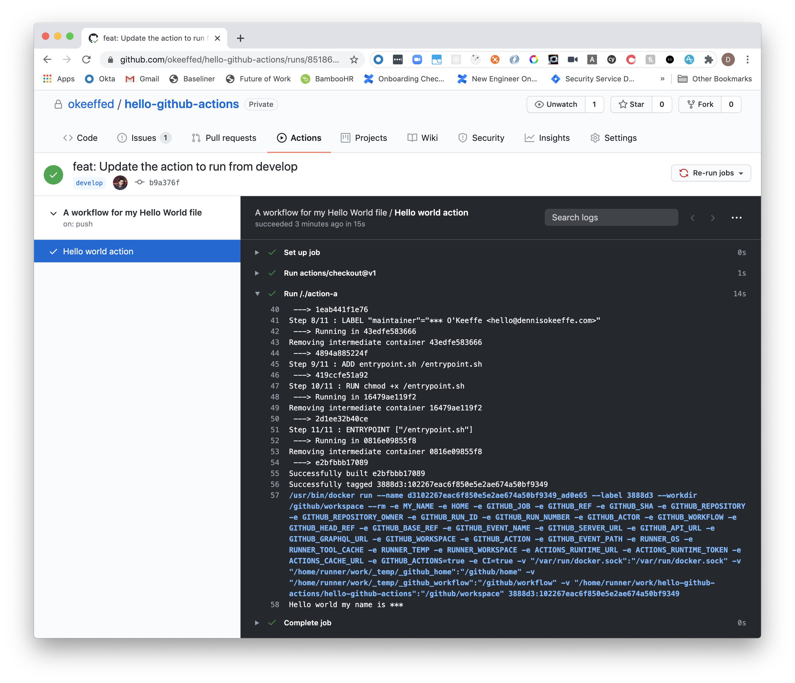

In today's short post, we're going to run through how to get a basic Docker container up in running in GitHub actions and learn how to use GitHub Secrets along the way!

## Setting up the workflow

First, we need to set up our `.github` folder and the `workflows`. From your project directory root, run the follow:

```s
mkdir -p .github/workflows
touch ./github/workflows/main.yml
```

Once we have our workflow, we can add the following to `./github/workflows/main.yml`:

```yml
name: An introductory GitHub Action
on:
  # Trigger the workflow on push or pull request,
  # but only for the master branch
  push:
    branches:
      - develop
jobs:
  build:
    name: Hello world action
    runs-on: ubuntu-latest
    steps:
      - uses: actions/checkout@v1
      # Looks for action in <PROJECT_ROOT_DIRECTORY>/action-a
      - uses: ./action-a
        # Set a secret from GitHub
        env:
          MY_NAME: ${{secrets.MY_NAME}}
```

Here, we give the action a `name` and tell it to run on every `push` to our `develop` branch.

The last top-level property we have is `jobs`, and this is where we can tell our action what to run!

In our job, we are creating an action known as `Hello world action`. As for the steps, we are telling it to first run `v1` of GitHub's `actions/checkout` repository.

From the [repo information](https://github.com/actions/checkout), That action checks-out your repository under `$GITHUB_WORKSPACE`, so your workflow can access it.

We then run a second action from a `./action-a` directory and tell it to set an environment variable which comes from our secrets! We will set that secret later, but first let's set up our Docker action!

## Creating our custom Docker action

From the root of the project directory, let's now create a folder `action-a` and some files to add in the actions:

```s
mkdir action-a
touch ./action-a/Dockerfile
touch ./action-a/entrypoint.sh
chmod u+x ./action-a/entrypoint.sh
```

Here, we are creating a folder (which we referenced in our workflow), then adding a Dockerfile for GitHub to build from and we are going to make a small Shell script that the action will run. Finally, we are adding user permissions to run the script so we can test it out locally.

## Setting up the script

Inside of `./action-a/entrypoint.sh`, add the following:

```sh
#!/bin/sh -l

sh -c "echo Hello world my name is $MY_NAME"
```

The script will simply out put the "Hello world my name is ..." based on the `$MY_NAME` environment variable!

Since we have added the correct permissions, let's run the action!

```s
> ./action-a/entrypoint.sh
Hello world my name is
```

As you can see, the above is doing something... but not exactly what we want! We need to set an environment variable to add in the name!

Let's run it name setting the environment variable at runtime:

```s
> MY_NAME=Dennis ./action-a/entrypoint.sh
Hello world my name is Dennis
```

**Sweet victory!**

Not a lot is happening in this script, but that's okay! We just want to get an action up and running!

Save this file and let's move onto the Dockerfile.

## Setting up the Dockerfile

Here, let's add the following:

```s
FROM debian:9.5-slim

LABEL "com.github.actions.name"="Hello World"
LABEL "com.github.actions.description"="Write arguments to the standard output"
LABEL "com.github.actions.icon"="mic"
LABEL "com.github.actions.color"="purple"

LABEL "repository"="http://github.com/okeeffed/hello-github-actions"
LABEL "homepage"="http://github.com/okeeffed"
LABEL "maintainer"="Dennis O'Keeffe <hello@dennisokeeffe.com>"

ADD entrypoint.sh /entrypoint.sh
RUN chmod +x /entrypoint.sh
ENTRYPOINT ["/entrypoint.sh"]
```

For those who are not familiar with a Dockerfile, this may look a little strange. To keep things brief, the file does the following:

1. Choose a container to build from. Here we are using a specific version of Debian from the public [Docker repository](https://hub.docker.com/_/debian).
2. Add some labels to the container for us to reference in future (particularly if we build locally).
3. Copy the `entrypoint.sh` file to the root of the container.
4. Add execution permissions to that file.
5. Set that script as the entrypoint for our container to run.

The expectation is that we can copy what we did above and run our script! The big difference will be that are going to use [GitHub Secrets](https://docs.github.com/en/actions/configuring-and-managing-workflows/creating-and-storing-encrypted-secrets#creating-encrypted-secrets-for-a-repository) to manage our `MY_NAME` variable!

## Adding secrets to the repository

Following along from [GitHub's docs](https://docs.github.com/en/actions/configuring-and-managing-workflows/creating-and-storing-encrypted-secrets#creating-encrypted-secrets-for-a-repository), we can head to our GitHub and create a new repository.

Once that is done, in the new repo we can go to `Settings > Secrets > Add a new secret` and add a name and value for our secret.



<figcaption>Adding secrets to a GitHub repo for okeeffed/hello-github-actions</figcaption>

Perfect! Now is the time to reap what we have sown.

## Running our action

On our local repository again, open up the terminal and let's set up the Git repo and push from the develop branch.

We will run through a standard Git workflow to initialise a Git repository, create a new `develop` branch, checkout that branch, commit everything, add the remote GitHub repository we have created and then push to that repository.

```s
git init
git branch develop
git checkout develop
git add --all
git ci -m "feat: Our first commit for the new action"
git remote add origin https://github.com/user/repo.git
git push
```

If we now head to our repository on GitHub and head to the `Actions` tab, we can see our action up and running!

## Viewing our action

Inside of the action, we can see we have a `Hello world action` and that is runs both the `actions/checkout@v1` and our `action-a` action that we created! Awesome!

If we click out action dropdown to reveal the details, you can see all the steps that the action ran while building the Docker image and we can see our script being run!



<figcaption>Your first Docker action</figcaption>

However, we do see the following: `Hello world my name is ***`. That's not `Hello world my name is Dennis`? This may requirement some faith, but GitHub is doing us the favour of obfuscating out secrets so that we don't accidentally let them out into the world! How kind of them. We just have to understand that under the hood, `Hello world my name is Dennis` is being run!

Did we have to make something like that a secret? Of course not. However doing so in this short example will give you the know how for when you do start building actions that require secret access tokens that you don't want to be leaked out into the world!

## Conclusion

Today, we made a simple GitHub action that uses the power of Docker containers and GitHub secrets! We can build as many actions as we want into a repository, and it is certainly a powerful feature to begin bringing CI/CD into your repository!

## Resources and Further Reading

1. [Adding secrets to a GitHub repository](https://docs.github.com/en/actions/configuring-and-managing-workflows/creating-and-storing-encrypted-secrets#creating-encrypted-secrets-for-a-repository)
2. [Docker hub - Debian](https://hub.docker.com/_/debian)
3. [actions/checkout](https://github.com/actions/checkout)
4. [Completed project](okeeffed/hello-github-actions)
