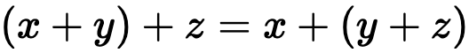
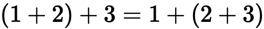
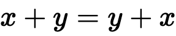
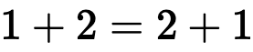
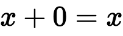
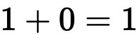
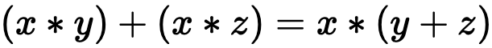
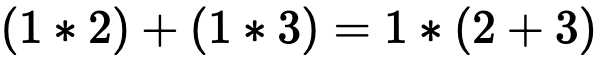

Your first dive into functional programming can be **humbling**. If you are familiar with object-oriented programming or any of the similar derivatives, then looking into different paradigms requires a reset of thinking and easing into foundational concepts.

Challenges are expected. We are in a trade that requires **persistence in the art of learning.**

In today's post, I am going to attempt to _gently ease you_ into some core functional programming concepts by implementing two common utility functions: **pipe** and **compose**.

This post has no requirements other than an understanding of JavaScript and basic arithmetic, however it is recommend that you understand how `reduce` works.

## To monad or not to monad

_That is the question._

Now is the time to reference **Lady Monadgreen’s curse** which was brought into infamy by Douglas Crockford:

> _"Once you understand monads, you immediately become incapable of explaining them to anyone else"_

You may or may not have about monads yet. I am going to heed to words of the curse and declare before starting that **we will not be speaking about monads in this post.**

It is a post for another time, but what I will say about them (and all the other quirky functional programming terms) is this: They are aptly named because of their roots in mathematics and [Set Theory](https://plato.stanford.edu/entries/set-theory/) and you will naturally come to understand them by building a core foundation.

There. I said it. No crazy concepts. No monads, no beta reduction, no alpha equivalence. For now, they are all buzzwords. Let's get down to the basics.

## Our first love addition

Let's go back to primary school mathematics and tell the tale of **addition.**

We understand that both the left-hand and right-hand side of `1 + 2 + 3 = 1 + 2 + 3` are equivalent.

In fact, we can simplify the right-hand side down further and say that `1 + 2 + 3 = 3 + 3` by adding the `1 + 2` that was on the right-hand side.

We didn't have to add the `1 + 2`, we also could have had `1 + 2 + 3 = 1 + 5` instead by add `2 + 3` from the right-hand side. We can bring simplify this down most to be `1 + 2 + 3 = 6`.

So far, we haven't broken any new ground. This is all common knowledge, and in fact, we probably would have skipped the middle stages that I spoke of and simplified straight to the answer 6. Have you stopped the think about _why_ this is the case?

## Talking through the properties of functional programming

Addition is fantastic introduction into the some of the core properties of functional programming as it exhibits them in a way that it easy to understand.

There are **four important properties** of functional programming:

1. A function must be **associative**
2. A function must be **commutative**
3. A function must have an **identity**
4. A function must be **distributive**

Let's explore these properties with our addition example and the **power of language.**

### Associative

"To associate". A quick Google into the origins of "associate" give us this:

> _"...as a verb in the sense 'join with in a common purpose'"_

Using the history and meaning behind words can help open up our understanding to its application in programming and mathematics. It amazes me how apt the naming used in these fields are and we should thank those who came before us for such great attention to detail.

When we speak about addition being **associative**, we mean that we can "group" and "associate" variables with the addition operation together.



<figcaption>1a. The Associative Property</figcaption>

We state the law that `(x + y) + z = x + (y + z)`. For functions that exhibit the associative property, this means that the order of operations will not change the outcome.

Looking at algebra can be cognitive load, but we already saw this in action from our trek down into addition memory lane when we stated this:



<figcaption>1b. The Associative Property with integers</figcaption>

Given what we know about mathematics, we could write an add function that is associative:

```js
const add = (x, y) => x + y

// equivalent to figure 1b
add(add(1, 2), 3) === add(1, add(2, 3))
```

It may look strange as first looking at the equation, but for the left-hand side we can see that `add(add(1, 2), 3)` will evaluate to `add(3, 3)` and finally we get 6.

We can run similar logic on the other side to reduce our answer to 6.

Even if you are not familiar with hearing the term **"associative law"**, you have been well acquainted most of your life!

### Commutative

Go back to our origins of term, **commutative** derives from "commute" or "to move around".

From its origins in late Middle English:

> _"In the sense 'interchange' (two things)"_

To make sense of it, we could "interchange" `1 + 2` to be `2 + 1`.

From this, we can derive the **commutative law**:



<figcaption>2a. The Commutative Property</figcaption>



<figcaption>2a. The Commutative Property with integers</figcaption>

Using our previous example of the `add` function to see this play out:

```js
const add = (x, y) => x + y

// equivalent to figure 2b
add(1, 2) === add(2, 1)
```

Simple as pie! The order doesn't matter for the operation when things are commutative.

> Author's note: I can not make pie, ergo I do not understand that saying.

For an example of something **that is not commutative**, take **division**. `1 / 2 != 2 / 1`. Division is a good counter example for a number of functional laws.

### Identity

When we speak of the **identity property**, I remember it to be that we wish for something to "keep its identity".

In addition, could you think of what you can add to another number for it to remain the same? If you said zero, then I dub thee **an arithmetic wizard**!



<figcaption>2a. The Identity Property</figcaption>



<figcaption>2a. The Identity Property with integers</figcaption>

We know that **anything** in mathematics added to zero will result in itself. We managed "keep" the identity.

```js
const add = (x, y) => x + y

// equivalent to figure 3b
add(1, 0) // 1
add(1000, 0) // 1000
add(-7, 0) // -7
```

What would be the identity property in multiplication? Understanding this can help you truly understand this property. Hint: it cannot be zero.

```js
const multiply = (x, y) => x * y

multiply(1, 1) // 1
multiply(1000, 1) // 1000
multiply(-7, 1) // -7
```

If you said "one", then you are a true miracle maker! In all seriousness though, these trivial examples are **fantastic examples** that can help you remember these laws without the help of Google and Stack Overflow (or the Math Exchange equivalent). _Feels good to know all this from understanding._

### Distributive

Admittedly, the **distributive property** is the one that requires fractionally more brain power than the others, but you will completely understand what it is about in action.

As for the definition:

> _"(of an operation) fulfilling the condition that, when it is performed on two or more quantities already combined by another operation, the result is the same as when it is performed on each quantity individually and the products then combined."_

That sentence was more than a few words, so let's simplify it into a way we can understand:



<figcaption>2a. The Distributive Property</figcaption>

The left and right hand side are equivalent, and we've done this by abstracting the `x` out and multiplying the `y` and `z` together.



<figcaption>2a. The Distributive Property with integers</figcaption>

This follows from algebraic principles that we understand through the order of operations. This property becomes incredibly important in functional programming for being able to re-arrange functions.

> We won't deep dive into the implications of the distributive property in this post. Let's save that for when we have more tools under our belt.

Now that we have an understanding of the four base properties, let's switch gears and start talking about our `add` function that we've been using so far.

## Currying and uncurrying

In programming, we have the following definition for currying from our pal [Wikipedia](https://en.wikipedia.org/wiki/Currying):

> _"...currying is the technique of converting a function that takes multiple arguments into a sequence of functions that each take a single argument."_

Our `add` function before took multiple arguments. The aim is for a us to turn this into a "sequence of functions that each take a single argument".

This looks like the following:

```js
// function that is not curried
const add = (x, y) => x + y
add(2, 1) // 3
add(2, 7) // 9
add(2, 10) // 12

// function that is curried
const curriedAdd = x => y => x + y
const addTwo(2)
add(2)(1) // 3
add(2)(7) // 9
add(2)(10) // 12
```

> For the sake of completeness, doing the reverse and taking a function from the `curriedAdd` back to the form of `add` above is the process of **uncurrying**.

The above looks like of weird? Why would we ever want to write `add(x)(y)`? Running the curried function like so is equivalent to running `add(x, y)` with the uncurried version, but it gives us the powerful ability to **partially apply** values to functions and gives us some powerful tools for determinism.

Before we step into the power of partial application, I think it is time to start preparing our final voyage towards the goal of this tutorial.

## Setting up the project

Let's start up a new project and start playing around with these figures. From your root project directory, run:

```s
# init basic application -> use npm init -y if you prefer npm
yarn init -y
touch index.js index.test.js
# install a test suit to play along with
yarn add --dev jest
```

Yarn/NPM `init` will generate the `package.json` file, so let's update that with a `test` script to run the Jest test suite.

```json
{
  "name": "build-your-own-pipe-compose",
  "version": "1.0.0",
  "main": "index.js",
  "license": "MIT",
  "scripts": {
    "test": "jest"
  }
}
```

Next, inside of `index.js`, let's export an `add` function. Armed with the understanding before about the add function, we will use our curried version:

```js
const add = x => y => x + y

module.exports = {
  add,
}
```

Next, in `index.test.js`, let's import that function and write a simple test to check that math is still math:

```js
const { add } = require("./index")

describe("curried add function", () => {
  test("expect 1 + 2 = 3", () => {
    expect(add(1)(2)).toEqual(3)
  })
})
```

Run `yarn test --watchAll` from the command line and we should be put into watch mode for our tests. If math is still math, you should be greeted with something similar to the following:

```s
PASS  ./index.test.js
  curried add function
    ✓ expect 1 + 2 = 3 (3 ms)

Test Suites: 1 passed, 1 total
Tests:       1 passed, 1 total
Snapshots:   0 total
Time:        0.407 s, estimated 1 s
Ran all test suites.

Watch Usage: Press w to show more.
```

Great! Math is still math!

Let's understand how partial application work.

## Partial Application

Currying a function gives us the capability to applying arguments one at a time. This gives us the power to create deterministic, flexible functions that are easily testable and amazingly useful.

Let's create some trivial examples of some partially applied functions see them at work.

```js
// index.js
const add = x => y => x + y

// partially applied functions
const addTwo = add(2)
const addTen = add(10)
// using the underscores for readability
const addTenMillion = add(10_000_000)

module.exports = {
  add,
  addTwo,
  addTen,
  addTenMillion,
}
```

Here, we are using the idea of partial application to apply 2, 10 and 10 million respectively. This locks in the fact that if we were to use the `addTwo` function name to add the remaining argument, it would **always deterministically add 2 to the argument.**

_Let me say that again._

If we were to use the `addTwo` function name to add the remaining argument, it would **always deterministically add 2 to the argument.** This is the **key takeaway** from the concept of partial application.

Let's update our test suite in `index.test.js` again:

```js
const { add, addTwo, addTen, addTenMillion } = require("./index")

// random numbers to illustrate our point
const numbers = [1, 2, 5, 7, 8, 11]

describe("curried add function", () => {
  test("expect 1 + 2 = 3", () => {
    expect(add(1)(2)).toEqual(3)
  })

  test("expects addTwo to add two to any number", () => {
    for (const number of numbers) {
      expect(addTwo(number)).toEqual(number + 2)
    }
  })

  test("expects addTen to add ten to any number", () => {
    for (const number of numbers) {
      expect(addTen(number)).toEqual(number + 10)
    }
  })

  test("expects addTwo to add ten million to any number", () => {
    for (const number of numbers) {
      expect(addTenMillion(number)).toEqual(number + 10_000_000)
    }
  })
})
```

In the new three tests, we are setting just some arbitrary numbers to check that each of those functions operate as expected.

Cool! _We have managed to partially apply arguments to curried functions that returned a deterministic function that we could then apply another number to._ **What a mouthful.**

At this point, I cannot stress how important that concept of partial application will be to functional programming. It may not look like much just yet, but hopefully I can convince you about how great it can be!

Stick with me, we are on the home stretch! Let's take what we have applied and see the power of things coming together.

## Writing your own pipe and compose function

Now that we have been currying our `add` function and partially applying values, we are at a point when testing is deterministic and our functions are so damn clear on what they do and very difficult to misuse (queue fact that there is no type safety).

Let's say we now want to write a function that can add twelve. What do we do now? Well, one thing we could do is follow our process like before of running `const addTwelve = add(12)`, or we could begin to look at the power of function programming and start applying the laws we learned at the beginning to create new, already-tested functions that can robustly give us confidence!

Given that we have a `addTwo` and `addTen` function, and - if math is still math - we know through our laws that `addTwo(addTen(5))` would run `2 + 10 + 5` which gives us seventeen, but what happens if we don't want to write that junk each time?

_In comes "pipe" and "compose"._

Pipe and compose give us a way to take an array of functions and run them over a data type using the power of partial application. **The only difference is that pipe operates from left-to-right while compose operates right-to-left**.

This may make more sense once we write some code for pipe. Update our index.js file to now take this:

```js
const add = x => y => x + y

// partially applied functions
const addTwo = add(2)
const addTen = add(10)
// using the underscores for readability
const addTenMillion = add(10_000_000)

// our pipe function
const pipe = (...fns) => data => fns.reduce((acc, fn) => fn(acc), data)

module.exports = {
  add,
  addTwo,
  addTen,
  addTenMillion,
  pipe,
}
```

The important part is our `pipe` function. It looks pretty crazy right now! Let's step through what it is doing:

1. Declaring the variable `pipe` which is a function
2. When you call `pipe`, it takes any number of function arguments. The `...fns` here using the operator `...` to enable us to take an **indefinite number of arguments**. We could call `pipe(addTwo)`, `pipe(addTwo, addTen)` or ``pipe(addTwo, addTen, addTenMillion)`and all would be valid as it takes each argument and adds it to an array`fn`. For those given examples, it would set`fn`to`[addTwo]`,`[addTwo, addTen]`and`[addTwo, addTen, addTenMillion]`respectively. As`pipe` is a curried function, it returns another function.
3. This function given back from pipe can then be called with argument `data`. The data in this instance will be our base number value that we will pass through the pipe.
4. Finally, after completing our partial application, it will run through the array of functions `fns` and call the function on the **accumulated value** `acc`, starting with the value of `data`.

_That is a lot of information._ But fear not, our use of this function below can show you this in action.

```js
const data = 2

// calling the curried function straight away
pipe(addTwo)(data) // 4
pipe(
  addTwo,
  addTen
)(data) // 14
pipe(
  addTwo,
  addTen,
  addTenMillion
)(data) // 10_000_014

// partially applying the function first
const addTwelve = pipe(
  addTwo,
  addTen
)
addTwelve(2) // 14
addTwelve(10) // 22
addTwelve(14) // 26
```

Whoa! Did you just see that? We are now able to take a number like 2 and pass it through a pipe that will apply all the functions we give it!

Let's step through the `addTwelve` function. This will make sense of the steps we walked through above!

1. First, we call `pipe(addTwo, addTen)` and assigned it to `addTwelve`. By passing `addTwo` and `addTen`, pipe will assign the parameter `fns` to be `[addTwo, addTen]`.
2. We calling `addTwelve(2)`, we are then assigning 2 to `data`.
3. The reducer runs with the base value being 2. It then applies the functions from left to right and assigns `acc` to the response. This means that we run `addTwo(2)` which gives back 4. 4 is assigned to `acc` and when then pass that value to `addTwelve(4)` to get us to 16.

While this example is trivial, it is pretty amazing what we can do. But here is the real kicker: **because of those laws we spoke of at the beginning, we can pipe the result of pipe functions back into other pipe functions.**

Say what?

```js
const data = 2

// calling the curried function straight away
const addTwelve = pipe(
  addTwo,
  addTen
)
const addTwentyTwo = pipe(
  addTen,
  addTwelve
)
const addThirtySix = pipe(
  addTwelve,
  addTwentyTwo,
  addTwo
)

addThirtySix(data) // 38
```

We can validate that this works by adding a test to `index.test.js`:

```js
// index.test.js - the rest is omitted for brevity
test("expects addThirtySix to add 36 to each number", () => {
  for (const number of numbers) {
    expect(addThirtySix(number)).toEqual(number + 36)
  }
})
```

**That. Is. Incredible.** While we have been using simple arithmetic so far, try to imagine the possibilities of applying functions on a certain data type and begin making these incredible powerful pipelines!

_So how do we build our own compose function?_ Remember how I said that `pipe` is left-to-right while `compose` is right-to-left? Well...

```js
// our pipe function
const pipe = (...fns) => data => fns.reduce((acc, fn) => fn(acc), data)

// our compose function
const compose = (...fns) => data => fns.reduceRight((acc, fn) => fn(acc), data)

// functionally equivalent
const addTwelvePipe = pipe(
  addTwo,
  addTen
)
const addTwelveCompose = compose(
  addTen,
  addTwo
)
```

That's right! We simply use of Array's [reduceRight](https://developer.mozilla.org/en-US/docs/Web/JavaScript/Reference/Global_Objects/Array/ReduceRight) prototype method. That's it!

We could pass the same arguments in the same order to both `pipe` and `compose` and get the same answer thanks to our four properties of functional programming that we covered in the beginning!

## Demoing applications with strings

Are you sick of talking arithmetic yet? I sure am. I wanted to start showing you the power of the functions by creating small, deterministic functions and applying them in the real world.

Strings are a great place to do this, as we manipulate these all the time, however you should note that the concepts can applying to other types as well (which is where you begin delving into the world of functional types like your monads etc).

For now, let's add a few functions to our `index.js` file. I'm not going to explain too much about these functions, but just know that we expect to take a string, run some form of manipulation and return a string.

```js
// index.js - rest omitted for brevity
// str manipulations
const lowercase = str => str.toLowerCase()
const capitalize = str => str.charAt(0).toUpperCase() + str.slice(1)
const removeFirstTwoChars = str => str.slice(2)
const addPrefix = str => "pre-" + str

const strPipe = pipe(
  lowercase,
  removeFirstTwoChars,
  capitalize,
  addPrefix
)
const strCompose = compose(
  lowercase,
  removeFirstTwoChars,
  capitalize,
  addPrefix
)

console.log(strPipe("Hello, World!"))
console.log(strCompose("Hello, World!"))
```

This time, we're not going to write a test. Just run `node index.js` and you will get the following output:

```s
$ node index.js
pre-Llo, world!
e-hello, world!
```

Simply by running either left-to-right or right-to-left, we have ended up with vastly different answers!

While the example above may be trivial, I use composition all the time to do things like group similar Regex replacement functions to make them incredibly readable.

In fact, I used them this week to help our with converting three hundred Less files to Sass in our codebase!

```js
// This is a snippet of the code to make things
// more readable!

/**
 * Group mixin fns together. Order here is really important.
 */
const replaceMixins = pipe(
  replaceMixinDeclaration,
  replaceMixinUsage,
  replaceMixinArgumentSemiColons
)

/**
 * Replace variable prefixes @ -> $ and handle
 * the imports from our Sass design system instead
 * of less.
 */
const replaceVariables = pipe(
  replaceVariablePrefixes,
  replacePathToKaizenImports
)

/**
 * Handle custom and inbuilt function conversion.
 */
const replaceFunctions = pipe(
  replaceLessFns,
  replaceCalcFn
)

/**
 * Partial application of the pipe with the functions
 * we wish to iterate through.
 */
const convertLessToSass = pipe(
  replaceVariables,
  replaceFunctions,
  replaceMixins
)

// ... when applied in another file
for (const lessFile of lessFiles) {
  const sassFile = convertLessToSass(lessFile)
  fs.writeFileSync(pathToSasFile, sassFile, "utf-8")
}
```

## Conclusion

We've covered the four core principles at the heart of functional programming, then followed the trail of understanding currying, partial application and finally created our own simple examples of `pipe` and `compose` to see them in action!

**This one was a big effort!**

Functional programming is another tool on the tool belt to choose from. This was only scratching the surface, but it sets a great foundation for those of you who are interesting in seeing what it is all about.

The concepts we covered today go _a long way_ into breaking down the paradigm shift required for functional programming and understanding them will be fundamental to conquering what comes next.

Let's finish by looking back at **Lady Monadgreen’s curse** again.

> _"Once you understand monads, you immediately become incapable of explaining them to anyone else"_

Next time, we will take this curse head out and come out victorious!

## Resources and further reading

1. [Currying](https://en.wikipedia.org/wiki/Currying)
2. [Set Theory](https://plato.stanford.edu/entries/set-theory/)
3. [Array.prototype.reduceRight](https://developer.mozilla.org/en-US/docs/Web/JavaScript/Reference/Global_Objects/Array/ReduceRight)
4. [Completed project](https://github.com/okeeffed/build-your-own-pipe-compose)
5. [4 properties of functional programming](https://docs.dennisokeeffe.com/manual-functional-programming-hardcore-fp-in-java-script-v2#properties-of-fp)

_Image credit: [Patrick Hendry](https://unsplash.com/@worldsbetweenlines)_