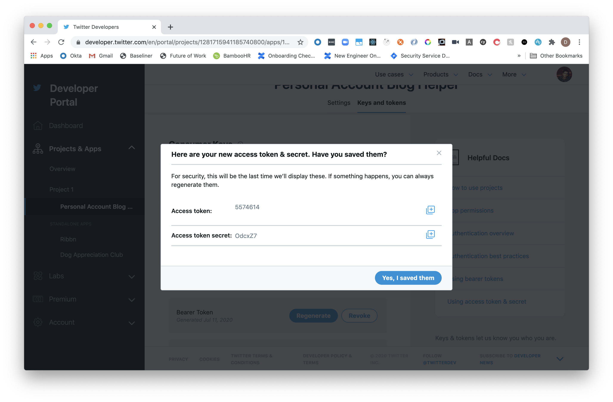
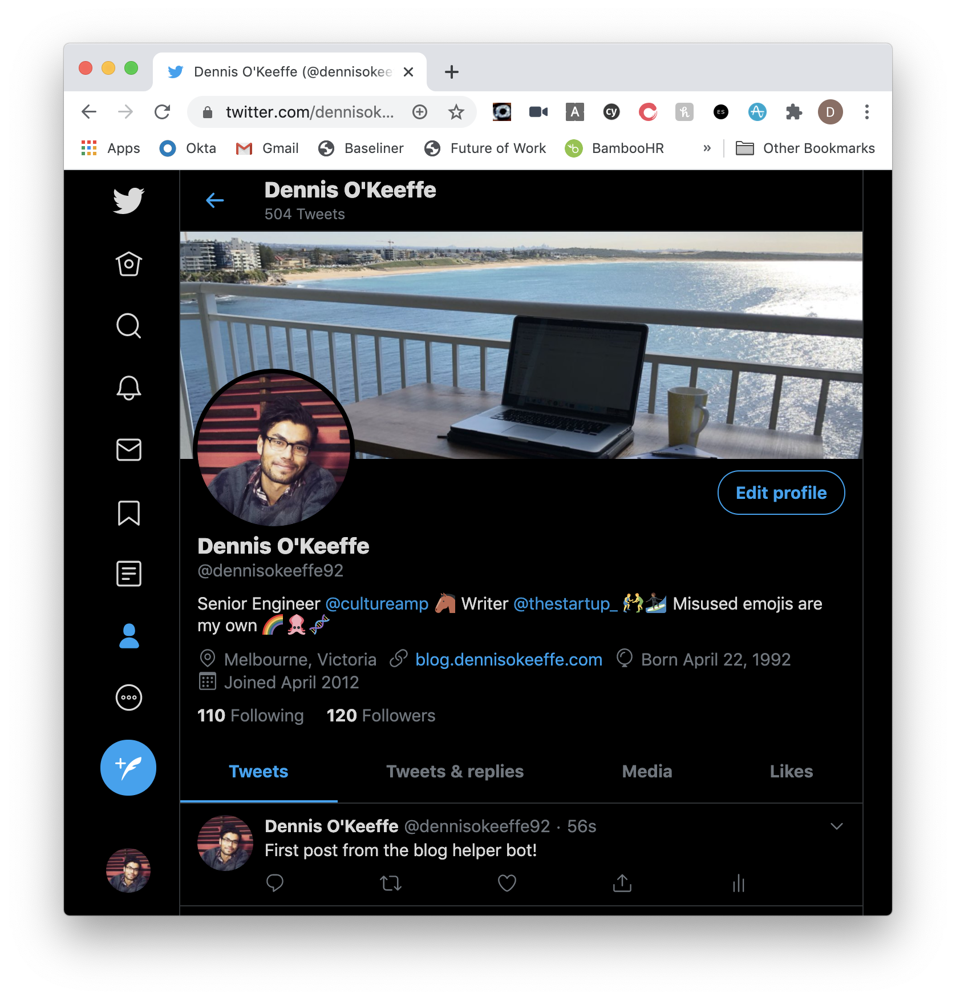

Building a Twitter bot is part of the holy pilgrimage to being a hobbyist developer. Let's face it: building bots is fun.

Let's take our first steps into how we can make our first Tweet with NodeJS. We will go through a simple four-step process on how to get up and running with your first bot!

## Step One: Get access

As of writing, it is a requirement to [apply for access](https://developer.twitter.com/en/apply-for-access) for a developer Twitter account. It is nice and straight-forward and requires a couple of minutes to fill out.

This step is only required if you have no yet done this.

## Step Two: Get tokens

Once you have access to the Developer Dashboard, you can create your first app and [obtain your Twitter access tokens](https://developer.twitter.com/en/docs/basics/authentication/oauth-1-0a/obtaining-user-access-tokens).

From the dashboard, you will need to head to `Projects & Apps > Your Project > Your App` and select `Keys and tokens` on the tabs at the top. This will give you access to copy and save your `API Key & Secret`. These will only be available for a day or so. Make sure you store them somewhere secure! I always opt for a password manager.

You will also need to generate the `Access Token & Secret`. This an be done under `Authentication Tokens`. Do the same by copying these and keeping them safe. We will need all four of the keys we have stored.



<figcaption>Obfuscated Auth token keys</figcaption>

Once you have done all that, keep the keys handy and we will build out the bot.

## Step Three: Add read + write permissions

In that same dashboard, head to `Projects & Apps > Your Project > Your App` and make sure you change your `App permissions` to be `Read and Write`.

This is important to allow us to Tweet with the credentials from above.

## Step Four: Build the application

We will keep things short and simple for now to get our first Tweet out! We are going to use the [Twit](https://github.com/ttezel/twit) package to be our medium through which we post and [Dotenv](https://github.com/motdotla/dotenv) to load our environment variables at runtime from our local (so we can safely Git ignore them).

From the root of your new project:

```s
# init with the basics
yarn init -y
yarn add twit
yarn add --dev dotenv
touch index.js .env .gitignore
```

Inside of `.gitignore`, let's make sure our secrets are not being stored on our remote repository:

```s
node_modules/
.env
```

With our access tokens we saved from before, we will need to add them to `.env`:

```s
TWITTER_CONSUMER_KEY=<your-token>
TWITTER_CONSUMER_SECRET=<your-token>
TWITTER_ACCESS_TOKEN_KEY=<your-token>
TWITTER_ACCESS_TOKEN_SECRET=<your-token>
```

Finally, let's add our code to `index.js`:

```js
require("dotenv").config()
const Twit = require("twit")
const client = new Twit({
  consumer_key: process.env.TWITTER_CONSUMER_KEY,
  consumer_secret: process.env.TWITTER_CONSUMER_SECRET,
  access_token: process.env.TWITTER_ACCESS_TOKEN_KEY,
  access_token_secret: process.env.TWITTER_ACCESS_TOKEN_SECRET,
})

/**
 * Post a tweet to account.
 *
 * @example
 * const tweet = await Twitter.post('This is an update', res.media.media_id_string);
 * // returns success/error object
 *
 * @param  {String} tweet  Tweet string
 * @param  {Twitter} client Client instance of Twitter package
 * @return {Promise<ClientResponse>} Return error or success object
 */
const post = tweet => {
  const limit = 136

  // ensure Tweet is correct length, but if not let's truncate
  // and still post.
  const tweetSubstr =
    tweet.length > limit ? `${tweet.substring(0, limit - 3)}...` : tweet

  const data = {
    status: tweetSubstr,
  }

  // use the client to post the message
  return client.post("statuses/update", data)
}

const main = async () => {
  try {
    console.log("Attempting to post")
    await post("First post from the blog helper bot!")
    console.log("Posted!")
  } catch (err) {
    console.error(err)
  }
}

main()
```

What we are doing in `index.js` is fairly straight forward, but let's break it down:

1. Require and load our env variables from the `.env` file to access during runtime
2. Require our Twitter library `Twit` and initialise it with our environment variables
3. Declare a `post` function that simply takes text, checks it is less than the defined limit and then uses the client to post
4. Declare `main` asynchronous function that will attempt to post the text `"First post from the blog helper bot!"`
5. Run the `main` function

> It is worth noting that `post` returns a promise, hence why we make `main` an `async` function and use `await` when calling to post

That is it! Let's now run `node index.js`. If successful, you should get the following back:

```s
> node index.js
Attempting to post
Posted!
```

> If you are unsuccessful, there will be an error that is caught and logged out.

If we now jump onto Twitter, we can see our successes!



<figcaption>First Twitter bot post</figcaption>

Congratulations! You can now post remotely and avoid all the negative vibes that can comes across from time to time when perusing the Twitterverse!

## Resources and Further Reading

1. [Apply for access](https://developer.twitter.com/en/apply-for-access)
2. [Obtaining Twitter access tokens](https://developer.twitter.com/en/docs/basics/authentication/oauth-1-0a/obtaining-user-access-tokens)
3. [Twit](https://github.com/ttezel/twit)
4. [Dotenv](https://github.com/motdotla/dotenv)
5. [Completed project](https://github.com/okeeffed/hello-twitter-bot)
6. [Twitter Docs - statuses/update](https://developer.twitter.com/en/docs/tweets/post-and-engage/api-reference/post-statuses-update)

_Image credit: [freestocks](https://unsplash.com/@freestocks)_
