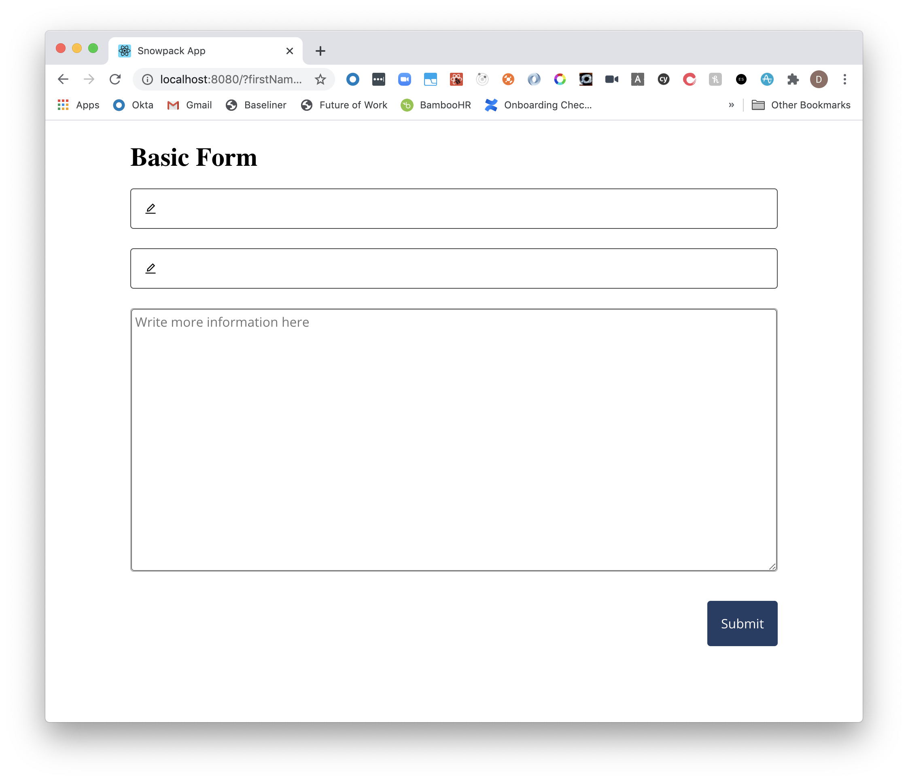
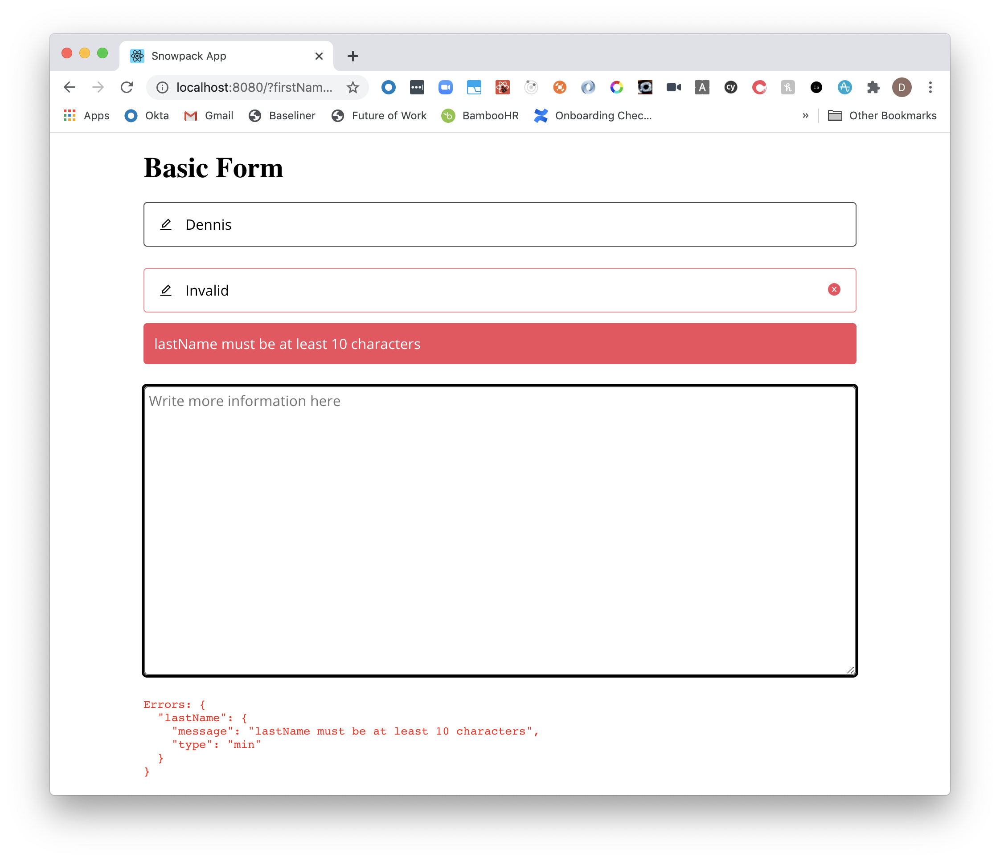
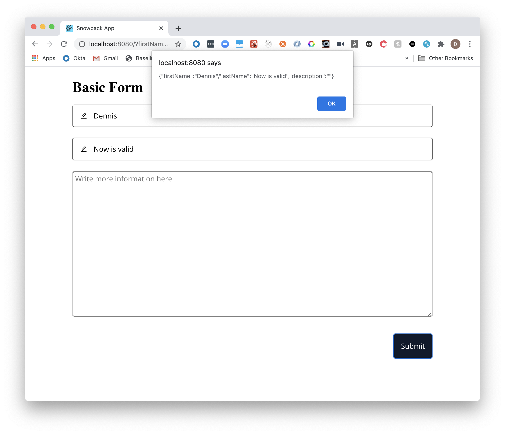
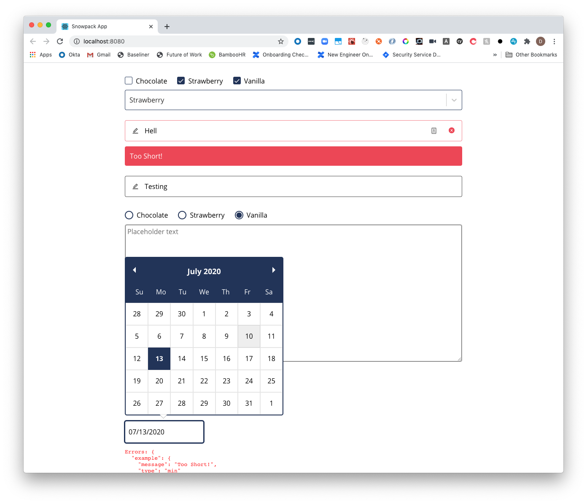

Building out forms ranks as one of the highest priorities in web development. It facilitates user interaction for the broader application. It is your gateway to providing the rest of your application clean data.

_It can also be very tedious._

Over the weekend, I began playing with the idea about how I could build forms without needing to write any JSX. I wanted to take a format (like JSON) that could be produced by anyone and use that to generate out the form with validation.

What are the benefits for doing this?

1. Re-useability: The ability to **take from one project to another and reproduce the form output**.
2. Compose-ability: It enables configurations to be **combined with ease** ie multiple config files being merged for more complex forms.
3. Upgradeability: It **centralises** the point where I can make adjustments in the future.
4. Flexibility: It is easy to provide JSON format. The endgame is to be very meta and build a form _that itself builds forms_.

_As a fair warning, this project is uses my personal (but currently private) design system to create the files._

While the output itself will be custom components, the approach to doing so is translatable to anything thing you want. This includes using the general HTML tags of `form`, `input`, etc.

**This tutorial is a lot more rough-around-the-edges and scrappy than my others.** There is much I could do to clean this up, but my hope is that this will show you how I begin projects by being scrappy and validating my goals. I have made adjustments to the code since.

## Prerequisites

We are going to be using [Deno](https://deno.land/) and [Snowpack](https://www.snowpack.dev/). I wanted an excuse to try both out as I've heard so many good things! Yes, this is my first time playing around with both. I wasn't so quick on adopting these technologies.

**_Spoiler alert: both great._**

Check the [installation guide](https://deno.land/#installation) for Deno to setup for this project.

## Setting up a TypeScript React project with Snowpack

We will set up a basic project for this to run in, but we won't be using it for much other than running our app and seeing the results.

We will use [Create Snowpack App](<https://www.snowpack.dev/#create-snowpack-app-(csa)>) to get up and going with a React template.

```s
npx create-snowpack-app forms --template @snowpack/app-template-react-typescript
cd forms
yarn start
```

Once installed, if we run `yarn start` then it will boot up a dev server with the familiar React starter page!

Perfect. Let's move onto generating the template.

## The game plan

You may have seen my previous post on [building your own code generator in JavaScript](https://blog.dennisokeeffe.com/blog/2020-06-30-javascript-code-generation/). Generally, I do use that approach or use [Hygen](https://github.com/jondot/hygen), but when quickly mocking up "will this work?" scenarios, I opted just use the power of template strings.

**So the plan is this:**

1. Learn how to read and write files with Deno.
2. Write a reuseable template string that I can test out (for building the forms).
3. Have this template string build out using my personal Design System components.
4. Have it also build out some form validation using [Yup](https://github.com/jquense/yup).
5. Come up with a reuseable JSON schema (which can be subject to change).

Let's get started with a short "Hello, World!" CLI with Deno.

## Hello, Deno

At this point, it required a bunch of running through Deno's documentation to find the packages that I needed.

For the sake of brevity, I will leave all the different Deno documentation resources for the end.

I knew what I wanted to be able to do:

1. Parse arguments given from the command line to provide the config path.
2. Read that config and use it.

From prior experience, I had an inkling on what to Google for (file readers, command line parsing, etc in Deno) so I went to work and found the `parse` module and built in `readFileSync` from the `std` library were what I needed.

Let's make a script file and see it in action:

```s
# Where we will keep our script
mkdir bin
touch bin/generate-form.ts
# Where we will search for data
mkdir data
touch data/basic-form.json
echo '{ "hello": "world" }' > bin/data.json
```

Now we can add six simple lines of code to `bin/generate-form.ts`:

```ts
import { parse } from "https://deno.land/std/flags/mod.ts"

const argv = parse(Deno.args)
const decoder = new TextDecoder("utf-8")
const jsonFile = Deno.readFileSync(argv._[0] as string)
const json = JSON.parse(decoder.decode(jsonFile))
console.log(json)
```

In this code, we are telling Deno to:

1. Parse the arguments given when we run the program.
2. Use a `TextDecoder` to read the file path that we will give as the first argument (indexed at 0).
3. Read that file synchronously.
4. Decode the file contents and assign it to JSON.
5. Log the JSON.

Now we can run the following:

```s
> deno run --allow-read bin/generate-form.ts data/basic-form.json
{ "hello": "world" }
```

The `--allow-read` flag gives Deno read permissions during runtime to allow use to read `data/basic-form.json`.

As for `argv`, the values of `_` begin **after** running the program with `deno run --allow-read bin/generate-form.ts`, so our argument `data/basic-form.json` becomes the first index of `_`, hence the `argv._[0]` being parse to the `Deno.readFileSync` line.

Let's now move onto the more complex work.

## Designing the form schema

A lot of this came from what props I provide my components, but I opted to update `data/generate-form.json` with something like this:

```json
{
  "name": "Basic Form",
  "elements": [
    {
      "id": "first-name",
      "name": "First name",
      "type": "text",
      "required": true
    },
    {
      "id": "last-name",
      "name": "Last name",
      "type": "text",
      "required": true,
      "min": 10
    },
    {
      "id": "description",
      "name": "Description",
      "type": "textarea",
      "required": false,
      "placeholder": "Write more information here"
    }
  ]
}
```

Here, I decided that I would have a top-level **name** property for the form and then **elements** as an array of what I want in the form. I decided to go this way to enable the top-level room for more metadata as I may need it down the track.

As for the structure of each element, I decided that they need an `id`, `name`, `type` and `required`, but anything else there can be optionally used to help create the validations and other metadata.

The types here I opted with relate directly to a component I have in my design system and map like what follows:

1. text - `<TextInput />`
2. textarea - `<TextArea />`
3. date - `<DatePicker />`
4. checkbox - `<CheckboxGroup />`
5. select - `<Select />`
6. radio - `<RadioGroup />`

Between these six, I have most of what I need for my forms.

## Building out the simple form

The following relates to how I ended up writing out the form. As there can be a lot of code, I will paste them in order of what is in the final file and explain a little on each.

If you would like, follow along as I add the code bit-by-bit, but I will leave the final code there are the end too.

### The imports

```ts
import { parse } from "https://deno.land/std/flags/mod.ts"
import { camelCase } from "https://deno.land/x/case/mod.ts"
import {
  prettier,
  prettierPlugins,
} from "https://denolib.com/denolib/prettier/prettier.ts"
```

I want to use the `name` field to help generate components, so I added in `camelCase` from Deno's `case` module to help alter the casing when required.

I also adding in the `prettier` modules to help with formatting the files afterwards. We are going to use string interpolation, so it will never be that pretty.

## Parsing the file

```ts
const argv = parse(Deno.args)
const decoder = new TextDecoder("utf-8")
const jsonFile = Deno.readFileSync(argv._[0] as string)
const json = JSON.parse(decoder.decode(jsonFile))
console.log(json)
```

Nothing new here from above, so I'll move on.

## Setting up types

```ts
type FieldType = Record<string, string>
const FieldType: FieldType = {
  text: "string",
  textarea: "string",
  date: "Date",
  checkbox: "string[]",
  select: "string",
}

type Config = {
  interface: string[]
  validations: string[]
  name: string
  useStateDeclarations: string[]
  register: string[]
  unregister: string[]
  components: string[]
}

type FormElement = {
  id: string
  name: string
  type: string
  required?: boolean
  min?: number
  placeholder?: string
}

enum FormType {
  text = "text",
  textarea = "textarea",
  date = "date",
  checkbox = "checkbox",
  select = "select'
}
```

This expects you to understand TypeScript. In general, I basically create the **FieldType** to match my "type" decisions explained early

I decided on an initial **Config** option that would house my different arrays of strings required for string interpolation.

The **FormElement** matches directly to how I structure my `elements` for the JSON files (and include their optional values).

Finally, the `FormType` is an enum so I could use things like `FormType.text` instead of always writing text and being susceptible to misuse.

## The generators

```ts
/**
 * Set up register + unregister form elements
 * that have more complex setups.
 *
 * @param {Config} config
 */
const generateRegistrations = (config: Config) => `
React.useEffect(() => {
  ${config.register}
  return () => {
    ${config.unregister}
  };
}, []);
`

const generateInterface = (el: FormElement) =>
  `${camelCase(el.id)}: ${FieldType[el.type]};`

const generateValidation = (el: FormElement) =>
  `${camelCase(el.id)}: yup.string()${el.required ? ".required()" : ""}${
    el.min ? `.min(${el.min})` : ""
  },`

const generateComponents = (el: FormElement) => {
  switch (el.type) {
    case FormType.text:
      return `<TextField
      id="${el.id}"
      name="${camelCase(el.id)}"
      status={errors.${camelCase(el.id)} ? 'error' : 'default'}
      ref={register}
      validationMessage={errors.${camelCase(el.id)} && errors.${camelCase(
        el.id
      )}.message}
    />`
    case FormType.textarea:
      return `<TextArea
      ref={register}
      name="${camelCase(el.id)}"
      id="${el.id}"
      placeholder="${
        el.placeholder ? el.placeholder : "Type your response here"
      }"
    />`
    default:
      console.log("Should not be here")
      return ""
  }
}

/**
 * Generate the form text.
 *
 * @param {Config} config
 *
 * @returns {string} Form JSX as string
 */
const generateForm = (config: Config) => `
import * as React from 'react';
import * as yup from 'yup';
import { yupResolver } from '@hookform/resolvers';
import { useForm } from 'react-hook-form';
import { 
  TextField, 
  TextArea, 
  Text,
  Box, 
  Button, 
  FormEvents
  // @ts-ignore
} from '@okeeffed/design-system';

export interface IFormInputs {
  ${config.interface.join("\n")}
}

const validationaSchema = yup.object().shape({
  ${config.validations.join("\n")}
});

export type ${config.name.replace(/\s/g, "")}Props = FormEvents;
type ${config.name.replace(
  /\s/g,
  ""
)} = React.FunctionComponent<${config.name.replace(/\s/g, "")}Props>;
const ${config.name.replace(/\s/g, "")}: ${config.name.replace(
  /\s/g,
  ""
)} = ({ onSubmit }) => {
  ${config.useStateDeclarations}
  
  const { register, unregister, handleSubmit, errors, setValue } = useForm<
    IFormInputs
  >({
    resolver: yupResolver(validationaSchema),
    mode: 'onBlur',
  });

  ${config.register ? setupRegistrations(config) : ""}

  return (
    <form
      onSubmit={handleSubmit(onSubmit)}
      style={{ padding: '24px', margin: '0 auto', maxWidth: '800px' }}
    >
      <Text type="pageTitle">${config.name}</Text>
      ${config.components.join("\n")}
      <div style={{ color: 'red' }}>
        <pre>
          {Object.keys(errors).length > 0 && (
            <label>Errors: {JSON.stringify(errors, null, 2)}</label>
          )}
        </pre>
      </div>
      <Box py="s" display="flex" justifyContent="flex-end">
        <Button
          type="submit"
          variant="info"
          disabled={Object.keys(errors).length}
        >
          Submit
        </Button>
      </Box>
    </form>
  );
};

export default ${config.name.replace(/\s/g, "")};
`
```

As mentioned, I wanted to start the form with string interpolation. A lot of this was identifying the points where I could repeat code (ie the elements, the component name, etc) and abstracted them so I could generate the strings and interpolate them all into one.

> It's worth noting that you definitely don't need to copy `.replace(/\s/g, ""` everywhere like I did. Again, it was simply to get things up and going. All this code is prior to refinement.

You can read through, but the gist of it is string manipulation based on the JSON files. The types I have above for them `Config`, `FormElement` should help understand the properties available to each argument.

These generators create a custom name for my component, add in the components within the JSX, add in validation and are prepped to set up things that work outside of [React Hook Form](https://react-hook-form.com/).

> I'm not going to delve too deep into React Hook Form, but it was the library that I opted to use. Why? I just went looking through the different options and felt it was the simplest to implement and had good performance (controlled input sometimes causes me headaches).

## Running the build config

```ts
const buildConfig = () => {
  const config: Partial<Config> = {
    name: json.name,
  }

  config.interface = json.elements.map(generateInterface)
  config.validations = json.elements.map(generateValidation)
  config.useStateDeclarations = []
  config.components = json.elements.map(generateComponents)

  const res = generateForm(config as Config)
  console.log(res)

  const formOutput = prettier.format(res, {
    parser: "typescript",
    plugins: prettierPlugins,
  })

  Deno.writeFileSync("./src/NewForm.tsx", new TextEncoder().encode(formOutput))
}

buildConfig()
```

Finally, the last part is essentially calling a "main" function `buildConfig` that generates a config on the fly by using the helper generator functions, then will finish up by using Prettier to format the code and then write the code out to a path that I desired.

> That path "./src/NewForm.tsx" was changed later to become an `--output` flag.

So it looks like a lot is happening since there is a lot of code, but really it is just one big interpolated string.

## The form in action

We can now run our final code using the following:

```s
deno run --allow-read --allow-write bin/generate-form.ts data/basic-form.json
```

> We've added `--allow-write` to our previous run for permissions.

If successful, we will have a new file `src/NewForm.tsx`!

Let's update our `App.tsx` file. Mine looked like so:

```ts
import React from "react"
// @ts-ignore
import { alpha as theme } from "@okeeffed/design-system"
import NewForm from "./NewForm"
import "./App.css"

interface AppProps {}

function App({  }: AppProps) {
  return <NewForm onSubmit={(data: never) => alert(JSON.stringify(data))} />
}

export default App
```

If we hit save, our local environment will reload (incredibly fast thanks to Snowpack) and show us our form!



<figcaption>The basic form output from the generator</figcaption>



<figcaption>The form in action</figcaption>



<figcaption>The form after submitting</figcaption>

> If you stopped the Snowpack server before, just run `yarn start` again from the CLI.

Because of how we have set the form with validations and by passing the **onSubmit** prop to show use the data, we can now play around with it and see that our code is working as expected.

Victory!

## Next steps

This was just a quick recount of how I got things up and running yesterday.

I made some changes later to introduce more complex JSON files that started adding in my other types.



<figcaption>More complex example</figcaption>

Unlike my other tutorials, this is a rough-around-the-edges example of getting things up and going and how you can to! I'll leave you with the final code and resources so I can begin my work week!

## Final code

```ts
import { parse } from "https://deno.land/std/flags/mod.ts"
import { camelCase } from "https://deno.land/x/case/mod.ts"
import {
  prettier,
  prettierPlugins,
} from "https://denolib.com/denolib/prettier/prettier.ts"

const argv = parse(Deno.args)
const decoder = new TextDecoder("utf-8")
const jsonFile = Deno.readFileSync(argv._[0] as string)
const json = JSON.parse(decoder.decode(jsonFile))
console.log(json)

type FieldType = Record<string, string>
const FieldType: FieldType = {
  text: "string",
  textarea: "string",
  date: "Date",
  checkbox: "string[]",
  select: "string",
}

type Config = {
  interface: string[]
  validations: string[]
  name: string
  useStateDeclarations: string[]
  register: string[]
  unregister: string[]
  components: string[]
}

type FormElement = {
  id: string
  name: string
  type: string
  required?: boolean
  min?: number
  placeholder?: string
}

enum FormType {
  text = "text",
  textarea = "textarea",
}

/**
 * Set up register + unregister form elements
 * that have more complex setups.
 *
 * @param {Config} config
 */
const generateRegistrations = (config: Config) => `
React.useEffect(() => {
  ${config.register}
  return () => {
    ${config.unregister}
  };
}, []);
`

const generateInterface = (el: FormElement) =>
  `${camelCase(el.id)}: ${FieldType[el.type]};`

const generateValidation = (el: FormElement) =>
  `${camelCase(el.id)}: yup.string()${el.required ? ".required()" : ""}${
    el.min ? `.min(${el.min})` : ""
  },`

const generateComponents = (el: FormElement) => {
  switch (el.type) {
    case FormType.text:
      return `<TextField
      id="${el.id}"
      name="${camelCase(el.id)}"
      status={errors.${camelCase(el.id)} ? 'error' : 'default'}
      ref={register}
      validationMessage={errors.${camelCase(el.id)} && errors.${camelCase(
        el.id
      )}.message}
    />`
    case FormType.textarea:
      return `<TextArea
      ref={register}
      name="${camelCase(el.id)}"
      id="${el.id}"
      placeholder="${
        el.placeholder ? el.placeholder : "Type your response here"
      }"
    />`
    default:
      console.log("Should not be here")
      return ""
  }
}

/**
 * Generate the form text.
 *
 * @param {Config} config
 *
 * @returns {string} Form JSX as string
 */
const generateForm = (config: Config) => `
import * as React from 'react';
import * as yup from 'yup';
import { yupResolver } from '@hookform/resolvers';
import { useForm } from 'react-hook-form';
import { 
  TextField, 
  TextArea, 
  Text,
  Box, 
  Button, 
  FormEvents
  // @ts-ignore
} from '@okeeffed/design-system';

export interface IFormInputs {
  ${config.interface.join("\n")}
}

const validationaSchema = yup.object().shape({
  ${config.validations.join("\n")}
});

export type ${config.name.replace(/\s/g, "")}Props = FormEvents;
type ${config.name.replace(
  /\s/g,
  ""
)} = React.FunctionComponent<${config.name.replace(/\s/g, "")}Props>;
const ${config.name.replace(/\s/g, "")}: ${config.name.replace(
  /\s/g,
  ""
)} = ({ onSubmit }) => {
  ${config.useStateDeclarations}
  
  const { register, unregister, handleSubmit, errors, setValue } = useForm<
    IFormInputs
  >({
    resolver: yupResolver(validationaSchema),
    mode: 'onBlur',
  });

  ${config.register ? setupRegistrations(config) : ""}

  return (
    <form
      onSubmit={handleSubmit(onSubmit)}
      style={{ padding: '24px', margin: '0 auto', maxWidth: '800px' }}
    >
      <Text type="pageTitle">${config.name}</Text>
      ${config.components.join("\n")}
      <div style={{ color: 'red' }}>
        <pre>
          {Object.keys(errors).length > 0 && (
            <label>Errors: {JSON.stringify(errors, null, 2)}</label>
          )}
        </pre>
      </div>
      <Box py="s" display="flex" justifyContent="flex-end">
        <Button
          type="submit"
          variant="info"
          disabled={Object.keys(errors).length}
        >
          Submit
        </Button>
      </Box>
    </form>
  );
};

export default ${config.name.replace(/\s/g, "")};
`

const buildConfig = () => {
  const config: Partial<Config> = {
    name: json.name,
  }

  config.interface = json.elements.map(generateInterface)
  config.validations = json.elements.map(generateValidation)
  config.useStateDeclarations = []
  config.components = json.elements.map(generateComponents)

  const res = generateForm(config as Config)

  console.log(res)

  const formOutput = prettier.format(res, {
    parser: "typescript",
    plugins: prettierPlugins,
  })

  Deno.writeFileSync("./src/NewForm.tsx", new TextEncoder().encode(formOutput))
}

buildConfig()
```

## Resources and Further Reading

1. [Deno Parse Args](https://deno.land/std/flags/README.md)
2. [Deno Read File Sync](https://deno.land/typedoc/index.html#readfilesync)
3. [Deno - Case](https://deno.land/x/case)
4. [Deno - Prettier](https://deno.land/x/prettier/README.md)
5. [Prettier - Parsers](https://prettier.io/docs/en/options.html#parser)
6. [Snowpack CSA](<https://www.snowpack.dev/#create-snowpack-app-(csa)>)
7. [React Hook Form API](https://react-hook-form.com/api/)
8. [React Hook Form - Examples](https://github.com/react-hook-form/react-hook-form/tree/master/examples)
9. [Build your own JS generator](https://blog.dennisokeeffe.com/blog/2020-06-30-javascript-code-generation/)
10. [Hygen template generator](https://github.com/jondot/hygen)
11. [Yup validation](https://github.com/jquense/yup)
