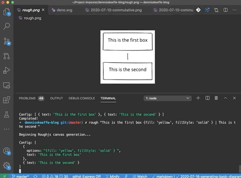
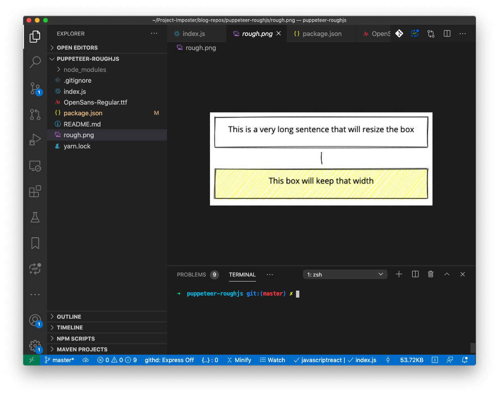
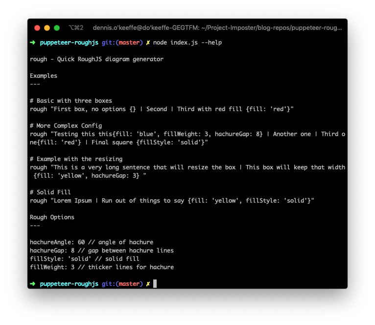
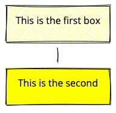
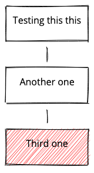
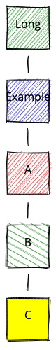
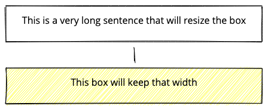

The recent evening's project was to generate a CLI helper for myself to quick sketch up rough diagrams and flows at work as PNG images.



<figcaption>The tool in action</figcaption>



<figcaption>Static output</figcaption>

Why? After recent events at work, I am helping to take over our department's developer tool that enables other users to get up and running quickly at work.

This tool is written in Golang and requires an understanding of certain concepts such as named pipes, POSIX standard interrupts, RPCs and more. The hope is that I can quickly generate rough diagram flows to help illustrate what is happening.

The MVP for this was to just get auto-sized rectangles that would flow from `1..n` with lines between each using a little bit of math.


## Prerequisites

This post uses concepts that were taken from previous blog posts. Please check them out first to understand how a bunch of the screenshots and argument parsing is working.

1. [Screenshots with Puppeteer - Blog Post](https://blog.dennisokeeffe.com/blog/2020-07-01-screenshot-anything-with-puppeteer/)
2. [Intro Yargs Parser - Blog Post](https://blog.dennisokeeffe.com/blog/yargs-parser/)


## Getting started

Setup a new project:

```s
mkdir rough-diagrams
cd rough-diagrams
yarn init -y
yarn add puppeteer yargs-parser
touch index.js
```

The above is what we'll use in the Node script. As for RoughJS itself, we are going to use CDNs for RoughJS to load in the vanilla HTML template. This does mean that our project will only work if connected to the internet.

> There are other ways to use Nodejs and Nodejs canvas locally, but this was for me to get it done quickly. I may cover another post with `node-canvas` another time as it is super handy!


## Writing the script part by part

Let's begin our script with requirements and a simple help message:

```js
/**
 * Usage from CLI:
 *
 * node index.js "Testing this this{},Another one,Third one{fill: 'red'}"
 *
 * @see https://roughjs.com/
 */
const puppeteer = require("puppeteer")
const argv = require("yargs-parser")(process.argv.slice(2))
const path = require("path")

/** Help text to display when asked or incorrect option given */
const help = `
rough - Quick RoughJS diagram generator

Examples
---

# Basic with three boxes
rough "First box, no options {} | Second | Third with red fill {fill: 'red'}"

# More Complex Config
rough "Testing this this{fill: 'blue', fillWeight: 3, hachureGap: 8} | Another one | Third one{fill: 'red'} | Final square {fillStyle: 'solid'}"

# Example with the resizing
rough "This is a very long sentence that will resize the box | This box will keep that width {fill: 'yellow', hachureGap: 3} "

# Solid Fill
rough "Lorem Ipsum | Run out of things to say {fill: 'yellow', fillStyle: 'solid'}"

Rough Options
---

hachureAngle: 60 // angle of hachure
hachureGap: 8 // gap between hachure lines
fillStyle: 'solid' // solid fill
fillWeight: 3 // thicker lines for hachure
`

// Check for help or any argument length.
// If not give, log out help and exit.
if (argv.help || !argv._.length) {
  console.log(help)
  process.exit()
}
```

Here I am requiring in `puppeteer` and `yargs-parser`, then writing a template string for me help. This isn't as useful as other libraries that can help you write out nice CLI "help" options, but it will do. We are going MVP here.

If you run `node index.js --help` or `node index.js` with no following arguments, it will now print the `help` out.



<figcaption>Output from help</figcaption>


## First attempt as legible parsing

In the help printed, we have an example `rough "First box, no options {} | Second | Third with red fill {fill: 'red'}"`. What's happening here?

The endgame is to have a command "rough" that I can use anywhere on the local machine, so running that during development would actually be `node index.js "First box, no options {} | Second | Third with red fill {fill: 'red'}"`

As for the part within the quotations, that is my attempt to ensure that string becomes the first argument of `argv._` and then I will parse the string to grab out the parts between the pipes `|` and use that to pipe from one text to the next.

The parts within the brackets `{}` will be the options I pass to Rough in order to add in the colours, fills, etc.


## Adding in the constants and helpers

This part is the tricky part. We're going to add in the constants and help functions. I've added some comment annotations to try explain, but the gist of it is that we're going set a set `HEIGHT` for each rectangle for now, and a set `DISPLACEMENT` for the space that we want between each rectangle. That will help us calculate the height and help with adding lines.

As for `PER_CHAR`, that's an arbitrary, allocated size I've come up with after a couple of tests for how much larger I want the rectangle to grow based on the amount of characters added.

The `PADDING` is used to give space between the edge of the canvas and the box.

The helper functions `addRectangle`, `addTextToRectangle` and `addLine` return strings that we will interpolate into the HTML. Those strings returned come from [RoughJS](https://roughjs.com/) and a text-onto-canvas [w3schools page](https://www.w3schools.com/graphics/canvas_text.asp) that helped me figure out what was valid JS and usage of those libraries.

Finally, the `generateString` is the difficult part. The general idea is that the `shapes` global constant that was split on the pipes will iterate. If it contains options `{}` it will attempt to slice that out to differentiate the text and options, else it will just assume it is all text.

It will then push these to a global `shapeObjs` array. There is no reason for this to be global, but I wanted to hack a way to log it out through the main function (coming later).

We calculate the `WIDTH` value at runtime to help with the different sizing based on the text. This is based on a `PER_CHAR` and `DISPLACEMENT` values. This just required jotting down some arithmetic. It isn't complex math, but I still always need to remember how high school algebra works when figuring it out.

Finally, I am iterating over that `shapeObjs` and building out a string **that will be valid JavaScript**. The validity is important here. A lot of this is really a big hack, and since these are all strings, your linters may not be there to help you.

> Note: There isn't really an error handler here. Just MVP'ing. That's my excuse, anyway.

```js
/** Constants */
// Allocated size per character
const PER_CHAR = 8
const HEIGHT = 80
// Displacement between each box
const DISPLACEMENT = 24
// Desired padding around the box from the edges
const PADDING = 10

/** Fetching arguments */
const [args] = argv._
const shapes = args.split("|")
// Used later as a "global" store for
// parsed text and options.
const shapeObjs = []

/**
 * Add a rectangle to the canvas
 *
 * Stringify slice is to help remove quotations.
 *
 * @param {*} x
 * @param {*} y
 * @param {*} width
 * @param {*} height
 * @param {*} [options={}]
 * @returns
 */
const addRectangle = (x, y, width, height, options = null) => {
  let str = `rc.rectangle(${x + PADDING}, ${y + PADDING}, ${width -
    PADDING * 2}, ${height - PADDING * 2}`

  if (options) {
    str += `, ${JSON.stringify(options).slice(1, -1)}`
  }

  // closing parens
  str += `);`

  return str
}

const addTextToRectangle = (text, x, y, width, height) =>
  `addTextToRectangle("${text}", ${x}, ${y}, ${width}, ${height});`

const addLine = (x1, y1, x2, y2) => `rc.line(${x1}, ${y1}, ${x2}, ${y2});`

/**
 * Helper to generate the string we will interpolate
 * to create the RoughJS objects
 *
 * @returns {string} JavaScript string
 */
const generateString = () => {
  let len = 0

  for (const shape of shapes) {
    const hasOptions = shape.indexOf("{")
    if (hasOptions > 0) {
      const options = shape.slice(hasOptions)
      const text = shape.substr(0, hasOptions).trim()
      shapeObjs.push({
        options,
        text,
      })

      if (text.length > len) {
        len = text.length
      }
    } else {
      // renaming for understanding
      const text = shape.trim()
      shapeObjs.push({
        text,
      })

      if (text.length > len) {
        len = text.length
      }
    }
  }

  let js = ""

  const WIDTH = len * PER_CHAR + DISPLACEMENT

  shapeObjs.map((obj, index) => {
    const startY = index * (HEIGHT + DISPLACEMENT)

    js += `\n${addRectangle(0, startY, WIDTH, HEIGHT, obj.options)}`
    js += `\n${addTextToRectangle(obj.text, 0, startY, WIDTH, HEIGHT)}`

    if (index > 0) {
      js += `\n${addLine(WIDTH / 2, startY - DISPLACEMENT, WIDTH / 2, startY)}`
    }
  })

  return js
}
```

Phew! That is the complex part out of the way.


## Adding the script and valid HTML

We now use that `generateString` function to generate out a `script` variable.

This script variable will then be injected into the `html` variable below. The script has two runtime helpers in
`addTextToRectangle` and `addTextToCircle`. The circle hasn't been implemented at time of writing (MVP, MVP, MVP!), but that other function helps us add in the text to the rectangles since it does come with RoughJS... at least, I didn't see it in the documentation.

That helper will center the text.

`calcLongestTextSize` is another helper function to determine the size for the canvas. This is actually repeated code (RIP DRY principle). MVP, I'm telling you!

Finally, we have the `html` variable which is valid HTML.

```js
/**
 * Helper screen to interpolate into the HTML text that we
 * will run with Puppeteer.
 */
const script = `
const addTextToRectangle = (text, x, y, width, height) => {
  var canvas = document.getElementById('canvas');
  var ctx = canvas.getContext('2d');
  ctx.font = '16px Open Sans';
  ctx.fillStyle = 'black';
  ctx.textAlign = 'center';
  ctx.fillText(text, x + width / 2, y + height / 2);
};

const addTextToCircle = (text, centerX, centerY) => {
  var canvas = document.getElementById('canvas');
  var ctx = canvas.getContext('2d');
  ctx.font = '16px Open Sans';
  ctx.fillStyle = 'black';
  ctx.textAlign = 'center';
  ctx.fillText(text, centerX, centerY);
};

const rc = rough.canvas(document.getElementById('canvas'));
${generateString()}
`

/**
 * Based on input, it will figure out the desired
 * width of the boxes. We essentially take the text
 * between the pipes, abstract any config, trim it
 * and then return the size to be used for width
 * calculation.
 *
 * @returns {number} Length of largest string
 */
const calcLongestTextSize = () => {
  let len = 0

  for (const shape of shapes) {
    const hasOptions = shape.indexOf("{")
    if (hasOptions > 0) {
      const text = shape.substr(0, hasOptions).trim()

      if (text.length > len) {
        len = text.length
      }
    } else {
      // renaming for understanding
      const text = shape.trim()

      if (text.length > len) {
        len = text.length
      }
    }
  }

  return len
}

const CALCULATED_WIDTH = calcLongestTextSize() * PER_CHAR + DISPLACEMENT
const CALCULATED_HEIGHT = shapes.length * (DISPLACEMENT + HEIGHT) - PADDING * 2

const html = `<!DOCTYPE html>
<html>
  <head>
    <script src="https://cdn.jsdelivr.net/npm/roughjs@4.3.1/bundled/rough.js" integrity="sha256-/9PZn0Dy4EaX+C+sZSpiFxTimvbrTSoeCj6XwK2vIFg=" crossorigin="anonymous"></script>
    <style>
      @font-face { font-family: 'Open Sans'; src: url('OpenSans-Regular.ttf'); } 
    </style>
  </head>
  <canvas id="canvas" width="${CALCULATED_WIDTH}px" height="${CALCULATED_HEIGHT}px" style="display: inline-block;"></canvas>
  <script>
    ${script}
  </script>
</html>`
```

There are two important tags in the `head` which load an `Open Sans` font that I downloaded from Google Fonts and a script to load RoughJS from a CDN:

```html
<head>
  <script
    src="https://cdn.jsdelivr.net/npm/roughjs@4.3.1/bundled/rough.js"
    integrity="sha256-/9PZn0Dy4EaX+C+sZSpiFxTimvbrTSoeCj6XwK2vIFg="
    crossorigin="anonymous"
  ></script>
  <style>
    @font-face {
      font-family: "Open Sans";
      src: url("OpenSans-Regular.ttf");
    }
  </style>
</head>
```


## Running this altogether

Finally, the magic. Again, this basically comes from [other blog post] on screenshots with Puppeteer, so I won't explain too much here:

```js
const main = async () => {
  let browser
  try {
    // Log out global config taken from command-line
    console.log("\nBeginning Roughjs canvas generation...")
    console.log("\nConfig:", shapeObjs)

    // Launch Puppeteer and setup a new page
    browser = await puppeteer.launch()
    const page = await browser.newPage()

    // Tell Puppeteer to load our HTML variable.
    // Wait until "networkidle0", which from the
    // docs means "consider navigation to be finished
    // when there are no more than 0 network connections
    // for at least 500 ms."
    //
    // Note: Writing "'data:' + 'text' + '/html' + html" in a weird way
    // because Dev.To does not like it.
    await page.goto("data:" + "text" + "/html" + html, {
      waitUntil: "networkidle0",
    })

    // Wait for the <span id="canvas" /> element to be visible
    // and assign it to "element".
    const element = await page.$("#canvas")

    // Create a screenshot and save it locally to "math.png"
    const output = argv.out ? argv.out : "rough.png"
    await element.screenshot({
      path: path.resolve(process.cwd(), output),
    })
  } catch (err) {
    console.error(err)
  } finally {
    await browser.close()
    console.log("Completed!")
  }
}

main()
```


## Running

Let's now run some of the examples to see what we get!

```s
> node index.js "This is the first box {fill: 'yellow'} | This is the second {fill: 'yellow', fillStyle: 'solid'}"

Beginning Roughjs canvas generation...

Config: [
  { options: "{fill: 'yellow'} ", text: 'This is the first box' },
  {
    options: "{fill: 'yellow', fillStyle: 'solid'}",
    text: 'This is the second'
  }
]
Completed!
```

This will output to `rough.png`, so if we check it out we can see our success!



<figcaption>First output</figcaption>

Let's run a couple more to see our success.

```s
> node index.js "Testing this this{} | Another one | Third one {fill: 'red'}"
```



<figcaption>Second output</figcaption>

```s
> node index.js "Long {fill: 'green' } | Example {fill: 'blue' } | A {fill: 'red'} | B {fill: 'green', hachureGap: 8, hachureAngle: 60 } | C {fill: 'yellow', fillStyle: 'solid' }"
```



<figcaption>Third output</figcaption>

> Note: This output actually doesn't have much spacing. That means I should adjust the `PER_CHAR` value to something more suitable.

```s
> node index.js "This is a very long sentence that will resize the box | This box will keep that width {fill: 'yellow', hachureGap: 3}"
```



<figcaption>Fourth output</figcaption>

Great success! That is all for today, I am already late for standup!


## Resources and Further Reading

1. [Open Sans](https://fonts.google.com/specimen/Open+Sans?sidebar.open&selection.family=Open+Sans)
2. [Text onto Canvas](https://www.w3schools.com/graphics/canvas_text.asp)
3. [RoughJS](https://roughjs.com/)
4. [Puppeteer](https://github.com/puppeteer/puppeteer)
5. [Yargs Parser](https://github.com/yargs/yargs-parser)
6. [Screenshots with Puppeteer - Blog Post](https://blog.dennisokeeffe.com/blog/2020-07-01-screenshot-anything-with-puppeteer/)
7. [Intro Yargs Parser - Blog Post](https://blog.dennisokeeffe.com/blog/yargs-parser/)

_Image credit: [Bekky Bekks](https://unsplash.com/@bekky_bekks)_
