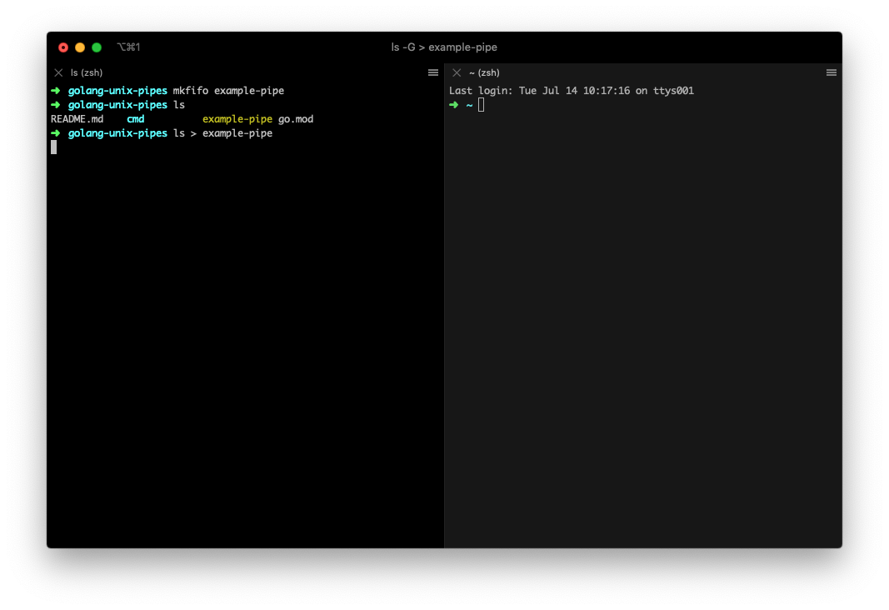
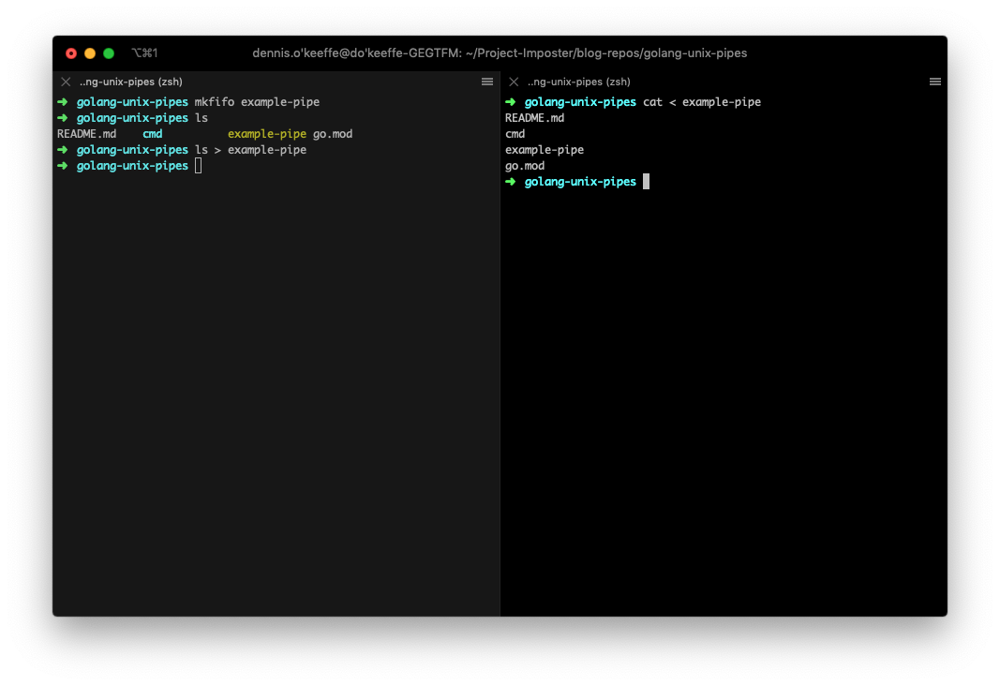
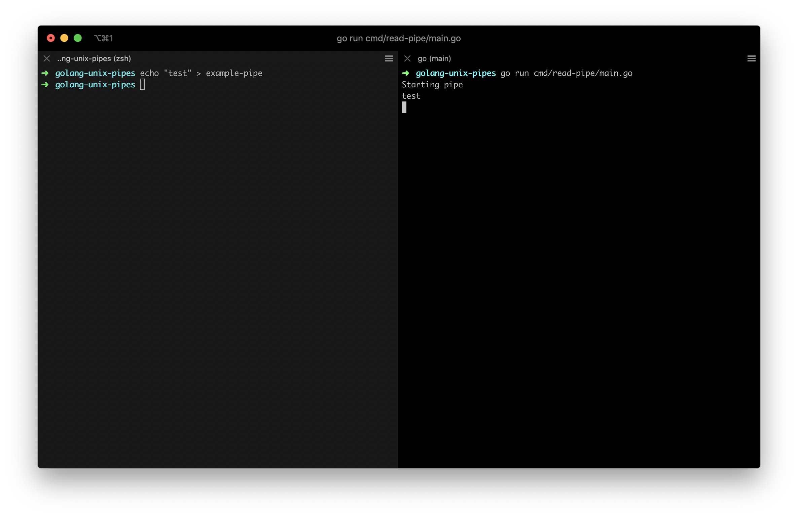
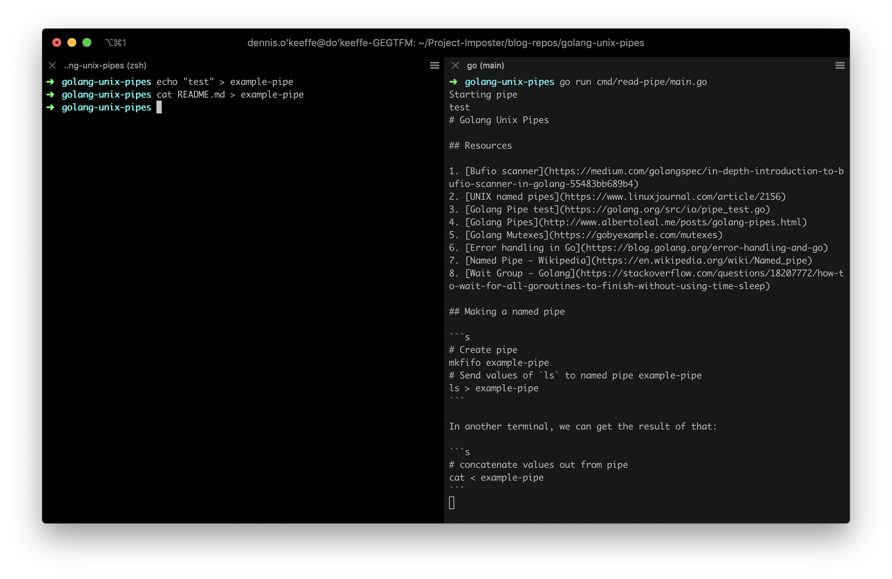
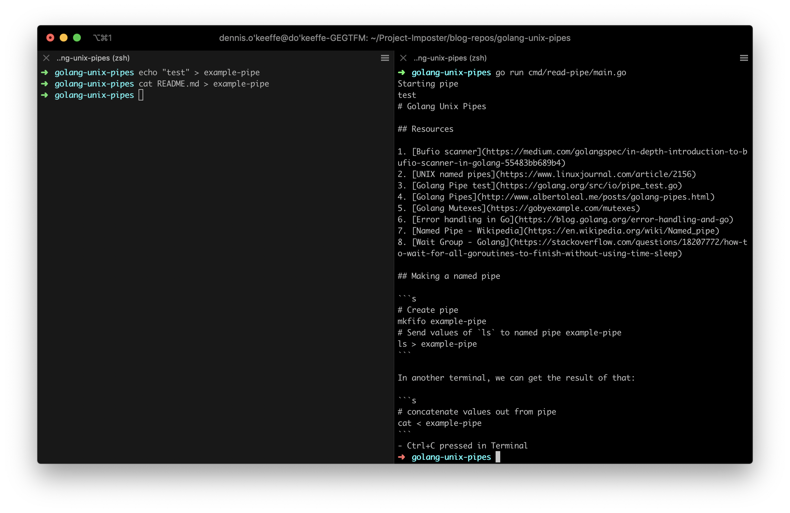

In Unix systems, pipes and redirections are the bridges that join our programs. They are an underrated resource that can aid developers in their own work in powerful ways.

Today's post will explore pipes from their humble beginnings to how we use them in our programs (with example help from Golang).

## Humble beginnings

Let's start with the humble pipe operator `|`. If you are running a Unix shell, we can explore the pipe operator with some simple examples:

```s
> echo "Hello friends"
Hello friends
> echo "Hello friends" | tr  "[:lower:]" "[:upper:]"
HELLO FRIENDS
```

In this short example, we are echoing "Hello friends" and using a pipe to pass that output to the translate characters program `tr` and taking all the lower case letters and upper casing them!

> If you are unfamiliar with `tr`, run `man tr` to see more. The description includes information on `[:class:]` usage.

In fact, we could add more pipes if we wanted to "glue" together more programs. We could even just do that with passing out put back to `translate` again!

```s
> echo "Hello friends!" | tr  "[:upper:]" "[:lower:]" | tr "[:space:]" "\n"
hello
friends
```

You get the gist. What gets cool though is that you can create "named pipes" to start piping in some cooler ways.

## Named pipes

What are "named pipes?". Let's define this with thanks again to our best friend [Wikipedia](https://en.wikipedia.org/wiki/Named_pipe):

> In computing, a named pipe (also known as a FIFO for its behavior) is an extension to the traditional pipe concept on Unix and Unix-like systems, and is one of the methods of inter-process communication (IPC).

For clarification, FIFO in this context stands for "first-in, first-out". We now also understand that it is an extension on tradition pipes, so how do we make one? Luckily, we have a program `mkfifo`.

In terminal, we can run this and se that a named pipe will be created in the current working directory.

```s
> mkfifo example-pipe
> ls
example-pipe
```

If were now to redirect anything to this named pipe ie `ls > example-pipe`, the program will wait for something for the named pipe to pass to.



In another terminal, we can do that very things by running `cat < example-pipe` to see the output in that terminal. Neat!



## Running the output of a named pipe to Golang

Now, let's see how this can be applied to our programs. Here, I am going to use a Golang program to demonstrate how we can do this. I won't dive too deep into the code (Go has the amazing `go doc <search>` feature to see information from the terminal) as this is simply a demo.

In the current working directory, create a `main.go` file and add the following:

```go
package main
import (
		"os"
		"os/signal"
		"syscall"
		"path/filepath"
		"bufio"
		"sync"
		"log"
		"fmt"
		"time"
)

func main() {

	// Setup our Ctrl+C handler
	SetupCloseHandler()
	ReadPipe()
}

func ReadPipe() {
	fmt.Println("Starting pipe")

	p := "example-pipe"
	dir, err := os.Getwd()
	if (err != nil) {
		log.Fatal(err)
		panic("Could not read working directory")
	}

	namedPipe := filepath.Join(dir, p)
	stdout, _ := os.OpenFile(namedPipe, os.O_RDONLY|syscall.O_NONBLOCK, 0600)
	syscall.SetNonblock(int(stdout.Fd()), false)

	// 128MB buffer
	bufSize := 1000000 * 128
	mutex := &sync.Mutex{}

	for {
		scanner := bufio.NewScanner(bufio.NewReaderSize(stdout, bufSize))
		for scanner.Scan() {
			mutex.Lock()
			fmt.Println(scanner.Text())
			mutex.Unlock()
		}
		time.Sleep(100 * time.Millisecond)
	}

	defer stdout.Close()
}

// SetupCloseHandler creates a 'listener' on a new goroutine which will notify the
// program if it receives an interrupt from the OS. We then handle this by calling
// our clean up procedure and exiting the program.
func SetupCloseHandler() {
	c := make(chan os.Signal)
	signal.Notify(c, os.Interrupt, syscall.SIGTERM)
	go func() {
		<-c
		fmt.Println("\r- Ctrl+C pressed in Terminal")
		os.Exit(0)
	}()
}
```

Our `main` function calls two functions:

1. `SetupCloseHandler` that creates a channel to listen out for our POSIX standard interrupt signal to exit the program.
2. `ReadPipe` that creates an infinite loop in the program to read from the "example-pipe" every 100ms.

> Author's note: `ReadPipe` and `SetupCloseHandler` did not need to be public functions, I am just copying them across from other packages in my program that did require it to be so.

If we run `go run main.go` in one terminal and `echo "test" > example-pipe` into another, you can see that we get the output through the pipe in our Go program!



Since we are indefinitely checking the pipe until the terminate signal is passed, we can run whatever we want into that `example-pipe` and see it coming out through our program.



Of course, once we run our terminate signal, we can close the Go program (and you can see Go handling that signal).



Awesome! We've managed to create some named pipes and use content piped into them in our program!

## Conclusion

This has been a short look at pipes and tying them into our programs. These become very useful when you are building tools to glue others together.

For example at work, we have a tool that I am about to take ownership of which connects together our developer experience from running our different services to migrations, installations and more. Named pipes is our way of being able to selectively pipe logs from each of those running services into one place to empower the developer experience and ensure that they are not overwhelmed!

I have linked a bunch of great resources below that relate to more information on both the pipes and everything that has been happening on the Golang side of things.

## Resources and further reading

1. [Bufio scanner](https://medium.com/golangspec/in-depth-introduction-to-bufio-scanner-in-golang-55483bb689b4)
2. [Pipes, redirection and stdout/stdin](http://www.compciv.org/topics/bash/pipes-and-redirection/)
3. [UNIX named pipes](https://www.linuxjournal.com/article/2156)
4. [Golang Pipe test](https://golang.org/src/io/pipe_test.go)
5. [Golang Pipes](http://www.albertoleal.me/posts/golang-pipes.html)
6. [Golang Mutexes](https://gobyexample.com/mutexes)
7. [Error handling in Go](https://blog.golang.org/error-handling-and-go)
8. [Named Pipe - Wikipedia](https://en.wikipedia.org/wiki/Named_pipe)
9. [Wait Group - Golang](https://stackoverflow.com/questions/18207772/how-to-wait-for-all-goroutines-to-finish-without-using-time-sleep)
10. [Piping in Unix or Linux](https://www.geeksforgeeks.org/piping-in-unix-or-linux/)

_Image credit: [Timothy L Brock](https://unsplash.com/@timothylbrock)_