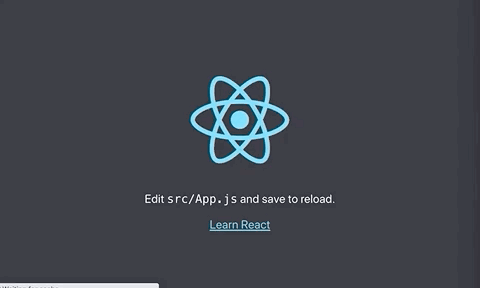

Bundlers have been the standard in web development over recent years, but as your application grows in size, so too does the bundle times. This creates issues for developers and costs everyone precious time.

Snowpack is build tool that addresses this issue by serving an unbundled application. They have a [great blog post](https://www.snowpack.dev/posts/2020-05-26-snowpack-2-0-release/) explaining how they got to the version 2 release.

In my own work, I have been getting unbelieably frustrated with build times and have been very keen to explore Snowpack. At first, I played around with their [Create Snowpack App](https://github.com/pikapkg/create-snowpack-app) starter, but want to know how I could run with [Create React App](https://github.com/facebook/create-react-app) and add Snowpack instead.

There really hasn't been many posts availble on how to do this, so I decided to go it on my own with some trial and error. Here are the short steps that you can take to start developing in O(1) build times with a fresh Create React App project!

> Note: This tutorial ran with `create-react-app@3.4.1` and `snowpack@2.6.4`.

## Getting started

Create a new React project with the following:

```s
npx create-react-app snowpack-uplift
```

This will create the default `create-react-app` setup into the `snowpack-uplift` folder.

## Babel Run Command File

Add a `.babelrc` file to your root directory and add the following:

```json
{
  "presets": ["@babel/preset-react"]
}
```

## index.html

We need to add the `<script type="module" src="/_dist_/index.js"></script>` tag into our `public/index.html` file.

Mine looked like the following:

```html
<!DOCTYPE html>
<html lang="en">
  <head>
    <meta charset="utf-8" />
    <link rel="icon" href="%PUBLIC_URL%/favicon.ico" />
    <meta name="viewport" content="width=device-width, initial-scale=1" />
    <meta name="theme-color" content="#000000" />
    <meta
      name="description"
      content="Web site created using create-react-app"
    />
    <link rel="apple-touch-icon" href="%PUBLIC_URL%/logo192.png" />
    <!--
      manifest.json provides metadata used when your web app is installed on a
      user's mobile device or desktop. See https://developers.google.com/web/fundamentals/web-app-manifest/
    -->
    <link rel="manifest" href="%PUBLIC_URL%/manifest.json" />
    <!--
      Notice the use of %PUBLIC_URL% in the tags above.
      It will be replaced with the URL of the `public` folder during the build.
      Only files inside the `public` folder can be referenced from the HTML.

      Unlike "/favicon.ico" or "favicon.ico", "%PUBLIC_URL%/favicon.ico" will
      work correctly both with client-side routing and a non-root public URL.
      Learn how to configure a non-root public URL by running `npm run build`.
    -->
    <title>React App</title>
  </head>
  <body>
    <noscript>You need to enable JavaScript to run this app.</noscript>
    <div id="root"></div>
    <script type="module" src="/_dist_/index.js"></script>
    <!--
      This HTML file is a template.
      If you open it directly in the browser, you will see an empty page.

      You can add webfonts, meta tags, or analytics to this file.
      The build step will place the bundled scripts into the <body> tag.

      To begin the development, run `npm start` or `yarn start`.
      To create a production bundle, use `npm run build` or `yarn build`.
    -->
  </body>
</html>
```

## Add Dependencies

Let's add our dev dependencies for the application! This will install Snowpack and some other dependencies I found along the way that look to be required.

```s
npm i --save-dev \
@snowpack/app-scripts-react \
@snowpack/plugin-babel \
rollup-plugin-node-polyfills \
snowpack
```

## package.json

Add the follow script to we can run `dev` as a npm script during development. It's not required, but saves time.

```json
"scripts": {
  "dev": "snowpack dev --config snowpack.config.js",
}
```

## Snowpack Config

Finally, create a `snowpack.config.js` file at the root directory and add the following:

```js
// snowpack.config.js
// Plugin: https://github.com/ionic-team/rollup-plugin-node-polyfills
module.exports = {
  extends: "@snowpack/app-scripts-react",
  devOptions: {
    port: 8080,
    src: "src",
    bundle: process.env.NODE_ENV === "production",
    fallback: "public/index.html",
  },
  installOptions: {
    rollup: {
      plugins: [require("rollup-plugin-node-polyfills")()],
    },
  },
}
```

These options are some that I carried over from the `Create Snowpack App` starter application. The `devOptions` may not be required, although I found the build would fail prior to add `fallback: "public/index.html"` to those options.

## Running out Application

Fire it up now by running `yarn dev` or `npm run dev`! The application will load on port 8080.

To see some neat speed changes, duplicate `App.js` and `App.css` into files `Alt.js` and `Alt.css`. Fiddle around with some of these settings so you can see the changes.

I updated `Alt.css` to have some colour changes:

```css
.Alt {
  text-align: center;
}

.Alt-logo {
  height: 40vmin;
  pointer-events: none;
}

@media (prefers-reduced-motion: no-preference) {
  .Alt-logo {
    animation: Alt-logo-spin infinite 20s linear;
  }
}

.Alt-header {
  background-color: #fff000;
  min-height: 100vh;
  display: flex;
  flex-direction: column;
  align-items: center;
  justify-content: center;
  font-size: calc(10px + 2vmin);
  color: black;
}

.Alt-link {
  color: black;
}

@keyframes Alt-logo-spin {
  from {
    transform: rotate(0deg);
  }
  to {
    transform: rotate(360deg);
  }
}
```

Make some simple changes to `Alt.js` to use `Alt.css` and have some different text:

```js
import React from "react"
import logo from "./logo.svg"
import "./Alt.css"

function Alt() {
  return (
    <div className="Alt">
      <header className="Alt-header">
        
        <p>
          Edit <code>src/Alt.js</code> and save to reload.
        </p>
        <a
          className="Alt-link"
          href="https://reactjs.org"
          target="_blank"
          rel="noopener noreferrer"
        >
          Learn Snowpack
        </a>
      </header>
    </div>
  )
}

export default Alt
```

## Seeing the speed changes

Import `Alt.js` in `index.js` and start swapping it back and forth with `<App />` to see some fast changes!

```js
import React from "react"
import ReactDOM from "react-dom"
import "./index.css"
import App from "./App"
import Alt from "./Alt"
import * as serviceWorker from "./serviceWorker"

ReactDOM.render(
  <React.StrictMode>
    <Alt />
  </React.StrictMode>,
  document.getElementById("root")
)

// If you want your app to work offline and load faster, you can change
// unregister() to register() below. Note this comes with some pitfalls.
// Learn more about service workers: https://bit.ly/CRA-PWA
serviceWorker.unregister()
```



The beauty with running CRA is that we can actually compare with the default settings! Stop the Snowpack server and start `yarn start` or `npm run start` to get the base app going with the bundler. Notice the following:

1. How much slower the server start up is.
2. The longer time to reload the app when changing between `<Alt />` and `<App />`.

It is really important to note here that the app is still **really, really small**, so time to bundle will only grow greater as we make the application larger and larger! That will be when Snowpack truly shines.

## Conclusion

We got up and running with Snowpack in 5 minutes and had a great chance to compare the two! O(1) build tools are a real breath of fresh air!

If you liked this short tutorial, you are going to love my next one where I dive into remote microfrontends with Webpack Federation. Be sure to follow me on [GitHub](https://github.com/okeeffed) and [Twitter](https://twitter.com/dennisokeeffe92) for updates on upcoming content.

## Resources and further reading

1. [Completed project](https://github.com/okeeffed/create-react-app-with-snowpack-example)
2. [The Path to Snowpack 2](https://www.snowpack.dev/posts/2020-05-26-snowpack-2-0-release/)
3. [Create Snowpack App](https://github.com/pikapkg/create-snowpack-app)
4. [Create React App](https://github.com/facebook/create-react-app)

_Image credit: [Katie Moum](https://unsplash.com/@katiemoum)_
