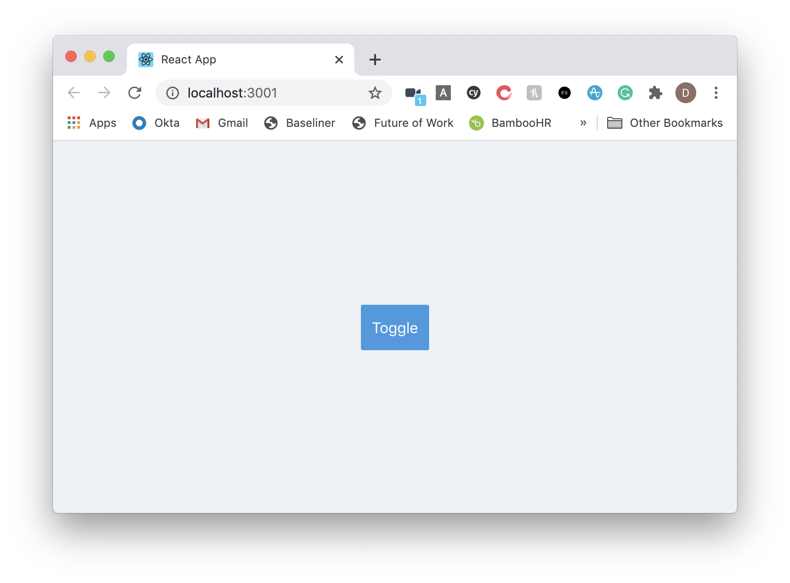
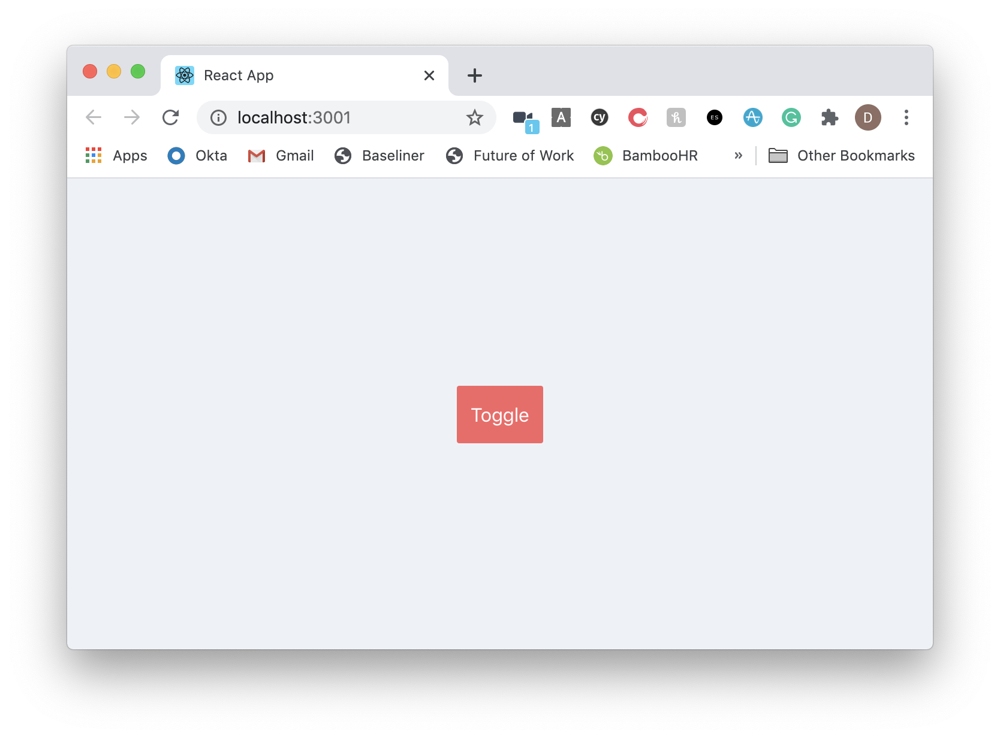

In this morning quick start, we are going to bootstrap a `create-react-app` with Tailwind and see how you can get it all up and running quickly with some state-based styling using `classnames`.


## Installation

First, we need to create the TypeScript React app with `create-react-app`.

Second, we will install the other packages required for today.

```s
# Create the app
npx create-react-app hello-tailwind --template typescript
# Change into our new app
cd hello-tailwind
# Using Yarn
yarn add tailwindcss classnames @types/classnames
```


## Updating package.json

This part took quick inspiration from [Dave Ceddia's post](https://daveceddia.com/tailwind-create-react-app/) with a modern update.

Let's update our scripts to have the following:

```json
{
  "scripts": {
    "build:tailwind": "tailwindcss build src/index.css -o src/tailwind.output.css",
    "prestart": "npm run build:tailwind",
    "prebuild": "npm run build:tailwind"
  }
}
```

`prestart` and `prebuild` scripts will run before any `start` and `build` script that is run. We are telling it to build the `index.css` file and output it to `src/tailwind.output.css`.


## Add Tailwind imports

Update `src/index.css` to look like the following:

```css
@tailwind base;
@tailwind components;
@tailwind utilities;

body {
  margin: 0;
  font-family: -apple-system, BlinkMacSystemFont, "Segoe UI", "Roboto",
    "Oxygen", "Ubuntu", "Cantarell", "Fira Sans", "Droid Sans",
    "Helvetica Neue", sans-serif;
  -webkit-font-smoothing: antialiased;
  -moz-osx-font-smoothing: grayscale;
}

code {
  font-family: source-code-pro, Menlo, Monaco, Consolas, "Courier New",
    monospace;
}
```

Then, we will need to update our `index.tsx` file to change the import from `index.css` to `tailwind.output.css`:

```tsx
import React from "react"
import ReactDOM from "react-dom"
import "./tailwind.output.css"
import App from "./App"
import * as serviceWorker from "./serviceWorker"

ReactDOM.render(
  <React.StrictMode>
    <App />
  </React.StrictMode>,
  document.getElementById("root")
)

// If you want your app to work offline and load faster, you can change
// unregister() to register() below. Note this comes with some pitfalls.
// Learn more about service workers: https://bit.ly/CRA-PWA
serviceWorker.unregister()
```

Now we are ready to run!


## Playing around with App.tsx

Run `yarn start` to get our application up and running.

Once up, let's update our `App.tsx` file to look like the following:

```tsx
import React from "react"

function App() {
  return (
    <div className="bg-gray-200 flex items-center justify-center h-screen">
      <button
        className="p-3 rounded-sm bg-blue-500 hover:bg-blue-700"
        onClick={() => setToggle(!toggle)}
      >
        Toggle
      </button>
    </div>
  )
}

export default App
```

When we run the app, we should now get the following:



These classnames come from the [Tailwind docs](https://tailwindcss.com/docs). The docs are very user friendly! Search for your CSS properties and apply them from there.

> As an added bonus, if you are a VSCode user, check out their [VSCode extension](https://marketplace.visualstudio.com/items?itemName=bradlc.vscode-tailwindcss) to help autocomplete classnames!


## Updating the App.tsx file to work based on logic

We can now add logic in based on `useState` to toggle between different states.

Update `App.tsx` to show the following:

```tsx
import React from "react"
// import cx from 'classnames';

function App() {
  const [toggle, setToggle] = React.useState<boolean>(false)
  console.log("toggle", toggle)

  const buttonClasses = toggle
    ? "bg-red-500 hover:bg-red-500"
    : "bg-blue-500 hover:bg-blue-500"
  return (
    <div className="bg-gray-200 flex items-center justify-center h-screen">
      <button
        className={`p-3 rounded-sm ${buttonClasses}`}
        onClick={() => setToggle(!toggle)}
      >
        Toggle
      </button>
    </div>
  )
}

export default App
```

Once we run the app now, if we click the button we will see the background change to red!




## Using classnames

For more complex logic, we can use the [classnames package](https://github.com/JedWatson/classnames) to help us define which classnames to apply.

```tsx
import React from "react"
import cx from "classnames"

function App() {
  const [toggle, setToggle] = React.useState<boolean>(false)

  const buttonClasses = cx({
    "bg-blue-500 hover:bg-blue-700": !toggle,
    "bg-red-500 hover:bg-red-500": toggle,
  })
  return (
    <div className="bg-gray-200 flex items-center justify-center h-screen">
      <button
        className={`p-3 rounded-sm ${buttonClasses}`}
        onClick={() => setToggle(!toggle)}
      >
        Toggle
      </button>
    </div>
  )
}

export default App
```

While this example is trivial, it becomes important for when you are defining variants based on props. We could swap out `toggle` to be logic such as `status === 'error'`, etc. to reflect different possibilities through our application.


## Conclusion

This has been a quick morning coffee and blog post on getting up and running with Tailwind without getting into the nitty gritty details.

Tailwind has a great reputation and for good reason - I highly recommend using this playground to try out what else it does offer.


## Resources and Further Reading

1. [VSCode extension](https://marketplace.visualstudio.com/items?itemName=bradlc.vscode-tailwindcss)
2. [Tailwind - Installation](https://tailwindcss.com/docs/installation)
3. [Tailwind - Flex](https://tailwindcss.com/docs/flex/#app)
4. [Tailwind - Text Color](https://tailwindcss.com/docs/text-color/#app)
5. [Tailwind - Background Color](https://tailwindcss.com/docs/background-color/#app)
6. [Tailwind - Border Radius](https://tailwindcss.com/docs/border-radius/#app)
7. [Tailwind - Padding](https://tailwindcss.com/docs/padding/#app)
8. [Tailwind with CRA - Dave Ceddia](https://daveceddia.com/tailwind-create-react-app/)
9. [Classnames - GitHub](https://github.com/JedWatson/classnames)

_Image credit: [Mael BALLAND](https://unsplash.com/@mael_bld)_