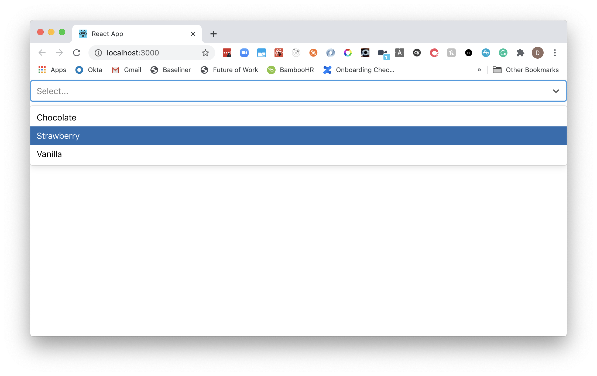

Today we're going to use Tailwind's resolveConfig to write out a JavaScript file that we can use with the [React Context API](https://reactjs.org/docs/context.html) to access the values from anywhere throughout the application.

We will create a small application and show it in action by overriding some styles from the [React Select](https://react-select.com/home) library.

## Setting up

We are going with the basic [Create React App](https://github.com/facebook/create-react-app) template. Let's set that up and install the dependencies for today.

```s
# Create app
npx create-react-app tailwind-theme-example
# Change into folder
cd tailwind-theme-example
# Install dependencies
yarn add tailwindcss \
  react-select \
  prettier
# Create a bin folder for us to write our JS generation script
mkdir bin
touch bin/generate-tailwind-theme
# Add execution permissions
chmod u+x bin/generate-tailwind-theme
```

## Tailwind Configuration

We want to have a `tailwind.config.js` file that can be used to extend the Tailwind defaults. We won't do too much with it today, but let's create it to use without our script later.

```s
# Setup tailwind config file
npx tailwindcss init
```

This will create a `tailwind.config.js` file at the root directory that looks like this:

```js
// tailwind.config.js
module.exports = {
  theme: {},
  variants: {},
  plugins: [],
}
```

Let's now write our script that will reference this file.

## Updating our script

Inside of `bin/generate-tailwind-theme`, update the file to have the following:

```js
#!/usr/bin/env node

const fs = require("fs")
const resolveConfig = require("tailwindcss/resolveConfig")
const prettier = require("prettier")
const path = require("path")
// bring in the Tailwind config
const tailwindConfig = require("../tailwind.config.js")

const { theme } = resolveConfig(tailwindConfig)
const themeStr = JSON.stringify(theme)
const js = `
const theme  = ${themeStr}

export default theme
`

try {
  // write the file to src/theme.js after
  // having prettier format the string for us
  fs.writeFileSync(
    path.resolve(process.cwd(), "./src/theme.js"),
    prettier.format(js, { parser: "babel" }),
    "utf-8"
  )
} catch (err) {
  // uh-oh, something happened here!
  console.log(err.message)
}
```

Here, we follow these steps:

1. Use `resolveConfig` from Tailwind to combine our config and their default config. We are destructing `theme` from the result.
2. Stringify the `theme` value and interpolate it within a string `js`. This string is valid JavaScript.
3. Writing that file out to `src/theme.js` after having our Prettier library format it.

We can now run this using `bin/generate-tailwind-theme`. If this doesn't work, you may need to check you have the correct permissions and shabang (#!) reference to your Node installation. If this doesn't work, feel free to run `node bin/generate-tailwind-theme` and see what happens.

## Theme Output

After success, a short look into our `src/theme.js` file should look like the following:

```js
const theme = {
  screens: { sm: "640px", md: "768px", lg: "1024px", xl: "1280px" },
  colors: {
    transparent: "transparent",
    current: "currentColor",
    black: "#000",
    white: "#fff",
    gray: {
      "100": "#f7fafc",
      "200": "#edf2f7",
      "300": "#e2e8f0",
      "400": "#cbd5e0",
      "500": "#a0aec0",
      "600": "#718096",
      "700": "#4a5568",
      "800": "#2d3748",
      "900": "#1a202c",
    },
    // ... the rest has been omitted for brevity
  },
  // ... the rest has been omitted for brevity
}

export default theme
```

Awesome! Now we have our theme config that we can use with React Context.

## Setting up the Provider for our app

Update the `src/App.jsx` file to look like the following:

```js
import React, { createContext } from "react"
import theme from "./theme"
import { Select } from "./Select"
import "./App.css"

export const ThemeContext = createContext(theme)

function App() {
  const [select, setSelect] = React.useState()

  return (
    <ThemeContext.Provider value={theme}>
      <Select
        id="select"
        name="select"
        options={[
          { value: "chocolate", label: "Chocolate" },
          { value: "strawberry", label: "Strawberry" },
          { value: "vanilla", label: "Vanilla" },
        ]}
        value={select}
        onChange={option => {
          setSelect(option?.value)
        }}
      />
    </ThemeContext.Provider>
  )
}

export default App
```

The `ThemeContext` that we have created using `createContext` will allow the theme to be accessible with the `useContext` hook throughout our application!

At the moment, our App will not run (we haven't created our `Select` file!).

We're going to write an adapter file for our `Select` component.

## Create a Select Adapter

Add a new `Select` component file.

```s
touch src/Select.jsx
```

Now, inside that `src/Select.jsx` file, add the following:

```jsx
import React from "react"
import BaseSelect from "react-select"
import { ThemeContext } from "./App"
export const Select = props => {
  const theme = React.useContext(ThemeContext)

  const customStyles = {
    control: (provided, state) => ({
      ...provided,
      zIndex: theme.zIndex["10"],
      fontFamily: theme.fontFamily.sans.join(","),
      fontSize: theme.fontSize.base,
      borderColor: state.isFocused
        ? theme.colors.blue["500"]
        : theme.colors.gray["300"],
      borderWidth: theme.borderWidth["2"],
      outline: "none",
      boxShadow: "none",
      "&:hover": {
        borderColor: state.isFocused
          ? theme.colors.blue["500"]
          : theme.colors.gray["500"],
      },
    }),
    menu: provided => ({
      ...provided,
      fontFamily: theme.fontFamily.sans.join(","),
      fontSize: theme.fontSize["text-base"],
    }),
    option: (provided, state) => ({
      ...provided,
      backgroundColor: state.isSelected
        ? theme.colors.blue["500"]
        : theme.colors.white,
      "&:hover": {
        ...provided["&:hover"],
        backgroundColor: theme.colors.blue["700"],
        color: theme.colors.white,
      },
    }),
  }

  return <BaseSelect styles={customStyles} {...props} />
}
```

In this file, we are exporting the `BaseSelect` with some default styles that come from our `theme`.

These theme values come from the `theme.js` object that have added to our context! This is possible at the line `const theme = React.useContext(ThemeContext)` where we set the theme to come from our context we set in `App.js`.

Note, the one quick here are the font family values `theme.fontFamily.sans.join(" ")`. Basically, the `fontFamily` key values are an array, so for it to be valid for the `font-family` CSS property, we want to join that array to have a space between each value ie `['Open Sans', 'sans-serif']` as an example would become `Open Sans,sans-serif`.

> This styling isn't perfect. They are just some styles I was playing around with this morning, but they illustrate the point.

## Running the app

Let's get our app up and going the normal way:

```s
yarn start
```

You can now see that we have our Tailwind theme styles applied!



We can now see these changes in action. If we head back to our `src/Select.jsx` file and replace all instances of `theme.colors.blue` with `theme.colors.teal`, you will now see teal!


Congratulations, you now have access to your Tailwind theme values across your React application!

## Resources and Further Reading

1. [Completed Project on GitHub](https://github.com/okeeffed/tailwind-theme-example)
2. [React Select - Custom Styles](https://react-select.com/home#custom-styles)
3. [Tailwind - Referencing in JavaScript](https://tailwindcss.com/docs/configuration/#referencing-in-javascript)
4. [React Context API](https://reactjs.org/docs/context.html)
