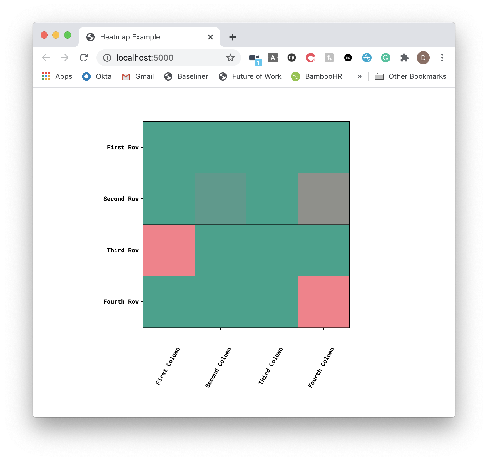

Heat maps are a great way to display correlations between two sets of data or quickly communicating progress on a project (think [node.green](https://node.green/)).

I recently had to draw up some heat maps at work to track progress on some projects I am working on with the power of D3. We are going to implement a short look at generating one with D3.

Note: we are not going to use any frameworks today.


## Prerequisites

We are going to use Vercel's [serve](https://github.com/vercel/serve) package to serve our static files.

Follow the link to read more about it.

```s
# Install serve globally
npm i -g serve
```


## Getting Started

```s
mkdir d3-heatmap
cd d3-heatmap
touch index.html main.css main.js
```


## The styles file

Let's add some CSS to our `main.css` file.

```css
text {
  font-size: 10px;
  font-family: "Roboto Mono", monospace;
  font-weight: 700;
}

line,
path {
  fill: none;
  stroke: #000;
  shape-rendering: crispEdges;
}
```

As this is a trivial example, we are going to target the HTML. Normally, applying a class is a better idea.

This sets the font to be `Roboto Mono` (which we will bring in from the Google Fonts CDN) and sets some CSS property values for the `line` and `path` SVG elements.


## The JavaScript

The JavaScript is the main place where the magic happens.

Let's add the following to `main.js`. I will add comments in the code about what is happening.

```js
// Assign a 2d array of correlating values.
// This each subarray will render as a row
const data = [[1, 1, 1, 1], [1, 0.8, 1, 0.5], [0, 1, 1, 1], [1, 1, 1, 0]]

// Add our labels as an array of strings
const rowLabelsData = ["First Row", "Second Row", "Third Row", "Fourth Row"]
const columnLabelsData = [
  "First Column",
  "Second Column",
  "Third Column",
  "Fourth Column",
]

function Matrix(options) {
  // Set some base properties.
  // Some come from an options object
  // pass when `Matrix` is called.
  const margin = { top: 50, right: 50, bottom: 180, left: 180 },
    width = 350,
    height = 350,
    container = options.container,
    startColor = options.start_color,
    endColor = options.end_color

  // Find our max and min values
  const maxValue = d3.max(data, layer => {
    return d3.max(layer, d => {
      return d
    })
  })
  const minValue = d3.min(data, layer => {
    return d3.min(layer, d => {
      return d
    })
  })

  const numrows = data.length
  // assume all subarrays have same length
  const numcols = data[0].length

  // Create the SVG container
  const svg = d3
    .select(container)
    .append("svg")
    .attr("width", width + margin.left + margin.right)
    .attr("height", height + margin.top + margin.bottom)
    .append("g")
    .attr("transform", "translate(" + margin.left + "," + margin.top + ")")

  // Add a background to the SVG
  const background = svg
    .append("rect")
    .style("stroke", "black")
    .attr("width", width)
    .attr("height", height)

  // Build some scales for us to use
  const x = d3.scale
    .ordinal()
    .domain(d3.range(numcols))
    .rangeBands([0, width])

  const y = d3.scale
    .ordinal()
    .domain(d3.range(numrows))
    .rangeBands([0, height])

  // This scale in particular will
  // scale our colors from the start
  // color to the end color.
  const colorMap = d3.scale
    .linear()
    .domain([minValue, maxValue])
    .range([startColor, endColor])

  // Generate rows and columns and add
  // color fills.
  const row = svg
    .selectAll(".row")
    .data(data)
    .enter()
    .append("g")
    .attr("class", "row")
    .attr("transform", (d, i) => {
      return "translate(0," + y(i) + ")"
    })

  const cell = row
    .selectAll(".cell")
    .data(d => {
      return d
    })
    .enter()
    .append("g")
    .attr("class", "cell")
    .attr("transform", (d, i) => {
      return "translate(" + x(i) + ", 0)"
    })

  cell
    .append("rect")
    .attr("width", x.rangeBand() - 0.3)
    .attr("height", y.rangeBand() - 0.3)

  row
    .selectAll(".cell")
    .data((d, i) => {
      return data[i]
    })
    .style("fill", colorMap)

  const labels = svg.append("g").attr("class", "labels")

  const columnLabels = labels
    .selectAll(".column-label")
    .data(columnLabelsData)
    .enter()
    .append("g")
    .attr("class", "column-label")
    .attr("transform", (d, i) => {
      return "translate(" + x(i) + "," + height + ")"
    })

  columnLabels
    .append("line")
    .style("stroke", "black")
    .style("stroke-width", "1px")
    .attr("x1", x.rangeBand() / 2)
    .attr("x2", x.rangeBand() / 2)
    .attr("y1", 0)
    .attr("y2", 5)

  columnLabels
    .append("text")
    .attr("x", 0)
    .attr("y", y.rangeBand() / 2 + 20)
    .attr("dy", ".82em")
    .attr("text-anchor", "end")
    .attr("transform", "rotate(-60)")
    .text((d, i) => {
      return d
    })

  const rowLabels = labels
    .selectAll(".row-label")
    .data(rowLabelsData)
    .enter()
    .append("g")
    .attr("class", "row-label")
    .attr("transform", (d, i) => {
      return "translate(" + 0 + "," + y(i) + ")"
    })

  rowLabels
    .append("line")
    .style("stroke", "black")
    .style("stroke-width", "1px")
    .attr("x1", 0)
    .attr("x2", -5)
    .attr("y1", y.rangeBand() / 2)
    .attr("y2", y.rangeBand() / 2)

  rowLabels
    .append("text")
    .attr("x", -8)
    .attr("y", y.rangeBand() / 2)
    .attr("dy", ".32em")
    .attr("text-anchor", "end")
    .text((d, i) => {
      return d
    })
}
```


## The HTML file

Inside of `index.html`, add the following.

```html
<!DOCTYPE html>
<html lang="en">
  <head>
    <meta charset="UTF-8" />
    <meta name="viewport" content="width=device-width, initial-scale=1.0" />
    <title>Heatmap Example</title>
    <link rel="stylesheet" type="text/css" href="main.css" />
    <link
      href="https://fonts.googleapis.com/css2?family=Roboto+Mono:wght@700&display=swap"
      rel="stylesheet"
    />
    <script
      type="text/javascript"
      src="https://cdnjs.cloudflare.com/ajax/libs/d3/3.5.17/d3.min.js"
    ></script>
  </head>
  <body>
    <div style="display:inline-block; float:left" id="container"></div>
    <script src="main.js"></script>
    <script>
      Matrix({
        container: "#container",
        start_color: "#FC7C89",
        end_color: "#21A38B",
      })
    </script>
  </body>
</html>
```

In this file, we are bringing in D3 + a Roboto Mono theme in from CDNs, plus loading out `main.css` and `main.js` files.

Finally, we call `Matrix` with the options object that we wrote in the JS file.


## Running

Within our work directory, run `serve .` - this will serve the files on port 5000.

> Alternatively, you could just run `open index.html` to open the file in the default browser. I only added `serve` to this tutorial as I use it all the time to serve more complex builds.

If we open up `http://localhost:5000` we will see our heat map.




## Resources and Further reading

1. [Google Fonts](https://fonts.google.com/specimen/Roboto+Mono?category=Monospace&sidebar.open=true&selection.family=Roboto+Mono:wght@700)
2. [Serve](https://github.com/vercel/serve)
3. [Node Green](https://node.green/)
4. [D3 Heatmap](https://www.d3-graph-gallery.com/heatmap)

_Image credit: [Anqi Lu](https://unsplash.com/@alu213000)_
