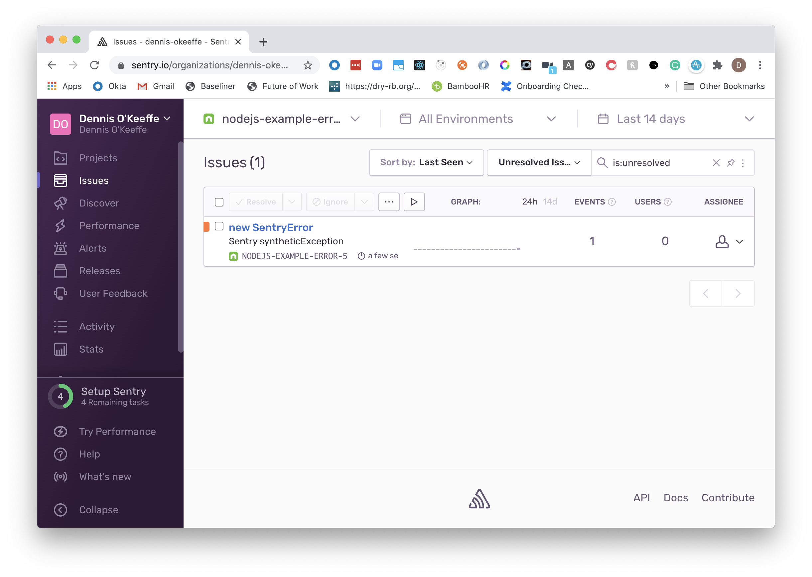
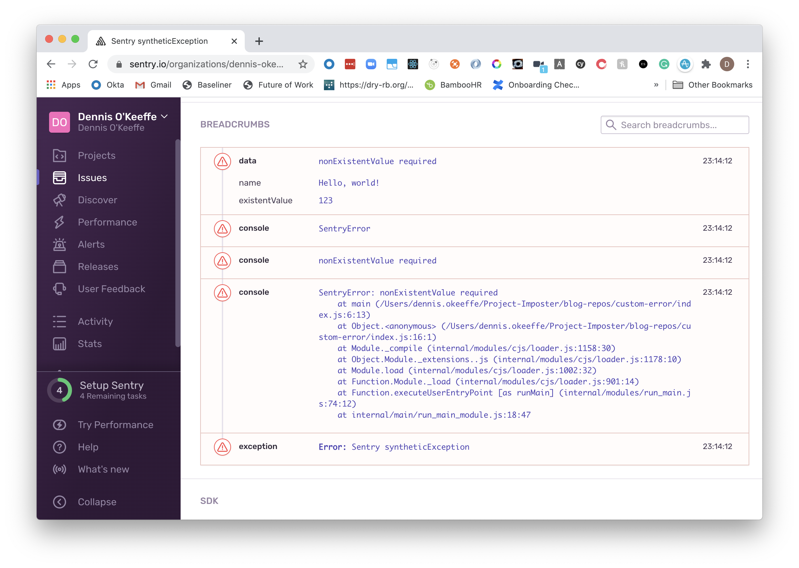
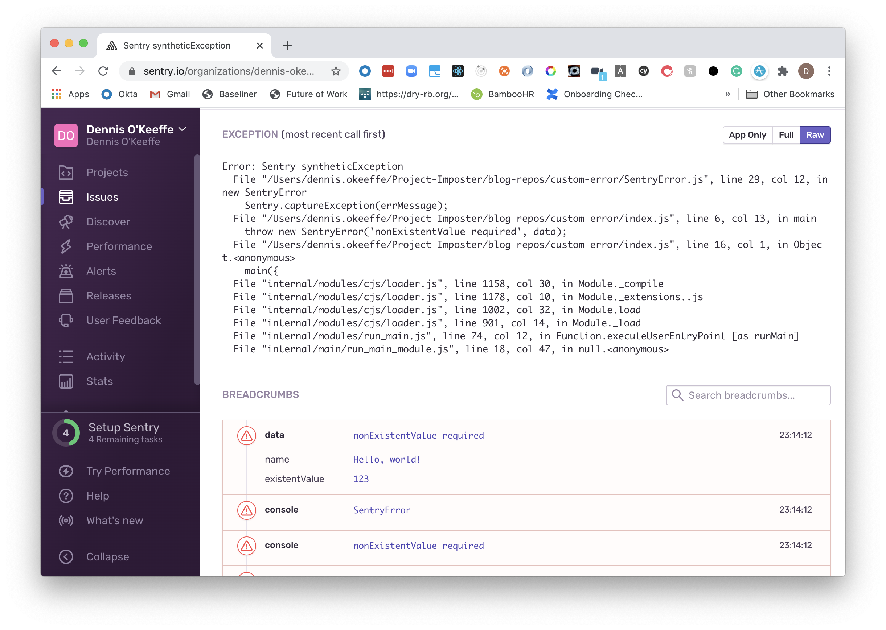
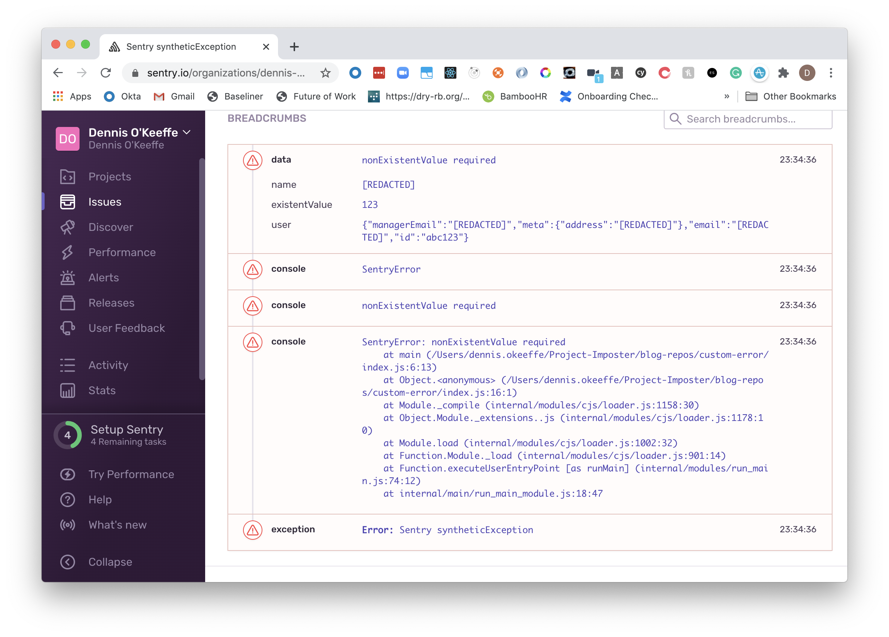

In today's tutorial, we're going to focus on a real-world application of extending the `Error` prototype with ES6 classes and how we can use this for effective error tracing.

> No time? Check the [completed example](https://github.com/okeeffed/custom-sentry-error).

This tutorial expects that you have a [Sentry](https://sentry.io/) account set up and are somewhat self-sufficient in getting your project up and going.

It also expects you are running a version of Node that supports ES6 classes. I am running `12.16.1` in this project.


## Getting started

Let's set up a new Nodejs project and install some deps.

```s
mkdir custom-error
cd custom-error
yarn init -y
yarn add dotenv @sentry/node
touch index.js SentryError.js .gitignore
```

We are going to use [dotenv](https://github.com/motdotla/dotenv) to hide away our Sentry endpoint.

## .gitignore

Throw in the files we don't wish to store in Git.

```s
.env
node_modules/
```


## Setting up Sentry

While this won't go into details, we want to set up a new Nodejs project in our Sentry account.


Once it is set up, it will give you a `dsn` URL that we are going to add to our `.env` file:

```s
SENTRY_ENDPOINT=<replace-with-your-url-here>
```

We are now ready to set up our custom error!


## SentryError.js

Add the following to `Sentry.js`:

```js
require("dotenv").config()
const Sentry = require("@sentry/node")

// initialises Sentry
Sentry.init({
  dsn: process.env.SENTRY_ENDPOINT,
})

class SentryError extends Error {
  constructor(errMessage, data, type = "error") {
    // Passes errMessage to the Error super class,
    // similar to call new Error(errMessage).
    super(errMessage)

    // Maintains proper stack trace for where our error was thrown (only available on V8)
    if (Error.captureStackTrace) {
      Error.captureStackTrace(this, SentryError)
    }

    this.name = "SentryError"

    Sentry.addBreadcrumb({
      category: "data",
      message: errMessage,
      data: data,
      type: type,
      level: Sentry.Severity.Debug,
    })

    Sentry.captureException(errMessage)
  }
}

module.exports = { SentryError }
```

In the code, we are doing to following:

1. Requiring `dotenv` to read in our `.env` file to `process.env`.
2. Initialising Sentry.
3. Create a class that "extends" error. In layperson JavaScript terms, "extends" with mean that our new `SentryError` extends from the `Error` prototype. We can use the constructor to initialise all the properties we are inheriting from Error.
4. Initialising a new instance with a `constructor`.

The `constructor` itself is a method called whenever we call `new SentryError()` for a new `SentryError` instance.

We are telling it we take an error message (similar to `new Error('error message')`), data (which we will use to set breadcrumbs to help us debug) and an breadcrumb type that we use within the constructor (which defaults to `error`).

The first thing we do in the constructor is call `super(errMessage)`, which is us calling up the chain to the Error prototype. This will set properties on this object that we expect to get from `Error` like `name`, `message` and `stack` (which we will see later).

Afterwards, we are essentially setting a breadcrumb and telling Sentry to capture an exception. You can read more about these on the [Sentry docs](https://docs.sentry.io/error-reporting/capturing/) but the tl;dr is that these calls will populate our telemetry data on Sentry.

With this alone, we are ready to roll!


## Testing out our new error

In `index.js`, add the following:

```js
const { SentryError } = require("./SentryError")

const main = data => {
  try {
    if (!data.nonExistentValue) {
      throw new SentryError("nonExistentValue required", data)
    }
  } catch (err) {
    console.error(err.name)
    console.error(err.message)
    console.error(err.stack)
  }
}

// no data passed
main({
  existentValue: 123,
  name: "Hello, world!",
})
```

Here, we are simply doing to following:

1. Requiring our new error.
2. We have a `main` function that simply throws our new `SentryError` if `data.nonExistentValue` does not exist (which it won't).
3. Finally we are call `main` with an object of information that will be assigned to `data`.

Running the following will give us this:

```s
> node index.js
SentryError
nonExistentValue required
SentryError: nonExistentValue required
    at main (/Users/dennis.okeeffe/Project-Imposter/blog-repos/custom-error/index.js:6:13)
    at Object.<anonymous> (/Users/dennis.okeeffe/Project-Imposter/blog-repos/custom-error/index.js:16:1)
    at Module._compile (internal/modules/cjs/loader.js:1158:30)
    at Object.Module._extensions..js (internal/modules/cjs/loader.js:1178:10)
    at Module.load (internal/modules/cjs/loader.js:1002:32)
    at Function.Module._load (internal/modules/cjs/loader.js:901:14)
    at Function.executeUserEntryPoint [as runMain] (internal/modules/run_main.js:74:12)
    at internal/main/run_main_module.js:18:47
```

From the `catch` block, you can see our new error has access to `name`, `message` and `stack` properties, which we mentioned will be the case from above thanks to use call `super(errMessage)` in our class to inherit the properties of the `Error` prototype.

If we head to Sentry, we can see our error has been logged!



If we look at the basic settings, we can see that our **breadcrumb** was logged under `data`, the console logs are also tracked (this is configurable).



Those logs came from our `catch` block. If we change from "App only" to "Raw" you can see our stack trace also shows up in the **exception**:




## Handling sensitive information

As a company, we do not want Personally Identifiable Data from our customers being shared with the third-party.

These tools for us are a way to help debug and trace back through a user journey to improve our product, and they trust us not to share this information.

There are a few ways that we can go about protecting ourselves, but one example I will give today is how we can implement our own "deny" or "block" list.

Let's make some small updates to our `SentryError.js` and `index.js` files.

For `index.js`, let's update the info passed into `main` to include some dummy user data (and my public email):

```js
const { SentryError } = require("./SentryError")

const main = data => {
  try {
    if (!data.nonExistentValue) {
      throw new SentryError("nonExistentValue required", data)
    }
  } catch (err) {
    console.error(err.name)
    console.error(err.message)
    console.error(err.stack)
  }
}

// no data passed
main({
  existentValue: 123,
  name: "Hello, world!",
  user: {
    email: "hello@dennisokeeffe.com",
    managerEmail: "hello@sensitiveinfo.com",
    id: "abc123",
    meta: {
      address: "123 Fake St",
    },
  },
})
```

Let's say that we do not wish to share the name, user email, user's manager email or their address, but we DO want to keep the ID for debugging issues. We can add a helper method to our class and set up a `denyList` that we can use in this method to recursively alter our breadcrumb data.

> Why keep `denyList` outside or the class? There is no particular reason, but I find it makes it easier to write unit regex tests if this is abstracted and it can be used for other 3rd-party block lists you may want to set up. `redactSensitiveInformation` could also have been pulled out of the class for the same reason if it was re-useable elsewhere.

Update `SentryError.js`:

```js
require("dotenv").config()
const Sentry = require("@sentry/node")

Sentry.init({
  dsn: process.env.SENTRY_ENDPOINT,
})

// create a simple deny list
const denyList = [/email/gi, /name/gi, /address/gi]

class SentryError extends Error {
  constructor(errMessage, data, type = "error") {
    // Passes errMessage to the Error super class,
    // similar to call new Error(errMessage).
    super(errMessage)

    // Maintains proper stack trace for where our error was thrown (only available on V8)
    if (Error.captureStackTrace) {
      Error.captureStackTrace(this, SentryError)
    }

    this.name = "SentryError"

    Sentry.addBreadcrumb({
      category: "data",
      message: errMessage,
      // update our data
      data: this.redactSensitiveInformation(data),
      type: type,
      level: Sentry.Severity.Debug,
    })

    Sentry.captureException(errMessage)
  }

  // add in this new method
  redactSensitiveInformation(data) {
    const keys = Object.keys(data)
    const safeData = {}

    for (const key of keys) {
      if (!Array.isArray(data[key]) && typeof data[key] === "object") {
        // recursively check deep nested children
        safeData[key] = this.redactSensitiveInformation(data[key])
      } else if (denyList.some(regex => regex.test(key))) {
        // redacted the data
        safeData[key] = "[REDACTED]"
      } else {
        // assign data to object to send to Sentry
        safeData[key] = data[key]
      }
    }
    return safeData
  }
}

module.exports = { SentryError }
```

`redactSensitiveInformation` uses the power of recursion. We basically want it to recursively check through an object to redact information that match a regex.

This means that the following:

```js
{
  existentValue: 123,
  name: "Hello, world!",
  user: {
    email: "hello@dennisokeeffe.com",
    managerEmail: "hello@sensitiveinfo.com",
    id: "abc123",
    meta: {
      address: "123 Fake St",
    },
  },
}
```

...will become redacted to the following with our current deny list:

```js
{
  existentValue: 123,
  name: "[REDACTED]",
  user: {
    email: "[REDACTED]",
    managerEmail: "[REDACTED]",
    id: "abc123",
    meta: {
      address: "[REDACTED]",
    },
  },
}
```

`denyList.some` iterates through our Regex array and if any regex matches, it will return "true" - this helps us identify from our list which data to redact.

Let's run `node index.js` again and confirm this in Sentry.



Victory!


## Conclusion

Today, we used ES6 classes to extend error. If anyone wants the "Why would you do that vs just extending the prototype?", my answer is that it is mainly preference.

I find classes in this case to be more readable and a better developer experience, but note that there is a cost if doing this in the web for transpiling back to ES5.

Today, we went with the idea of a "block" list. If you want a stronger alternative, go with the idea of an "allow" list where a property **must be allowed** before it will show up on Sentry.


## Resources and Further Reading

1. [Completed example](https://github.com/okeeffed/custom-sentry-error)
2. [Sentry](https://sentry.io/)
3. [Sentry - Capturing Events](https://docs.sentry.io/error-reporting/capturing/)
4. [Sentry - Breadcrumbs](https://docs.sentry.io/enriching-error-data/breadcrumbs/)
5. [Super and Extends in JavaScript - Medium](https://medium.com/beginners-guide-to-mobile-web-development/super-and-extends-in-javascript-es6-understanding-the-tough-parts-6120372d3420)

_Image credit: [Ali Saadat](https://unsplash.com/@camsaadat)_