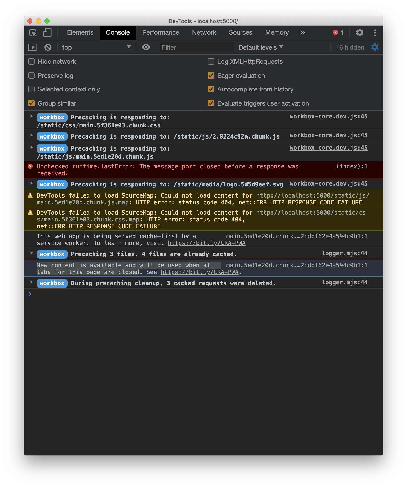
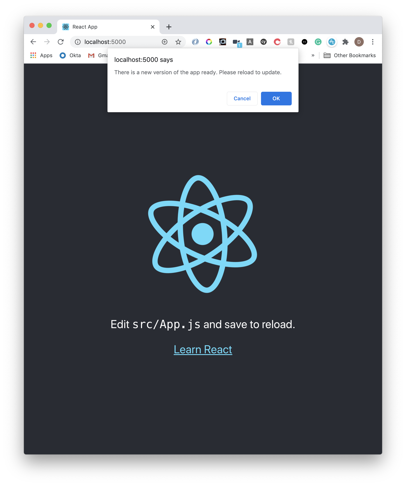
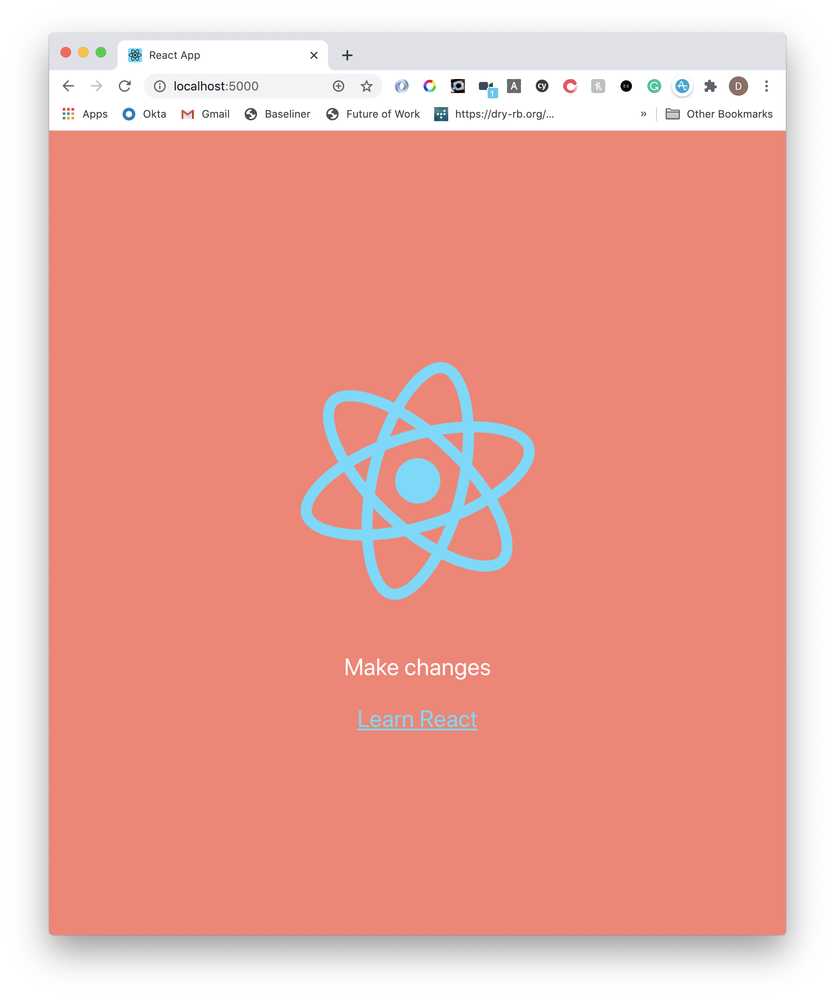

Service workers can a powerful utility to increasing performance in your app. They provide some powerful caching mechanisms and modern capabilities, however, they are generally misunderstood in web development.

A common misconception is that when new content is available, it will only be loaded once all tabs for your progressive web app are closed.

While this can be the default behaviour, you can speed this process up by skipping the wait and prompting the user to update.

In this short tutorial, we will do just that to a Create React App setup.

## Creating the React App

We will used `npx create-react-app` and install Vercel's `serve` globally to serve our build.

```s
npx create-react-app hello-cra-push-notifications
cd hello-sw-push-notifications
# We'll use this to serve our app
npm i -g serve
```

Before building, let's update `index.js`:

```js
import React from "react"
import ReactDOM from "react-dom"
import "./index.css"
import App from "./App"
import * as serviceWorker from "./serviceWorker"

ReactDOM.render(
  <React.StrictMode>
    <App />
  </React.StrictMode>,
  document.getElementById("root")
)

// Changes made here
serviceWorker.register({
  onUpdate: registration => {
    const waitingServiceWorker = registration.waiting

    if (waitingServiceWorker) {
      waitingServiceWorker.addEventListener("statechange", event => {
        if (event.target.state === "activated") {
          if (
            window.confirm(
              "There is a new version of the app ready. Please reload to update."
            )
          ) {
            window.location.reload()
          }
        }
      })
      waitingServiceWorker.postMessage({ type: "SKIP_WAITING" })
    }
  },
})
```

Here we are adding out magic code for the `onUpdate` handler that CRA provides for us out-of-the-box.

In this code, we will check if there is a service worker waiting from file changes. If so, we simply add an event for a state change and post a message to `SKIP_WAITING`.

Now, the next time we reload the app, we will be prompted with a confirm dialog to reload the page with our latest updates!

There is still the option for the user to deny the change if they wish.

## Build and serve

Let's get our build up and going:

```s
yarn build
serve build
```

Now at port 5000 (or whatever you have), you will see the usual CRA basic that has been built.

Let's make some changes and see our prompt in action!

## Make changes to your React App

Update the app to have whatever you want. This can include changes to the styles, etc. (I have done this in my example image below).

```js
import React from "react"
import logo from "./logo.svg"
import "./App.css"

function App() {
  return (
    <div className="App">
      <header className="App-header">
        
        <p>Make changes</p>
        <a
          className="App-link"
          href="https://reactjs.org"
          target="_blank"
          rel="noopener noreferrer"
        >
          Learn React
        </a>
      </header>
    </div>
  )
}

export default App
```

Once you are happy, simply run `yarn build`.

> Do this in another tab while the server is running. There is no real reason here other than to prevent yourself from second guessing why the changes are happening.

If you reload the React App on port 5000, after a few moments you'll see the following show up in the console:

> _New content is available and will be used when all tabs for this page are closed._



In fact, that log is the precursor right before our custom `onUpdate` hook comes into play. At the same time you will have that window dialog show up on the screen:



If we accept (and you can cancel if you want), you will see our updated app!



Victory!

Of course, you don't have to use the window dialog. Once that notification comes through, you can do whatever your heart desires to let the user know that they can update their app on reload. In fact, you could be rude and just reload the page on them (although I wouldn't!).

As a final note, this is supported in most major browsers but with the caveat that Safari iOS [does not support this](https://developer.mozilla.org/en-US/docs/Web/API/ServiceWorkerRegistration/waiting). The trade-off is your to make!

## Resources and further reading

1. [Window Dialog](https://developer.mozilla.org/en-US/docs/Web/API/Window/confirm)
2. [Service Worker API](https://developer.mozilla.org/en-US/docs/Web/API/Service_Worker_API)
3. [Service Worker Post Message](https://googlechrome.github.io/samples/service-worker/post-message/)
4. [Service Worker Waiting Compatibility](https://developer.mozilla.org/en-US/docs/Web/API/ServiceWorkerRegistration/waiting)

_Image credit: [Clément H](https://unsplash.com/@clemhlrdt)_
