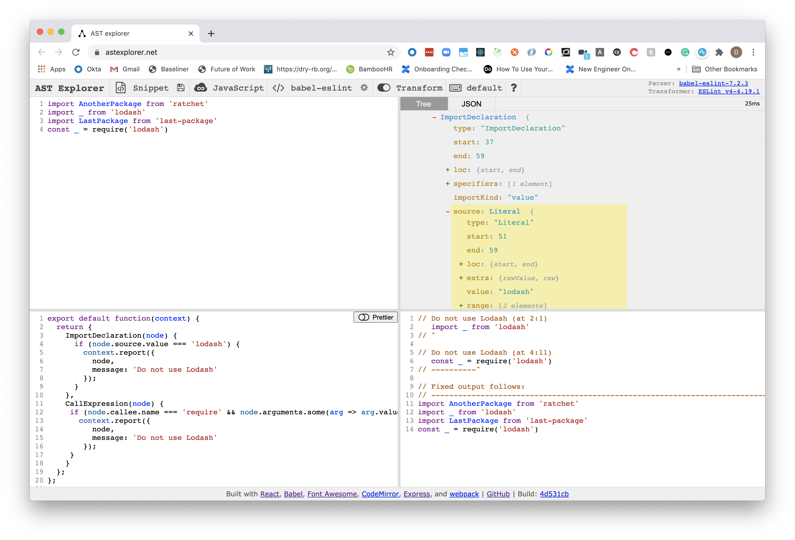

Following along with some "Hello, World!" examples for ESLint has been surprisingly more difficult than I would like to admit. Whether it is the nature of the Abstract Syntax Tree (AST traversal), or setting up the actual rule in a project from start-to-finish, the "Hello, World!" of the ESLint world has not been the most pleasant experience for me.

That being said, light bulbs look to go off on how it works once all of it comes together and the documentation has a moment of clarity for me during this. This project is going to run a small example to demonstrate the clarity I came in hope that following along with it with do the same for you.

You do not need to know React to follow along. I've chosen to use Create React App to demonstrate a working example of getting your first rule up and going. Let's begin!

## Setup

We are going to create a CRA app and another folder to host our ESLint rules that we will install.

```s
mkdir eslint-rules-example
cd eslint-rules-example
# Create a react app called "demo-app"
npx create-react-app demo-app
# Create a folder for our ESLint rules
mkdir rules
```

Now that we have our two sub-directories set up (one to house the React app, the other for the rules), let's take a quick jump over the [AST Explorer](https://astexplorer.net/) website in order to quickly put together our rule.

## AST Explorer

I've gone into ASTs before, so I won't cover that topic again, but the long and short of the AST Explorer website is that it will parse code and turn it into an AST based the parser that you choose.

It also has the option to run a transformation. This is amazing for testing codemods or, more appropriately today, ESLint rules.

From the toolbar in the AST Explorer, choose JavaScript, then `babel-eslint` as the parser, turn on `Transform` and select `ESLint` from the dropdown as the transformer.

In the top-left box, add the following code:

```js
import AnotherPackage from "ratchet"
import _ from "lodash"
import LastPackage from "last-package"
const _ = require("lodash")
```

You will see on the top-right that a tree will be generated. What is even cooler - if you click on a particular word or part of the code, it will highlight the current selection.

We are going to make a rule that does not allow you to use the Lodash package. I have opted to go with this rule as it seems like it will be an easy way to illustrate a rule that everyone can understand.

There are two ways to require the package that we will cover: importing and requiring the lodash package.

```js
// imports
import _ from "lodash"
// requires
const _ = require("lodash")
```

We won't go in-depth for locking every lodash module - just the main package.

If you click on the `import` part of `import _ from 'lodash'`, you will see it highlights the `ImportDeclaration` block. We can use this knowledge to write our rule.

On the bottom-left box, add the following code:

```js
export default function(context) {
  return {
    ImportDeclaration(node) {
      if (node.source.value === "lodash") {
        context.report({
          node,
          message: "Do not use Lodash",
          fix: function(fixer) {
            return fixer.replaceText(node, "")
          },
        })
      }
    },
  }
}
```

What we are saying here is to accept a `context` param from whatever calls this function, then return an object that follows the visitor pattern. Again, I won't bamboozle you with terms, but essentially this object takes functions that align to the name of the AST node, and once it comes across this node, it will run a function that we can use to apply our rules.

As you saw, the `ImportDeclaration` node type from the top-right box is the name of the function from the object we are returning on the bottom-left. In this function, we are telling it to take the node, find the `source.value` from it (which you can also read through on the top-right explorer box) and basically "fix" it by replacing it with nothing.

Currently on the bottom right, you should get this back:

```js
// Lint rule not fired.

// Fixed output follows:
// --------------------------------------------------------------------------------
import AnotherPackage from "ratchet"

import LastPackage from "last-package"
const _ = require("lodash")
```

Our `fix` function is only applying to the `import` right now. If we remove the `fix` function altogether, the bottom-right will show the following:

```js
// Do not use Lodash (at 2:1)
import _ from "lodash"
// ^

// Fixed output follows:
// --------------------------------------------------------------------------------
import AnotherPackage from "ratchet"
import _ from "lodash"
import LastPackage from "last-package"
const _ = require("lodash")
```

Awesome! We can clarify it is working. I am not going to go too deep into replace the `CallExpression`, but I've taken a different approach here to replace the matching node's grandparent and that code is as follows:

```js
export default function(context) {
  return {
    ImportDeclaration(node) {
      if (node.source.value === "lodash") {
        context.report({
          node,
          message: "Do not use Lodash",
        })
      }
    },
    CallExpression(node) {
      if (
        node.callee.name === "require" &&
        node.arguments.some(arg => arg.value === "lodash")
      ) {
        context.report({
          node,
          message: "Do not use Lodash",
          fix: function(fixer) {
            // node.parent.parent to replace the entire line
            return fixer.replaceText(node.parent.parent, "")
          },
        })
      }
    },
  }
}
```

As an example: here is my screen after adding all of the above:



Now that we have code to replace both the `import` and `require` statement, let's head back to our code and see it in action!

## Adding the rule

Back in our `rules` folder, let's run the following:

```s
mkdir eslint-plugin-no-lodash
cd eslint-plugin-no-lodash
# Initialise a NPM project
yarn init -y
mkdir lib lib/rules
touch lib/rules/no-lodash.js index.js
```

Right now we are just adding some files to follow conventions.

Inside of `lib/rules/no-lodash.js`, we can alter the code we had in AST explorer to be the following:

```js
/**
 * @fileoverview Rule to disallow Lodash
 * @author Dennis O'Keeffe
 */

"use strict"

//------------------------------------------------------------------------------
// Rule Definition
//------------------------------------------------------------------------------

module.exports = {
  meta: {
    type: "suggestion",

    docs: {
      description: "disallow Lodash",
      category: "Possible Errors",
      recommended: true,
    },
    fixable: "code",
    schema: [], // no options
  },
  create: function(context) {
    return {
      ImportDeclaration(node) {
        if (node.source.value === "lodash") {
          context.report({
            node,
            message: "Do not use Lodash",
            fix: function(fixer) {
              return fixer.replaceText(node, "")
            },
          })
        }
      },
      CallExpression(node) {
        if (
          node.callee.name === "require" &&
          node.arguments.some(arg => arg.value === "lodash")
        ) {
          context.report({
            node,
            message: "Do not use Lodash",
            fix: function(fixer) {
              // node.parent.parent to replace the entire line
              return fixer.replaceText(node.parent.parent, "")
            },
          })
        }
      },
    }
  },
}
```

The `function` we had before now goes under the exported `create` property. There is also a `meta` property that I won't go into, but as you can see it provides meta data if you wish.

Back in `index.js` we can now add the following:

```js
const noLodash = require("./lib/rules/no-lodash")

module.exports = {
  rules: {
    "no-lodash": noLodash,
  },
}
```

Here we are following more conventions, but the exported object from our `index.js` file is that we can add our rules under the `rules` property.

As a last part, ensure that you're `package.json` file has the following:

```json
{
  "name": "eslint-plugin-no-lodash",
  "version": "1.0.0",
  "main": "index.js",
  "license": "MIT"
}
```

We are now ready to apply this in our React App!

## Setting up the new rule in our React App

Let's change into our `demo-app` folder and install our package:

```s
yarn add ../rules/eslint-plugin-no-lodash
```

This will install our new rule locally.

Update `App.js` to simply add `import _ from 'lodash'`.

```js
import React from "react"
// Add this line here
import _ from "lodash"
import logo from "./logo.svg"
import "./App.css"

function App() {
  const arr = [1, 2]
  _.map(arr, () => true)
  return (
    <div className="App">
      <header className="App-header">
        
        <p>
          Edit <code>src/App.js</code> and save to reload.
        </p>
        <a
          className="App-link"
          href="https://reactjs.org"
          target="_blank"
          rel="noopener noreferrer"
        >
          Learn React
        </a>
      </header>
    </div>
  )
}

export default App
```

> Note: there is no need to install Lodash first. We are simply testing the rule.

To finalise our setup, we need to make some changes to React app's `package.json` so that the `eslintConfig` key has the following:

```json
{
  "eslintConfig": {
    "extends": "react-app",
    "rules": {
      "no-lodash/no-lodash": "warn"
    },
    "plugins": ["no-lodash"]
  }
}
```

We add the `no-lodash` from the `eslint-plugin-no-lodash` name and then we import the rule `no-lodash` that we stated in the `rules/eslint-plugin-no-lodash/index.js` file.

Once that is done, we can now start our app! From the Create React App docs on [extending ESLint Config](https://create-react-app.dev/docs/setting-up-your-editor/#experimental-extending-the-eslint-config), it states that we need the environment variable `EXTEND_ESLINT` to be true, so we can start our app like so:

```s
# Run this from the demo-app folder
EXTEND_ESLINT=true yarn start
```

Once the app starts up, you will see that our rule has successfully been added!


## Conclusion

It has been a little bit of a whirlwind to getting this ESLint rule in, but hopefully it can take you from A to Z in a working fashion.

Have a play around afterwards to get a feel, but use tools like AST Explorer to your benefit and, if you are like me, returning to the ESLint docs after getting the working example in will lighten up how it all works and how to apply it all.

## Resources and Further Reading

1. [Completed GitHub project](https://github.com/okeeffed/eslint-rules-example)
2. [AST Explorer](https://astexplorer.net/)
3. [ESLint Docs](https://eslint.org/docs/developer-guide/working-with-rules)
4. [Extending ESLint Config](https://create-react-app.dev/docs/setting-up-your-editor/#experimental-extending-the-eslint-config)
5. [Advanced Config](https://create-react-app.dev/docs/advanced-configuration/)

_Image credit: [Blake Connally](https://unsplash.com/@blakeconnally)_