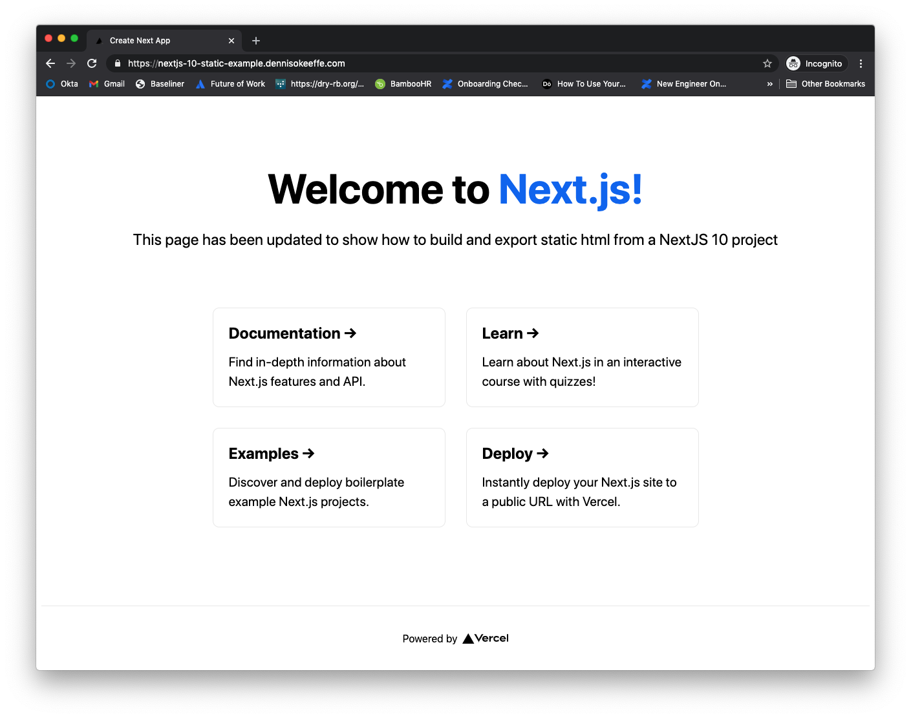

In today's post, we're going to walk through a step-by-step deployment of a static website to an S3 bucket that has CloudFront setup as the global CDN.

The post is written using the AWS TypeScript CDK.

> This example is used as a deployment for a static export of a NextJS 10 website. Find the blog post on how to do that [here](https://blog.dennisokeeffe.com/blog/2020-11-04-exporting-static-nextjs-10-websites/). That being said, this post is aimed at pushing any HTML to S3 to use a static website. I simply use the NextJS content to demo the final product and changes in steps required to get it done.

## Getting Started

We need to set up a new npm project and install the prerequisites. We'll also create a `stacks` directory to house our S3 stack and update it to take some custom.

```s
# Create a root directory
mkdir infra
cd infra
# init npm project with default values
npm init -y
# Install required libraries
npm i @aws-cdk/aws-cloudfront @aws-cdk/aws-route53 @aws-cdk/aws-s3 @aws-cdk/aws-s3-deployment @aws-cdk/aws-certificatemanager @aws-cdk/core @aws-cdk/aws-route53-targets
# Dev installation reqs
npm i --save-dev typescript @types/node
# Make a stacks directory to house stacks
mkdir -p stacks stacks/s3-static-site-with-cloudfront
# Create main infra entry file
touch index.ts
# Create stack file
touch stacks/s3-static-site-with-cloudfront/index.ts
touch tsconfig.json cdk.json cdk.context.json
```

## Updating cdk.json

Add the following the the `cdk.json` file:

```json
{
  "app": "node index"
}
```

## Setting up context

Add the following the the `cdk.json` file:

```json
{
  "account": "<your-account-number>",
  "region": "us-east-1"
}
```

A guide to getting your account ID can be found on the [AWS website](https://docs.aws.amazon.com/IAM/latest/UserGuide/console_account-alias.html), but if you are familiar with the AWS CLI then you can use the following.

```s
aws sts get-caller-identity
```

Ensure that you set the `account` to be a string with the number returned.

For more information on context, see the [AWS docs](https://docs.aws.amazon.com/cdk/latest/guide/context.html).

## Updating the TypeScript Configuration File

In `tsconfig.json`, add the following:

```json
{
  "compilerOptions": {
    "target": "ES2018",
    "module": "commonjs",
    "lib": ["es2016", "es2017.object", "es2017.string"],
    "strict": true,
    "noImplicitAny": true,
    "strictNullChecks": true,
    "noImplicitThis": true,
    "alwaysStrict": true,
    "noUnusedLocals": true,
    "noUnusedParameters": true,
    "noImplicitReturns": true,
    "noFallthroughCasesInSwitch": false,
    "inlineSourceMap": true,
    "inlineSources": true,
    "experimentalDecorators": true,
    "strictPropertyInitialization": false,
    // only required if using Node fns (which I do later on)
    "types": ["node"]
  }
}
```

This is a basic TypeScript configuration for the CDK to compile the TypeScript configuration to JavaScript.

## Handling the static site stack

Open up `stacks/s3-static-site-with-cloudfront/index.ts` and add the following:

```ts
import cloudfront = require("@aws-cdk/aws-cloudfront")
import route53 = require("@aws-cdk/aws-route53")
import s3 = require("@aws-cdk/aws-s3")
import s3deploy = require("@aws-cdk/aws-s3-deployment")
import acm = require("@aws-cdk/aws-certificatemanager")
import cdk = require("@aws-cdk/core")
import targets = require("@aws-cdk/aws-route53-targets/lib")
import { Stack, App, StackProps } from "@aws-cdk/core"
import path = require("path")

export interface StaticSiteProps extends StackProps {
  domainName: string
  siteSubDomain: string
}

/**
 * Static site infrastructure, which deploys site content to an S3 bucket.
 *
 * The site redirects from HTTP to HTTPS, using a CloudFront distribution,
 * Route53 alias record, and ACM certificate.
 */
export class StaticSiteStack extends Stack {
  constructor(parent: App, name: string, props: StaticSiteProps) {
    super(parent, name, props)

    const zone = route53.HostedZone.fromLookup(this, "Zone", {
      domainName: props.domainName,
    })
    const siteDomain = props.siteSubDomain + "." + props.domainName
    new cdk.CfnOutput(this, "Site", { value: "https://" + siteDomain })

    // Content bucket
    const siteBucket = new s3.Bucket(this, "SiteBucket", {
      bucketName: siteDomain,
      websiteIndexDocument: "index.html",
      websiteErrorDocument: "error.html",
      publicReadAccess: true,

      // The default removal policy is RETAIN, which means that cdk destroy will not attempt to delete
      // the new bucket, and it will remain in your account until manually deleted. By setting the policy to
      // DESTROY, cdk destroy will attempt to delete the bucket, but will error if the bucket is not empty.
      removalPolicy: cdk.RemovalPolicy.DESTROY, // NOT recommended for production code
    })
    new cdk.CfnOutput(this, "Bucket", { value: siteBucket.bucketName })

    // TLS certificate
    const certificateArn = new acm.DnsValidatedCertificate(
      this,
      "SiteCertificate",
      {
        domainName: siteDomain,
        hostedZone: zone,
        region: "us-east-1", // Cloudfront only checks this region for certificates.
      }
    ).certificateArn
    new cdk.CfnOutput(this, "Certificate", { value: certificateArn })

    // CloudFront distribution that provides HTTPS
    const distribution = new cloudfront.CloudFrontWebDistribution(
      this,
      "SiteDistribution",
      {
        aliasConfiguration: {
          acmCertRef: certificateArn,
          names: [siteDomain],
          sslMethod: cloudfront.SSLMethod.SNI,
          securityPolicy: cloudfront.SecurityPolicyProtocol.TLS_V1_1_2016,
        },
        originConfigs: [
          {
            customOriginSource: {
              domainName: siteBucket.bucketWebsiteDomainName,
              originProtocolPolicy: cloudfront.OriginProtocolPolicy.HTTP_ONLY,
            },
            behaviors: [{ isDefaultBehavior: true }],
          },
        ],
      }
    )
    new cdk.CfnOutput(this, "DistributionId", {
      value: distribution.distributionId,
    })

    // Route53 alias record for the CloudFront distribution
    new route53.ARecord(this, "SiteAliasRecord", {
      recordName: siteDomain,
      target: route53.RecordTarget.fromAlias(
        new targets.CloudFrontTarget(distribution)
      ),
      zone,
    })

    // Deploy site contents to S3 bucket
    new s3deploy.BucketDeployment(this, "DeployWithInvalidation", {
      sources: [s3deploy.Source.asset("./site-contents")],
      destinationBucket: siteBucket,
      distribution,
      distributionPaths: ["/*"],
    })
  }
}
```

The above was adjusted from the [AWS CDK Example](https://github.com/aws-samples/aws-cdk-examples/blob/master/typescript/static-site/static-site.ts) to convert things to run as a stack as opposed to a construct.

To explain what is happening here:

1. We have an interface **StaticSiteProps** which allows up to pass an object of arguments `domainName` and `siteSubDomain` which will allow us to demo an example. If I were to push `domainName` as **dennisokeeffe.com** and `siteSubDomain` as **s3-cdk-deployment-example** then you would expect the website to be available at **s3-cdk-deployment-example.dennisokeeffe.com**. This is assigned as the variable `siteDomain` within the class.
2. An ARN certificate `certificateArn` is create to enable us to use `https`.
3. A new CloudFront distribution is created and assigned to `distribution`. The `certificateArn` is used to configure the ACM Certificate Reference, and the `siteDomain` is used here as the name.
4. A new Alias Record is created for our `siteDomain` value and has the target set to be the new CloudFront Distribution.
5. Finally, we deploy assets from a source `./site-contents` which expects you to have your code source in that folder relative to the stacks folder. In our case, this will **not be what we want** and that value will be changed. The deployment also invalidates the objects on the CDN. This may or may not be what you want depending on how your cache-busting mechanisms work. If you have hashed assets and `no-cache` or `max-age=0` for your `index.html` file (which you should) then you can switch this off. Invalidation costs money.

In my case, I am going to adjust the code above to import `path` and change the `s3deploy.Source.asset('./site-contents')` value to become `s3deploy.Source.asset(path.resolve(__dirname, '../../../next-10-static-export/out'))` (which points to my output directory with the static HTML build assets). This relates to my corresponding blog post on [exporting NextJS 10 static websites](https://blog.dennisokeeffe.com/blog/2020-11-04-exporting-static-nextjs-10-websites/) directly. Note that you will need to add `import path = require('path')` to the top and install `@types/node`.

## Using the StaticSite Stack

Back at the root directory in `index.ts`, let's import the stack and put it to use.

```ts
import cdk = require("@aws-cdk/core")
import { StaticSiteStack } from "./stacks/s3-static-site-with-cloudfront"

const app = new cdk.App()
const staticSite = new StaticSiteStack(app, "NextJS10StaticSite", {
  env: {
    account: app.node.tryGetContext("account"),
    region: app.node.tryGetContext("region"),
  },
  domainName: "dennisokeeffe.com",
  siteSubDomain: "nextjs-10-static-example",
})

// example of adding a tag - please refer to AWS best practices for ideal usage
cdk.Tags.of(staticSite).add("Project", "NextJS 10 Example Deployment")

app.synth()
```

In the above, we simply import the stack, create a new app with the `cdk` API, then pass that app to the new instance of the `StaticSite`.

If you recall, the constructor for the `StaticSite` reads `constructor(parent: Construct, name: string, props: StaticSiteProps)` and so it expects three arguments.

1. The CDK app.
2. The "name" or identifier for the stack.
3. Props that adhere to our `StaticSiteProps`, so in our case an object that passes the `domainName` and `siteSubDomain`.

## Updating package.json

Before deployment, let's adjust `package.json` for some scripts to help with the deployment.

```json
{
  // rest omitted for brevity
  "scripts": {
    "build": "tsc",
    "watch": "tsc -w",
    "cdk": "cdk",
    "deploy": "cdk deploy",
    "destroy": "cdk destroy",
    "synth": "cdk synth"
  }
}
```

Now we are ready to roll.

## Deploying our site

> Note: you **must** have your static folder from another project ready for this to work. Please refer to my post on [a static site export of NextJS 10](https://blog.dennisokeeffe.com/blog/2020-11-04-exporting-static-nextjs-10-websites/) if you would like to follow what I am doing here.

To deploy our site, we need to transpile the TypeScript to JavaScript, then run the CDK synth and deploy commands.

> Note: you'll need to make sure that your AWS credentials are configured for this to work. I personally use [aws-vault](https://github.com/99designs/aws-vault).

```s
# Transpile TypeScript
npm run build
# Synth
npm run synth
# Deploy
npm run deploy
```

You'll need to accept the new resources template generated before the deployment will commence.

In my particular case, I used the NextJS static site example given from my post on [Exporting Static NextJS 10 Websites](https://blog.dennisokeeffe.com/blog/2020-11-04-exporting-static-nextjs-10-websites/)

You can see the final, live deploy at [https://nextjs-10-static-example.dennisokeeffe.com](https://nextjs-10-static-example.dennisokeeffe.com).



## Resources

1. [AWS CDK Static Site Example - GitHub](https://github.com/aws-samples/aws-cdk-examples/blob/master/typescript/static-site/static-site.ts)
2. [Exporting Static NextJS 10 Websites](https://blog.dennisokeeffe.com/blog/2020-11-04-exporting-static-nextjs-10-websites/)
3. [AWS Vault - GitHub](https://github.com/99designs/aws-vault)
4. [AWS Runtime Context](https://docs.aws.amazon.com/cdk/latest/guide/context.html)
5. [Getting Your Account ID](https://docs.aws.amazon.com/IAM/latest/UserGuide/console_account-alias.html)
6. [Final, live website deployment](https://nextjs-10-static-example.dennisokeeffe.com)
7. [Final code](https://github.com/okeeffed/nextjs-10-static-deployment-with-typescript-aws-cdk)
