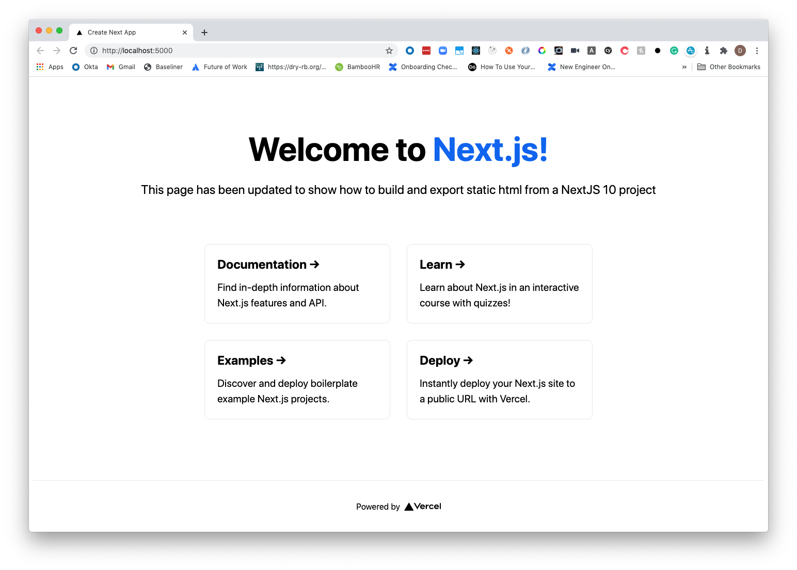

In this blog post, we're going to take the default start from NextJS 10 and export a static site that we can host in S3.

This post goes alongside a partner post on [deploying static websites to S3 using the AWS TypeScript CDK](https://blog.dennisokeeffe.com/blog/2020-11-04-deploying-websites-to-aws-s3-with-the-cdk/) if you would like to get the site up and running on your AWS account.

> Note: There are reasons for and against exporting static HTML for a NextJS application. Those needs may differ from person to person. Please see NextJS documentation on [Static HTML Export](https://nextjs.org/docs/advanced-features/static-html-export#caveats) for the latest caveats when using their static export feature.

## Getting Started

We will use the latest `create-next-app` deployment to get things rolling.

```s
# from the project root directory
npx create-next-app next-10-static-export
```

Once this runs, there will be a new folder that hosts your NextJS 10 application in `next-10-static-export`.

## Building the application

Adjust your application's `package.json` file to add a new script for export:

```json
{
  // reduced for brevity
  "scripts": {
    "dev": "next dev",
    "build": "next build",
    "start": "next start",
    // add this
    "export": "next export"
  }
  // reduced for brevity
}
```

## Building and exporting the website

Under `pages/index.js` I am going to make some small adjustments for the project and add a small paragraph that says **This page has been updated to show how to build and export static html from a NextJS 10 project**.

After making whatever adjustments you would like, run the following from your root directory:

```s
# Build the NextJS application
npm run build
# Export the HTML to the `out` directory
npm run export
```

Once you have run both commands, you'll notice that there is now a `_next` and `out` directory created.

The `out` directory is where `next export` will move the assets to.

## Seeing the final product

We can now serve those assets locally to see the build in action.

If you do not have it already, I recommend globally installing [Vercel's Serve package](https://github.com/vercel/serve) package to enable you serve the `out` directory. This can be done with `npm i -g serve`.

Now, run `serve out` from the root directory and you will have a URL posted to the terminal to show you where the website is being served from (generally localhost port 5000 unless busy).

Head to the website and you will see the following:



Congrats! You have your statically exported site.

## What's next?

If you would like to see how to deploy your website to AWS S3 using the AWS TypeScript CDK, head to [the partner post](https://blog.dennisokeeffe.com/blog/2020-11-04-deploying-websites-to-aws-s3-with-the-cdk/) and continue on.

## Resources

1. [Vercel's Serve package](https://github.com/vercel/serve)
2. [NextJS Static Export Caveats](https://nextjs.org/docs/advanced-features/static-html-export#caveats)
3. [Deploying NextJS to AWS S3 Using The AWS TypeScript CDK](https://blog.dennisokeeffe.com/blog/2020-11-04-deploying-websites-to-aws-s3-with-the-cdk/)
4. [Final, live website deployment via the deployment blog](https://nextjs-10-static-example.dennisokeeffe.com)
5. [Final code](https://github.com/okeeffed/nextjs-10-static-deployment-with-typescript-aws-cdk)
