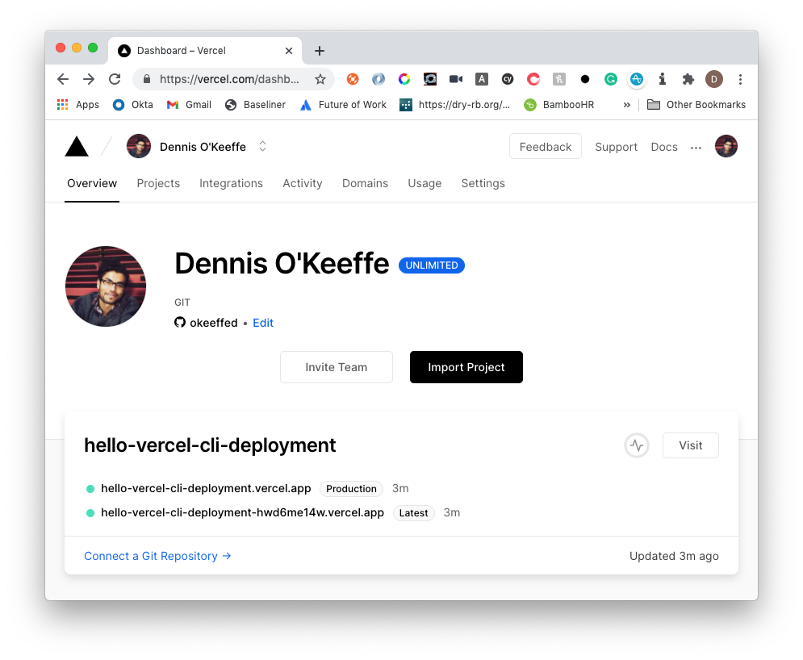
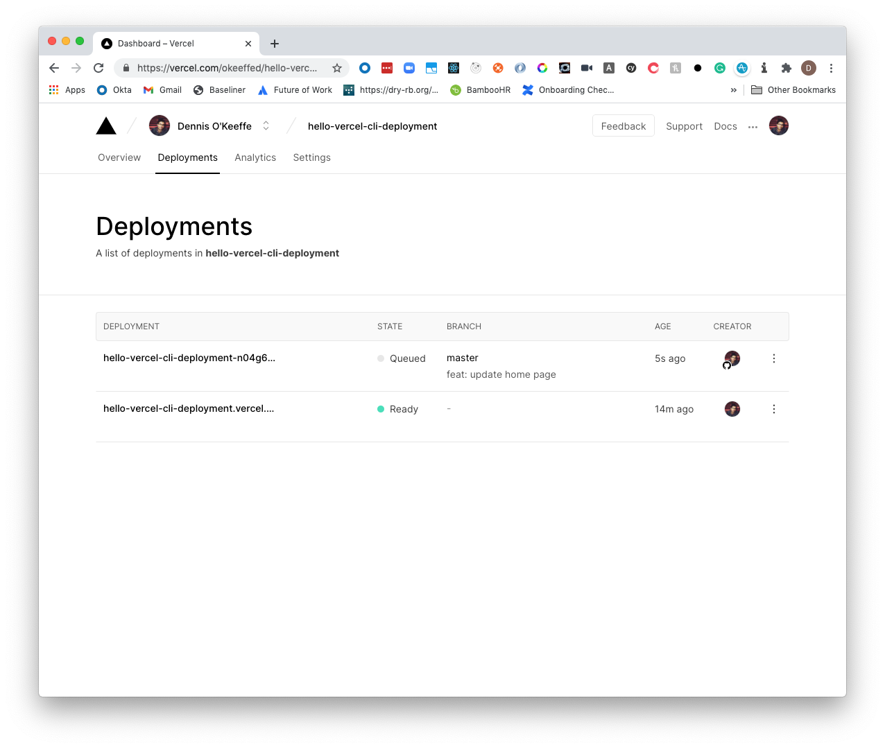

Back in the day when Vercel was Zeit and the Vercel CLI was simply `now`, I was blown away by the simplicity of it all. You could, at the time, deploy contains and I made that count during that golden Bitcoin phase of 2018 (yep, what a throwback).

After the recent [Next.js Conference](https://nextjs.org/conf/stage/n) and announcement of [Next.js 10](https://nextjs.org/blog/next-10), I have been very tempted to make some changes to how I deploy my applications.

I am still working through it, but as it currently stands, **I am not into the idea of fighting against the grain to get Lambda functions working with Next.js 9+** (yes, there is a serverless plugin but it doesn't suit the workflow I was going for).

So, I have decided to jump back into Vercel and see what is fresh and put some focus on Next.js.

Today's post will be about simply reliving the making deployments with Vercel.

The requirements are that you have a Vercel and GitHub account.

## Deploying a Next.js 10 application with the Vercel CLI

We need to run some groundwork. From a project base, let's use **create-next-app** to create a Next.js 10 app that we will deploy with the Vercel CLI that we will install.

```s
# Install the Vercel CLI
npm i -g vercel
# Create hello-vercel-cli-deployment next.j 10 application
npx create-next-app hello-vercel-cli-deployment
cd hello-vercel-cli-deployment
```

Once we install and create our basic scaffold, we will need to log into our Vercel account using `vercel login`.

This will prompt you for an email address. Once this has been entered, head to your email to verify the code.

This will log you in from the CLI and you are ready to go!

Now, here is the magic... just run `vercel`.

Follow the prompts for the scope and project you are happy enough to deploy.

The prompts will give you a URL to inspect so you can see the progress of the deployment.


Once the project has been completed, it will provide you with a link for that particular project. For me, that link was [https://hello-vercel-cli-deployment.vercel.app](https://hello-vercel-cli-deployment.vercel.app).

If you head to that link, you will see the basic Next.js 10 landing page!


Wow, still just as easy as it was two years ago.

## Deploying with GitHub

If we now head to your [Vercel dashboard](https://vercel.com/dashboard), you will see the project with an option to connect a Git repository.



In order to connect this, you will need to make sure your new repo is up on GitHub.

If you are using the [GitHub CLI](https://github.com/cli/cli), you could run a command similar to the following to create a repo (in this case public) and push the repository.

```s
# Create public repo and auto-respond to CLI inputs with 'y'
gh repo create [your-github-username]/hello-vercel-cli-deployment --public -y
# Push up the repo
git push
```

Back in the dashboard, we can select **Connect to Git repository** and follow the prompts to add our newly created **hello-vercel-cli-deployment** repository.

> It is important to note that by default, Vercel will look to deploy on the `main` branch.

At this stage, I am going to head back to the repo, make some minor adjustments to the home page `pages/index.js`, save, commit to Git then push to remote.

Once you push, the connected Git repo will automatically trigger a new deployment!



You can follow along on the dashboard, but once it is done you will see a new preview of the website and the final website.


Congratulations, step one to faster projects and deployments is complete!

## Wrapping up

Awesome, so we managed to deploy the basics of a Next.js 10 application using the Vercel CLI and hooking up GitHub to automatically trigger changes to the branch.

Following this blog, I will be running some posts about Next.js 10's new features and doing a deeper dive into them and deploying all the examples to the Vercel website.

## Resources

1. [GitHub CLI](https://github.com/cli/cli)
2. [Vercel dashboard](https://vercel.com/dashboard)
3. [Next.js Conference](https://nextjs.org/conf/stage/n)
4. [Next.js 10](https://nextjs.org/blog/next-10)
5. [Live deployment](https://hello-vercel-cli-deployment.vercel.app)
6. [Final Code - GitHub](https://github.com/okeeffed/hello-vercel-cli-deployment)

_Image credit: [Drew Beamer](https://unsplash.com/@drew_beamer)_