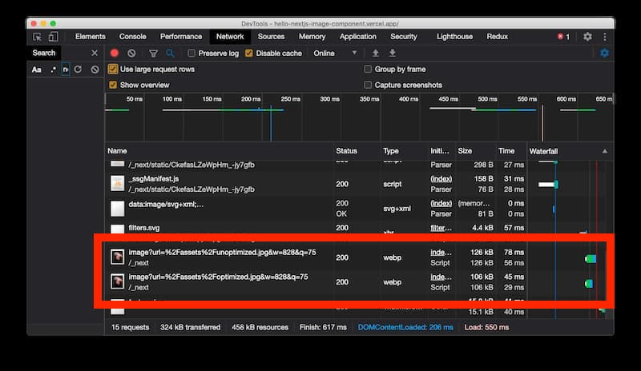

Next.js released an optimised [image component](https://nextjs.org/docs/basic-features/image-optimization) that optimizes how images load on Next.js websites. In their own words:

> _"Images are always rendered in such a way as to avoid prevent Cumulative Layout Shift, a Core Web Vital that Google is going to use in search ranking."_ - [Next.js image docs](https://nextjs.org/docs/basic-features/image-optimization)

In this post, we're going to explore and play around with this new component to see it in action.

## Getting Started

We will use `create-next-app` build out the project:

```s
# Create a new project `hello-nextjs-image-component`
npx create-next-app hello-nextjs-image-component
cd hello-nextjs-image-component
```

## Selecting an image

For this particularly exploration, I went to [Unsplash](https://unsplash.com) and chose an image to my taste.

In this case, I went with [Florian Olivo's Jellyfish image](https://unsplash.com/photos/GVe30cQ8CWU).


Afterwards, I went to the online tool [Squoosh](https://squoosh.app/) to resize the image at 800x1199 and optimized it with the basic settings.

This created an optimized version of the image at 78KB, while the original, unoptimized version was 4.5MB.

## Updating the homepage to put in both version

Following on from the example I saw in the Next.js examples repo, I altered it to show both the optimized and unoptimized image:

```js
import Image from "next/image"

function Home() {
  return (
    <>
      <p>Unoptimized</p>
      <Image
        src="/assets/unoptimized.jpg"
        alt="Unoptimized jellyfish image"
        width={800}
        height={1199}
      />
      <p>Optimized</p>
      <Image
        src="/assets/optimized.jpg"
        alt="Optimized jellyfish image"
        width={800}
        height={1199}
      />
    </>
  )
}

export default Home
```

Essentially, that was all I need for playing around with it!

I deployed this example to [Vercel](https://vercel.com) to see what the results may be.

## Exploring the results

When first visiting the production website, I noticed that while the images were loading, there was a nice space kept there for where the image was due to load into:


This space relates to preventing the [culmulative layout shift](https://web.dev/cls/) which, as mentioned prior, is a core web vital.

During this first load, the unoptimized image took ~17 seconds to load into the page. This is due to Next.js optimizing the image before loading.

I made the rookie error of not have the `Network` tab open during the first load of the project, so the timing itself is not perfect but here the Network tab of a re-deployment of the project I did later to show a similar experience to my first load:

.

> Note: You can see that the image here is optimized down from the 4.5MB of the original JPEG and it comes as `webp` format, but that optimized size is far larger than the examples shown later. I cannot speak to why this happened upon re-deploying the project, but given that the image is optimized for the device and browser, I would say it may be due to re-deploying and visiting the project on my MacBook with higher resolution than my monitor.

Once loaded, we get a screen that looks like the following:


According to the docs, the caching works as so:

> _"Images are optimized dynamically upon request and stored in the <distDir>/cache/images directory. The optimized image file will be served for subsequent requests until the expiration is reached. When a request is made that matches a cached but expired file, the cached file is deleted before generating a new optimized image and caching the new file._
>
> _"The expiration (or rather Max Age) is defined by the upstream server's Cache-Control header._
>
> _"If s-maxage is found in Cache-Control, it is used. If no s-maxage is found, then max-age is used. If no max-age is found, then 60 seconds is used."_

So in our case, once the image has been optimized during a call, it is cached and subsequent requests will load our required image wickedly fast! Here was the network for my original deployment on reload:



## In conclusion

Today's post was about seeing Next.js image optimization in action using a unoptimized and optimized source image on a live deployment.

While this is only a surface-deep look, it is incredible to see what you get out of the box with Next.js 10 image optimization and it is certainly a great step in the right direction for helping developers.

I've been keen to see other solutions in this space since coming across the [react-ideal-image package](https://github.com/stereobooster/react-ideal-image) a couple of years ago and this is definitely one of those solutions that stands a head above.

## Resources and further reading

1. [Next.js Image Component](https://nextjs.org/docs/basic-features/image-optimization)
2. [Florian Olivo - Jellyfish image](https://unsplash.com/photos/GVe30cQ8CWU?utm_source=unsplash&utm_medium=referral&utm_content=creditShareLink)
3. [Squoosh](https://squoosh.app/)
4. [Next.js Image Example](https://github.com/vercel/next.js/tree/canary/examples/image-component)
5. [Culmulative Layout Shift](https://web.dev/cls/)
6. [react-ideal-image package](https://github.com/stereobooster/react-ideal-image)

_Image credit: [bmarcel](https://unsplash.com/@bmarcel)_