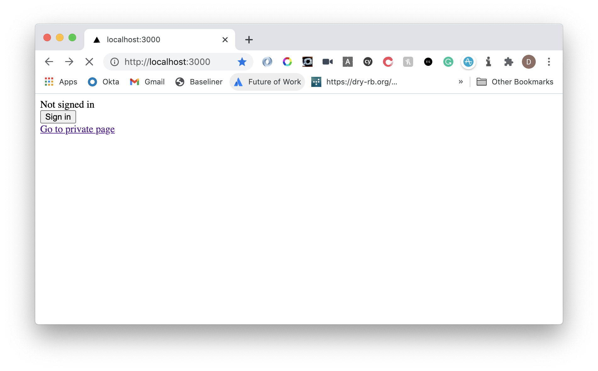
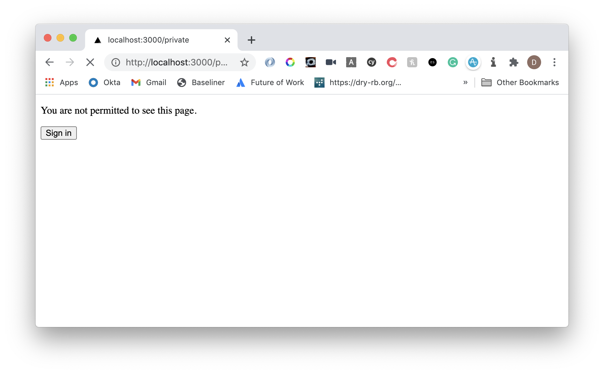
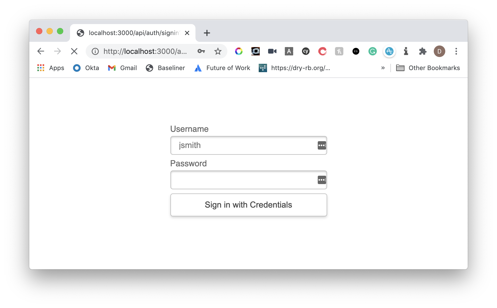
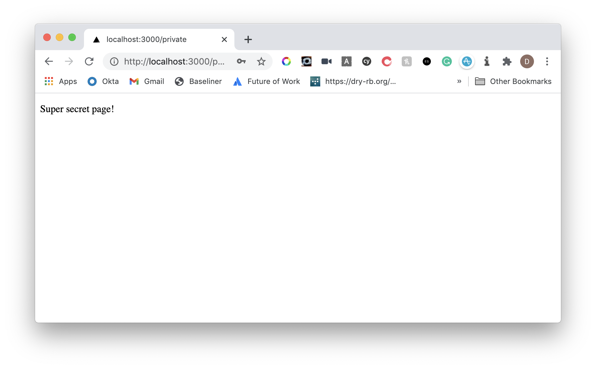

Password protection for deploys can be a costly payment when hosting websites, particularly when you want to protect branch deployments.

In today's tutorial, I am going to show you how you can set up your own simple authentication protection on these branches using Next.js 10 and Next.js Auth.

## Getting Started

```s
# Create simple-auth-example
npx create-next-app simple-auth-example
cd simple-auth-example
# Install packages required
npm i next-auth --legacy-peer-deps
# Create required auth route
mkdir pages/api/auth
touch "pages/api/auth/[...nextauth].js"
# We'll also create a private page we a basic example
touch pages/private.js
```

## Setting up the API

In `pages/api/auth/[...nextauth].js`, add the following:

```js
import NextAuth from "next-auth"
import Providers from "next-auth/providers"

const isCorrectCredentials = credentials =>
  credentials.username === process.env.NEXTAUTH_USERNAME &&
  credentials.password === process.env.NEXTAUTH_PASSWORD

const options = {
  // Configure one or more authentication providers
  providers: [
    Providers.Credentials({
      // The name to display on the sign in form (e.g. 'Sign in with...')
      name: "Credentials",
      // The credentials is used to generate a suitable form on the sign in page.
      // You can specify whatever fields you are expecting to be submitted.
      // e.g. domain, username, password, 2FA token, etc.
      credentials: {
        username: { label: "Username", type: "text", placeholder: "jsmith" },
        password: { label: "Password", type: "password" },
      },
      authorize: async credentials => {
        if (isCorrectCredentials(credentials)) {
          const user = { id: 1, name: "Admin" }
          // Any object returned will be saved in `user` property of the JWT
          return Promise.resolve(user)
        } else {
          // If you return null or false then the credentials will be rejected
          return Promise.resolve(null)
          // You can also Reject this callback with an Error or with a URL:
          // return Promise.reject(new Error('error message')) // Redirect to error page
          // return Promise.reject('/path/to/redirect')        // Redirect to a URL
        }
      },
    }),
  ],
}

export default (req, res) => NextAuth(req, res, options)
```

We are going to use `NEXTAUTH_USERNAME` and `NEXTAUTH_PASSWORD` to set up our basic environment variables.

The above will make a comparison, and if that comparison is correct, we'll return the `user` object which will just be a name of `admin` and ID of `1`.

## Setting up a private page

In `pages/private.js`, add the following:

```js
import React from "react"
import { signIn, useSession } from "next-auth/client"

export default function Page() {
  const [session, loading] = useSession()

  if (loading) {
    return <p>Loading...</p>
  }

  return (
    <>
      {session ? (
        <p>Super secret page!</p>
      ) : (
        <p>
          <p>You are not permitted to see this page.</p>
          <button onClick={signIn}>Sign in</button>
        </p>
      )}
    </>
  )
}
```

Here we will use the `useSession` hook to determine if we are logged in, while using `signIn` from the `next-auth/client` library to given an option for the user to sign in.

## Updating pages/index.js and pages/\_app.js

Finally, let's update our base page:

```js
import React from "react"
import Link from "next/link"
import { signIn, signOut, useSession } from "next-auth/client"

export default function Page() {
  const [session, loading] = useSession()

  if (loading) {
    return <p>Loading...</p>
  }

  return (
    <>
      {!session && (
        <>
          Not signed in <br />
          <button onClick={signIn}>Sign in</button>
        </>
      )}
      {session && (
        <>
          Signed in as {session.user.name} <br />
          <button onClick={signOut}>Sign out</button>
        </>
      )}
      <div>
        <Link href="/private">
          <a>Go to private page</a>
        </Link>
      </div>
    </>
  )
}
```

This will do similar to our private page based on the session.

As for `pages/_app.js` we will ensure our auth provider is there:

```js
import { Provider } from "next-auth/client"

export default function App({ Component, pageProps }) {
  return (
    <Provider session={pageProps.session}>
      <Component {...pageProps} />
    </Provider>
  )
}
```

That is all we need for the code setup!

## Setting environment variables

For local development, we can add env vars to the `.env.local` file. Add the following now:

```s
NEXTAUTH_URL=http://localhost:3000
NEXTAUTH_USERNAME=superuser123
NEXTAUTH_PASSWORD="#3bgQ]Xu(,GwVH7bLc4gQjR"
```

Here we set the username and password required for the auth and the apps URL (here it is just localhost).

Perfect, now we can see things in action!

## Exploring the website

If we run `npm run dev`, it will run `next dev` through a `package.json` script and start the website on `localhost:3000`.



The page as it sits currently does not have access, and so it displays our sign in message.

Regardless of access, there will be a link to click through to our `/private` page where all the content is private.

If we select that, we will see that we do not have permission.



If we now decide to click sign in, we will get a `sign in` page provided by **Next.js Auth**.



Writing in our **username** and **password** as we have set it in the environment variable will result in us being redirected to the previous page with access.



Success! We have managed to add simple, basic authentication to our Next.js application.

You can [try out the project](https://nextjs-simple-auth.vercel.app/) being hosted on Vercel.

## Resources and further reading

1. [Live project](https://nextjs-simple-auth.vercel.app/)
2. [Code repo](https://github.com/okeeffed/nextjs-simple-auth)
3. [Next.js Auth](https://next-auth.js.org/)
4. [Next.js Auth - credentials](https://next-auth.js.org/providers/credentials)

_Image credit: [Chris Yang](https://unsplash.com/@chrisyangchrisfilm)_