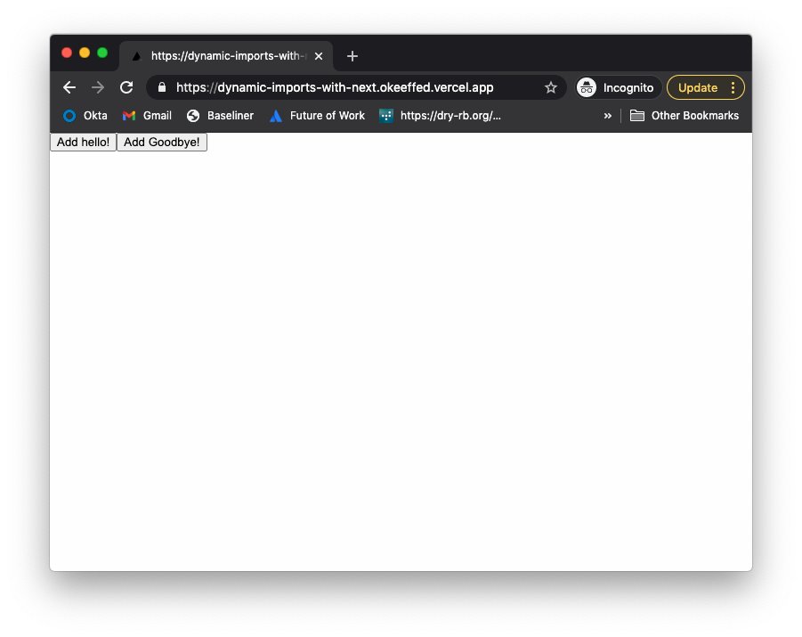
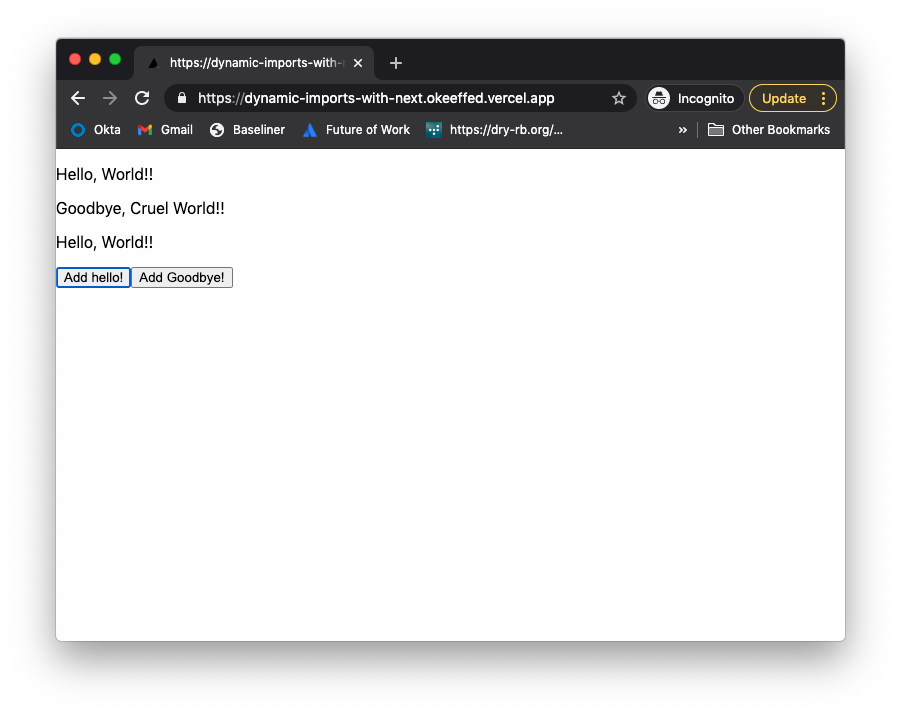

As I continue my posts looking into Next.js 10, we have now arrived at [dynamic imports](https://nextjs.org/docs/advanced-features/dynamic-import).

Dynamic imports are incredible and can be such an important tool in the toolkit.

In this post I will show you can dynamically create UIs based on React State using dynamic imports, Next.js 10 and React State.

## Setting up

We will use a simple `create-next-app` for this template.

```s
# Create Next App template
npx create-next-app dynamic-imports-with-next
cd dynamic-imports-with-next
# Make components folder to house components
mkdir components
# Make file to house exported components
touch components/Hello.js
```

## Adding the components to be dynamically exported

In this example, I will extend off the named exports example given on the [Next.js docs](https://nextjs.org/docs/advanced-features/dynamic-import).

We will extend it by enabling the components exported to take props.

In `components/Hello.js`, add the following:

```js
export function Hello({ name }) {
  return <p>Hello, {name}!</p>
}

export function Goodbye({ name }) {
  return <p>Goodbye, {name}!</p>
}
```

The above is simple enough. `<Hello name="world" />` would return `<p>Hello, world!</p>`. Similar for the `Goodbye` component.

## Updating the index page

We are going to make adjustments to the home page.

```js
import dynamic from "next/dynamic"
import { useState } from "react"

const DynamicHello = dynamic(() =>
  import("../components/hello").then(mod => mod.Hello)
)

const DynamicGoodbye = dynamic(() =>
  import("../components/hello").then(mod => mod.Goodbye)
)

function Home() {
  const [modules, setModules] = useState([])

  const addHello = () =>
    setModules([
      ...modules,
      { Component: DynamicHello, props: { name: "World!" } },
    ])

  const addGoodbye = () =>
    setModules([
      ...modules,
      { Component: DynamicGoodbye, props: { name: "Cruel World!" } },
    ])

  return (
    <div>
      {modules.map(({ Component, props }) => (
        <Component {...props} />
      ))}
      <button onClick={addHello}>Add hello!</button>
      <button onClick={addGoodbye}>Add Goodbye!</button>
    </div>
  )
}

export default Home
```

We are doing the following here:

1. Adding some helper functions to dynamically import `Hello` and `Goodbye`.
2. Using React state to store an array of components to dynamically import.
3. Adding basic buttons to add the components for us.
4. Adding closure functions that will make use of `setModules` function to set our dynamic components.
5. Mapping out those `modules` in the returned JSX.

I am keeping things incredibly simple above, so the helper closure functions will set the name props for us but you can be more creative in your own work.

## Seeing the dynamic imports in action

Run `npm run dev` from the command line to start our app in development mode.

Head to the localhost page and you will see the following:



The page itself is pretty bare, but once we start clicking some buttons we can see the magic in action!



It took us only a few lines, but we can see how components can be required at run time. It is super impressive what you can do with dynamic imports and hopefully you will begin to make the most of using this feature.

## Resources and further reading

1. [Next.js Dynamic Import docs](https://nextjs.org/docs/advanced-features/dynamic-import)
2. [Completed project](https://dynamic-imports-with-next.okeeffed.vercel.app/)
3. [Completed code](https://github.com/okeeffed/dynamic-imports-with-next.git)
