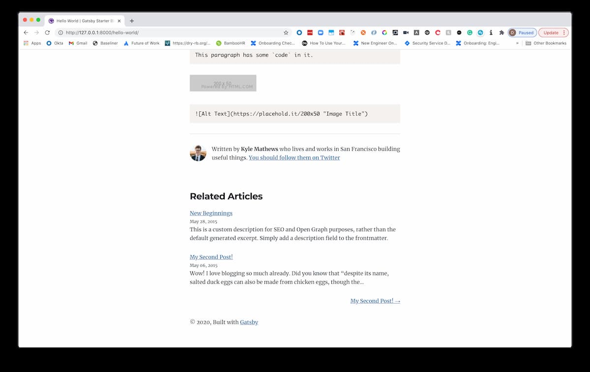
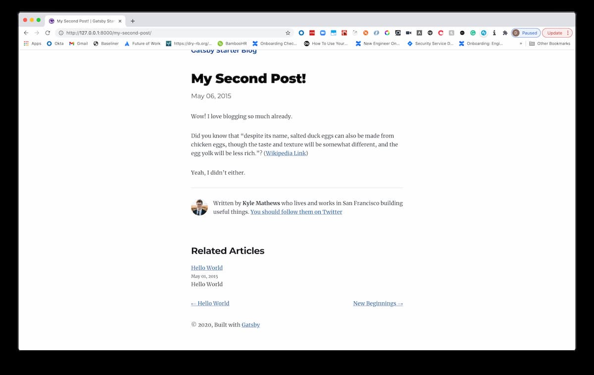
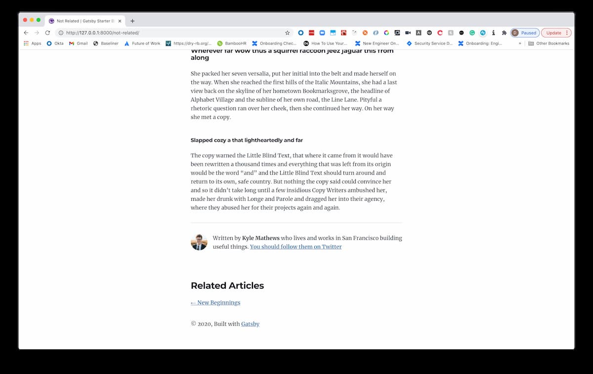

In this post, I am going to walk through a simple update that I made to my blog website to display related articles.

This solution is by no means perfect. The aims I had coming into this was that I wanted the work time-boxed to less than thirty minutes. This post was on my pragmatic, time-boxed solution and not a fool-proof way to determine weighted articles.

This post requires that you have globally installed the `gatsby` CLI tool.

I will walk through the solution using the [Gatsby Starter Blog(https://github.com/gatsbyjs/gatsby-starter-blog) template.


## Getting started

Use the Gatsby command provided from the [quick start docs](https://github.com/gatsbyjs/gatsby-starter-blog) to get a basic repo up and running:

```sh
# Creates new blog in folder "blog-with-similar-section"
gatsby new blog-with-similar-section https://github.com/gatsbyjs/gatsby-starter-blog
```

This will add a new Gatsby starter to the `blog-with-similar-section` folder.


## Preparing the articles for the new related articles component

Once you are in the blog, we are going to do some updates to the posts inside of the `content/blog` folder.

For each current post, update them to have tags. At the time of writing, there were three articles:

1. `content/blog/hello-world/index.md`
2. `content/blog/my-second-post/index.md`
3. `content/blog/new-beginnings/index.md`

For the first post, add `tags: hello, world` to the frontmatter metadata at the top of the post (I am doing it as a string to emulate my website), for the second add `tags: hello` and third `tags: world`.

Finally, I just copy-pasted the `content/blog/new-beginnings` folder, renamed it to `not-related` and update the title to `Not related` and tags to `tags: unrelated`.

With that, we are ready to start up our development environment running `npm start` and get going!

> Note: once you start with `npm start`, your site should be live on `localhost:8000`. If for whatever reason you have issues where the page constantly reloads (like I did) then an interim solution is to go to `127.0.0.1:8000` instead.


## The related component

Create a new file `src/components/related.js` and add the following code:

```js
import React from "react"
import { Link, StaticQuery, graphql } from "gatsby"

const RelatedArticles = ({ posts }) => {
  return (
    <div>
      {posts.map(({ node }) => {
        const title = node.frontmatter.title || node.fields.slug
        return (
          <div key={node.fields.slug}>
            <div>
              <Link style={{ boxShadow: `none` }} to={node.fields.slug}>
                >{title}
              </Link>
            </div>
            <small>{node.frontmatter.date}</small>
            <p
              dangerouslySetInnerHTML={{
                __html: node.frontmatter.description || node.excerpt,
              }}
            />
          </div>
        )
      })}
    </div>
  )
}

export const relatedArticlesQuery = graphql`
  query {
    allMarkdownRemark(sort: { fields: [frontmatter___date], order: DESC }) {
      edges {
        node {
          excerpt
          fields {
            slug
          }
          frontmatter {
            date(formatString: "MMMM DD, YYYY")
            title
            description
            tags
          }
        }
      }
    }
  }
`

export default props => {
  const related = []

  return (
    <StaticQuery
      query={relatedArticlesQuery}
      render={data => {
        const {
          allMarkdownRemark: { edges },
        } = data

        // iterate through article vertex
        for (const vertex of edges) {
          // handle base case
          if (related.length >= props.limit) {
            continue
          }

          // abstract tags
          const {
            frontmatter: { tags },
          } = vertex.node

          // handle case where there are no tags or prop tags
          if (!tags || !props.tags) {
            continue
          }

          const formattedTags = tags.split(",")

          // ensure tags match and article is not the same as current
          if (
            props.tags.some(item => formattedTags.includes(item)) &&
            props.title !== vertex.node.frontmatter.title
          ) {
            related.push(vertex)
          }
        }

        // render posts
        return (
          <>
            <h3
              style={{
                fontFamily: `Montserrat, sans-serif`,
                marginTop: 0,
              }}
            >
              Related Articles
            </h3>
            <RelatedArticles posts={related} />
          </>
        )
      }}
    />
  )
}
```

This component does the following:

1. Queries for all our posts.
2. Filters those with related tags based on a limit and parent tags.
3. Filters the post itself based on the title.
4. Renders the `RelatedArticles` component based on our filtered values.

> Note: There are some safety related `if` statements above that relate to posts without tags. I've done this based on my own blog content where not every article will have tags.

There is not too much to this, but that is all we need there.


## Adding to our blog post component

Inside of `src/templates/blog-post.js`, we need to import our component with `import RelatedArticles from "../components/related"` at the top and I've added `<RelatedArticles tags={post.frontmatter.tags && post.frontmatter.tags.split(",")} limit={10} title={post.frontmatter.title} />` to the render method.

I also need to add one line to the `pageQuery` so that the parent article would now retrieve the tags as well.

```js
export const pageQuery = graphql`
  query BlogPostBySlug(
    $id: String!
    $previousPostId: String
    $nextPostId: String
  ) {
    site {
      siteMetadata {
        title
      }
    }
    markdownRemark(id: { eq: $id }) {
      id
      excerpt(pruneLength: 160)
      html
      frontmatter {
        title
        date(formatString: "MMMM DD, YYYY")
        description
        # add the below
        tags
      }
    }
    previous: markdownRemark(id: { eq: $previousPostId }) {
      fields {
        slug
      }
      frontmatter {
        title
      }
    }
    next: markdownRemark(id: { eq: $nextPostId }) {
      fields {
        slug
      }
      frontmatter {
        title
      }
    }
  }
`
```

With all of this code in, we can see our results.


## Viewing the results

If we head to our first "Hello, World!" post, we can now see that we have our related section showing the two posts that share a tag:



Heading to the second post, we see that it relates back to the **Hello, World!** post:



Finally, heading to our unrelated post will show nothing related:




## Conclusion

In today's post, we added a quick, pragmatic solution to adding in a "related posts" section to each blog post.

As mentioned in the intro, this is by no means a complete solution, but it is great to add some more "calls-to-action" to your blog page.


## Resources and further reading

1. [Gatsby Starter Blog - GitHub](https://github.com/gatsbyjs/gatsby-starter-blog)
