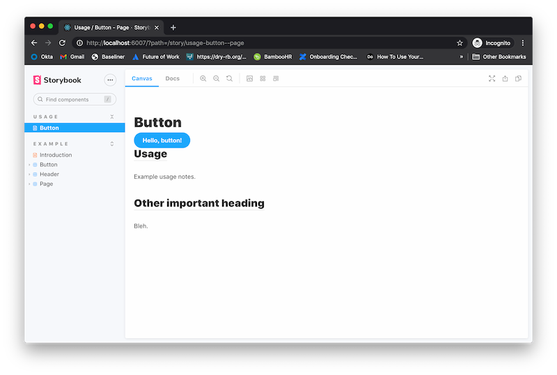
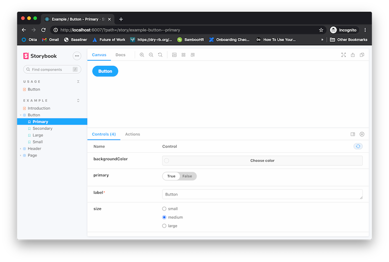
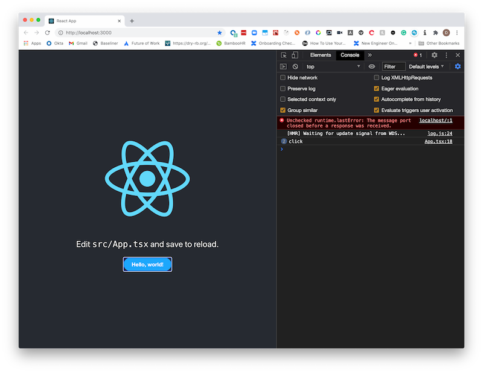
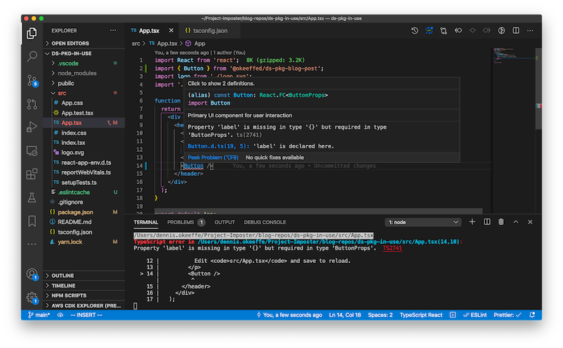
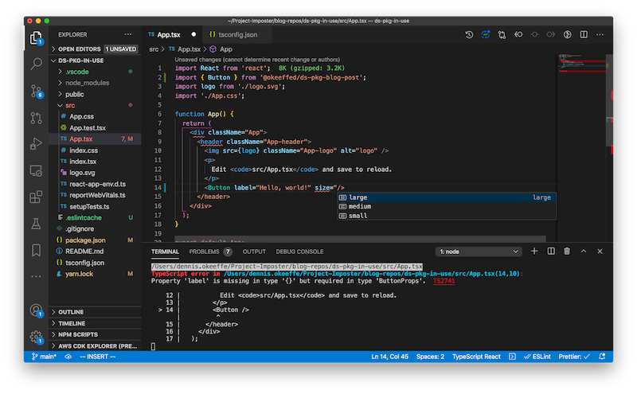

When building out a UI Component Library for my own work, I ran into a couple of pain points when searching how to create a simple workflow that "just works".

Most tutorials I saw for TypeScript component libraries made use of build tools (which at times caused headaches) and my current job took the opposite extreme of publishing the UI component library as TypeScript and relying on individual projects to transpile it to JavaScript directly from the library itself (if you are from my work... you didn't read anything).

This tutorial will show how to create a simple project set up a `create-react-app` project to create components with TypeScript + Storybook, then finally it will demo the that same design system being used as a package in another React project.

## UI Component Library vs Design System

While these can be minor semantics to me, there are some important differences on [what constitutes a component library vs design system](<(https://uxdesign.cc/do-you-think-your-component-library-is-your-design-system-think-again-7e2c902b5275)>) that you may want to delve into and understand (unless you are happy to be corrected all the time like myself).

Essentially, we will create a simple, single-component UI Component library as the main demonstration, but the installation of Storybook will enable us to markdown guides to write principles, patterns, tone, etc.

Your willingness to update those guides are (for all intensive purposes) what will take this project from a simple component library to being able to communicate other facets that make up the definition of a "design system" as linked above.

## Getting Started

We will begin by using `create-react-app` to set up a React project and then adding in Storybook to help with component development.

```s
# creates project `ds-pkg-blog-post`
npx create-react-app ds-pkg-blog-post --template typescript
cd ds-pkg-blog-post
# initialise storybook
npx sb init
# add in some other required libs
yarn add --dev copyfiles rimraf
# adding an entry point to export the components from
touch src/main.ts
```

As we are just going to use TypeScript for the build, I am using `copyfiles` to help us copy over filetypes that are not handled by the TypeScript compiler (think CSS files, image assets, etc.). This helps us keep our build tooling as simple as can be.

We will use `rimraf` as a simple pre-build clean to remove our output folder (which will be `./lib`).

## Updating our package.json configuration

We are going to add some meta information to our **package.json** file. In my case, I am going to create a private npm package hosted on GitHub.

You can see an [older post on creating GitHub packages](https://blog.dennisokeeffe.com/blog/2020-07-05-your-first-github-npm-package-in-five-minutes/), otherwise publish however you wish to!

```json
{
  "name": "@okeeffed/ds-pkg-blog-post",
  "version": "0.1.47",
  "main": "./lib/main.js",
  "module": "./lib/main.js",
  "types": "./lib/main.d.ts",
  "files": ["lib"],
  "repository": {
    "type": "git",
    "url": "git+https://github.com/okeeffed/ds-pkg-blog-post.git"
  },
  "author": "Dennis O'Keeffe",
  "license": "ISC",
  "bugs": {
    "url": "https://github.com/okeeffed/ds-pkg-blog-post/issues"
  },
  "homepage": "https://github.com/okeeffed/ds-pkg-blog-post#readme",
  "publishConfig": {
    "registry": "https://npm.pkg.github.com/"
  },
  "scripts": {
    "start": "react-scripts start",
    "test": "react-scripts test",
    "eject": "react-scripts eject",
    "release": "standard-version && npm publish",
    "build": "tsc -p tsconfig.json && yarn copy-files",
    "copy-files": "copyfiles -u 1 \"src/**/*.css\" \"src/**/*.svg\" \"src/**/*.json\" lib/",
    "storybook": "start-storybook -p 6006",
    "build-storybook": "build-storybook",
    "prebuild": "rimraf lib"
  }
  // the rest is omitted for brevity...
}
```

I have also updated the build script to build out a configuration from `tsconfig.json`.

## Updating tsconfig.json

We want to update the config to emit files and emit declaration files.

```json
{
  "compilerOptions": {
    "target": "es5",
    "lib": ["dom", "dom.iterable", "esnext"],
    "allowJs": true,
    "skipLibCheck": true,
    "esModuleInterop": true,
    "allowSyntheticDefaultImports": true,
    "strict": true,
    "forceConsistentCasingInFileNames": true,
    "noFallthroughCasesInSwitch": true,
    "module": "esnext",
    "moduleResolution": "node",
    "resolveJsonModule": true,
    "isolatedModules": true,
    "jsx": "react",
    "declaration": true
  },
  "include": ["src"],
  "exclude": ["src/**/*.stories.@(mdx,tsx)"]
}
```

Here we have updated the file to remove `noEmit` and then using `declaration` to emit out declaration files.

This will ensure any custom types we create will make be emitted during the build for other libraries to use that support TypeScript.

> Our updated package.json file contains the changes to the "build" script which uses the TypeScript compiler instead of `react-scripts`.

## Our first component via Storybook

Running `npx sb init` will have created a `src/stories` folder for us for a few files.

Let's move the `src/stories/Button.*.*` files to `src/components/Button`.

Once that is done, we will barrel the component out. We do this by creating `src/components/index.ts`.

Inside of `src/components/index.ts` add the following:

```ts
export * from "./Button/Button"
```

Then to export this from our library, we will create a file `src/main.ts` and add the following:

```ts
export * from "./components"
```

Our lines in the package.json file for the types, main and module keys will be pointing the created files.

## Workflow with Storybook

Let's add `src/components/Button/Button.stories.mdx` and add some basic markdown:

```md
import { Meta } from "@storybook/addon-docs/blocks"
import { Button } from "./Button"

<Meta title="Usage/Button" />

# Button

<div>
  <Button primary={true} label="Hello, button!" />
</div>

## Usage

Example usage notes.

## Other important heading

Bleh.
```

Although a super basic example, this will create some interactive markdown that we can use for documentation on usage and add in our "design system" guides and principles.

Let's now run `yarn storybook` to start up the Storybook environment.

> Note: You'll also need to adjust `src/stories/Header.tsx` to fix where Button is imported from.

Once Storybook is up and running, you can head to the localhost port to see a `Usage` section with our notes on using the Button (although styled badly and bland) and you can see under `Examples/Button` some examples and interactive ways to work with the component itself.





Amazing! We have a work environment to develop our components with.

At this point, I will leave the Storybook part there as this is more of a proof to get up and going and move to publishing the library. There is a lot to Storybook, but check the docs from here on out to build further than the simple set up we have done above.

## Publishing the library

Assuming that we are happy with our `Button` and this will make up the sole component of our incredibly versatile component library, so let's move to publishing the package!

For myself, I am going to run the following:

```s
yarn build
yarn publish
```

This will build the package into the `lib` folder and then publish to GitHub for me. Much of this configuration and "why" is from the set up we did earlier in `package.json` and `tsconfig.json`.

> Note: If you are also publishing to GitHub, ensure that you have the repo created on remote. For me, I used the GitHub CLI by running `gh repo create okeeffed/ds-pkg-blog-post --public -y` and then pushing to remote. You will also need to ensure you have setup `.npmrc` up correctly (either in the local project or globally). Please see my above link on creating a GitHub package to do so if you are unfamiliar with publishing packages.

## Trying out the new library

Now that our package has been published, let's start up another `create-react-app` project and install our package:

```s
# Creates project `ds-pkg-in-use`
npx create-react-app ds-pkg-in-use --template typescript
cd ds-pkg-in-use
# for me, your-pkg-name is @okeeffed/ds-pkg-blog-post
yarn add your-pkg-name
```

Let's update `src/App.tsx` to use our new `Button`:

```ts
// App.tsx
import React from "react"
import { Button } from "@okeeffed/ds-pkg-blog-post"
import logo from "./logo.svg"
import "./App.css"

function App() {
  return (
    <div className="App">
      <header className="App-header">
        
        <p>
          Edit <code>src/App.tsx</code> and save to reload.
        </p>
        <Button
          label="Hello, world!"
          size="large"
          primary={true}
          onClick={() => console.log("click")}
        />
      </header>
    </div>
  )
}

export default App
```

Running our app using `yarn start` in this project and heading to localhost will show us our component in use! Clicking the button will also log out our "click" to see it all in operation.



What is amazing is that we also still get our type safety showing, as demonstrated when we don't provide a label:



We also get our type suggestions coming through for things such as our props (as seen here with VSCode):



Success! We have gone start to finish with our design system setup and having it work as a type-safe package in another project.

## Conclusion

Today's post is not perfect by all means and it is not all encompassing, but I was very surprised by how few posts there were to get this all done without running into issues.

Having a basic, TypeScript-compiled solution has been working great for me as a quick start to getting things working together without too many discrepancies or issues along the way.

We have gone from a simple `create-react-app` command to having a TypeScript design system that supports Storybook for both development and documentation, then we pushed and published it as an npm package hosted on GitHub and finally seen it in action in another project - all doable within the space of minutes.

## Resources and further reading

1. [Do you think your component library is your design system? Think again.](https://uxdesign.cc/do-you-think-your-component-library-is-your-design-system-think-again-7e2c902b5275)
2. [Your first GitHub npm package in 5 minutes](https://blog.dennisokeeffe.com/blog/2020-07-05-your-first-github-npm-package-in-five-minutes/)
3. [Finish package on GitHub](https://github.com/okeeffed/ds-pkg-blog-post)
4. [Example repo of package in use](https://github.com/okeeffed/ds-pkg-in-use)
