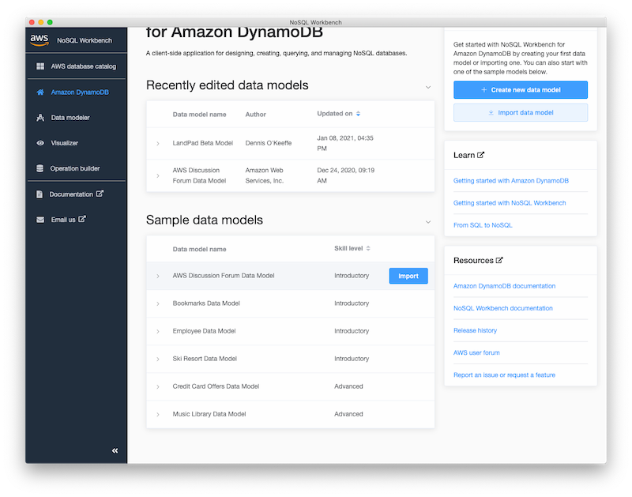
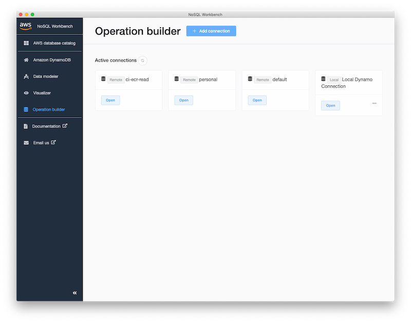
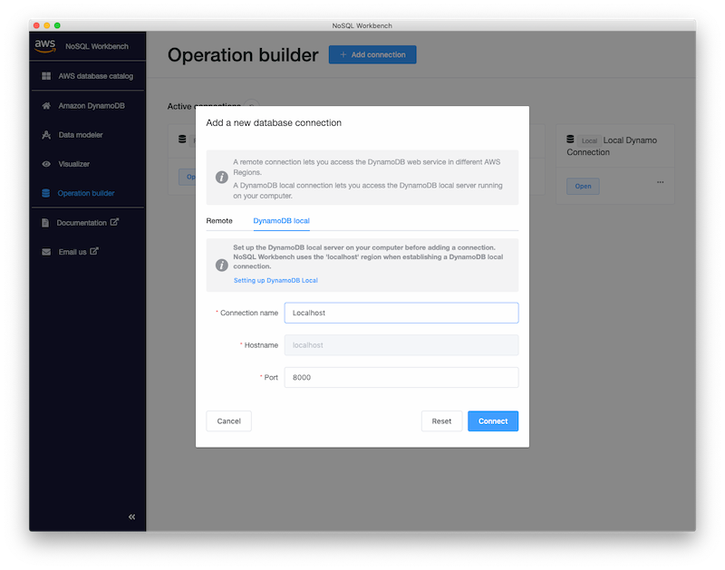
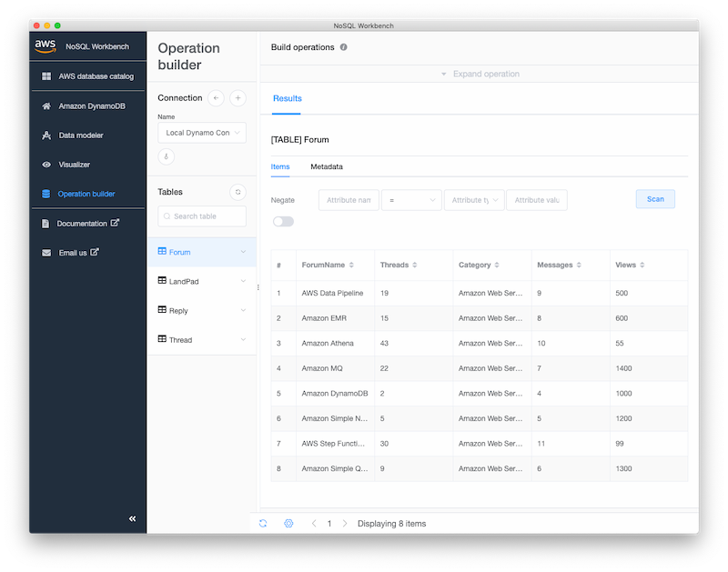
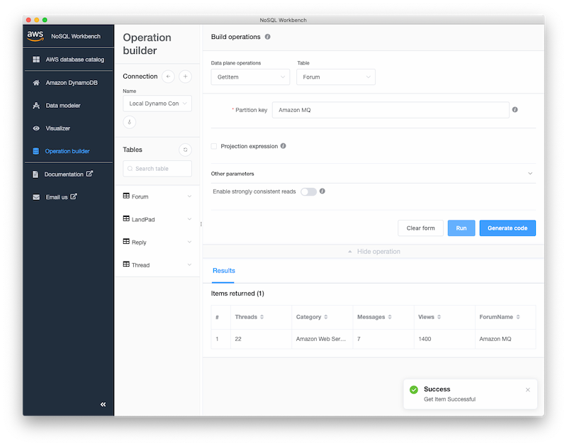
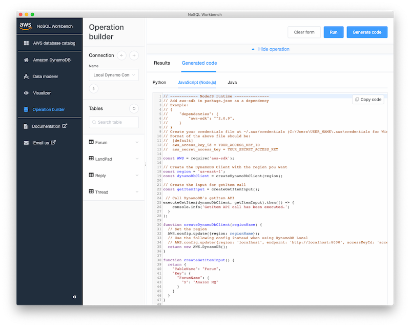

In this post we will set up DynamoDB for local development and learn how to use the provided UI to explore data we work with.


## Getting started

Create a new project directory to work within.

```s
# Make project directory
mkdir hello-dynamodb-local
cd hello-dynamodb-local
# Add some simple files to work with
mkdir src
touch src/index.js
# Create new npm package to work with
npm init -y
```

Head to the [AWS documentation page](https://docs.aws.amazon.com/amazondynamodb/latest/developerguide/DynamoDBLocal.DownloadingAndRunning.html) and download a version of DynamoDB into the project directory.

I will download the Oregon zip file.

Ensure to unzip the folder into the project directory. Within that folder, I am going to move the `DynamoDBLocal_lib` and `DynamoDBLocal.jar` file up to the project directory root (you can remove what is left of the folder after if you would like).

Now we can start the DB by running `java -Djava.library.path=./DynamoDBLocal_lib -jar DynamoDBLocal.jar -sharedDb`.

I am going to add that line as a script in the `package.json` file:

```json
{
  "scripts": {
    "start:db": "java -Djava.library.path=./DynamoDBLocal_lib -jar DynamoDBLocal.jar -sharedDb"
  }
}
```


## First look after running DynamoDB

Now that we have our script in `package.json`, we can run `npm run start:db` to get up and running:

```s
$ npm run start:db

> hello-dynamodb-local@1.0.0 start:db /[REDACTED]/hello-dynamodb-local
> java -Djava.library.path=./DynamoDBLocal_lib -jar DynamoDBLocal.jar -sharedDb

Initializing DynamoDB Local with the following configuration:
Port:   8000
InMemory:       false
DbPath: null
SharedDb:       true
shouldDelayTransientStatuses:   false
CorsParams:     *

2020-12-24 09:08:30.030:INFO::main: Logging initialized @1270ms to org.eclipse.jetty.util.log.StdErrLog
```

Once it is running, we can use the AWS CLI to begin interacting with our table locally.

If we run `aws dynamodb list-tables --endpoint-url http://localhost:8000` we will get the following:

```json
{
  "TableNames": []
}
```

Although we currently have no tables, we have success with setting up!


## Setting up NoSQL Workbench

AWS also provides a app **NoSQL Workbench** that can operate as a GUI for us to use.

To try it, head to the [NoSQL Workbench installation page](https://docs.aws.amazon.com/amazondynamodb/latest/developerguide/workbench.html) and download the application for your system.


## Adding a Table via the NoSQL Workbench

Once you open the workbench, if you head to **Amazon DynamoDB** on the left-hand side panel, you will have some sample models that you can hover over and import.



Now if we run `aws dynamodb list-tables --endpoint-url http://localhost:8000` we will see the data has been imported to our local database:

```json
{
  "TableNames": ["Forum", "Reply", "Thread"]
}
```


## Running queries with the NoSQL Workbench

In order to run queries against the local, select the **Operation builder** on the left-hand side panel. Once there, select **Add connection**, choose the **DynamoDB local** tab and ensure that the details there are correct to your localhost port and add the connection.





Now we can run a simple `GetItem` on `Amazon DynamoDB` for the Forum table.

First, head back to the **Amazon DynamoDB** tab, hover over the **AWS Discussion Forum Data Model** and open it. This will take you to the **Data modeler**. From here, select **Visualize data model** to open the **Visualizer**. Finally, select **Commit to Amazon DynamoDB** and from the **Saved connections** you can now select you localhost instance to commit the tables to.

Now we can open up the connection in the operation builder and select the **Forum** table.



Exploring the data in the table gives us an idea of some basic queries we can make.

If you select **Expand operation**, select **GetItem** from the data plane operations dropdown and **Forum** from the table dropdown, we can then pop a value such as **Amazon MQ** into the required **Partition key** value.

Selecting it will return the values for that particular item:



As an added bonus, if you select **Generate code**, NoSQL Workbench will even generate some code in Python, JavaScript and Java for you to use or take inspiration from.



From here, we can plan out our tables and run CRUD operations to test these from within the NoSQL Workbench and our local DynamoDB instance!


## Conclusion

To recap today's short post, we set up a simple way to run DynamoDB locally from a simple project and then explored the NoSQL Workbench and did a basic **GetItem** request to show how we can connect up our local DynamoDB.

This first post on the topic is short and simple, but you can take parts of it and elaborate ie set global commands to run DynamoDB from anywhere.


## Resources and Further Reading

1. [Setting up DynamoDB on your computer](https://docs.aws.amazon.com/amazondynamodb/latest/developerguide/DynamoDBLocal.DownloadingAndRunning.html)
2. [NoSQL Workbench](https://docs.aws.amazon.com/amazondynamodb/latest/developerguide/workbench.html)

_Image credit: [Lars Kienle](https://unsplash.com/@larskienle)_
