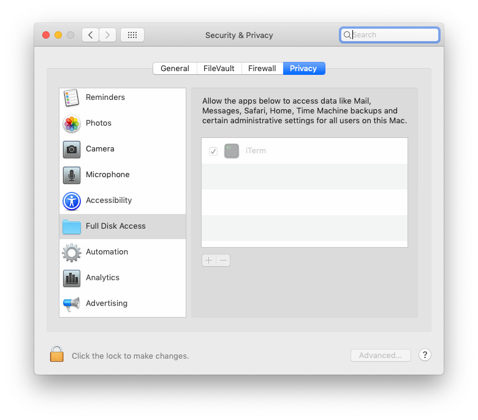

Today's post will demonstrate how to have a script automatically run as a cron job on your Mac computer using `crontab`.

We will demonstrate by automating a simple script to add the word "hello" onto a new line every minute and showing how we can log out `stdout` and `stderr` to a file after each run for our sake.

<Ad />

## Getting started

We will create a `.scripts` folder at the root using to store our scripts to be used by `crontab` and create a file `hello.sh` to store our script:

```s
# Create the .scripts folder at the root
mkdir ~/.scripts
# Change into the folder
cd ~/.scripts
# Create the file ~/.scripts/hello.sh
touch hello.sh
# Ensure we enable execution permissions for the file
chmod u+x ./hello.sh
```

Inside of the file `hello.sh`, add the following:

```s
#!/bin/bash
echo "Starting script"
# Echoes the word "hello" in a file "hello.txt" in the same folder
echo hello >> hello.txt
echo "Finished"
```

The above simply does the following:

1. Echo "Starting script" to `stdout`.
2. Append the word "hello" to the `hello.txt` file.
3. Echo "Finished" to `stdout`.

Will all this out of the way, we can now tell `crontab` to run the script each minute.

<Ad />

## Setting the script to run in crontab

On the Mac, we can use `crontab -e` to open an editor in Vim which will allow us to enter the following.

```s
* * * * * cd ~/.scripts && ./hello.sh >/tmp/stdout.log 2>/tmp/stderr.log
```

**_Note: if you want to use another editor you are familiar with, you will need to update your run command file to change the editor ie if you use Bash, add `export EDITOR=/usr/bin/nano` to your `.bashrc` file (or equivalent for your shell of choice). More on this below in "handling issues"._**

The line added can be broken down into two parts: The **cron schedule expression** and the **command to invoke**.

The `cron schedule expression` in the line above consists of the `* * * * *` part of the line. This line in layperson's terms means "at every minute". This means that at every minute, the `[command]` part of the expression will be run.

For those unfamiliar with cron expressions, websites such as [crontab guru](https://crontab.guru/) are great for giving a layperson expression in understandable English.

Below are some basic expressions and some human readable translations to give you some insight:

```s
# At minute 5 of every hour
5 * * * *
# At 5:00
0 5 * * *
# At minute 15, 30, 45, and 0 past hour 5
15,30,45,0 5 * * *
# At 05:00 on day-of-month 1
0 5 1 * *
# At 05:00 on day-of-month 1 in April
0 5 1 4 *
# At 05:00 on Monday, Wednesday, Friday, and Sunday in April
0 5 * 4 1,3,5,7
```

As for the rest of the line `cd ~/.scripts && ./hello.sh >/tmp/stdout.log 2>/tmp/stderr.log`, we are simply say "change to the `~/.scripts` directory, run `./hello.sh` and log stdout to `/tmp/stdout.log` and stderr to `/tmp/stderr.log`.

You can update that line to be whatever you want. What is important is that `~/.scripts/hello.sh` has the correct permissions to execute.

<Ad />

## The script in action

Once you set the value in the crontab file, exit your editor of choice after saving the file.

If successful, you should get an indicator that things are okay if you run `crontab -l` and see your job listed. If not, check `Handling issues` below to see if one of them ends up as your issue. If not, you may have to do some online searching!

Assuming that you are successful, all we really need to do now is wait a few minutes and we can `cat` the `~/.scripts/hello.sh` file out and see the results!

```s
# After waiting 5 minutes
$ cat ~/.scripts/hello.txt
hello
hello
hello
hello
hello
$ cat /tmp/stdout.log
Starting script
Finished
$ cat /tmp/stderr.log
# Nothing - there was no error
```

Success! We have successfully set up our first automated crontab job in OSX!

To remove the cron job, simple run `crontab -e` again and remove the job with the editor.

<Ad />

## Handling issues

This is not an exhaustive list, but two issues I came across was the need to update my editor to reference `/usr/bin/vim` instead of `/usr/bin/vi` and to update my `Security & Privacy` to allow Full Disk Access for iTerm (enable at your own risk).

To update the editor, ensure that your shell run command files that are loaded (ie `~/.bashrc` etc) includes the following export value for `EDITOR`:

```s
# Attempt to fix crontab using Vim
export EDITOR=/usr/bin/vim
```

As for the Full Disk Access, simply head to `Security and Privacy`, enable changes through the lock on the bottom-left and add your terminal of choice.



<Ad />

## Conclusion

The post today is a very beginner-friendly one that does the bare minimum to demonstrate how to get `crontab` working.

From here, it is up to you to automate what you wish to automate! You can adjust the shell script to run very complex web scrapers in other languages and more!

I personally use it to automate some of my morning preparation with some JavaScript and Python scripts that do some of the morning's heavy lifting and information aggregation for things that I may need to kickstart my morning off on the right foot.

<Ad />

## Resources and further reading

1. [Crontab Guru](https://crontab.guru/)
2. [Crontab operation not permitted answer](https://serverfault.com/questions/954586/osx-mojave-crontab-tmp-tmp-x-operation-not-permitted)
3. [/usr/bin/vi not working to edit Crontab](https://stackoverflow.com/questions/21848801/cant-edit-crontab)

_Image credit: [Elia Pellegrini](https://unsplash.com/@eliapelle)_
