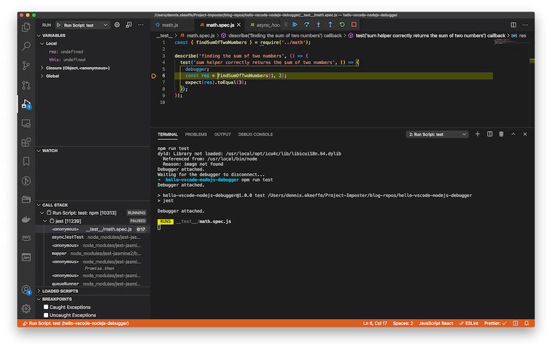

VSCode comes jam packed with some incredible tools to help you build your applications.

One such tool is the built-in debugger. This debugger can make life far easier when you are debugging Node.js applications!

In today's post, we will create an incredibly simple Node.js application to sum two numbers and show how the debugger can be a powerful tool for helper to run through your programs and identify issues.

## Getting started

We will initialise a new npm project and install jest from your root directory of choice and create some files to run things through:

```s
# Make a project folder and change into it
mkdir hello-vscode-nodejs-debugger
cd hello-vscode-nodejs-debugger
# Init and answer yes to all questions for basic setup
npm init -y
# Install Jest for testing
npm install --save-dev jest
# Create test directory
mkdir __test__
# Create test file and main file
touch math.js __test__/math.spec.js
```

Open your new `hello-vscode-nodejs-debugger` folder in VSCode and you will be set to start adding files!

## Setting up math.js and adding a simple test

In `math.js`, add the following:

```js
const sum = (a, b) => a + b

const findSumOfTwoNumbers = (a, b) => {
  sum(a, b)
}

module.exports = {
  findSumOfTwoNumbers,
}
```

Here we are creating a basic `sum` function that takes two arguments and returns the sum. We are also creating a contrived "helper" function that is a wrapper around `sum` so it is not exposed from the file. You may already see what is wrong, but we will show how to do so with the VSCode debugger.

Inside of `__test__/math.spec.js`, add the following:

```js
const { findSumOfTwoNumbers } = require("../math")

describe("finding the sum of two numbers", () => {
  test("sum helper correctly returns the sum of two numbers", () => {
    const res = findSumOfTwoNumbers(1, 2)
    expect(res).toEqual(3)
  })
})
```

We are running one simply test that expects 1 + 2 to equal 3. Before running the test, let's update our `package.json` file to have a `test` script:

```json
{
  "name": "hello-vscode-nodejs-debugger",
  "version": "1.0.0",
  "description": "",
  "main": "index.js",
  "scripts": {
    "test": "jest",
    "hello": "echo \"hello\""
  },
  "keywords": [],
  "author": "",
  "license": "ISC",
  "devDependencies": {
    "jest": "^26.6.3"
  }
}
```

I had added to simple scripts: `test` and `hello`. Hello is a ridiculous example but it is there to demonstrate what we can do with the debugger later.

To confirm everything is happy, let's run `npm test`. You will get the following:

```s
$ npm test
> hello-vscode-nodejs-debugger@1.0.0 test /hello-vscode-nodejs-debugger
> jest

 FAIL  __test__/math.spec.js
  finding the sum of two numbers
    ✕ sum helper correctly returns the sum of two numbers (5 ms)

  ● finding the sum of two numbers › sum helper correctly returns the sum of two numbers

    expect(received).toEqual(expected) // deep equality

    Expected: 3
    Received: undefined

       5 |     debugger;
       6 |     const res = findSumOfTwoNumbers(1, 2);
    >  7 |     expect(res).toEqual(3);
         |                 ^
       8 |   });
       9 | });
      10 |

      at Object.<anonymous> (__test__/math.spec.js:7:17)

Test Suites: 1 failed, 1 total
Tests:       1 failed, 1 total
Snapshots:   0 total
Time:        2.069 s
Ran all test suites.
npm ERR! Test failed.  See above for more details.
```

Oh no, it seems like `res` was `undefined`! Every person and their dog probably knows where we went wrong, but let's find out the fun way using the VSCode Debugger!

## Running the VSCode Debugger

If you select the `debugger` icon in VSCode from the left-hand side panel, you will be confronted with a basic screen asking for configurations to get started.


You will want to select the `Node.js (preview)` configuration. Once selected, you will actually see you have the option to run the scripts written in our `package.json` file! Adding `hello` was a silly way to demonstrate that all scripts show up there, but we will want to choose the debug the `test` script.


Click the green play button to start debugging. Once it starts running, you'll notice that a new set of icons will appear (as denoted in the image below) and the terminal will output that the debugger is attached.

```s
$ npm run test
Debugger attached.

> hello-vscode-nodejs-debugger@1.0.0 test /Users/dennis.okeeffe/Project-Imposter/blog-repos/hello-vscode-nodejs-debugger
> jest

Debugger attached.
 FAIL  __test__/math.spec.js
  finding the sum of two numbers
    ✕ sum helper correctly returns the sum of two numbers (5 ms)

  ● finding the sum of two numbers › sum helper correctly returns the sum of two numbers

    expect(received).toEqual(expected) // deep equality

    Expected: 3
    Received: undefined

      4 |   test('sum helper correctly returns the sum of two numbers', () => {
      5 |     const res = findSumOfTwoNumbers(1, 2);
    > 6 |     expect(res).toEqual(3);
        |                 ^
      7 |   });
      8 | });
      9 |

      at Object.<anonymous> (__test__/math.spec.js:6:17)

Test Suites: 1 failed, 1 total
Tests:       1 failed, 1 total
Snapshots:   0 total
Time:        3.522 s, estimated 7 s
Ran all test suites.
Waiting for the debugger to disconnect...
npm ERR! code ELIFECYCLE
npm ERR! errno 1
npm ERR! hello-vscode-nodejs-debugger@1.0.0 test: `jest`
npm ERR! Exit status 1
npm ERR!
npm ERR! Failed at the hello-vscode-nodejs-debugger@1.0.0 test script.
npm ERR! This is probably not a problem with npm. There is likely additional logging output above.

npm ERR! A complete log of this run can be found in:
npm ERR!     /Users/dennis.okeeffe/.npm/_logs/2021-02-02T09_56_42_365Z-debug.log
Waiting for the debugger to disconnect...
```


It looks like it ran without doing anything! That is because we need to start using the `debugger` keyword to help let VSCode know that we want to stop the debugger (or set breakpoints, but more on that later).

Update `__test__/math.spec.js` to have the following:

```js
const { findSumOfTwoNumbers } = require("../math")

describe("finding the sum of two numbers", () => {
  test("sum helper correctly returns the sum of two numbers", () => {
    debugger // this is the keyword we want to tell the debugger to stop here
    const res = findSumOfTwoNumbers(1, 2)
    expect(res).toEqual(3)
  })
})
```

When we re-run our spec, you'll notice that we pause at the debugger and get some more information!


On the left-hand side, we'll start getting information on things like the variables, call stack, breakpoints (and a couple more). You'll notice that under variables, it tells us that our local `res` variable is currently undefined. We can start walking through our application and see this value change!

First, we need to understand the debugging icons.


From left-to-right, the icons mean the following:

1. Continue: pressing this will continue execution until the next breakpoint or `debugger` keyword.
2. Step over: this will "step over" the current line and move onto the next. This is useful if you want to step over a function.
3. Step into: as opposed to step over, on the line of a function, it will actually step into the function and move the debugger there.
4. Step out: if we have stepped into a function, we can step back out using this button.
5. Restart: you can restart the script being debugged with this.
6. Stop: stop the debugger.

In our example, we will look to do the following:

1. Step over the `debugger` line.
2. Step into the `findSumOfTwoNumbers` function.
3. Step over a few lines and watch what variables are there.
4. Step back to our test file.
5. Come to a conclusion and fix the file.

Given what has been said above, we want to first click "step over" to put our highlight on the line `const res = findSumOfTwoNumbers(1,2)`:



Now, "step into" the function:


You will see that we have now been move to our `math.js` file and it is showing where execution is currently out. Our "variables" section on the left-hand side has been updated to show the local values at the moment where `a` is 1 and `b` is 2. Pretty neat!

Our `sum` function itself has no issues (spoiler alert), so we are just going to step over the current line for now.


However, now that we have, you'll noticed something strange - our variables section now shows that our return value for the function is `undefined`! Surprise, surprise, we forgot to return `sum(a,b)` from our function!

As you may have guessed, this is the issue. For now, what we want to do is add a breakpoint by clicking on the "bookmark" symbol in the gutter to the left-hand side of the line number 5. This will add a breakpoint for us (which you can confirm as it will now be added to our breakpoints section on the left-hand sidebar).

Step back out of the function now. This will bring us back to our test file.


You will notice our local `res` value is still `undefined` as expected since we did not return a value from `findSumOfTwoNumbers(1, 2);`. Let's just hit the continue option in the debugger now to finish off the script run.

## Fixing our script

Select the breakpoint `math.js` under our breakpoints section in the debugger panel on the left-hand side. This will take us back to the line that caused issues!

Let's now update it to return the value:

```js
const sum = (a, b) => a + b

const findSumOfTwoNumbers = (a, b) => {
  return sum(a, b)
}

module.exports = {
  sum,
  findSumOfTwoNumbers,
}
```

With that all out of the way, we can select the `restart` option on our debugger to begin the process over again!

We will stop at the `debugger` statement again, but lucky for us we can speed the process up this time since we added the breakpoint in the `math.js` file. As mentioned earlier, the debugger will stop for the `debugger` keyword or breakpoints! Let's hit continue and move to that breakpoint.

If we step over the breakpoint in `math.js`, you'll now see that our return value is `3` as we want!


Understanding that this will return the value we want, we can hit continue again in the debugger options to finish executing the test.

This time you will see success in our test file:

```s
> npm run test
Debugger attached.

> hello-vscode-nodejs-debugger@1.0.0 test /Users/dennis.okeeffe/Project-Imposter/blog-repos/hello-vscode-nodejs-debugger
> jest

Debugger attached.
 PASS  __test__/math.spec.js (101.404 s)
  finding the sum of two numbers
    ✓ sum helper correctly returns the sum of two numbers (100439 ms)

Test Suites: 1 passed, 1 total
Tests:       1 passed, 1 total
Snapshots:   0 total
Time:        103.065 s
Ran all test suites.
Waiting for the debugger to disconnect...
Waiting for the debugger to disconnect...
```


Hooray! We managed to isolate the issue by walking through our code with the VSCode debugger!

## Conclusion

This is just a light overview of the debugger. There are other cool features like "watching" variables that I did not dive into here.

Although the example was contrived, the same principles apply when tracing other variables in-depth.

_Image credit: [Sigmund](https://unsplash.com/@sigmund)_