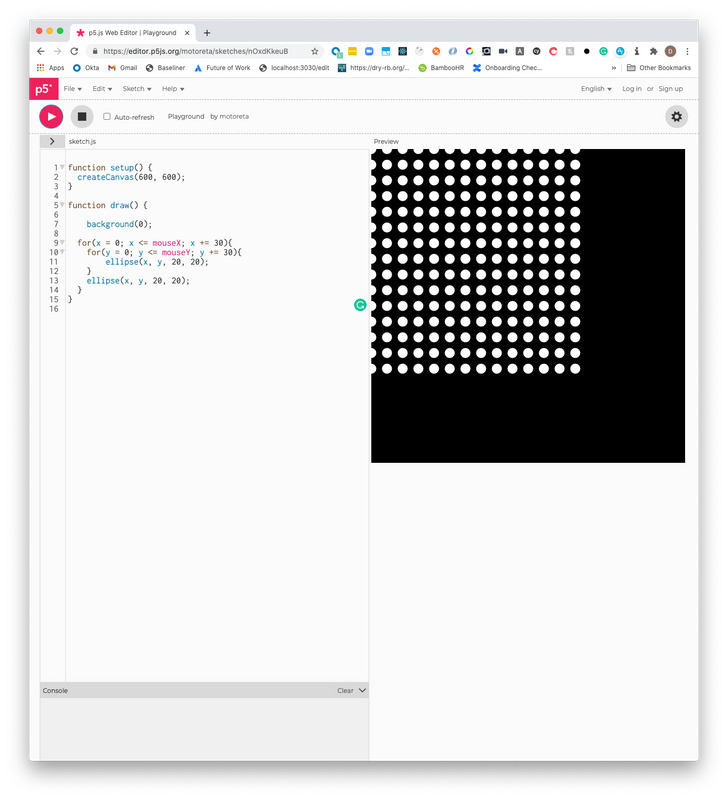
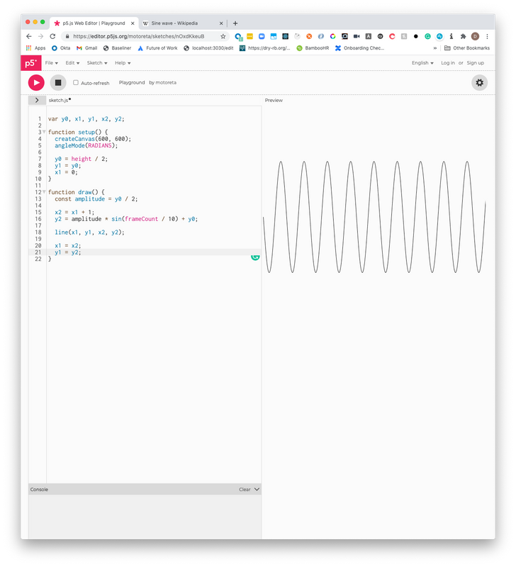
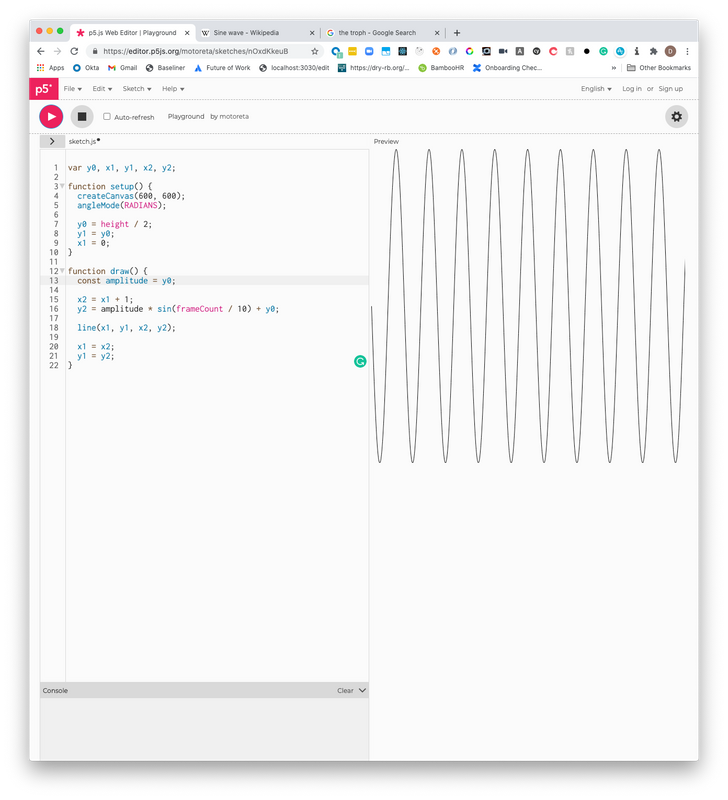
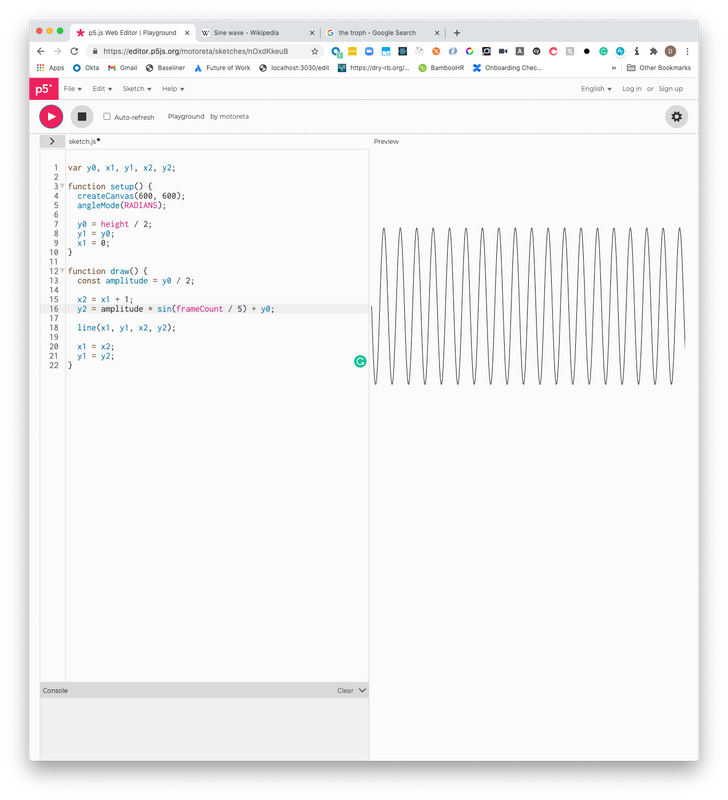
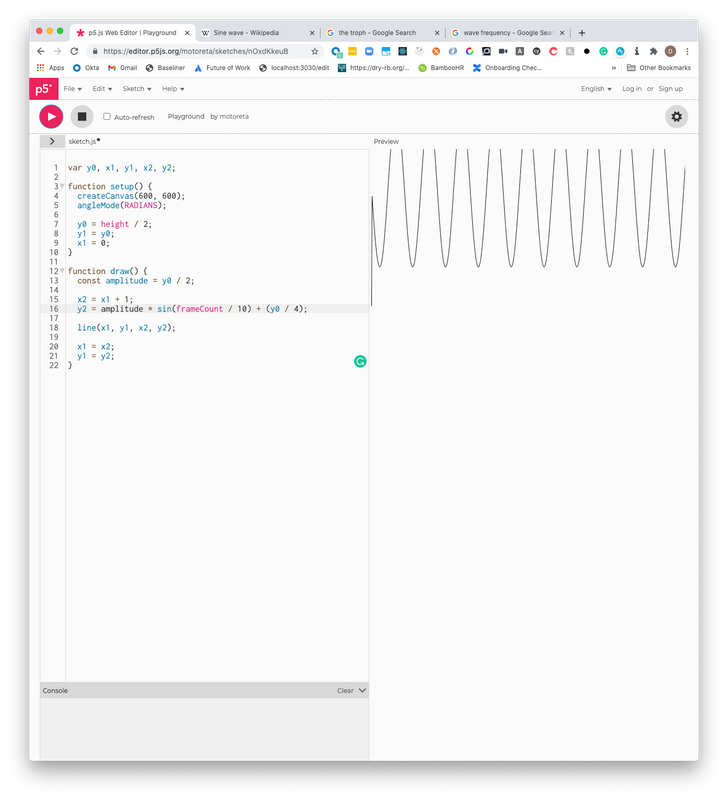
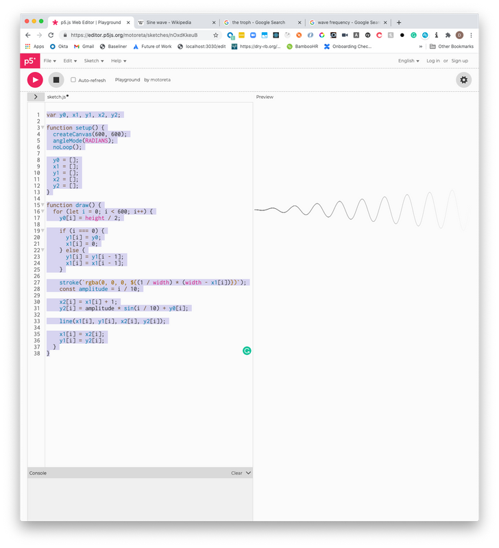
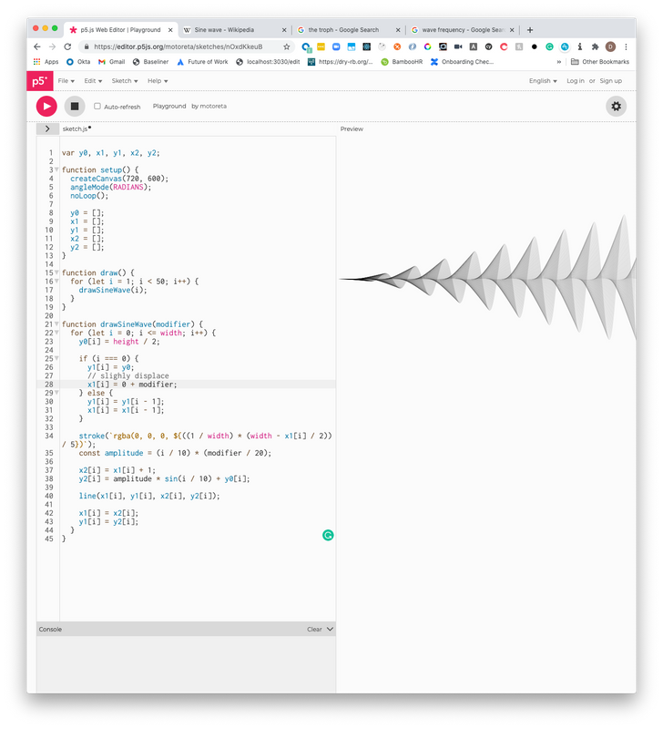

I have recently begun redecorating my room and a recent addition was a new set of frames. While the frames are nice, I am not the greatest fan of the default prints that have come with it! After struggling to find adequate prints of the desired size, I have come to the conclusion that I may as well use this as an opportunity to explore generative art and create some stills to print on my wall in the interim (until I find my desired prints).

In today's tutorial, we are going to explore [p5.js](https://p5js.org/) and slowly explore a generated sinusoidal wave to see how we can begin to express the inner artist we never knew we had.

## Getting Started

For today's tutorial, we are actually going to explore the changing results using the [online playground](https://editor.p5js.org/motoreta/sketches/nOxdKkeuB). Doing so will enable us to add changes as we go and explore together.

The introduction code we get is this:

```js
function setup() {
  createCanvas(600, 600)
}

function draw() {
  background(0)

  for (x = 0; x <= mouseX; x += 30) {
    for (y = 0; y <= mouseY; y += 30) {
      ellipse(x, y, 20, 20)
    }
    ellipse(x, y, 20, 20)
  }
}
```

The `setup` and `draw` function are essentially our two main methods we need to work with. `setup` is called at the start of the lifecycle and `draw` is called on the tick of every frame. These are important concepts to grab early in the piece, but will become more clear as we begin to add more and more to it.

Pressing play on the top left-hand side enables us to see the output.



In the above with the default code, it instructs the library to create a 600 by 600 canvas in the DOM during the setup, and then during the repeating draw phase that is called on each tick of the frame, the mouse point is found and ellispses are drawn until it reaches `mouseX` and `mouseY` (which is provided by the library during the `draw` phase).

Hopefully you are with me so far, but do not fret. We are going to reset the setup and draw functions to go from the basics and refer to documentation.

## Setting up a basic Sinusoidal Wave

Update the code to show the following:

```js
// initialise the variables
var y0, x1, y1, x2, y2

function setup() {
  createCanvas(600, 600)
  angleMode(RADIANS)

  // set the base of y to be half te size of the canvas
  y0 = height / 2
  // set the first value of y1 to start at the midway point
  y1 = y0
  // tell x axis to start at left side of the canvas
  x1 = 0
}

function draw() {
  // this sets our wave to be half the size of the height (+150 up and -150 down)
  const amplitude = y0 / 2

  // on each frame, let's add 1 to the last x1 value
  x2 = x1 + 1
  // multiple amplitude by the sin calc output and offset it to the midway point
  y2 = amplitude * sin(frameCount / 10) + y0

  // draw a line from the last known point to the new one
  line(x1, y1, x2, y2)

  // update x1, y1 to be the last known point for the next iteration
  x1 = x2
  y1 = y2
}
```

The comments should explain some of the icky math, but in the general we can create a wave over time by drawing a line from the last known `(x, y)` coordinates and connecting it to the newly calculated ones which is done over each frame.

The `frameCount` variable will give us the current frame (and comes as part of the library). This value starts from 0 and goes in a positive direction, so we can use it to change the frequency ie space between each "cycle" of a sine wave (peak + trough).



From here alone, it is worth change the `amplitude` value and change the value of `10` in `sin(frameCount / 10)` as well as the offset `y0` to get a better visual understanding of what is happening.







## Changing the stroke color and amplitude dynamically

Now, we are going to make some changes that may be hard to understand at first. We want to:

1. Stop the loops (from the setup function).
2. Draw all the lines at once (requiring an array of values to loop on the only call to draw).
3. Change the amplitude over time.
4. Change the stroke color over time.

To do so, we add the following code:

```js
var y0, x1, y1, x2, y2

function setup() {
  createCanvas(600, 600)
  angleMode(RADIANS)
  noLoop()

  y0 = []
  x1 = []
  y1 = []
  x2 = []
  y2 = []
}

function draw() {
  for (let i = 0; i < 600; i++) {
    y0[i] = height / 2

    if (i === 0) {
      y1[i] = y0
      x1[i] = 0
    } else {
      y1[i] = y1[i - 1]
      x1[i] = x1[i - 1]
    }

    stroke(`rgba(0, 0, 0, ${(1 / width) * (width - x1[i])})`)
    const amplitude = i / 10

    x2[i] = x1[i] + 1
    y2[i] = amplitude * sin(i / 10) + y0[i]

    line(x1[i], y1[i], x2[i], y2[i])

    x1[i] = x2[i]
    y1[i] = y2[i]
  }
}
```

We use the `noLoop` function in the `setup` to ensure there is only one call to `draw`, but now we must also update `draw` in order to loop over the width of our canvas and draw a sinusoidal wave.

We are going to use the loop `i` value to help us also dynamically change the stroke alpha as well as the amplitude. The resulting wave it this:



## Drawing multiple lines with slight changes

Now we can start generating the fun stuff. In this example, we are still going to keep the `noLoop` (ultimately my goal is to draw some abstract art). However, what we will do is abstract what we have in the `draw` function to its own helper function `drawSineWave` and then iterate over that 50 times to draw 50 waves!

In order to stop it from drawing all the same wave, we will again use the power of the loop to pass a `modifier` argument which can be used as an offset.

```js
var y0, x1, y1, x2, y2

function setup() {
  createCanvas(720, 600)
  angleMode(RADIANS)
  noLoop()

  y0 = []
  x1 = []
  y1 = []
  x2 = []
  y2 = []
}

function draw() {
  // draw 50 sinusoidal waves
  for (let i = 1; i < 50; i++) {
    drawSineWave(i)
  }
}

function drawSineWave(modifier) {
  for (let i = 0; i <= width; i++) {
    y0[i] = height / 2

    if (i === 0) {
      y1[i] = y0
      // slighly displace each wave
      x1[i] = 0 + modifier
    } else {
      y1[i] = y1[i - 1]
      x1[i] = x1[i - 1]
    }

    stroke(`rgba(0, 0, 0, ${((1 / width) * (width - x1[i] / 2)) / 5})`)
    const amplitude = (i / 10) * (modifier / 20)

    x2[i] = x1[i] + 1
    y2[i] = amplitude * sin(i / 10) + y0[i]

    line(x1[i], y1[i], x2[i], y2[i])

    x1[i] = x2[i]
    y1[i] = y2[i]
  }
}
```

The result is something cooler like this:



## Summary

In conclusion, we just took a small look into using the **p5.js** library to begin drawing some generative art.

This is day one for me, so I am certainly no expert, but it should be a good enough launch pad for you to start playing around with some of your own modifiers and get things going.

My plan is to continue exploring the library over the next few weeks and continue writing some posts, so hopefully by the end I will have some worthy prints to use as placeholders across my bedroom.

## Resources and further reading

1. [p5.js - Online Editor](https://editor.p5js.org/motoreta/sketches/nOxdKkeuB)
2. [p5.js - Getting Started](https://p5js.org/get-started/)
