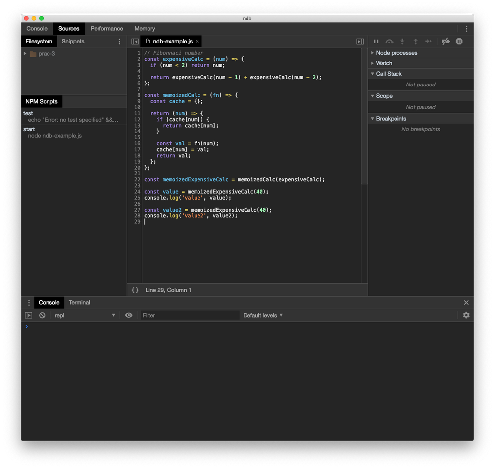
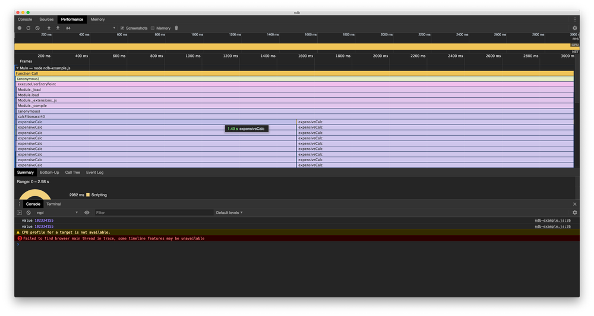
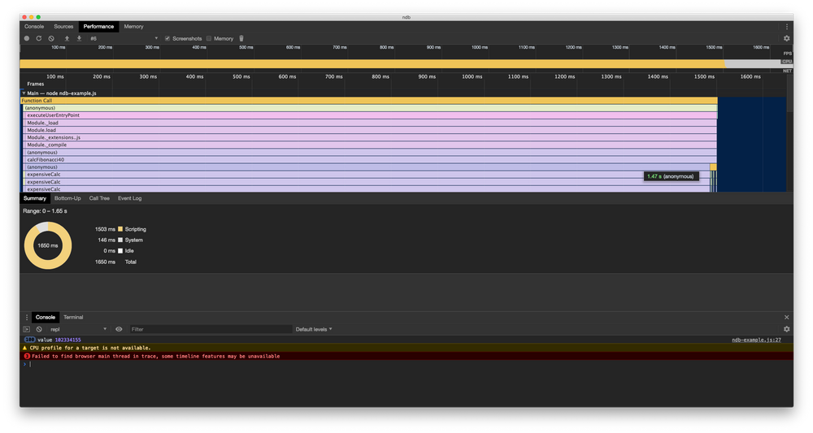
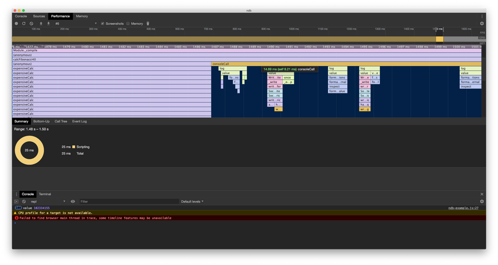

[ndb](https://github.com/GoogleChromeLabs/ndb) describes itself as "an improved debugging experience for Node.js, enabled by Chrome DevTools".

It enables some of the best features of Chrome DevTools to become an ally when debugging Nodejs applications.

In a previous blog post, we went through debugging through VSCode. In this post, I will show how the profiler from ndb can help you identify and address bottlenecks where possible.

## Getting started

Install ndb globally, initialise a new project and create a new file for the example:

```s
# Initialise an npm project
npm init -y
# Global install of ndb
npm i -g ndb
# File to write our code
touch ndb-example.js
```

Inside of `package.json`, update the scripts to include a `start` script:

```json
{
  // ... omitted
  "scripts": {
    "test": "echo \"Error: no test specified\" && exit 1",
    "start": "node ndb-example.js"
  }
  // ... omitted
}
```

## Our first example

We are going to calculate the [Fibonacci number](https://en.wikipedia.org/wiki/Fibonacci_number) and code it in a way that costs `2^n` where the time to calculate doubles the more we need to recursively call the number (excluding the base case).

Inside of `ndb-example.js`, add the following:

```js
// Fibonnaci number
const expensiveCalc = num => {
  if (num < 2) return num

  return expensiveCalc(num - 1) + expensiveCalc(num - 2)
}

function calcFibonacci40() {
  const value = expensiveCalc(40)
  console.log("value", value)
}

calcFibonacci40()
calcFibonacci40()
```

We are going to run the same calculation to get the Fibonacci number for 40 (102334155). To do so, start-up ndb by running `ndb .` in the console at the base directory. You should be faced with the following:



On the left-hand panel under `NPM Scripts`, you will see our `start` script is available. Hovering over it we can see buttons highlight that enables us to "play" or "record" the script. Given that our `start` script will run through the `ndb-example.js` file, we can hit record to see what happens during execution:



On the profiler, it shows us the two different call stacks under `calcFibonacci40`, with the two largest `expensiveCalc` directly underneath being the two calls that we made from `calcFibonacci40`. Both cost me 1.49 seconds on this hardware each! In fact, as our code is at the moment, if we continually call `calcFibonacci40`, that expensive calculation will always be recalculated!

So what can we do? We will memoise the function.

## Memoizing the function

Memoizing the function will "cache" our previous results and make any calls with the same arguments return back what is stored in the cache instead of re-calculated that expensive calculation.

Let's implement this by updating our code:

```js
// Fibonnaci number
const expensiveCalc = num => {
  if (num < 2) return num

  return expensiveCalc(num - 1) + expensiveCalc(num - 2)
}

const memoize = fn => {
  const cache = {}

  return num => {
    if (cache[num]) {
      return cache[num]
    }

    const val = fn(num)
    cache[num] = val
    return val
  }
}

// memoize the function
const memoizedExpensiveCalc = memoize(expensiveCalc)

function calcFibonacci40() {
  // update this to use the memoized version
  const value = memoizedExpensiveCalc(40)
  console.log("value", value)
}

// we will run the function 100 times
for (let i = 0; i < 100; i++) {
  calcFibonacci40()
}
```

Here we add a simple memoisation function that essentially uses closures to "maintain" a cache and return the original function with the argument passed. I won't speak too much to the memoisation, but more information can be found on this [blog post](https://scotch.io/tutorials/understanding-memoization-in-javascript).

Finally, we replace the expensive function with the memoized version of the function.

To add dramatic effect, we are now going to iterate over the function 100 times. On my current machine, I would be expecting the function to take about 2 minutes to run without memoisation!

Let's re-record the performance and see what happens.



Analysing the performance, we see that we still made our expensive calculation (and it still took 1.49 seconds), but we also see in our console that we logged the answer 100 times? What happened?

If we zoom into the very end, we see that `calcFibonacci40` has a direct child of `console.log` at the tail-end of the call!



This is our memoisation at work! Since we are continually passing the same argument, our cache is picking this up and we are no longer calling `expensiveCalc` to fetch the answer!

We can actually see the while the first call took 1.49 seconds, the remaining 99 calls took a total of 14.69ms! As far as performance goes, this is a great success!

## Summary

In today's post, we installed ndb and used to help profile and pinpoint expensive calculations.

Finally, we ended by memoizing the function and visually seeing our improvements!

ndb is a great debugging tool to add to your tool belt, particularly when debugging performance and memory issues.

## Resources and further reading

1. [ndb - Github](https://github.com/GoogleChromeLabs/ndb)
2. [Memoization in JavaScript](https://scotch.io/tutorials/understanding-memoization-in-javascript)

_Image credit: [Sigmund](https://unsplash.com/@sigmund)_
